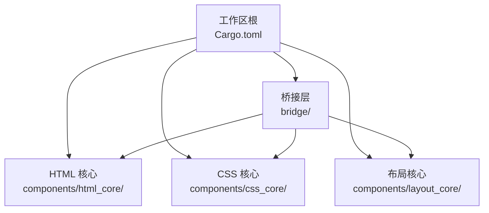
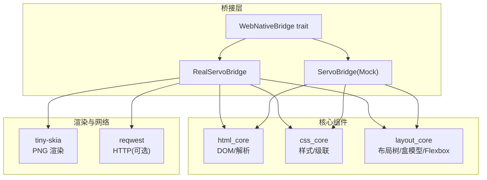
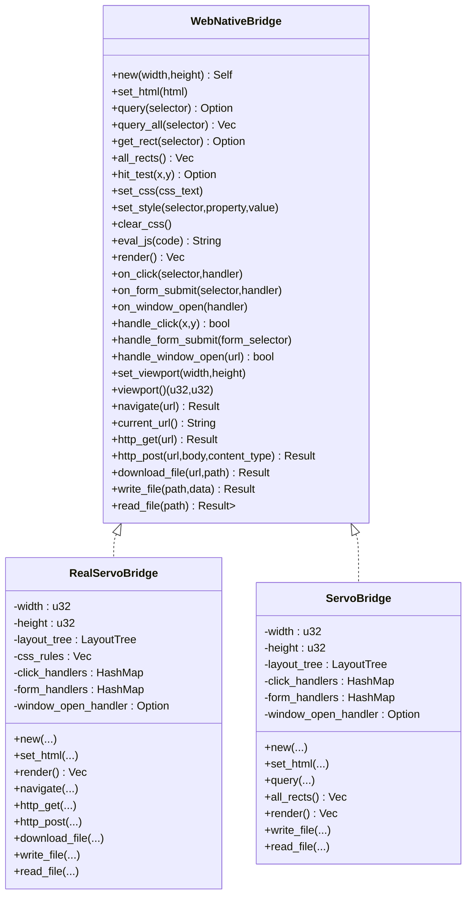
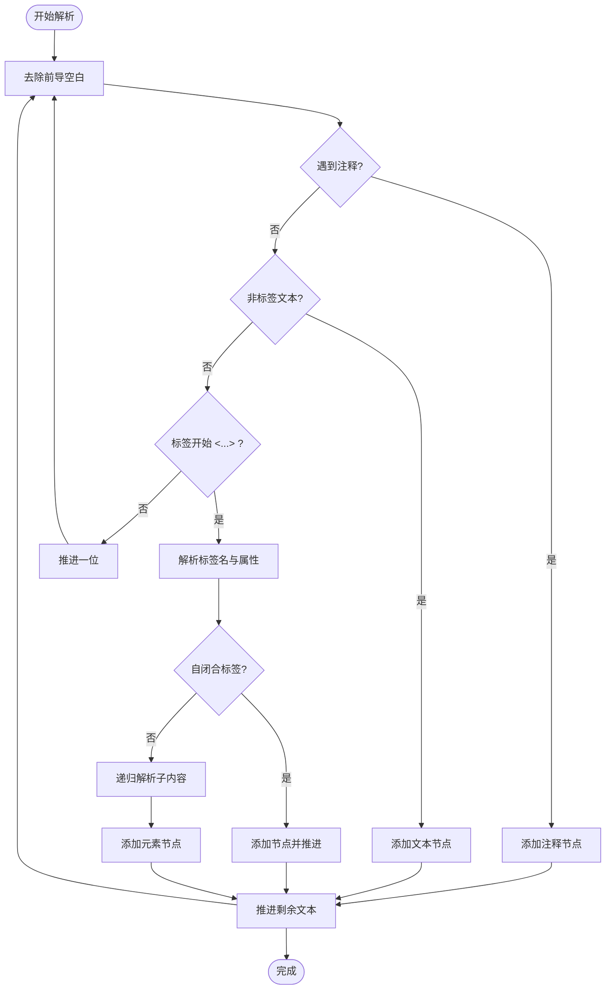
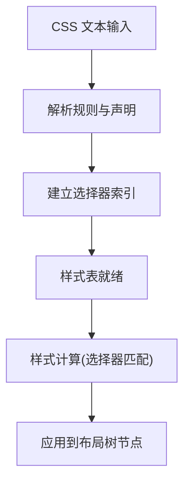
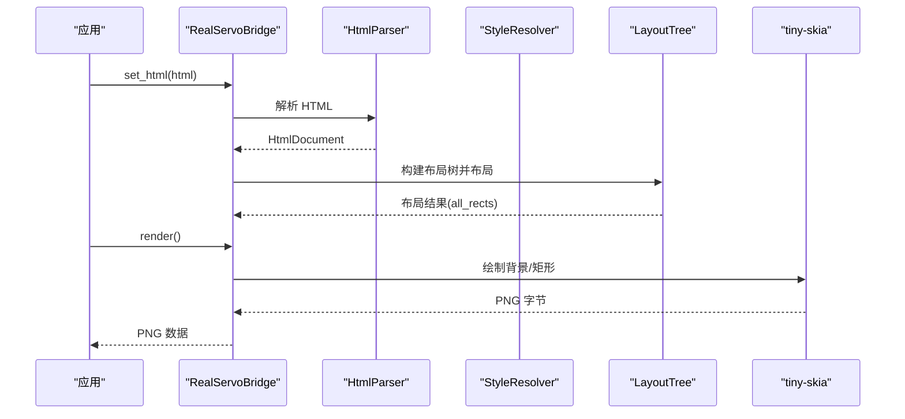
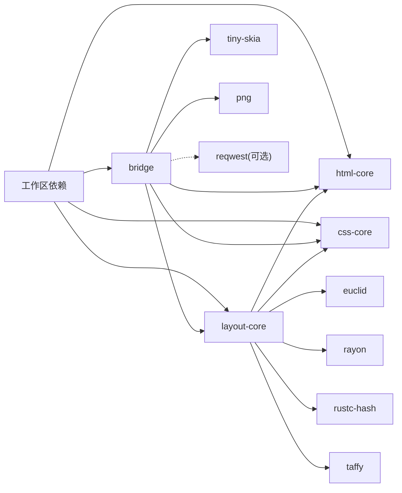

# 开发指南

<cite>
**本文引用的文件**
- [README.md](file://README.md)
- [Cargo.toml](file://Cargo.toml)
- [bridge/lib.rs](file://bridge/lib.rs)
- [bridge/bridge.rs](file://bridge/bridge.rs)
- [bridge/network.rs](file://bridge/network.rs)
- [bridge/real_impl.rs](file://bridge/real_impl.rs)
- [bridge/servo_impl.rs](file://bridge/servo_impl.rs)
- [components/html_core/lib.rs](file://components/html_core/lib.rs)
- [components/html_core/parser.rs](file://components/html_core/parser.rs)
- [components/css_core/lib.rs](file://components/css_core/lib.rs)
- [components/css_core/stylesheet.rs](file://components/css_core/stylesheet.rs)
- [components/layout_core/lib.rs](file://components/layout_core/lib.rs)
- [components/layout_core/tree.rs](file://components/layout_core/tree.rs)
</cite>

## 目录
1. [简介](#简介)
2. [项目结构](#项目结构)
3. [核心组件](#核心组件)
4. [架构总览](#架构总览)
5. [详细组件分析](#详细组件分析)
6. [依赖关系分析](#依赖关系分析)
7. [性能考虑](#性能考虑)
8. [故障排查指南](#故障排查指南)
9. [结论](#结论)
10. [附录](#附录)

## 简介
本指南面向希望参与 Servo-Zero 项目的开发者，提供从环境准备、构建与测试到贡献流程、调试与性能优化的全流程说明。Servo-Zero 是一个基于 Servo 的轻量 Web-Native 渲染引擎，提供纯 Rust 的桥接层，支持 DOM 注入与操作、CSS 解析与布局、事件处理、PNG 渲染以及可选的 HTTP 网络能力。项目采用多 crate 工作区组织，便于模块化开发与最小化二进制体积。

## 项目结构
仓库采用工作区（workspace）组织，顶层 Cargo.toml 声明成员 crate；bridge 作为统一桥接层，components 子目录下包含 html_core、css_core、layout_core 三个核心组件 crate，分别负责 HTML 解析与 DOM、CSS 解析与级联、布局计算与渲染。

图表来源
- [Cargo.toml:1-7](file://Cargo.toml#L1-L7)
- [bridge/Cargo.toml:32-35](file://bridge/Cargo.toml#L32-L35)
- [components/html_core/Cargo.toml:12-13](file://components/html_core/Cargo.toml#L12-L13)
- [components/css_core/Cargo.toml:12-13](file://components/css_core/Cargo.toml#L12-L13)
- [components/layout_core/Cargo.toml:12-13](file://components/layout_core/Cargo.toml#L12-L13)

章节来源
- [README.md: 157-173:157-173](file://README.md#L157-L173)
- [Cargo.toml: 1-37:1-37](file://Cargo.toml#L1-L37)

## 核心组件
- 桥接层（bridge）：定义 WebNativeBridge trait，并提供 ServoBridge（Mock）与 RealServoBridge（生产）两种实现，统一对外暴露 DOM 操作、CSS 控制、布局查询、事件绑定、渲染、网络与文件操作等能力。
- HTML 核心（html_core）：提供 HTML 解析器与 DOM 结构，支持标签、属性、文本与注释节点的构建与查询。
- CSS 核心（css_core）：提供样式表解析、声明解析、颜色与长度解析、样式级联与计算等能力。
- 布局核心（layout_core）：基于 taffy 的盒模型与 Flexbox 布局算法，结合 html_core 与 css_core 输出布局树与命中测试结果。

章节来源
- [README.md: 43-48:43-48](file://README.md#L43-L48)
- [bridge/lib.rs: 1-13:1-13](file://bridge/lib.rs#L1-L13)
- [components/html_core/lib.rs: 1-15:1-15](file://components/html_core/lib.rs#L1-L15)
- [components/css_core/lib.rs: 1-12:1-12](file://components/css_core/lib.rs#L1-L12)
- [components/layout_core/lib.rs: 1-12:1-12](file://components/layout_core/lib.rs#L1-L12)

## 架构总览
桥接层作为统一入口，协调 HTML、CSS、布局与渲染模块，同时通过 feature 标记控制网络与嵌入模式。渲染使用 tiny-skia 输出 PNG，布局使用 taffy 与自研盒模型实现。

图表来源
- [bridge/bridge.rs: 114-262:114-262](file://bridge/bridge.rs#L114-L262)
- [bridge/real_impl.rs: 1-372:1-372](file://bridge/real_impl.rs#L1-L372)
- [bridge/servo_impl.rs: 1-413:1-413](file://bridge/servo_impl.rs#L1-L413)
- [components/html_core/lib.rs: 5-9:5-9](file://components/html_core/lib.rs#L5-L9)
- [components/css_core/lib.rs: 5-11:5-11](file://components/css_core/lib.rs#L5-L11)
- [components/layout_core/lib.rs: 5-11:5-11](file://components/layout_core/lib.rs#L5-L11)
- [bridge/Cargo.toml: 38-42:38-42](file://bridge/Cargo.toml#L38-L42)

## 详细组件分析

### 桥接层与接口设计
- WebNativeBridge trait：定义了 DOM 操作、布局查询、CSS 控制、事件绑定与处理、渲染、网络与文件操作等方法族，提供默认实现以便在不同模式（如 Minimal）下按需启用。
- RealServoBridge：生产实现，集成 HTML 解析、CSS 应用、布局计算与 tiny-skia 渲染；在启用 network feature 时支持导航、HTTP GET/POST、文件下载与当前 URL 查询。
- ServoBridge：Mock 实现，用于测试与演示，支持 HTML 功能时可进行 DOM 查询与样式设置。

图表来源
- [bridge/bridge.rs: 114-262:114-262](file://bridge/bridge.rs#L114-L262)
- [bridge/real_impl.rs: 11-372:11-372](file://bridge/real_impl.rs#L11-L372)
- [bridge/servo_impl.rs: 10-413:10-413](file://bridge/servo_impl.rs#L10-L413)

章节来源
- [bridge/bridge.rs: 114-262:114-262](file://bridge/bridge.rs#L114-L262)
- [bridge/real_impl.rs: 61-372:61-372](file://bridge/real_impl.rs#L61-L372)
- [bridge/servo_impl.rs: 74-413:74-413](file://bridge/servo_impl.rs#L74-L413)

### HTML 解析与 DOM
- HtmlParser：递归解析 HTML 字符串，构建 HtmlDocument，支持标签、属性、文本与注释节点，处理自闭合标签与层级嵌套。
- HtmlDocument/DomNode：提供节点查询、父子关系与属性访问等基础能力，支撑布局与事件系统。

图表来源
- [components/html_core/parser.rs: 18-135:18-135](file://components/html_core/parser.rs#L18-L135)

章节来源
- [components/html_core/parser.rs: 1-153:1-153](file://components/html_core/parser.rs#L1-L153)
- [components/html_core/lib.rs: 5-15:5-15](file://components/html_core/lib.rs#L5-L15)

### CSS 解析、级联与样式计算
- Stylesheet：从 CSS 文本解析出规则与声明，建立选择器索引，支持规则增删与查询。
- color_from_name/parse_color：支持颜色名称、十六进制、rgb/rgba 与渐变首色解析。
- Length：支持 px/em/rem/% 等长度单位解析与转换。
- 与布局树联动：通过 StyleResolver 计算每个节点的最终样式，驱动布局树生成。

图表来源
- [components/css_core/stylesheet.rs: 30-203:30-203](file://components/css_core/stylesheet.rs#L30-L203)
- [components/css_core/lib.rs: 14-207:14-207](file://components/css_core/lib.rs#L14-L207)
- [components/layout_core/tree.rs: 53-79:53-79](file://components/layout_core/tree.rs#L53-L79)

章节来源
- [components/css_core/stylesheet.rs: 1-210:1-210](file://components/css_core/stylesheet.rs#L1-L210)
- [components/css_core/lib.rs: 1-207:1-207](file://components/css_core/lib.rs#L1-L207)
- [components/layout_core/tree.rs: 1-241:1-241](file://components/layout_core/tree.rs#L1-L241)

### 布局树与渲染
- LayoutTree：基于 DOM 与样式，构建布局树，计算每个节点的位置与尺寸，支持命中测试与矩形查询。
- 渲染：RealServoBridge 使用 tiny-skia 将布局节点按深度顺序绘制为 PNG。

图表来源
- [bridge/real_impl.rs: 101-125:101-125](file://bridge/real_impl.rs#L101-L125)
- [bridge/real_impl.rs: 154-205:154-205](file://bridge/real_impl.rs#L154-L205)
- [components/layout_core/tree.rs: 21-69:21-69](file://components/layout_core/tree.rs#L21-L69)

章节来源
- [components/layout_core/tree.rs: 1-241:1-241](file://components/layout_core/tree.rs#L1-L241)
- [bridge/real_impl.rs: 101-205:101-205](file://bridge/real_impl.rs#L101-L205)

## 依赖关系分析
- 工作区依赖：日志、渲染与几何、布局引擎、并行与哈希、URL 等在工作区层面集中声明，便于版本一致性。
- 桥接层依赖：html-core、css-core、layout-core 作为内部依赖；tiny-skia、png 用于渲染；reqwest（可选）用于网络。
- 核心组件依赖：layout_core 依赖 html-core、css-core、euclid、rayon、rustc-hash、taffy。

图表来源
- [Cargo.toml: 19-37:19-37](file://Cargo.toml#L19-L37)
- [bridge/Cargo.toml: 26-42:26-42](file://bridge/Cargo.toml#L26-L42)
- [components/layout_core/Cargo.toml: 15-22:15-22](file://components/layout_core/Cargo.toml#L15-L22)

章节来源
- [Cargo.toml: 19-37:19-37](file://Cargo.toml#L19-L37)
- [bridge/Cargo.toml: 26-42:26-42](file://bridge/Cargo.toml#L26-L42)
- [components/layout_core/Cargo.toml: 15-22:15-22](file://components/layout_core/Cargo.toml#L15-L22)

## 性能考虑
- 布局计算：layout_core 使用 taffy 与自研盒模型，建议减少不必要的重复布局调用，批量更新样式后再触发布局。
- 渲染路径：RealServoBridge 在渲染时对节点按深度排序，避免透明度与覆盖顺序导致的多次绘制开销。
- 并行与哈希：工作区引入 rayon 与 rustc-hash，可在需要时利用并行与高效哈希提升性能。
- 网络请求：网络功能为可选，避免在 Minimal 模式引入额外依赖与开销。

## 故障排查指南
- 网络功能未启用：当未启用 network feature 时，navigate、http_get、http_post、download_file 会返回错误提示。请使用 --features "network" 或 --all-features 构建。
- JS 执行：当前实现中 eval_js 返回空字符串并记录警告，表明不支持 JS 执行。
- DOM 查询：在 Minimal 模式下，set_html 会输出警告但不会执行实际解析，需启用 HTML 功能或使用 RealServoBridge。
- 渲染异常：若渲染结果为空白，请检查布局树是否已正确构建与布局，确认 set_html 后调用了 layout。

章节来源
- [bridge/real_impl.rs: 252-279:252-279](file://bridge/real_impl.rs#L252-L279)
- [bridge/real_impl.rs: 281-358:281-358](file://bridge/real_impl.rs#L281-L358)
- [bridge/real_impl.rs: 149-152:149-152](file://bridge/real_impl.rs#L149-L152)
- [bridge/bridge.rs: 125-129:125-129](file://bridge/bridge.rs#L125-L129)

## 结论
Servo-Zero 通过清晰的模块划分与可选特性，提供了从 HTML/CSS 解析到布局渲染的完整链路，并以桥接层统一对外暴露能力。建议在开发过程中遵循最小功能集起步，逐步启用网络与 HTML 功能，关注布局与渲染的性能瓶颈，配合日志与单元测试快速定位问题。

## 附录

### 构建与测试
- 构建命令
  - 默认构建（启用 network）：cargo build
  - 启用所有特性：cargo build --features "network"
  - 最小模式（禁用默认特性）：cargo build --no-default-features
- 运行测试：cargo test
- 特性说明
  - network：启用 HTTP 网络请求（reqwest）
  - embed：嵌入模式（当前与 network 相同）

章节来源
- [README.md: 58-80:58-80](file://README.md#L58-L80)

### 项目结构与职责
- bridge：统一接口与两种实现（Mock/Real），负责 DOM/CSS/布局/事件/渲染/网络/文件操作。
- components/html_core：HTML 解析与 DOM。
- components/css_core：CSS 解析、级联与样式计算。
- components/layout_core：布局树、盒模型与 Flexbox。

章节来源
- [README.md: 157-173:157-173](file://README.md#L157-L173)

### 贡献指南（建议）
- 编码规范
  - 使用标准 Rust 风格与命名约定，保持模块内函数与结构体职责单一。
  - 对外接口尽量通过 trait 抽象，确保桥接层可替换实现。
- 测试要求
  - 为关键模块（HTML 解析、CSS 样式表、布局树）编写单元测试，覆盖边界与错误场景。
  - 对网络功能使用条件编译进行测试隔离。
- Pull Request 流程
  - 新功能/修复需附带测试用例与变更说明。
  - 提交前确保通过 cargo test 与 clippy（如启用）校验。

### 调试与性能分析
- 调试技巧
  - 使用 log 宏输出关键路径状态，结合 cargo run -- -- -- -- -- -- -- -- -- -- -- -- -- -- -- -- -- -- -- -- -- -- -- -- -- -- -- -- -- -- -- -- -- -- -- -- -- -- -- -- -- -- -- -- -- -- -- -- -- -- -- -- -- -- -- -- -- -- -- -- -- -- -- -- -- -- -- -- -- -- -- -- -- -- -- -- -- -- -- -- -- -- -- -- -- -- -- -- -- -- -- -- -- -- -- -- -- -- -- -- -- -- -- -- -- -- -- -- -- -- -- -- -- -- -- -- -- -- -- -- -- -- -- -- -- -- -- -- -- -- -- -- -- -- -- -- -- -- -- -- -- -- -- -- -- -- -- -- -- -- -- -- -- -- -- -- -- -- -- -- -- -- -- -- -- -- -- -- -- -- -- -- -- -- -- -- -- -- -- -- -- -- -- -- -- -- -- -- -- -- -- -- -- -- -- -- -- -- -- -- -- -- -- -- -- -- -- -- -- -- -- -- -- -- -- -- -- -- -- -- -- -- -- -- -- -- -- -- -- -- -- -- -- -- -- -- -- -- -- -- -- -- -- -- -- -- -- -- -- -- -- -- -- -- -- -- -- -- -- -- -- -- -- -- -- -- -- -- -- -- -- -- -- -- -- -- -- -- -- -- -- -- -- -- -- -- -- -- -- -- -- -- -- -- -- -- -- -- -- -- -- -- -- -- -- -- -- -- -- -- -- -- -- -- -- -- -- -- -- -- -- -- -- -- -- -- -- -- -- -- -- -- -- -- -- -- -- -- -- -- -- -- -- -- -- -- -- -- -- -- -- -- -- -- -- -- -- -- -- -- -- -- -- -- -- -- -- -- -- -- -- -- -- -- -- -- -- -- -- -- -- -- -- -- -- -- -- -- -- -- -- -- -- -- -- -- -- -- -- -- -- -- -- -- -- -- -- -- -- -- -- -- -- -- -- -- -- -- -- -- -- -- -- -- -- -- -- -- -- -- -- -- -- -- -- -- -- -- -- -- -- -- -- -- -- -- -- -- -- -- -- -- -- -- -- -- -- -- -- -- -- -- -- -- -- -- -- -- -- -- -- -- -- -- -- -- -- -- -- -- -- -- -- -- -- -- -- -- -- -- -- -- -- -- -- -- -- -- -- -- --......
  - 性能分析
    - 使用火焰图工具（如 perf 或 flamegraph）定位热点函数。
    - 关注布局与渲染阶段的重复计算，必要时引入缓存或增量更新策略。

### 常见问题与解决方案
- navigate/http_get/http_post/download_file 报错“Network feature not enabled”
  - 解决：使用 --features "network" 或 --all-features 重新构建。
- set_html 无效果或警告
  - 解决：确保启用 HTML 功能或使用 RealServoBridge；确认 HTML 字符串格式正确。
- 渲染结果为空白
  - 解决：确认已调用 set_html 并完成布局；检查样式是否设置了背景色。

章节来源
- [bridge/real_impl.rs: 252-279:252-279](file://bridge/real_impl.rs#L252-L279)
- [bridge/real_impl.rs: 101-125:101-125](file://bridge/real_impl.rs#L101-L125)
- [bridge/real_impl.rs: 154-205:154-205](file://bridge/real_impl.rs#L154-L205)