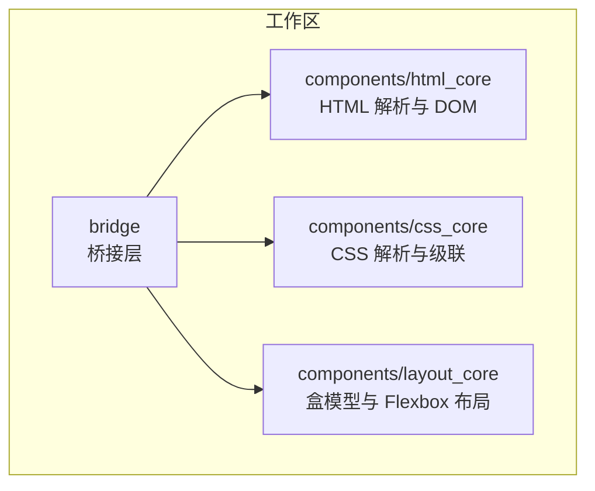
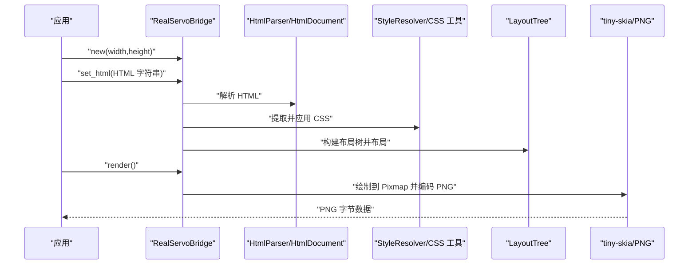
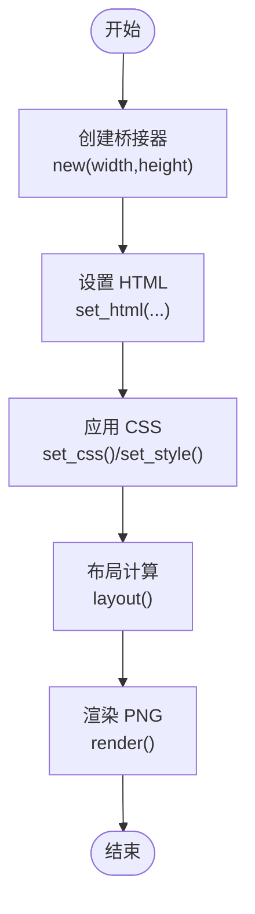
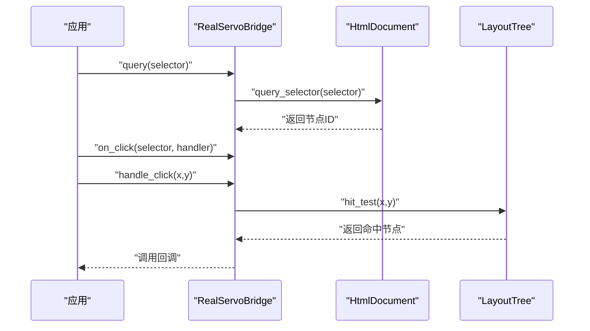
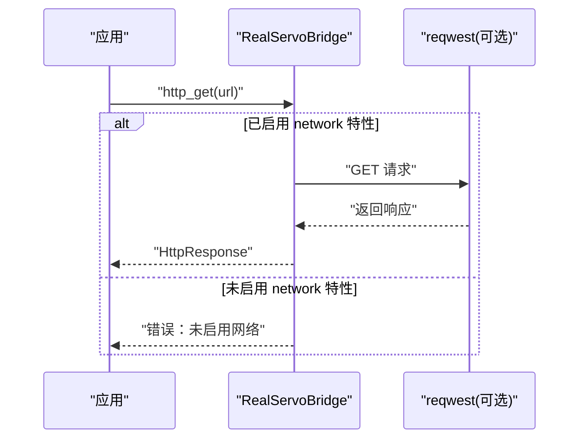
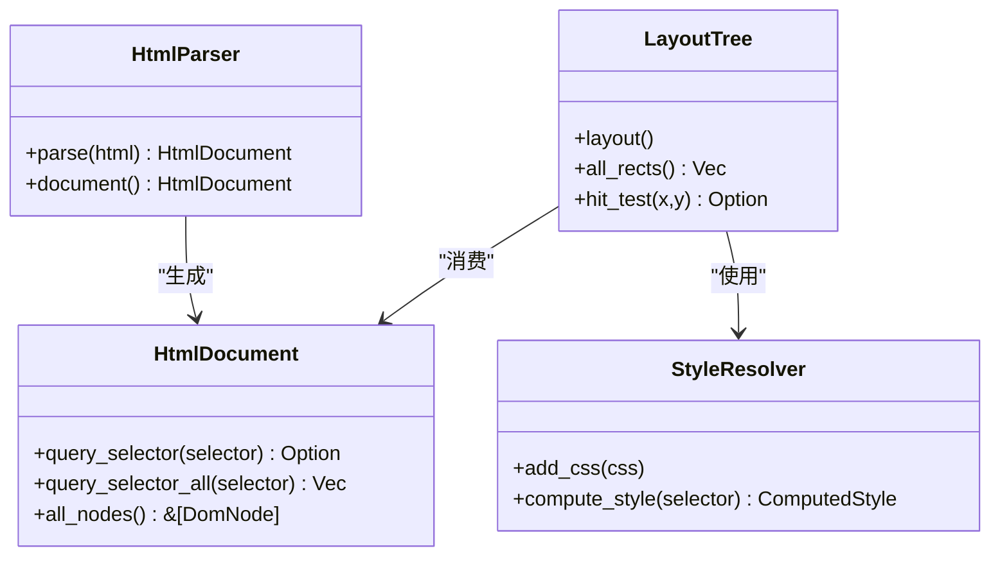
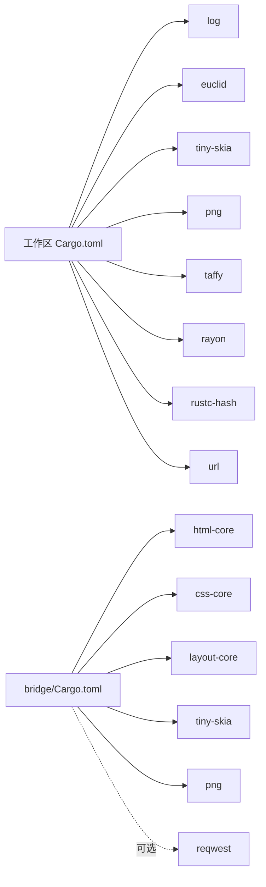

# 快速开始

<cite>
**本文引用的文件**
- [README.md](file://README.md)
- [Cargo.toml](file://Cargo.toml)
- [FEATURES.md](file://FEATURES.md)
- [bridge/lib.rs](file://bridge/lib.rs)
- [bridge/Cargo.toml](file://bridge/Cargo.toml)
- [bridge/bridge.rs](file://bridge/bridge.rs)
- [bridge/real_impl.rs](file://bridge/real_impl.rs)
- [bridge/network.rs](file://bridge/network.rs)
- [components/html_core/lib.rs](file://components/html_core/lib.rs)
- [components/html_core/dom.rs](file://components/html_core/dom.rs)
- [components/html_core/parser.rs](file://components/html_core/parser.rs)
- [components/css_core/lib.rs](file://components/css_core/lib.rs)
- [components/layout_core/lib.rs](file://components/layout_core/lib.rs)
- [components/layout_core/tree.rs](file://components/layout_core/tree.rs)
- [components/layout_core/flexbox.rs](file://components/layout_core/flexbox.rs)
</cite>

## 目录
1. [简介](#简介)
2. [项目结构](#项目结构)
3. [核心组件](#核心组件)
4. [架构总览](#架构总览)
5. [详细组件分析](#详细组件分析)
6. [依赖关系分析](#依赖关系分析)
7. [性能考虑](#性能考虑)
8. [故障排除指南](#故障排除指南)
9. [结论](#结论)
10. [附录](#附录)

## 简介
本指南面向初学者，帮助你在最短时间内完成 Servo-Zero 的安装与构建，并掌握从创建桥接器到渲染第一个 PNG 图像的完整流程。你还将看到基础的 DOM 查询、事件绑定与点击处理示例，以及网络功能的简单用法。所有示例均来自仓库源码，你可以直接运行并理解每一步的作用。

## 项目结构
Servo-Zero 采用工作区组织，核心由“桥接层”和“三大引擎组件”构成：
- 桥接层 bridge：统一的 WebNativeBridge 接口与生产实现 RealServoBridge，负责 DOM/CSS/布局/渲染/事件/网络等能力的对外暴露。
- HTML 引擎 components/html_core：纯 Rust 的 HTML 解析与 DOM 树支持。
- CSS 引擎 components/css_core：CSS 解析、级联、选择器匹配与常用颜色/长度解析。
- 布局引擎 components/layout_core：基于 taffy 的盒模型与 Flexbox 布局，生成布局树并参与渲染。

图表来源
- [bridge/Cargo.toml:1-43](file://bridge/Cargo.toml#L1-L43)
- [components/html_core/lib.rs:1-15](file://components/html_core/lib.rs#L1-L15)
- [components/css_core/lib.rs:1-207](file://components/css_core/lib.rs#L1-L207)
- [components/layout_core/lib.rs:1-22](file://components/layout_core/lib.rs#L1-L22)

章节来源
- [README.md:16-31](file://README.md#L16-L31)
- [Cargo.toml:1-37](file://Cargo.toml#L1-L37)

## 核心组件
- WebNativeBridge 接口：定义了创建桥接器、设置 HTML、DOM 查询、布局查询、CSS 操作、JS 执行占位、渲染 PNG、事件绑定与处理、网络请求、文件读写等方法。
- RealServoBridge 实现：提供完整的 HTML/CSS/布局/渲染/事件处理能力；在未启用网络特性时，网络相关方法会返回错误提示。
- HTML 引擎：HtmlParser 将 HTML 字符串解析为 HtmlDocument；HtmlDocument 提供节点存储、父子关系、文本收集与 CSS 选择器查询。
- CSS 引擎：提供颜色解析、长度解析、样式解析与计算等工具函数。
- 布局引擎：LayoutTree 基于 DOM 与样式计算构建布局树，支持盒模型与 Flexbox；tree.rs 中实现了布局计算与命中测试。

章节来源
- [bridge/bridge.rs:114-262](file://bridge/bridge.rs#L114-L262)
- [bridge/real_impl.rs:11-372](file://bridge/real_impl.rs#L11-L372)
- [components/html_core/lib.rs:1-15](file://components/html_core/lib.rs#L1-L15)
- [components/html_core/dom.rs:174-316](file://components/html_core/dom.rs#L174-L316)
- [components/html_core/parser.rs:18-153](file://components/html_core/parser.rs#L18-L153)
- [components/css_core/lib.rs:13-207](file://components/css_core/lib.rs#L13-L207)
- [components/layout_core/lib.rs:13-22](file://components/layout_core/lib.rs#L13-L22)
- [components/layout_core/tree.rs:61-241](file://components/layout_core/tree.rs#L61-L241)

## 架构总览
下图展示了从创建桥接器到渲染 PNG 的端到端流程，以及网络请求在不同特性模式下的启用情况。

图表来源
- [bridge/real_impl.rs:61-125](file://bridge/real_impl.rs#L61-L125)
- [components/html_core/parser.rs:18-22](file://components/html_core/parser.rs#L18-L22)
- [components/layout_core/tree.rs:61-69](file://components/layout_core/tree.rs#L61-L69)
- [bridge/real_impl.rs:154-205](file://bridge/real_impl.rs#L154-L205)

## 详细组件分析

### 安装与构建
- 默认构建：启用网络特性，适合完整浏览器功能。
- 全特性构建：显式开启网络与其它特性。
- 最小模式：关闭默认特性，仅保留最小依赖集合，适合仅渲染已有 HTML 的场景。
- 嵌入模式：关闭默认特性并启用 embed（等价于启用 network），适合将 Servo-Zero 嵌入到其他程序中使用。

构建命令与特性矩阵请参考以下文件路径：
- [README.md:58-80](file://README.md#L58-L80)
- [FEATURES.md:14-67](file://FEATURES.md#L14-L67)

章节来源
- [README.md:58-80](file://README.md#L58-L80)
- [FEATURES.md:14-67](file://FEATURES.md#L14-L67)

### 基础使用：创建桥接器与渲染第一个 PNG
- 步骤概览
  1) 创建桥接器实例，指定视口宽高。
  2) 设置 HTML 内容（含内联样式）。
  3) 可选：添加额外 CSS 或内联样式。
  4) 触发布局计算。
  5) 调用渲染接口，得到 PNG 字节数据。
- 关键接口与实现
  - 创建桥接器：参见 [bridge/real_impl.rs:61-75](file://bridge/real_impl.rs#L61-L75)
  - 设置 HTML：参见 [bridge/real_impl.rs:101-125](file://bridge/real_impl.rs#L101-L125)
  - 应用 CSS：参见 [bridge/real_impl.rs:131-140](file://bridge/real_impl.rs#L131-L140)
  - 布局计算：参见 [components/layout_core/tree.rs:61-69](file://components/layout_core/tree.rs#L61-L69)
  - 渲染 PNG：参见 [bridge/real_impl.rs:154-205](file://bridge/real_impl.rs#L154-L205)

图表来源
- [bridge/real_impl.rs:61-140](file://bridge/real_impl.rs#L61-L140)
- [components/layout_core/tree.rs:61-69](file://components/layout_core/tree.rs#L61-L69)
- [bridge/real_impl.rs:154-205](file://bridge/real_impl.rs#L154-L205)

章节来源
- [README.md:81-118](file://README.md#L81-L118)
- [bridge/real_impl.rs:61-205](file://bridge/real_impl.rs#L61-L205)

### DOM 查询与事件绑定
- DOM 查询
  - 通过 CSS 选择器查询单个或多个元素，返回 DOM 节点 ID。
  - 查询实现位于 HtmlDocument，支持 ID、类、标签选择器。
  - 参考：[components/html_core/dom.rs:174-202](file://components/html_core/dom.rs#L174-L202)
- 事件绑定与处理
  - 绑定点击事件：参见 [bridge/bridge.rs:212-213](file://bridge/bridge.rs#L212-L213)
  - 处理点击：参见 [bridge/real_impl.rs:219-227](file://bridge/real_impl.rs#L219-L227)
  - 命中测试：参见 [components/layout_core/tree.rs:217-232](file://components/layout_core/tree.rs#L217-L232)

图表来源
- [bridge/bridge.rs:212-228](file://bridge/bridge.rs#L212-L228)
- [bridge/real_impl.rs:219-227](file://bridge/real_impl.rs#L219-L227)
- [components/layout_core/tree.rs:217-232](file://components/layout_core/tree.rs#L217-L232)
- [components/html_core/dom.rs:174-202](file://components/html_core/dom.rs#L174-L202)

章节来源
- [bridge/bridge.rs:131-141](file://bridge/bridge.rs#L131-L141)
- [bridge/real_impl.rs:207-227](file://bridge/real_impl.rs#L207-L227)
- [components/layout_core/tree.rs:217-232](file://components/layout_core/tree.rs#L217-L232)

### 网络功能基础用法
- 导航到 URL：参见 [bridge/real_impl.rs:252-264](file://bridge/real_impl.rs#L252-L264)
- HTTP GET：参见 [bridge/real_impl.rs:281-301](file://bridge/real_impl.rs#L281-L301)
- HTTP POST：参见 [bridge/real_impl.rs:308-334](file://bridge/real_impl.rs#L308-L334)
- 下载文件：参见 [bridge/real_impl.rs:341-353](file://bridge/real_impl.rs#L341-L353)
- 响应类型：HttpResponse 结构体定义，参见 [bridge/network.rs:5-53](file://bridge/network.rs#L5-L53)

图表来源
- [bridge/real_impl.rs:281-301](file://bridge/real_impl.rs#L281-L301)
- [bridge/network.rs:5-53](file://bridge/network.rs#L5-L53)

章节来源
- [README.md:120-134](file://README.md#L120-L134)
- [bridge/real_impl.rs:252-353](file://bridge/real_impl.rs#L252-L353)
- [bridge/network.rs:5-53](file://bridge/network.rs#L5-L53)

### HTML、CSS 与布局核心
- HTML 解析与 DOM
  - HtmlParser.parse：将 HTML 字符串解析为 HtmlDocument。
  - HtmlDocument.query_selector/query_selector_all：支持 ID、类、标签选择器。
  - 参考：[components/html_core/parser.rs:18-153](file://components/html_core/parser.rs#L18-L153)，[components/html_core/dom.rs:174-316](file://components/html_core/dom.rs#L174-L316)
- CSS 工具
  - 颜色解析：支持 #RGB/#RGBA/#RRGGBB/#RRGGBBAA、rgb()/rgba()、颜色名称。
  - 长度解析：支持 px/em/rem/%/auto。
  - 参考：[components/css_core/lib.rs:43-207](file://components/css_core/lib.rs#L43-L207)
- 布局树
  - LayoutTree：基于 DOM 与样式解析器构建布局树，支持盒模型与 Flexbox。
  - 布局计算与命中测试：参见 [components/layout_core/tree.rs:61-241](file://components/layout_core/tree.rs#L61-L241)
  - Flexbox 参数：方向、换行、对齐等，参见 [components/layout_core/flexbox.rs:1-167](file://components/layout_core/flexbox.rs#L1-L167)

图表来源
- [components/html_core/parser.rs:18-153](file://components/html_core/parser.rs#L18-L153)
- [components/html_core/dom.rs:174-316](file://components/html_core/dom.rs#L174-L316)
- [components/layout_core/tree.rs:61-241](file://components/layout_core/tree.rs#L61-L241)

章节来源
- [components/html_core/lib.rs:1-15](file://components/html_core/lib.rs#L1-L15)
- [components/css_core/lib.rs:13-207](file://components/css_core/lib.rs#L13-L207)
- [components/layout_core/lib.rs:13-22](file://components/layout_core/lib.rs#L13-L22)

## 依赖关系分析
- 工作区依赖汇总：日志、渲染/几何、布局引擎、并行、URL 等。
- 桥接层依赖：独立核心组件（html-core、css-core、layout-core）、tiny-skia、png、可选 reqwest。
- 特性开关：default=html+network；embed=network；最小=no features。

图表来源
- [Cargo.toml:19-37](file://Cargo.toml#L19-L37)
- [bridge/Cargo.toml:26-43](file://bridge/Cargo.toml#L26-L43)

章节来源
- [Cargo.toml:19-37](file://Cargo.toml#L19-L37)
- [bridge/Cargo.toml:16-43](file://bridge/Cargo.toml#L16-L43)

## 性能考虑
- 特性模式对比：default（约 150 依赖，~25s 编译，~15MB）、embed（约 100 依赖，~15s，~10MB）、最小（约 50 依赖，~5s，~5MB）。
- 体积与启动速度：embed 模式移除了 HTML 解析，适合嵌入场景；最小模式进一步减少依赖，适合仅渲染已有 HTML。
- 布局与渲染：布局树构建与 tiny-skia 绘制是主要开销；合理设置视口尺寸与样式可降低复杂度。

章节来源
- [FEATURES.md:70-74](file://FEATURES.md#L70-L74)
- [README.md:136-156](file://README.md#L136-L156)

## 故障排除指南
- 网络功能不可用
  - 现象：调用 navigate/http_get/http_post/download_file 返回“未启用网络”错误。
  - 原因：未启用 network 特性。
  - 处理：使用默认或显式开启 network 特性的构建命令。
  - 参考：[bridge/real_impl.rs:266-269](file://bridge/real_impl.rs#L266-L269)，[bridge/real_impl.rs:303-306](file://bridge/real_impl.rs#L303-L306)，[bridge/real_impl.rs:336-339](file://bridge/real_impl.rs#L336-L339)，[bridge/real_impl.rs:355-358](file://bridge/real_impl.rs#L355-L358)
- 事件未触发
  - 现象：handle_click 无法命中回调。
  - 原因：未正确绑定事件或命中测试未找到节点。
  - 处理：确认选择器正确、已绑定事件、坐标在元素区域内。
  - 参考：[bridge/real_impl.rs:219-227](file://bridge/real_impl.rs#L219-L227)，[components/layout_core/tree.rs:217-232](file://components/layout_core/tree.rs#L217-L232)
- 渲染结果为空
  - 现象：render 返回 PNG，但画面空白。
  - 原因：未设置 HTML/CSS，或背景色透明。
  - 处理：确保 set_html/set_css 已调用，设置可见背景色。
  - 参考：[bridge/real_impl.rs:154-205](file://bridge/real_impl.rs#L154-L205)

章节来源
- [bridge/real_impl.rs:266-358](file://bridge/real_impl.rs#L266-L358)
- [components/layout_core/tree.rs:217-232](file://components/layout_core/tree.rs#L217-L232)
- [bridge/real_impl.rs:154-205](file://bridge/real_impl.rs#L154-L205)

## 结论
通过本快速开始指南，你已经完成了 Servo-Zero 的安装与构建，掌握了创建桥接器、设置 HTML/CSS、布局计算与 PNG 渲染的完整流程，并了解了 DOM 查询、事件绑定与网络功能的基础用法。建议在实际项目中结合特性矩阵选择合适的构建模式，并逐步扩展到更复杂的布局与交互场景。

## 附录
- 示例代码路径（可直接运行）
  - 基础示例：[README.md:81-118](file://README.md#L81-L118)
  - 网络示例：[README.md:120-134](file://README.md#L120-L134)
- 特性说明与使用场景：[FEATURES.md:14-67](file://FEATURES.md#L14-L67)
- 桥接层导出入口：[bridge/lib.rs:1-13](file://bridge/lib.rs#L1-L13)
- 桥接层接口定义：[bridge/bridge.rs:114-262](file://bridge/bridge.rs#L114-L262)
- 生产实现与渲染逻辑：[bridge/real_impl.rs:61-205](file://bridge/real_impl.rs#L61-L205)
- 网络响应类型：[bridge/network.rs:5-53](file://bridge/network.rs#L5-L53)