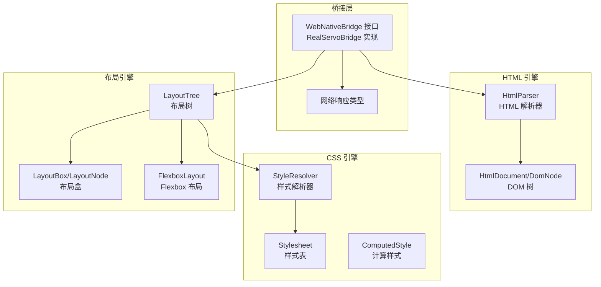
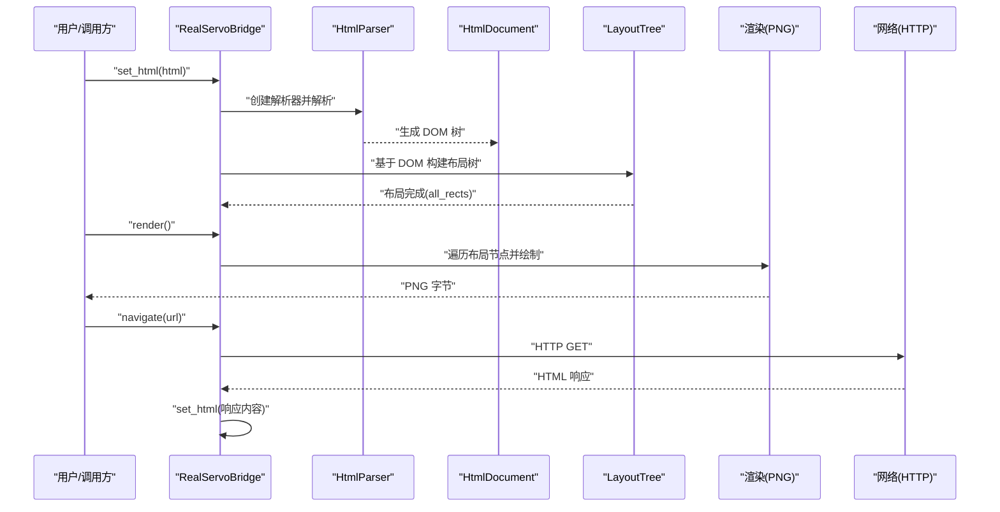
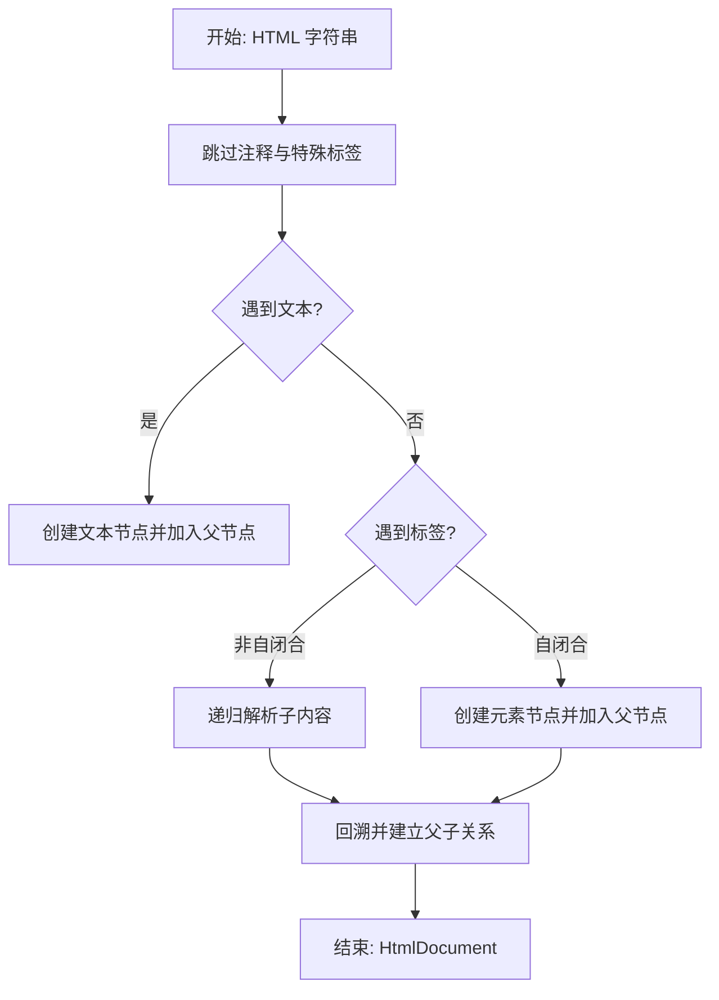
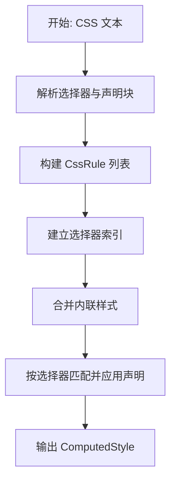
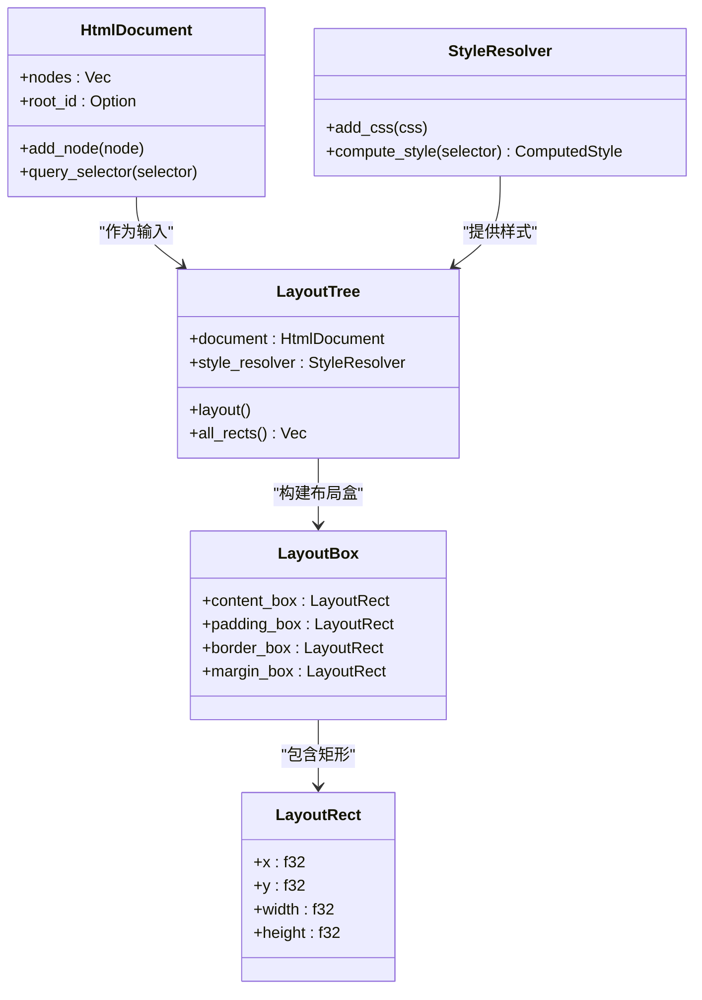
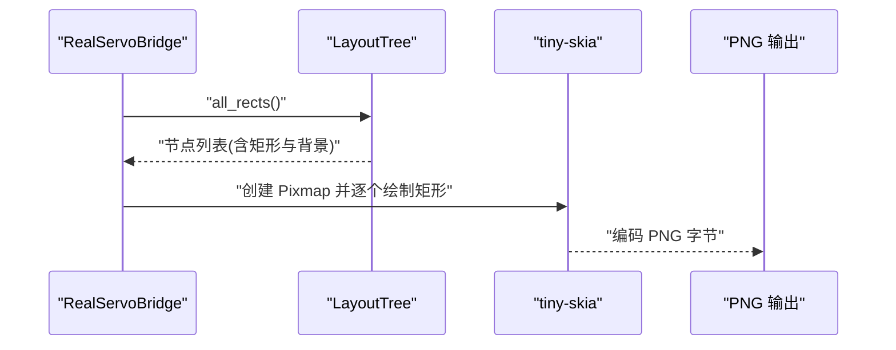
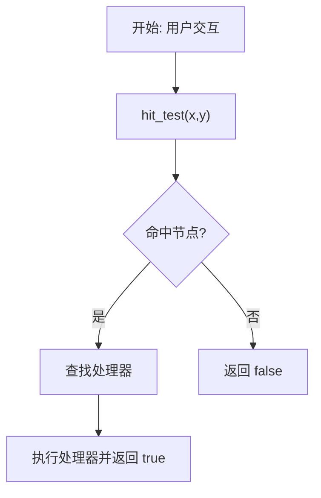
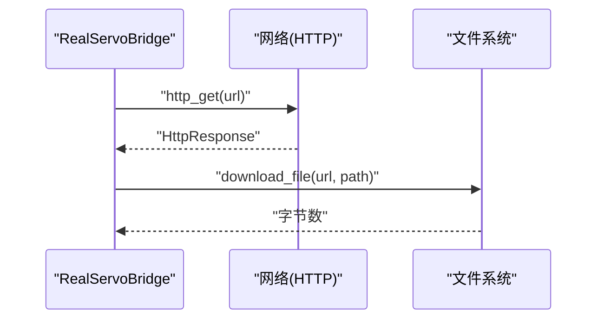
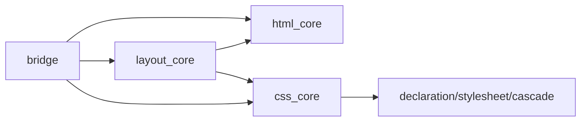

# 数据流分析

<cite>
**本文档引用的文件**
- [README.md](file://README.md)
- [Cargo.toml](file://Cargo.toml)
- [bridge/lib.rs](file://bridge/lib.rs)
- [bridge/bridge.rs](file://bridge/bridge.rs)
- [bridge/real_impl.rs](file://bridge/real_impl.rs)
- [bridge/network.rs](file://bridge/network.rs)
- [components/html_core/lib.rs](file://components/html_core/lib.rs)
- [components/html_core/dom.rs](file://components/html_core/dom.rs)
- [components/html_core/parser.rs](file://components/html_core/parser.rs)
- [components/css_core/lib.rs](file://components/css_core/lib.rs)
- [components/css_core/stylesheet.rs](file://components/css_core/stylesheet.rs)
- [components/css_core/cascade.rs](file://components/css_core/cascade.rs)
- [components/layout_core/lib.rs](file://components/layout_core/lib.rs)
- [components/layout_core/box_model.rs](file://components/layout_core/box_model.rs)
- [components/layout_core/flexbox.rs](file://components/layout_core/flexbox.rs)
- [components/layout_core/tree.rs](file://components/layout_core/tree.rs)
</cite>

## 目录
1. [简介](#简介)
2. [项目结构](#项目结构)
3. [核心组件](#核心组件)
4. [架构总览](#架构总览)
5. [详细组件分析](#详细组件分析)
6. [依赖关系分析](#依赖关系分析)
7. [性能考量](#性能考量)
8. [故障排查指南](#故障排查指南)
9. [结论](#结论)

## 简介
本文件针对 Servo-Zero 的数据流进行系统化分析，覆盖从 HTML 输入到最终 PNG 输出的完整处理链路。文档重点阐述以下方面：
- 每个处理阶段的数据结构变化与转换过程
- HTML 解析、CSS 计算、布局计算与渲染输出的数据流向
- 组件间数据传递机制与同步策略
- 关键性能瓶颈与优化机会
- 为系统性能调优与问题诊断提供技术洞察

## 项目结构
Servo-Zero 采用工作区（workspace）组织，核心由桥接层与三大引擎组件构成：
- 桥接层（bridge）：统一对外接口与生产实现，负责事件绑定、网络与文件操作等
- HTML 引擎（html_core）：纯 Rust HTML 解析与 DOM 树管理
- CSS 引擎（css_core）：CSS 解析、级联与样式计算
- 布局引擎（layout_core）：盒模型与 Flexbox 布局，结合 taffy 实现布局算法

图表来源
- [bridge/bridge.rs:114-262](file://bridge/bridge.rs#L114-L262)
- [bridge/real_impl.rs:11-372](file://bridge/real_impl.rs#L11-L372)
- [components/html_core/parser.rs:1-153](file://components/html_core/parser.rs#L1-L153)
- [components/html_core/dom.rs:115-316](file://components/html_core/dom.rs#L115-L316)
- [components/css_core/stylesheet.rs:13-210](file://components/css_core/stylesheet.rs#L13-L210)
- [components/css_core/cascade.rs:86-271](file://components/css_core/cascade.rs#L86-L271)
- [components/layout_core/tree.rs:12-241](file://components/layout_core/tree.rs#L12-L241)
- [components/layout_core/box_model.rs:155-210](file://components/layout_core/box_model.rs#L155-L210)
- [components/layout_core/flexbox.rs:87-167](file://components/layout_core/flexbox.rs#L87-L167)

章节来源
- [README.md:16-31](file://README.md#L16-L31)
- [Cargo.toml:1-37](file://Cargo.toml#L1-L37)

## 核心组件
- WebNativeBridge 接口：定义统一能力边界，包括 DOM 读写、布局查询、CSS 操作、JS 执行占位、渲染、事件绑定与处理、网络与文件操作等
- RealServoBridge：生产实现，封装布局树、样式规则与事件处理器，协调 HTML 解析、CSS 计算与布局计算，并驱动渲染
- HtmlParser/HtmlDocument/DomNode：HTML 解析与 DOM 树管理，支持注释、文本、元素节点与属性
- Stylesheet/StyleResolver/ComputedStyle：CSS 解析、选择器匹配与样式级联计算
- LayoutTree/LayoutBox：布局树构建与盒模型计算，支持 Flexbox 布局
- 网络响应类型：HTTP 响应结构，便于桥接层在网络功能启用时返回统一格式

章节来源
- [bridge/bridge.rs:114-262](file://bridge/bridge.rs#L114-L262)
- [bridge/real_impl.rs:11-372](file://bridge/real_impl.rs#L11-L372)
- [components/html_core/lib.rs:1-15](file://components/html_core/lib.rs#L1-L15)
- [components/css_core/lib.rs:1-207](file://components/css_core/lib.rs#L1-L207)
- [components/layout_core/lib.rs:1-22](file://components/layout_core/lib.rs#L1-L22)

## 架构总览
下图展示从 HTML 输入到 PNG 输出的端到端数据流：

图表来源
- [bridge/real_impl.rs:101-125](file://bridge/real_impl.rs#L101-L125)
- [bridge/real_impl.rs:154-205](file://bridge/real_impl.rs#L154-L205)
- [components/html_core/parser.rs:18-22](file://components/html_core/parser.rs#L18-L22)
- [components/layout_core/tree.rs:61-69](file://components/layout_core/tree.rs#L61-L69)

## 详细组件分析

### HTML 解析与 DOM 树
- 解析流程：解析器递归扫描输入，跳过注释与特殊标签，识别自闭合标签，构建元素节点与其属性、文本节点与注释节点，维护父子关系
- DOM 结构：文档根节点、元素节点、文本节点、注释节点；支持按 ID/类/标签选择器查询
- 数据结构演进：
  - 输入：HTML 字符串
  - 中间：DomNode 列表与父子索引
  - 输出：HtmlDocument（包含根节点、节点数组、ID 分配器）

图表来源
- [components/html_core/parser.rs:24-135](file://components/html_core/parser.rs#L24-L135)
- [components/html_core/dom.rs:115-316](file://components/html_core/dom.rs#L115-L316)

章节来源
- [components/html_core/parser.rs:18-153](file://components/html_core/parser.rs#L18-L153)
- [components/html_core/dom.rs:19-316](file://components/html_core/dom.rs#L19-L316)

### CSS 解析、级联与样式计算
- 样式表解析：从 CSS 文本中提取选择器与声明块，构建 CssRule 列表与选择器索引
- 样式解析器：聚合多个样式表与内联样式，按选择器匹配规则，应用声明到 ComputedStyle
- 颜色与长度解析：支持多种颜色格式与长度单位，提供 px/em/rem/% 到像素的换算
- 数据结构演进：
  - 输入：CSS 文本
  - 中间：Stylesheet（规则列表+索引）、Declaration
  - 输出：ComputedStyle（按属性存储的最终样式）

图表来源
- [components/css_core/stylesheet.rs:29-107](file://components/css_core/stylesheet.rs#L29-L107)
- [components/css_core/cascade.rs:86-154](file://components/css_core/cascade.rs#L86-L154)
- [components/css_core/lib.rs:43-206](file://components/css_core/lib.rs#L43-L206)

章节来源
- [components/css_core/stylesheet.rs:13-210](file://components/css_core/stylesheet.rs#L13-L210)
- [components/css_core/cascade.rs:86-271](file://components/css_core/cascade.rs#L86-L271)
- [components/css_core/lib.rs:13-207](file://components/css_core/lib.rs#L13-L207)

### 布局树构建与盒模型
- 布局树：以 HtmlDocument 为基础，结合 StyleResolver 计算每个节点的样式，构建 LayoutBox（含 content/padding/border/margin 盒）
- 盒模型：根据 CssLength 计算盒尺寸，支持 hit-test 与矩形查询
- Flexbox 布局：提供 FlexDirection/FlexWrap/AlignItems/JustifyContent 等枚举，计算主轴与交叉轴尺寸与位置
- 数据结构演进：
  - 输入：HtmlDocument、ComputedStyle
  - 中间：LayoutTree（节点到 LayoutBox 的映射）
  - 输出：all_rects（节点 ID、标签名、布局矩形、背景色）

图表来源
- [components/layout_core/tree.rs:12-69](file://components/layout_core/tree.rs#L12-L69)
- [components/layout_core/box_model.rs:155-210](file://components/layout_core/box_model.rs#L155-L210)
- [components/layout_core/flexbox.rs:87-167](file://components/layout_core/flexbox.rs#L87-L167)

章节来源
- [components/layout_core/tree.rs:21-241](file://components/layout_core/tree.rs#L21-L241)
- [components/layout_core/box_model.rs:5-210](file://components/layout_core/box_model.rs#L5-L210)
- [components/layout_core/flexbox.rs:1-167](file://components/layout_core/flexbox.rs#L1-L167)

### 渲染输出（PNG）
- 渲染策略：创建 Pixmap，按布局节点深度与面积排序，依次填充背景矩形
- 输出格式：tiny-skia 编码为 PNG 字节
- 数据结构演进：
  - 输入：LayoutTree.all_rects()
  - 中间：排序后的节点序列
  - 输出：Vec<u8>（PNG）

图表来源
- [bridge/real_impl.rs:154-205](file://bridge/real_impl.rs#L154-L205)
- [components/layout_core/tree.rs:202-215](file://components/layout_core/tree.rs#L202-L215)

章节来源
- [bridge/real_impl.rs:154-205](file://bridge/real_impl.rs#L154-L205)

### 事件与交互
- 事件绑定：支持点击与表单提交事件绑定，window.open 处理
- 事件处理：hit-test 查询命中节点，回调对应处理器
- 数据结构演进：
  - 输入：事件坐标/表单选择器
  - 中间：命中节点与处理器映射
  - 输出：事件处理结果（布尔值表示是否处理）

图表来源
- [bridge/real_impl.rs:219-227](file://bridge/real_impl.rs#L219-L227)
- [components/layout_core/tree.rs:217-232](file://components/layout_core/tree.rs#L217-L232)

章节来源
- [bridge/bridge.rs:210-229](file://bridge/bridge.rs#L210-L229)
- [bridge/real_impl.rs:207-237](file://bridge/real_impl.rs#L207-L237)
- [components/layout_core/tree.rs:217-232](file://components/layout_core/tree.rs#L217-L232)

### 网络与文件操作
- 网络：导航、GET/POST、下载文件，返回 HttpResponse
- 文件：读写本地文件
- 功能开关：通过 feature gate 控制网络功能启用与否

图表来源
- [bridge/real_impl.rs:252-358](file://bridge/real_impl.rs#L252-L358)
- [bridge/network.rs:5-53](file://bridge/network.rs#L5-L53)

章节来源
- [bridge/real_impl.rs:250-371](file://bridge/real_impl.rs#L250-L371)
- [bridge/network.rs:1-54](file://bridge/network.rs#L1-L54)

## 依赖关系分析
- 组件耦合：
  - bridge 依赖 html_core、layout_core（以及可选的网络与文件依赖）
  - layout_core 依赖 html_core 与 css_core
  - css_core 依赖自身模块（declaration、stylesheet、cascade）
- 外部依赖：
  - tiny-skia/png：渲染与编码
  - taffy：布局算法（在 flexbox 模块中体现）
  - rayon/rustc-hash：并行与哈希（在布局与样式索引中使用）
  - reqwest/url（可选）：网络功能

图表来源
- [Cargo.toml:19-37](file://Cargo.toml#L19-L37)
- [bridge/real_impl.rs:5-8](file://bridge/real_impl.rs#L5-L8)
- [components/layout_core/tree.rs:3-8](file://components/layout_core/tree.rs#L3-L8)

章节来源
- [Cargo.toml:19-37](file://Cargo.toml#L19-L37)

## 性能考量
- HTML 解析
  - 现状：递归解析与字符串扫描，未见并行化
  - 建议：对大型文档可考虑分段解析或并行扫描（需评估 DOM 树构建成本）
- CSS 计算
  - 现状：选择器匹配与声明应用线性扫描，存在多样式表合并
  - 建议：缓存选择器匹配结果与 ComputedStyle，减少重复计算
- 布局计算
  - 现状：LayoutTree.layout 递归遍历，盒模型计算简单
  - 建议：引入增量布局与脏标记，仅对变更节点重新布局；对 Flexbox 计算进行常量时间优化
- 渲染
  - 现状：按深度与面积排序后顺序绘制
  - 建议：批量绘制与区域裁剪，避免透明度混合开销；考虑多线程绘制（谨慎处理像素写入）
- 网络
  - 现状：阻塞式 HTTP 请求
  - 建议：异步网络与事件循环，避免主线程阻塞

## 故障排查指南
- set_html 无效果
  - 检查 HTML 是否包含有效标签与样式；确认样式规则是否正确添加
  - 参考：[bridge/real_impl.rs:101-125](file://bridge/real_impl.rs#L101-L125)
- render 返回空 PNG
  - 确认布局树已计算（layout）且存在可绘制矩形
  - 参考：[bridge/real_impl.rs:154-205](file://bridge/real_impl.rs#L154-L205)
- 事件未触发
  - 检查 hit-test 命中与处理器注册
  - 参考：[bridge/real_impl.rs:219-227](file://bridge/real_impl.rs#L219-L227)
- 网络功能不可用
  - 确认 feature "network" 已启用
  - 参考：[bridge/real_impl.rs:252-269](file://bridge/real_impl.rs#L252-L269)

章节来源
- [bridge/real_impl.rs:101-205](file://bridge/real_impl.rs#L101-L205)
- [bridge/real_impl.rs:219-269](file://bridge/real_impl.rs#L219-L269)

## 结论
Servo-Zero 通过清晰的模块划分实现了从 HTML 到 PNG 的完整数据流：HTML 解析生成 DOM，CSS 级联得到计算样式，布局树计算出盒模型与矩形，最终 tiny-skia 渲染为 PNG。当前实现简洁可靠，适合嵌入与最小化部署；在大规模页面与高频更新场景下，建议引入增量布局、样式缓存与异步网络等优化手段以提升性能与用户体验。