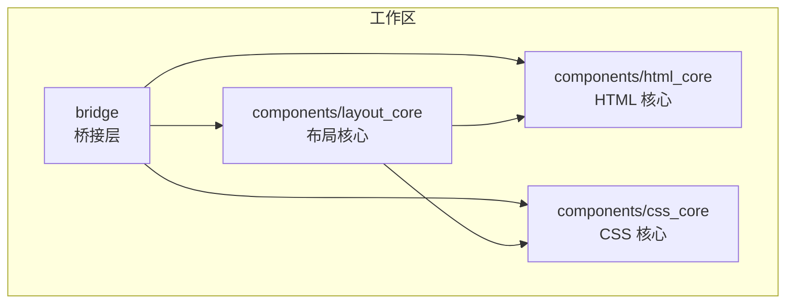
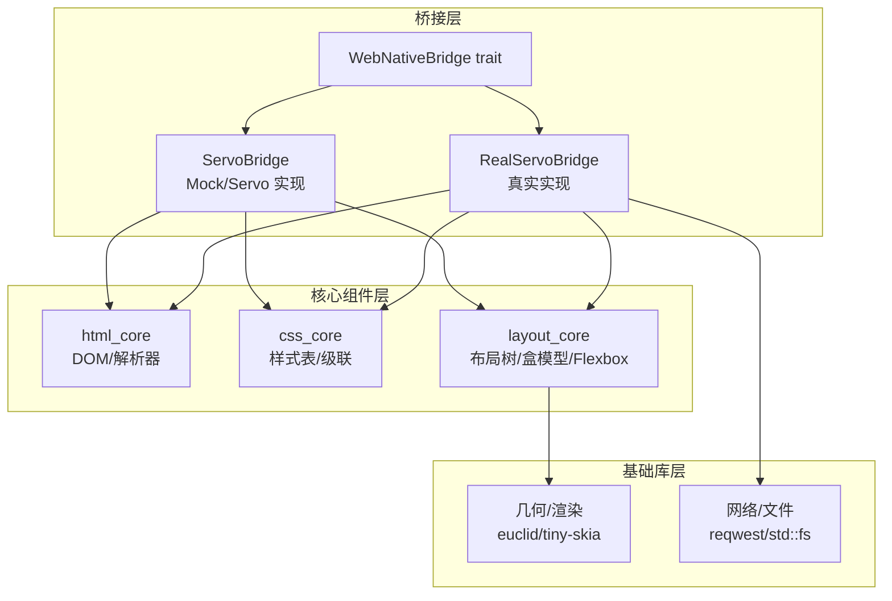
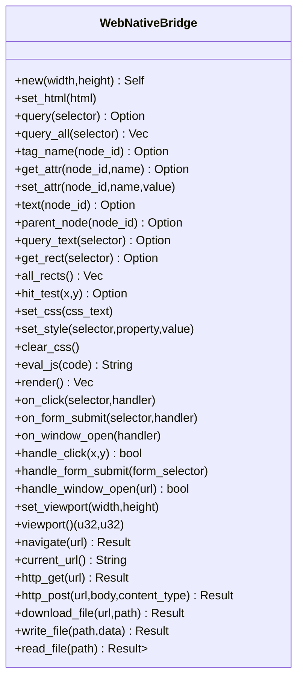
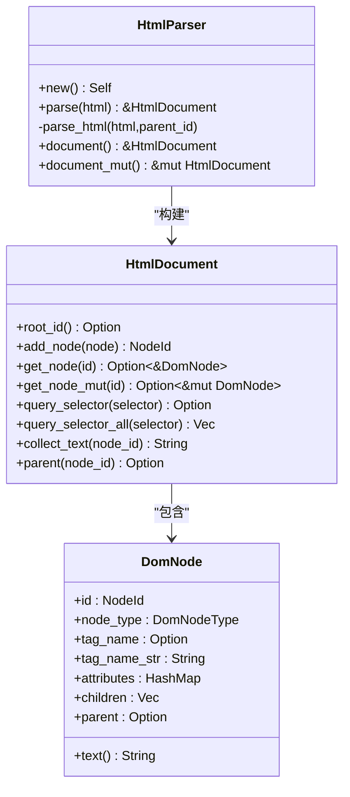
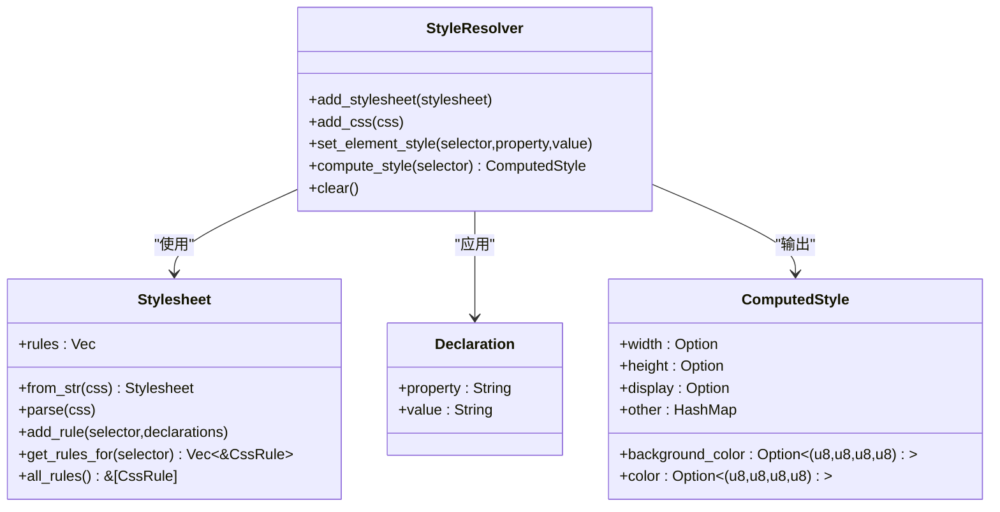
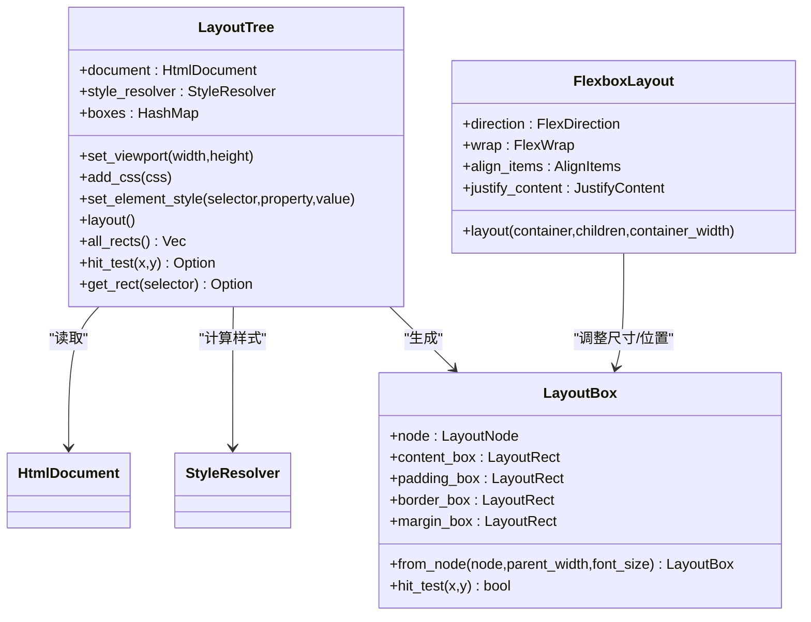
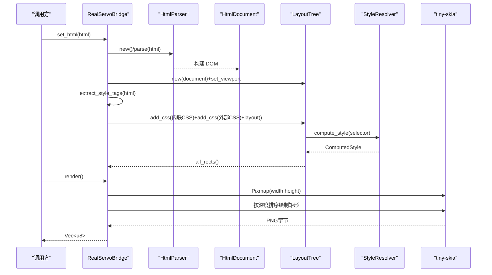
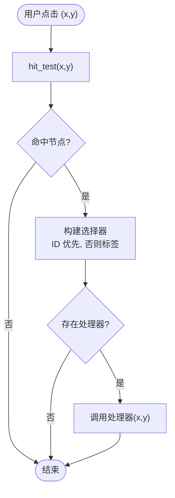
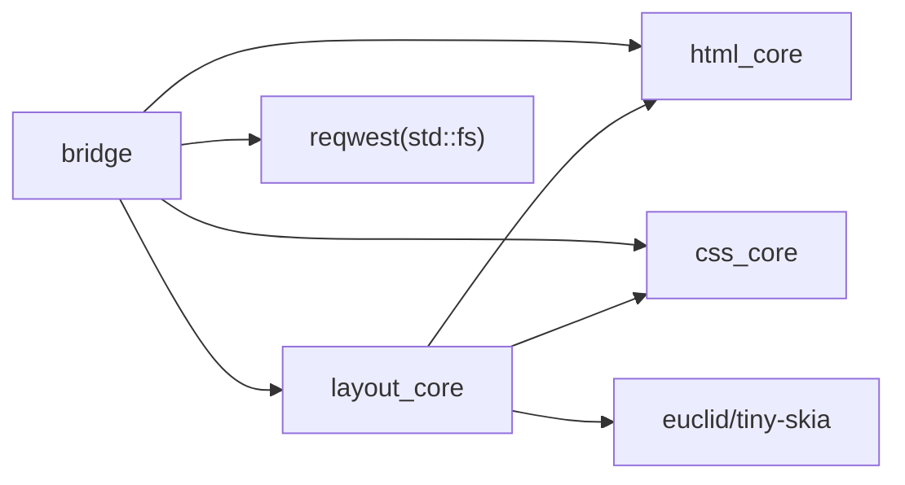

# 架构设计

<cite>
**本文引用的文件**
- [bridge/lib.rs](file://bridge/lib.rs)
- [bridge/bridge.rs](file://bridge/bridge.rs)
- [bridge/servo_impl.rs](file://bridge/servo_impl.rs)
- [bridge/real_impl.rs](file://bridge/real_impl.rs)
- [components/html_core/lib.rs](file://components/html_core/lib.rs)
- [components/html_core/parser.rs](file://components/html_core/parser.rs)
- [components/html_core/dom.rs](file://components/html_core/dom.rs)
- [components/css_core/lib.rs](file://components/css_core/lib.rs)
- [components/css_core/cascade.rs](file://components/css_core/cascade.rs)
- [components/css_core/stylesheet.rs](file://components/css_core/stylesheet.rs)
- [components/layout_core/lib.rs](file://components/layout_core/lib.rs)
- [components/layout_core/tree.rs](file://components/layout_core/tree.rs)
- [components/layout_core/box_model.rs](file://components/layout_core/box_model.rs)
- [components/layout_core/flexbox.rs](file://components/layout_core/flexbox.rs)
- [Cargo.toml](file://Cargo.toml)
</cite>

## 目录
1. [引言](#引言)
2. [项目结构](#项目结构)
3. [核心组件](#核心组件)
4. [架构总览](#架构总览)
5. [详细组件分析](#详细组件分析)
6. [依赖分析](#依赖分析)
7. [性能考量](#性能考量)
8. [故障排查指南](#故障排查指南)
9. [结论](#结论)
10. [附录](#附录)

## 引言
本文件为 Servo-Zero 的架构设计文档，聚焦于三层分层结构：桥接层、核心组件层与基础库层。桥接层通过 WebNativeBridge trait 抽象出统一的 Web → Native 接口，屏蔽底层差异；核心组件层由 html_core、css_core、layout_core 三部分组成，分别负责 HTML 解析、CSS 解析与样式计算、布局与渲染；基础库层提供几何、渲染与网络等通用能力。本文将详细解释 WebNativeBridge 的设计思想与接口定义，阐述三大核心组件的职责与交互，说明从 HTML 解析到 PNG 输出的数据流，并总结模块化设计的优势、技术权衡与约束。

## 项目结构
仓库采用工作区组织，成员包含桥接层与三个核心组件模块，以及共享的基础依赖。

**图表来源**
- [Cargo.toml:1-37](file://Cargo.toml#L1-L37)
- [bridge/lib.rs:1-13](file://bridge/lib.rs#L1-L13)

**章节来源**
- [Cargo.toml:1-37](file://Cargo.toml#L1-L37)
- [bridge/lib.rs:1-13](file://bridge/lib.rs#L1-L13)

## 核心组件
- 桥接层（bridge）：定义 WebNativeBridge trait 与多种实现（Mock/Servo/Real），对外暴露统一接口，内部协调 HTML/CSS/布局与渲染。
- HTML 核心（html_core）：DOM 结构与 HTML 解析器，支持基本标签、属性、文本与注释节点，提供查询与文本收集能力。
- CSS 核心（css_core）：样式表解析、声明与级联计算，支持颜色解析、长度单位转换与常用属性映射。
- 布局核心（layout_core）：基于盒模型与 Flexbox 的布局树，负责样式应用、盒尺寸计算与命中测试，支持渲染输出。

**章节来源**
- [bridge/bridge.rs:114-262](file://bridge/bridge.rs#L114-L262)
- [components/html_core/lib.rs:1-15](file://components/html_core/lib.rs#L1-L15)
- [components/css_core/lib.rs:1-207](file://components/css_core/lib.rs#L1-L207)
- [components/layout_core/lib.rs:1-22](file://components/layout_core/lib.rs#L1-L22)

## 架构总览
Servo-Zero 的分层架构如下：

**图表来源**
- [bridge/bridge.rs:114-262](file://bridge/bridge.rs#L114-L262)
- [bridge/servo_impl.rs:74-267](file://bridge/servo_impl.rs#L74-L267)
- [bridge/real_impl.rs:61-371](file://bridge/real_impl.rs#L61-L371)
- [components/layout_core/tree.rs:12-47](file://components/layout_core/tree.rs#L12-L47)
- [Cargo.toml:19-37](file://Cargo.toml#L19-L37)

## 详细组件分析

### WebNativeBridge 设计与接口
- 设计思想
  - 通过 trait 抽象 Web 侧与原生侧的交互边界，屏蔽具体实现细节（如是否启用 HTML、JS、网络等特性）。
  - 大量方法提供默认实现，便于在不同场景下按需覆盖，降低集成成本。
  - 将 DOM 读写、布局查询、CSS 操作、事件绑定、渲染与网络/文件能力统一到一个接口中，简化上层调用。
- 关键接口类别
  - DOM 读写：设置/查询节点、属性、文本、父子关系等。
  - 布局：获取矩形、全量布局节点、命中测试。
  - CSS：添加规则、内联样式、清理样式。
  - 事件：点击、表单提交、window.open。
  - 渲染：生成 PNG。
  - 工具：视口设置与查询。
  - 网络：导航、HTTP 请求、下载、文件读写。
- 与实现的关系
  - ServoBridge（Mock/Servo）与 RealServoBridge 分别实现该 trait，前者侧重无 HTML 模式下的最小可用能力，后者在真实模式下完成 HTML 解析、CSS 应用与渲染。

**图表来源**
- [bridge/bridge.rs:114-262](file://bridge/bridge.rs#L114-L262)

**章节来源**
- [bridge/bridge.rs:114-262](file://bridge/bridge.rs#L114-L262)

### HTML 核心（html_core）
- DOM 结构
  - DomNode 支持文档、元素、文本、注释等节点类型，维护父子关系与属性集合。
  - HtmlDocument 提供节点管理、查询（ID/类/标签）、文本聚合与父子关系查询。
- HTML 解析
  - HtmlParser 递归解析标签、属性、文本与注释，构建 DOM 树。
  - 支持自闭合标签与常见标签列表，忽略 DOCTYPE 与特殊标记。
- 查询与遍历
  - query_selector/query_selector_all 支持 ID、类、标签选择器，递归遍历子树。
  - collect_text 聚合节点及其后代文本。

**图表来源**
- [components/html_core/dom.rs:115-316](file://components/html_core/dom.rs#L115-L316)
- [components/html_core/parser.rs:5-153](file://components/html_core/parser.rs#L5-L153)

**章节来源**
- [components/html_core/dom.rs:1-316](file://components/html_core/dom.rs#L1-L316)
- [components/html_core/parser.rs:1-153](file://components/html_core/parser.rs#L1-L153)

### CSS 核心（css_core）
- 样式表与声明
  - Stylesheet 从字符串解析规则，记录选择器索引，支持多规则合并。
  - Declaration 表示单条 CSS 声明。
- 级联与样式计算
  - StyleResolver 负责收集规则与内联样式，进行选择器匹配与声明应用，输出 ComputedStyle。
  - 支持颜色解析（名称、十六进制、rgb/rgba、渐变首色）、长度单位解析（px/em/rem/%）。
- 颜色与长度工具
  - color_from_name 与 parse_color 提供颜色映射与解析。
  - Length 提供单位到像素的转换。

**图表来源**
- [components/css_core/stylesheet.rs:13-210](file://components/css_core/stylesheet.rs#L13-L210)
- [components/css_core/cascade.rs:86-271](file://components/css_core/cascade.rs#L86-L271)
- [components/css_core/lib.rs:13-207](file://components/css_core/lib.rs#L13-L207)

**章节来源**
- [components/css_core/stylesheet.rs:1-210](file://components/css_core/stylesheet.rs#L1-L210)
- [components/css_core/cascade.rs:1-271](file://components/css_core/cascade.rs#L1-L271)
- [components/css_core/lib.rs:1-207](file://components/css_core/lib.rs#L1-L207)

### 布局核心（layout_core）
- 布局树与盒模型
  - LayoutTree 以 HtmlDocument 为输入，结合 StyleResolver 计算每个节点的盒模型（content/padding/border/margin），并支持命中测试与矩形查询。
  - BoxModel 定义 LayoutRect、LayoutNode、DisplayType、PositionType、SideValues 与 LayoutBox。
- Flexbox 布局
  - FlexboxLayout 支持方向、换行、对齐与主轴分配策略，计算子项位置与容器尺寸。
- 数据流
  - 输入：HtmlDocument + Stylesheets/内联样式
  - 处理：遍历节点，构建 LayoutNode，计算盒尺寸，递归布局子节点
  - 输出：布局矩形集合、命中测试结果

**图表来源**
- [components/layout_core/tree.rs:12-241](file://components/layout_core/tree.rs#L12-L241)
- [components/layout_core/box_model.rs:25-210](file://components/layout_core/box_model.rs#L25-L210)
- [components/layout_core/flexbox.rs:87-167](file://components/layout_core/flexbox.rs#L87-L167)

**章节来源**
- [components/layout_core/tree.rs:1-241](file://components/layout_core/tree.rs#L1-L241)
- [components/layout_core/box_model.rs:1-210](file://components/layout_core/box_model.rs#L1-L210)
- [components/layout_core/flexbox.rs:1-167](file://components/layout_core/flexbox.rs#L1-L167)

### 数据流：从 HTML 到 PNG 的完整过程
以下序列图展示 RealServoBridge 的典型流程（含 HTML 解析、CSS 应用与渲染）：

**图表来源**
- [bridge/real_impl.rs:101-205](file://bridge/real_impl.rs#L101-L205)
- [components/html_core/parser.rs:18-22](file://components/html_core/parser.rs#L18-L22)
- [components/layout_core/tree.rs:53-69](file://components/layout_core/tree.rs#L53-L69)
- [components/css_core/cascade.rs:128-154](file://components/css_core/cascade.rs#L128-L154)

**章节来源**
- [bridge/real_impl.rs:101-205](file://bridge/real_impl.rs#L101-L205)
- [components/html_core/parser.rs:18-22](file://components/html_core/parser.rs#L18-L22)
- [components/layout_core/tree.rs:53-69](file://components/layout_core/tree.rs#L53-L69)
- [components/css_core/cascade.rs:128-154](file://components/css_core/cascade.rs#L128-L154)

### 事件处理与交互
- 点击事件：hit_test 命中布局节点后，根据选择器（ID/标签）触发对应处理器。
- 表单提交与 window.open：提供事件绑定与处理入口，便于扩展业务逻辑。

**图表来源**
- [bridge/real_impl.rs:219-227](file://bridge/real_impl.rs#L219-L227)
- [components/layout_core/tree.rs:217-232](file://components/layout_core/tree.rs#L217-L232)

**章节来源**
- [bridge/real_impl.rs:219-227](file://bridge/real_impl.rs#L219-L227)
- [components/layout_core/tree.rs:217-232](file://components/layout_core/tree.rs#L217-L232)

## 依赖分析
- 组件耦合
  - 布局树依赖 HTML 文档与 CSS 样式解析结果，形成“样式 → 布局”的单向依赖。
  - 桥接层同时依赖 HTML/CSS/Layout，但通过 trait 抽象隔离了具体实现细节。
- 外部依赖
  - 幾何与渲染：euclid、tiny-skia
  - 布局引擎：taffy（工作区依赖）
  - 并行与哈希：rayon、rustc-hash
  - URL：url
  - 网络：reqwest（受 feature 控制）

**图表来源**
- [Cargo.toml:19-37](file://Cargo.toml#L19-L37)
- [components/layout_core/tree.rs:4-8](file://components/layout_core/tree.rs#L4-L8)

**章节来源**
- [Cargo.toml:19-37](file://Cargo.toml#L19-L37)
- [components/layout_core/tree.rs:4-8](file://components/layout_core/tree.rs#L4-L8)

## 性能考量
- 解析与布局
  - HTML 解析采用递归扫描，适合中小规模文档；复杂页面建议优化选择器与样式数量。
  - 布局树在每次样式变更后重新计算，建议批量更新后再触发 layout。
- 渲染
  - tiny-skia 渲染按节点深度排序绘制，避免不必要的覆盖；可进一步按可视区域裁剪。
- 并行与内存
  - 工作区引入 rayon/rustc-hash，可用于未来并行化解析或样式计算（需评估收益与开销）。

## 故障排查指南
- HTML 未生效
  - 若未启用 html feature，ServoBridge 的 set_html 会被降级为警告；确认 feature 开启或使用 RealServoBridge。
- CSS 未生效
  - 确认 set_css 或内联样式已调用，且 selector 匹配正确；检查样式表解析与选择器匹配逻辑。
- 渲染异常
  - 检查视口尺寸与布局计算；确认 all_rects 返回非空；验证 tiny-skia 初始化与编码。
- 网络功能不可用
  - 未启用 network feature 时，navigate/http_get 等会返回错误；开启 feature 并确保运行环境具备网络访问权限。

**章节来源**
- [bridge/servo_impl.rs:35-49](file://bridge/servo_impl.rs#L35-L49)
- [bridge/real_impl.rs:252-269](file://bridge/real_impl.rs#L252-L269)

## 结论
Servo-Zero 通过清晰的三层分层与 WebNativeBridge 接口，实现了从 HTML 解析到 PNG 输出的完整链路。html_core、css_core、layout_core 各司其职，桥接层提供统一抽象与灵活实现，既满足最小可用目标，又为后续扩展（如网络、JS、高级布局）预留空间。模块化设计提升了可维护性与可测试性，同时通过 trait 与 feature gate 降低了平台与能力差异带来的耦合风险。

## 附录
- 技术决策与权衡
  - 不依赖 SpiderMonkey：减少运行时复杂度，便于嵌入与跨平台部署。
  - 选择 tiny-skia 渲染：轻量、纯 Rust、易于打包。
  - 选择 taffy 作为布局引擎：工作区依赖，便于后续集成更完整的布局能力。
- 约束条件
  - 当前实现未包含 JS 引擎与复杂网络栈，相关能力通过 feature 控制。
  - 布局算法当前以简化盒模型与基础 Flexbox 为主，复杂场景需进一步完善。