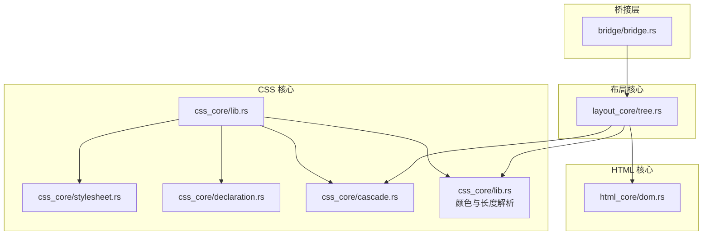
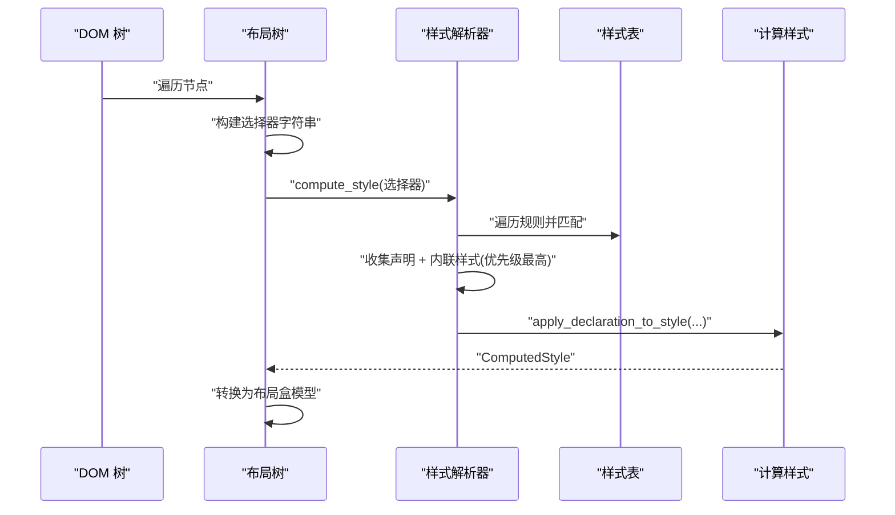
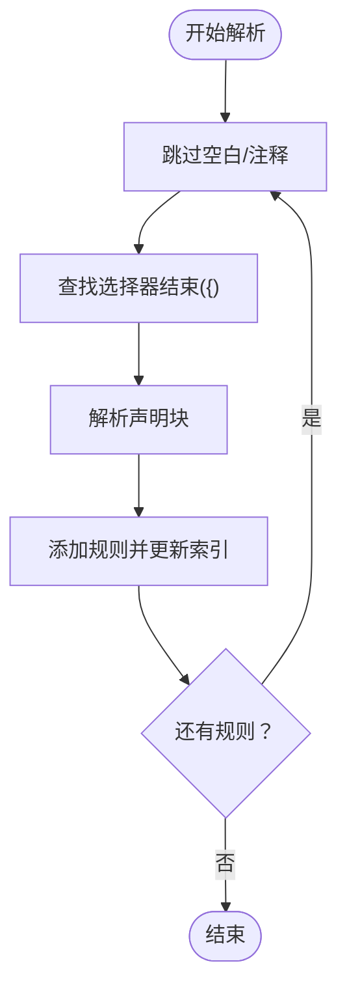
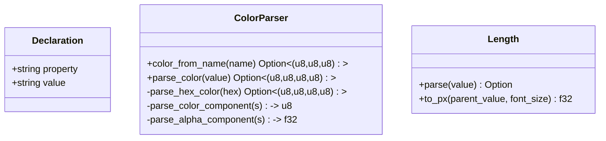
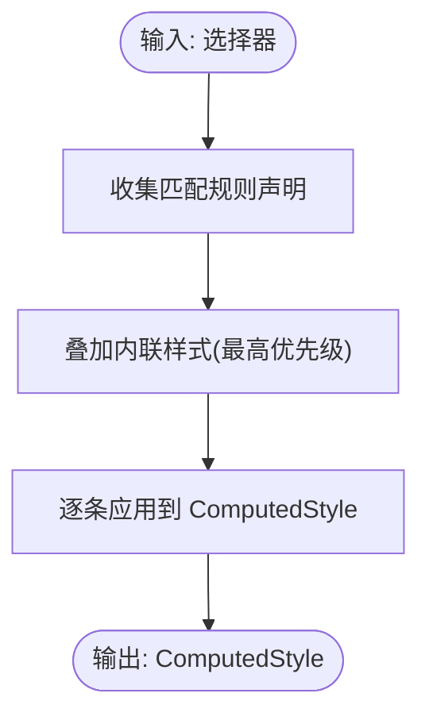
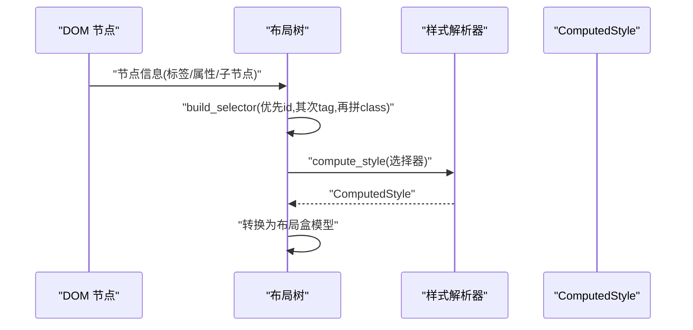
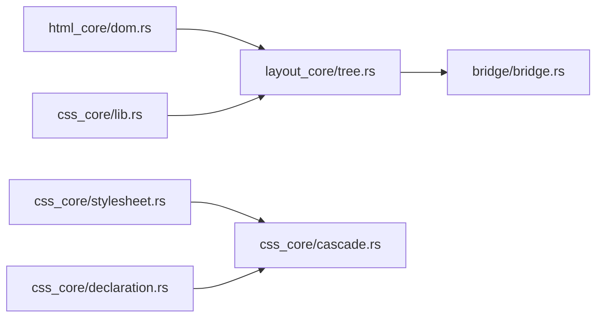

# CSS 处理组件

<cite>
**本文引用的文件**
- [components/css_core/lib.rs](file://components/css_core/lib.rs)
- [components/css_core/stylesheet.rs](file://components/css_core/stylesheet.rs)
- [components/css_core/declaration.rs](file://components/css_core/declaration.rs)
- [components/css_core/cascade.rs](file://components/css_core/cascade.rs)
- [components/html_core/dom.rs](file://components/html_core/dom.rs)
- [components/layout_core/tree.rs](file://components/layout_core/tree.rs)
- [bridge/bridge.rs](file://bridge/bridge.rs)
- [components/css_core/Cargo.toml](file://components/css_core/Cargo.toml)
- [components/html_core/Cargo.toml](file://components/html_core/Cargo.toml)
</cite>

## 目录
1. [简介](#简介)
2. [项目结构](#项目结构)
3. [核心组件](#核心组件)
4. [架构总览](#架构总览)
5. [详细组件分析](#详细组件分析)
6. [依赖关系分析](#依赖关系分析)
7. [性能考虑](#性能考虑)
8. [故障排查指南](#故障排查指南)
9. [结论](#结论)
10. [附录](#附录)

## 简介
本文件面向“CSS 处理组件”，系统化阐述样式表解析、选择器匹配、级联与样式计算的实现机制，以及与 HTML DOM 的集成与数据流。文档同时给出流程图与序列图，帮助读者快速把握关键路径；并提供性能优化建议与调试技巧，便于在实际工程中落地。

## 项目结构
该仓库采用按功能域分层的模块组织方式：
- css_core：独立的 CSS 解析、级联与样式计算，不依赖 SpiderMonkey
- html_core：HTML 解析与 DOM 构建
- layout_core：基于 DOM 与 CSS 的布局树构建
- bridge：Web→Native 桥接层，定义统一接口

图表来源
- [components/css_core/lib.rs:1-207](file://components/css_core/lib.rs#L1-L207)
- [components/css_core/stylesheet.rs:1-210](file://components/css_core/stylesheet.rs#L1-L210)
- [components/css_core/declaration.rs:1-18](file://components/css_core/declaration.rs#L1-L18)
- [components/css_core/cascade.rs:1-271](file://components/css_core/cascade.rs#L1-L271)
- [components/html_core/dom.rs:1-316](file://components/html_core/dom.rs#L1-L316)
- [components/layout_core/tree.rs:1-241](file://components/layout_core/tree.rs#L1-L241)
- [bridge/bridge.rs:1-263](file://bridge/bridge.rs#L1-L263)

章节来源
- [components/css_core/Cargo.toml:1-20](file://components/css_core/Cargo.toml#L1-L20)
- [components/html_core/Cargo.toml:1-21](file://components/html_core/Cargo.toml#L1-L21)

## 核心组件
- 样式表解析器（Stylesheet）：负责从 CSS 文本解析出规则与声明，维护选择器索引，支持增量添加规则。
- 声明（Declaration）：最小的属性-值对单元。
- 级联与样式计算（StyleResolver/ComputedStyle）：负责选择器匹配、声明收集与应用、内联样式的最高优先级处理。
- 颜色与长度工具：提供颜色解析与长度单位解析能力，支撑样式计算阶段的值处理。
- 布局树（LayoutTree）：在布局阶段消费 ComputedStyle，结合 DOM 生成布局盒模型。

章节来源
- [components/css_core/stylesheet.rs:1-210](file://components/css_core/stylesheet.rs#L1-L210)
- [components/css_core/declaration.rs:1-18](file://components/css_core/declaration.rs#L1-L18)
- [components/css_core/cascade.rs:1-271](file://components/css_core/cascade.rs#L1-L271)
- [components/css_core/lib.rs:1-207](file://components/css_core/lib.rs#L1-L207)
- [components/layout_core/tree.rs:1-241](file://components/layout_core/tree.rs#L1-L241)

## 架构总览
CSS 处理组件在布局阶段与 HTML DOM 集成，形成如下数据流：
- HTML DOM 提供节点信息（标签名、属性、父子关系）
- 布局树根据 DOM 构造选择器字符串（优先 ID，其次标签，再拼接类）
- 样式解析器匹配规则并收集声明，应用内联样式优先级，输出 ComputedStyle
- 布局树将 ComputedStyle 中的颜色、尺寸等转换为布局盒模型

图表来源
- [components/layout_core/tree.rs:71-159](file://components/layout_core/tree.rs#L71-L159)
- [components/css_core/cascade.rs:128-154](file://components/css_core/cascade.rs#L128-L154)

## 详细组件分析

### 样式表解析（Stylesheet）
- 功能要点
  - 从 CSS 文本解析规则：跳过空白与注释，定位选择器与声明块，提取属性-值对
  - 维护选择器到规则索引，加速规则查询
  - 支持动态添加规则与批量解析
- 关键行为
  - parse：逐段扫描，识别选择器与声明块，调用 parse_declarations
  - parse_declarations：解析单条声明，跳过注释与空白，提取属性名与值
  - add_rule/get_rules_for：维护 selector_index，支持按选择器检索规则
- 复杂度
  - 解析阶段：O(N) 文本扫描
  - 查询阶段：按选择器检索为 O(k)（k 为命中规则数）

图表来源
- [components/css_core/stylesheet.rs:36-106](file://components/css_core/stylesheet.rs#L36-L106)

章节来源
- [components/css_core/stylesheet.rs:1-210](file://components/css_core/stylesheet.rs#L1-L210)

### 声明与颜色/长度工具
- 声明（Declaration）：属性名与值的简单封装，用于规则与内联样式的统一表示
- 颜色解析（color_from_name、parse_color、parse_hex_color）
  - 支持颜色名称、#RGB/#RGBA、#RRGGBB/#RRGGBBAA、rgb()/rgba()、渐变首色提取
  - 返回 RGBA 三元组或四元组
- 长度解析（Length）
  - 支持 px/em/rem/%/auto
  - 提供 to_px(parent_value, font_size) 转换单位

图表来源
- [components/css_core/declaration.rs:1-18](file://components/css_core/declaration.rs#L1-L18)
- [components/css_core/lib.rs:14-207](file://components/css_core/lib.rs#L14-L207)

章节来源
- [components/css_core/declaration.rs:1-18](file://components/css_core/declaration.rs#L1-L18)
- [components/css_core/lib.rs:1-207](file://components/css_core/lib.rs#L1-L207)

### 级联与样式计算（StyleResolver/ComputedStyle）
- 功能要点
  - compute_style：收集所有匹配规则的声明，叠加内联样式（最高优先级），应用到 ComputedStyle
  - selector_matches：支持精确匹配、通配符、ID、类、标签、多选择器（逗号分隔）
  - apply_declaration_to_style：针对已知属性进行赋值，未知属性存入 other 映射
- 优先级与继承
  - 内联样式优先级最高（通过 set_element_style/set_inline_style 注入）
  - 规则声明按出现顺序累积（未实现 CSS 特异性权重与层叠源排序）
  - 未实现继承规则（如 font-*、color 等的默认继承链）
- 输出
  - ComputedStyle：包含背景色、文本色、尺寸、定位、边距、内边距、边框、字体系列等

图表来源
- [components/css_core/cascade.rs:128-154](file://components/css_core/cascade.rs#L128-L154)

章节来源
- [components/css_core/cascade.rs:1-271](file://components/css_core/cascade.rs#L1-L271)

### 与 HTML DOM 的集成
- 选择器构建
  - 布局树在遍历 DOM 节点时，优先使用 id 属性构造选择器；若无 id 则使用标签名；若有 class 属性则追加类选择器
- 选择器匹配
  - 样式解析器的 selector_matches 支持 ID、类、标签与多选择器
- 样式应用
  - 布局树根据 ComputedStyle 设置布局节点的显示类型、颜色、尺寸等

图表来源
- [components/layout_core/tree.rs:161-188](file://components/layout_core/tree.rs#L161-L188)
- [components/css_core/cascade.rs:128-154](file://components/css_core/cascade.rs#L128-L154)

章节来源
- [components/html_core/dom.rs:1-316](file://components/html_core/dom.rs#L1-L316)
- [components/layout_core/tree.rs:1-241](file://components/layout_core/tree.rs#L1-L241)
- [components/css_core/cascade.rs:156-198](file://components/css_core/cascade.rs#L156-L198)

### 代码示例（路径指引）
以下示例均以“文件路径+行号范围”形式给出，避免直接粘贴代码内容：
- 样式表加载与解析
  - [样式表解析入口:29-34](file://components/css_core/stylesheet.rs#L29-L34)
  - [规则解析主循环:36-106](file://components/css_core/stylesheet.rs#L36-L106)
  - [声明解析:109-176](file://components/css_core/stylesheet.rs#L109-L176)
- 选择器匹配
  - [选择器匹配逻辑:156-198](file://components/css_core/cascade.rs#L156-L198)
  - [DOM 选择器构建:161-188](file://components/layout_core/tree.rs#L161-L188)
- 样式应用
  - [计算样式应用:200-257](file://components/css_core/cascade.rs#L200-L257)
  - [布局树消费样式:77-104](file://components/layout_core/tree.rs#L77-L104)

## 依赖关系分析
- 模块间耦合
  - layout_core 依赖 html_core(dom) 与 css_core(cascade、stylesheet、lib)
  - css_core 内部模块低耦合：declaration 独立，stylesheet/cascade 通过 lib.rs 汇聚导出
- 外部依赖
  - 日志：css-core 与 html-core 均引入 log crate
- 接口契约
  - bridge/bridge.rs 定义了 Web→Native 的统一接口，其中包含 set_css、set_style、clear_css 等 CSS 操作入口，由具体实现转发至布局树

图表来源
- [components/layout_core/tree.rs:1-241](file://components/layout_core/tree.rs#L1-L241)
- [components/css_core/lib.rs:1-207](file://components/css_core/lib.rs#L1-L207)
- [components/css_core/stylesheet.rs:1-210](file://components/css_core/stylesheet.rs#L1-L210)
- [components/css_core/declaration.rs:1-18](file://components/css_core/declaration.rs#L1-L18)
- [components/css_core/cascade.rs:1-271](file://components/css_core/cascade.rs#L1-L271)
- [bridge/bridge.rs:114-262](file://bridge/bridge.rs#L114-L262)

章节来源
- [components/css_core/Cargo.toml:15-17](file://components/css_core/Cargo.toml#L15-L17)
- [components/html_core/Cargo.toml:15-17](file://components/html_core/Cargo.toml#L15-L17)

## 性能考虑
- 解析与索引
  - 选择器索引（selector_index）将规则查询从 O(R) 降低到 O(k)，适合规则较多的场景
  - 建议：对频繁使用的规则建立更细粒度索引（如按前缀/首字母分桶）
- 匹配策略
  - 当前匹配为线性扫描，复杂选择器（伪类、组合器）会增加开销
  - 建议：引入选择器 AST 与快速匹配算法（如 NFA/DFA），或缓存匹配结果
- 样式应用
  - apply_declaration_to_style 使用分支判断，建议改为哈希表映射属性→setter，减少分支
- 内存管理
  - 大量规则与声明时，注意 Vec/HashMap 的容量预估与重用
  - 对 ComputedStyle 的字符串值可考虑驻留池或共享字符串，减少重复分配
- 单位转换
  - to_px 需要父尺寸与字体大小上下文，建议在布局阶段统一传参，避免重复计算

## 故障排查指南
- 样式未生效
  - 检查选择器构建是否正确（ID/类/标签拼接顺序）
    - [选择器构建逻辑:161-188](file://components/layout_core/tree.rs#L161-L188)
  - 确认内联样式是否被覆盖（内联优先级最高）
    - [内联样式叠加:143-146](file://components/css_core/cascade.rs#L143-L146)
- 颜色解析失败
  - 检查颜色格式是否受支持（名称、#RGB/#RGBA/#RRGGBB/#RRGGBBAA、rgb()/rgba()、渐变首色）
    - [颜色解析入口:44-102](file://components/css_core/lib.rs#L44-L102)
- 长度解析异常
  - 检查单位是否为 px/em/rem/%/auto
    - [长度解析:169-194](file://components/css_core/lib.rs#L169-L194)
- 选择器匹配不到规则
  - 确认样式表是否已添加（add_css/add_stylesheet）
    - [添加样式表:100-109](file://components/css_core/cascade.rs#L100-L109)
  - 检查规则是否被正确解析（注释、空白、花括号）
    - [规则解析:36-106](file://components/css_core/stylesheet.rs#L36-L106)
- 布局异常
  - 检查 ComputedStyle 中的 display/font-size 等是否按预期设置
    - [样式应用:200-257](file://components/css_core/cascade.rs#L200-L257)
    - [布局树消费样式:77-104](file://components/layout_core/tree.rs#L77-L104)

## 结论
本 CSS 处理组件实现了从样式表解析、选择器匹配到样式计算的核心流程，具备良好的模块化与可扩展性。当前实现聚焦于基础能力与性能优化点，尚未完全覆盖 CSS 规范的特异性权重、层叠源排序与继承规则。建议后续在保持低耦合的前提下，逐步引入选择器 AST、特异性计算与继承链，以满足更复杂的样式需求。

## 附录
- 关键 API 路径
  - [样式表解析入口:29-34](file://components/css_core/stylesheet.rs#L29-L34)
  - [规则解析主循环:36-106](file://components/css_core/stylesheet.rs#L36-L106)
  - [声明解析:109-176](file://components/css_core/stylesheet.rs#L109-L176)
  - [选择器匹配:156-198](file://components/css_core/cascade.rs#L156-L198)
  - [计算样式应用:200-257](file://components/css_core/cascade.rs#L200-L257)
  - [DOM 选择器构建:161-188](file://components/layout_core/tree.rs#L161-L188)
  - [布局树消费样式:77-104](file://components/layout_core/tree.rs#L77-L104)
  - [颜色解析:44-102](file://components/css_core/lib.rs#L44-L102)
  - [长度解析:169-194](file://components/css_core/lib.rs#L169-L194)