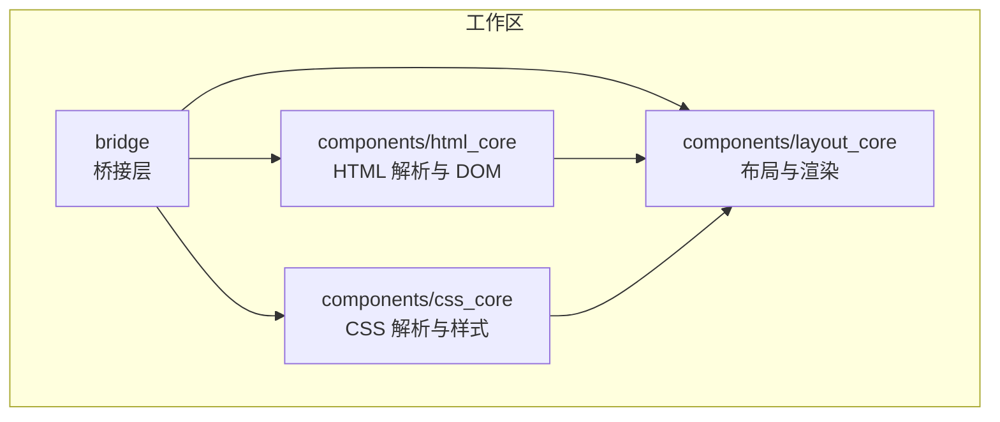
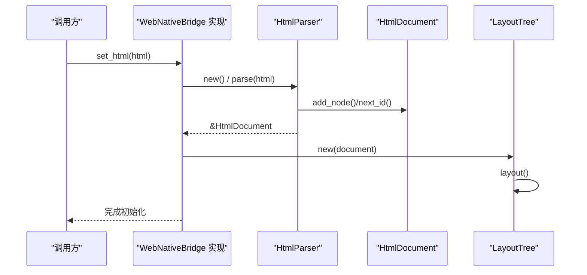
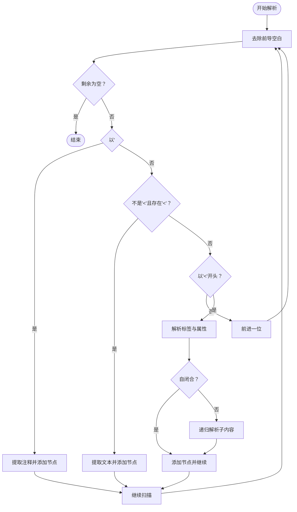
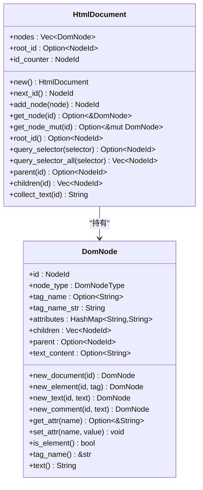
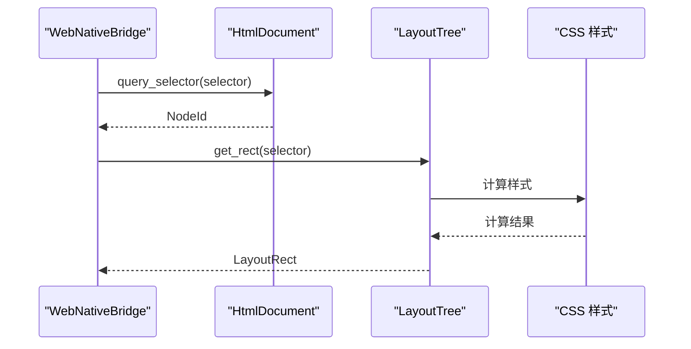
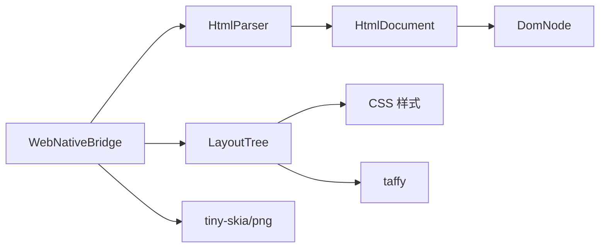

# HTML 解析组件

<cite>
**本文引用的文件**
- [components/html_core/lib.rs](file://components/html_core/lib.rs)
- [components/html_core/parser.rs](file://components/html_core/parser.rs)
- [components/html_core/dom.rs](file://components/html_core/dom.rs)
- [bridge/lib.rs](file://bridge/lib.rs)
- [bridge/bridge.rs](file://bridge/bridge.rs)
- [bridge/servo_impl.rs](file://bridge/servo_impl.rs)
- [components/css_core/lib.rs](file://components/css_core/lib.rs)
- [components/layout_core/lib.rs](file://components/layout_core/lib.rs)
- [Cargo.toml](file://Cargo.toml)
- [README.md](file://README.md)
</cite>

## 目录
1. [简介](#简介)
2. [项目结构](#项目结构)
3. [核心组件](#核心组件)
4. [架构总览](#架构总览)
5. [详细组件分析](#详细组件分析)
6. [依赖关系分析](#依赖关系分析)
7. [性能考量](#性能考量)
8. [故障排查指南](#故障排查指南)
9. [结论](#结论)
10. [附录](#附录)

## 简介
本文件面向 HTML 解析组件，围绕基于 html5ever 的纯 Rust 实现进行技术文档化，重点覆盖：
- 解析器工作原理与错误处理机制
- DOM 树结构设计（节点类型、关系管理、内存布局）
- HtmlDocument 生命周期、节点操作 API 与查询方法
- 解析过程中的字符编码、实体解码与命名空间管理
- 与 CSS 处理模块的接口契约与数据传递
- 常见问题与最佳实践

该组件为 Servo-Zero 的一部分，采用模块化设计，通过桥接层对外暴露统一接口，同时保持与 CSS/布局模块的清晰边界。

## 项目结构
仓库采用多 crate 的工作区组织方式，HTML 解析组件位于 components/html_core，CSS 与布局分别位于 components/css_core 与 components/layout_core，桥接层位于 bridge。

图表来源
- [Cargo.toml:1-37](file://Cargo.toml#L1-L37)
- [README.md:16-31](file://README.md#L16-L31)

章节来源
- [Cargo.toml:1-37](file://Cargo.toml#L1-L37)
- [README.md:16-31](file://README.md#L16-L31)

## 核心组件
- HtmlParser：负责将 HTML 字符串解析为 DOM 树，支持注释、文本、元素标签与自闭合标签等基础语法。
- HtmlDocument：维护 DOM 节点列表、根节点 ID 与节点分配策略；提供查询、父子关系访问与文本收集等能力。
- DomNode：表示 DOM 节点，包含类型、标签名、属性、子节点索引、父节点 ID 与文本内容等字段。
- WebNativeBridge：桥接层对外接口，HTML 解析能力通过 RealServoBridge/ServoBridge 在运行时注入到桥接实现中。

章节来源
- [components/html_core/lib.rs:1-15](file://components/html_core/lib.rs#L1-L15)
- [components/html_core/parser.rs:1-153](file://components/html_core/parser.rs#L1-L153)
- [components/html_core/dom.rs:1-316](file://components/html_core/dom.rs#L1-L316)
- [bridge/bridge.rs:114-262](file://bridge/bridge.rs#L114-L262)

## 架构总览
HTML 解析组件与桥接层、CSS/布局模块之间的交互如下：

图表来源
- [bridge/servo_impl.rs:90-96](file://bridge/servo_impl.rs#L90-L96)
- [components/html_core/parser.rs:10-22](file://components/html_core/parser.rs#L10-L22)
- [components/html_core/dom.rs:124-152](file://components/html_core/dom.rs#L124-L152)

章节来源
- [bridge/servo_impl.rs:90-96](file://bridge/servo_impl.rs#L90-L96)
- [components/html_core/parser.rs:10-22](file://components/html_core/parser.rs#L10-L22)
- [components/html_core/dom.rs:124-152](file://components/html_core/dom.rs#L124-L152)

## 详细组件分析

### HtmlParser：解析器实现
- 责任边界
  - 将输入字符串按标记流解析为 DOM 节点序列，构建树形结构。
  - 支持注释、文本、元素标签、自闭合标签与基本属性解析。
- 关键流程
  - 递归扫描输入，跳过注释与特殊声明，识别文本与标签。
  - 对标签解析出标签名与属性，创建 DomNode 并加入 HtmlDocument。
  - 对非自闭合标签递归解析其子内容，直至遇到闭合标签。
- 错误处理
  - 未闭合标签会触发返回逻辑，避免无限递归。
  - 缺失闭合标签时，剩余文本作为兄弟节点处理。
- 性能特性
  - 线性扫描与简单字符串切片，时间复杂度近似 O(n)。
  - 属性解析使用哈希表，查询平均 O(1)。
  - 递归深度受嵌套层级限制，栈空间与时间开销可控。

图表来源
- [components/html_core/parser.rs:25-135](file://components/html_core/parser.rs#L25-L135)

章节来源
- [components/html_core/parser.rs:10-153](file://components/html_core/parser.rs#L10-L153)

### HtmlDocument：DOM 树与节点管理
- 结构设计
  - nodes：Vec<DomNode> 存储所有节点，索引即节点在向量中的位置。
  - root_id：根节点 ID，初始为文档节点。
  - id_counter：自增 ID 分配器，确保唯一性。
- 节点关系
  - parent：Option<NodeId> 指向父节点。
  - children：Vec<NodeId> 子节点列表，按插入顺序排列。
- 查询与遍历
  - query_selector/query_selector_all：支持 ID、类、标签选择器的深度优先搜索。
  - collect_text：递归收集节点及其后代的文本内容。
- 生命周期
  - new：创建文档根节点并设置 root_id。
  - add_node：分配新 ID，追加节点并返回索引。
  - next_id：单调递增分配 ID。
- API 一览
  - new_document：便捷工厂函数。
  - query_selector / query_selector_all：CSS 选择器查询。
  - parent / children：父子关系访问。
  - collect_text：文本聚合。
  - get_node / get_node_mut：节点读写访问。

图表来源
- [components/html_core/dom.rs:116-316](file://components/html_core/dom.rs#L116-L316)

章节来源
- [components/html_core/dom.rs:116-316](file://components/html_core/dom.rs#L116-L316)

### DomNodeType：节点类型定义
- 支持类型：Document、Element、Text、Comment、DocumentType、Fragment。
- 用途：区分节点语义，影响查询与渲染行为。

章节来源
- [components/html_core/dom.rs:8-17](file://components/html_core/dom.rs#L8-L17)

### 与 CSS/布局模块的接口契约
- 数据传递
  - HtmlDocument 作为只读数据源被 LayoutTree 使用，用于布局计算与命中测试。
  - WebNativeBridge 的 set_html 会将解析后的 HtmlDocument 注入到布局树。
- 查询与样式联动
  - query/query_all 返回 DOM 节点 ID，随后可结合 CSS 选择器进行样式解析与布局。
- 事件与布局
  - hit_test 返回布局节点信息，桥接层据此定位事件目标并分发。

图表来源
- [bridge/servo_impl.rs:98-104](file://bridge/servo_impl.rs#L98-L104)
- [bridge/servo_impl.rs:136-144](file://bridge/servo_impl.rs#L136-L144)

章节来源
- [bridge/servo_impl.rs:98-104](file://bridge/servo_impl.rs#L98-L104)
- [bridge/servo_impl.rs:136-144](file://bridge/servo_impl.rs#L136-L144)

## 依赖关系分析
- 组件耦合
  - HtmlParser 依赖 HtmlDocument 进行节点创建与插入。
  - HtmlDocument 与 DomNode 为纯数据结构，无外部依赖。
  - 桥接层通过 WebNativeBridge 抽象与 HTML/CSS/布局模块解耦。
- 外部依赖
  - 日志：log
  - 几何与渲染：euclid、tiny-skia、png
  - 布局算法：taffy
  - 并行与哈希：rayon、rustc-hash
  - URL：url

图表来源
- [Cargo.toml:19-37](file://Cargo.toml#L19-L37)
- [bridge/servo_impl.rs:90-96](file://bridge/servo_impl.rs#L90-L96)

章节来源
- [Cargo.toml:19-37](file://Cargo.toml#L19-L37)
- [bridge/servo_impl.rs:90-96](file://bridge/servo_impl.rs#L90-L96)

## 性能考量
- 时间复杂度
  - 解析：线性扫描，O(n)，其中 n 为输入长度。
  - 选择器查询：深度优先遍历，最坏 O(N)（N 为节点数），但通常受限于选择器范围。
- 空间复杂度
  - DOM 存储：O(N) 节点 + O(E) 边关系（父子关系）。
  - 属性存储：每个节点的属性映射，平均 O(A) 空间（A 为属性数量）。
- 优化建议
  - 选择器缓存：对常用 ID/类选择器建立索引，降低重复查询成本。
  - 文本收集：在频繁查询场景下，可考虑为节点维护文本缓存。
  - 递归深度控制：对极深嵌套的 HTML，建议在解析阶段做深度限制与警告。
  - 并行化：布局阶段可利用 rayon 进行并行计算（由布局模块负责）。

## 故障排查指南
- 常见问题
  - 未闭合标签导致解析提前结束：检查 HTML 结构，确保所有非自闭合标签正确闭合。
  - 属性解析异常：确认属性格式为 key="value" 或 key='value'，避免非法字符。
  - 选择器未命中：核对选择器类型（ID、类、标签）与节点实际属性是否一致。
  - 文本内容为空：确认节点类型为 Text 或包含文本内容的元素。
- 调试建议
  - 启用日志：使用 log 输出解析状态与节点信息。
  - 分段解析：将大 HTML 分块解析，定位问题片段。
  - 对比输出：打印 HtmlDocument 的节点列表与关系，验证树结构。

章节来源
- [components/html_core/parser.rs:78-81](file://components/html_core/parser.rs#L78-L81)
- [components/html_core/dom.rs:174-202](file://components/html_core/dom.rs#L174-L202)

## 结论
HTML 解析组件以简洁高效的纯 Rust 实现，提供了完整的 DOM 树构建与查询能力，与 CSS/布局模块通过桥接层无缝衔接。其设计注重模块化与可扩展性，适合在多种运行模式下使用。通过合理的查询策略与缓存机制，可在保证正确性的前提下进一步提升性能。

## 附录

### 示例：创建文档、插入节点与查询元素
- 创建文档
  - 使用工厂函数创建空文档。
- 插入节点
  - 通过解析器将 HTML 字符串转换为 DOM 节点并加入文档。
- 查询元素
  - 使用 CSS 选择器查询首个匹配元素或所有匹配元素。

章节来源
- [components/html_core/lib.rs:11-14](file://components/html_core/lib.rs#L11-L14)
- [components/html_core/parser.rs:18-22](file://components/html_core/parser.rs#L18-L22)
- [components/html_core/dom.rs:174-202](file://components/html_core/dom.rs#L174-L202)

### 字符编码、实体解码与命名空间
- 字符编码
  - 当前实现假设输入为 UTF-8 字符串，未显式进行编码检测与转换。
- 实体解码
  - 当前解析器未实现 HTML 实体解码（如 &amp;），文本内容保留原样。
- 命名空间
  - 标签名统一转为小写，未区分命名空间（如 SVG/XML）。

章节来源
- [components/html_core/parser.rs:25-135](file://components/html_core/parser.rs#L25-L135)
- [components/html_core/dom.rs:48-58](file://components/html_core/dom.rs#L48-L58)

### 与 CSS 处理模块的接口契约
- 输入：HtmlDocument（只读）
- 输出：布局节点信息（包含 DOM 节点 ID、标签名、矩形区域与背景色）
- 关键方法：set_css、set_style、clear_css、get_rect、all_rects、hit_test

章节来源
- [bridge/servo_impl.rs:174-189](file://bridge/servo_impl.rs#L174-L189)
- [bridge/servo_impl.rs:136-172](file://bridge/servo_impl.rs#L136-L172)
- [components/layout_core/lib.rs:13-22](file://components/layout_core/lib.rs#L13-L22)