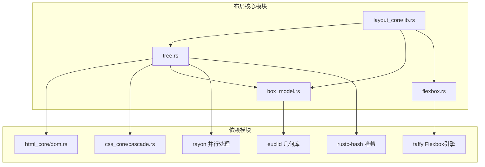
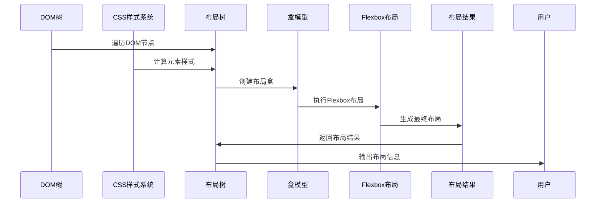
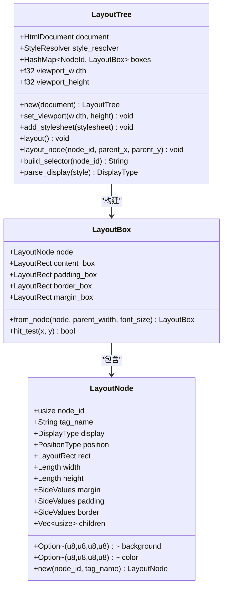
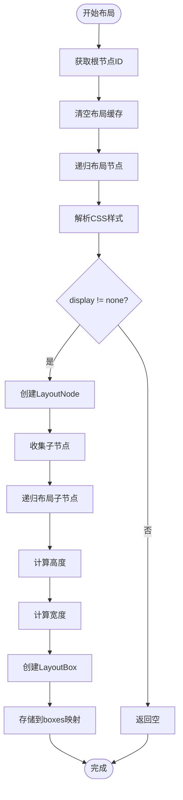
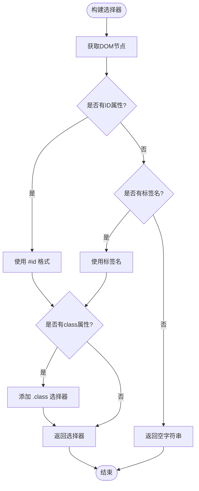
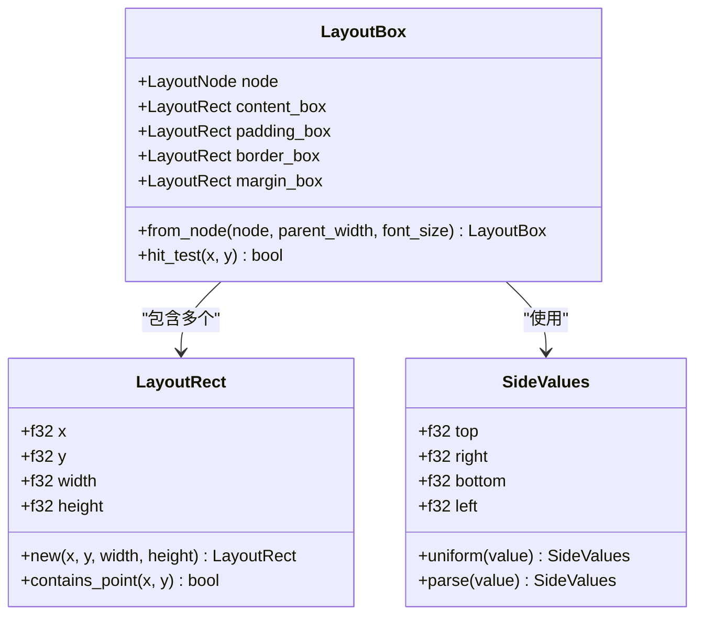
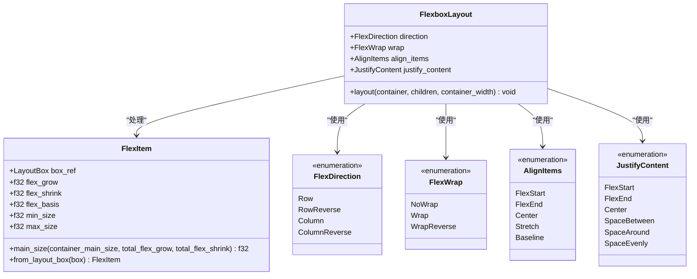
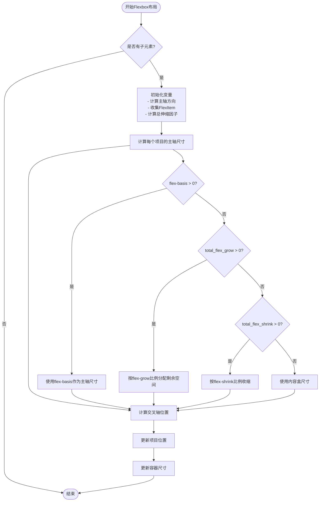
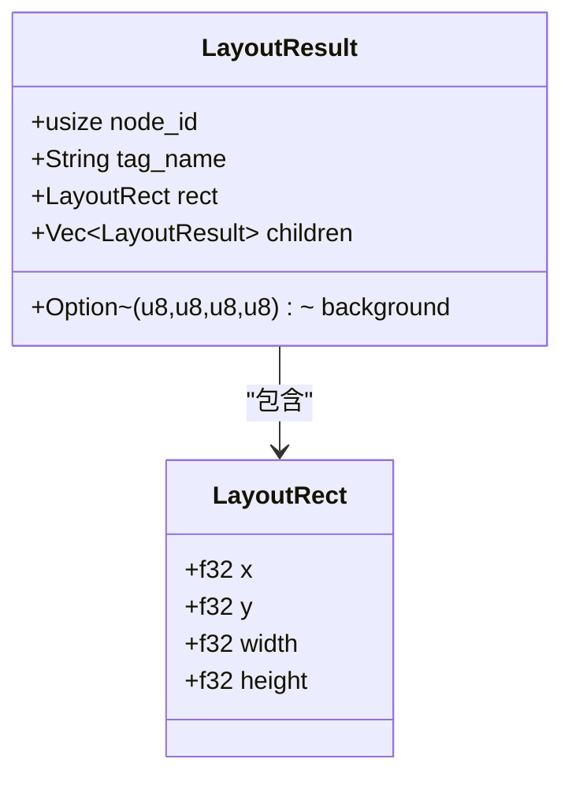
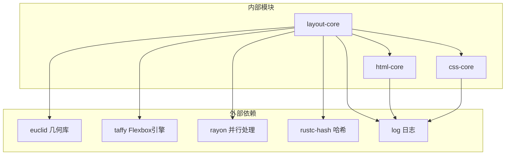

# 布局引擎组件

<cite>
**本文档引用的文件**
- [lib.rs](file://components/layout_core/lib.rs)
- [tree.rs](file://components/layout_core/tree.rs)
- [box_model.rs](file://components/layout_core/box_model.rs)
- [flexbox.rs](file://components/layout_core/flexbox.rs)
- [dom.rs](file://components/html_core/dom.rs)
- [cascade.rs](file://components/css_core/cascade.rs)
- [Cargo.toml](file://Cargo.toml)
- [README.md](file://README.md)
</cite>

## 目录
1. [简介](#简介)
2. [项目结构](#项目结构)
3. [核心组件](#核心组件)
4. [架构概览](#架构概览)
5. [详细组件分析](#详细组件分析)
6. [依赖关系分析](#依赖关系分析)
7. [性能考虑](#性能考虑)
8. [故障排除指南](#故障排除指南)
9. [结论](#结论)
10. [附录](#附录)

## 简介

布局引擎组件是 Servo-Zero 项目中的核心渲染引擎，提供独立的 CSS 布局功能，支持盒模型和 Flexbox 布局算法，完全不依赖 SpiderMonkey JavaScript 引擎。该组件实现了完整的布局树构建、盒模型计算和 Flexbox 布局算法，为 Web-Native 浏览器渲染提供基础支撑。

布局引擎采用模块化设计，通过三个主要模块协作：
- **HTML 解析与 DOM 树**：负责 HTML 文档解析和 DOM 结构管理
- **CSS 样式系统**：处理 CSS 解析、级联和样式计算
- **布局计算引擎**：执行盒模型和 Flexbox 布局算法

## 项目结构

布局引擎组件位于 `components/layout_core/` 目录下，采用清晰的模块化架构：



**图表来源**
- [lib.rs:1-22](file://components/layout_core/lib.rs#L1-L22)
- [tree.rs:1-241](file://components/layout_core/tree.rs#L1-L241)
- [box_model.rs:1-210](file://components/layout_core/box_model.rs#L1-L210)
- [flexbox.rs:1-167](file://components/layout_core/flexbox.rs#L1-L167)

**章节来源**
- [lib.rs:1-22](file://components/layout_core/lib.rs#L1-L22)
- [Cargo.toml:1-37](file://Cargo.toml#L1-L37)

## 核心组件

布局引擎由四个核心组件构成，每个组件都有明确的职责分工：

### 1. 布局树 (LayoutTree)
负责遍历 DOM 树，结合 CSS 样式计算，构建布局树并执行布局计算。

### 2. 盒模型 (BoxModel)
实现 CSS 盒模型规范，包括内容区、内边距、边框和外边距的计算。

### 3. Flexbox 布局 (FlexboxLayout)
实现 Flexbox 布局算法，支持主轴和交叉轴计算、对齐方式和换行逻辑。

### 4. 布局结果 (LayoutResult)
提供布局计算结果的标准化输出格式。

**章节来源**
- [lib.rs:9-21](file://components/layout_core/lib.rs#L9-L21)
- [tree.rs:13-19](file://components/layout_core/tree.rs#L13-L19)

## 架构概览

布局引擎采用自底向上的架构设计，从底层数据结构到高层算法层层封装：



**图表来源**
- [tree.rs:61-159](file://components/layout_core/tree.rs#L61-L159)
- [box_model.rs:166-204](file://components/layout_core/box_model.rs#L166-L204)
- [flexbox.rs:107-165](file://components/layout_core/flexbox.rs#L107-L165)

## 详细组件分析

### 布局树构建过程

布局树是布局引擎的核心数据结构，负责协调整个布局过程：

#### 核心数据结构



**图表来源**
- [tree.rs:13-159](file://components/layout_core/tree.rs#L13-L159)
- [box_model.rs:25-210](file://components/layout_core/box_model.rs#L25-L210)

#### 布局树构建流程

布局树构建遵循深度优先遍历策略，具体流程如下：



**图表来源**
- [tree.rs:61-159](file://components/layout_core/tree.rs#L61-L159)

#### 样式选择器构建

布局树实现了智能的样式选择器构建机制：



**图表来源**
- [tree.rs:161-188](file://components/layout_core/tree.rs#L161-L188)

**章节来源**
- [tree.rs:61-240](file://components/layout_core/tree.rs#L61-L240)

### 盒模型实现

盒模型是 CSS 布局的基础概念，布局引擎严格遵循 W3C 规范实现：

#### 盒模型数据结构



**图表来源**
- [box_model.rs:5-210](file://components/layout_core/box_model.rs#L5-L210)

#### 盒模型计算规则

盒模型计算遵循严格的层级关系：

1. **内容盒 (Content Box)**：实际内容区域
2. **内边距盒 (Padding Box)**：内容盒 + 内边距
3. **边框盒 (Border Box)**：内边距盒 + 边框
4. **外边距盒 (Margin Box)**：边框盒 + 外边距

计算公式：
- 内边距盒宽度 = 内容盒宽度 + 左内边距 + 右内边距
- 边框盒宽度 = 内边距盒宽度 + 左边框 + 右边框
- 外边距盒宽度 = 边框盒宽度 + 左外边距 + 右外边距

**章节来源**
- [box_model.rs:155-210](file://components/layout_core/box_model.rs#L155-L210)

### Flexbox 布局算法

Flexbox 布局算法实现了完整的 CSS Flexbox 规范：

#### Flexbox 数据结构



**图表来源**
- [flexbox.rs:87-167](file://components/layout_core/flexbox.rs#L87-L167)

#### Flexbox 布局流程

Flexbox 布局算法包含以下关键步骤：



**图表来源**
- [flexbox.rs:107-165](file://components/layout_core/flexbox.rs#L107-L165)

#### 主轴和交叉轴计算

Flexbox 布局的关键在于正确区分主轴和交叉轴：

- **Row 方向**：主轴为水平方向，交叉轴为垂直方向
- **Column 方向**：主轴为垂直方向，交叉轴为水平方向

位置计算规则：
- 主轴位置：基于当前累积的主轴尺寸
- 交叉轴位置：根据 align-items 属性确定

**章节来源**
- [flexbox.rs:106-167](file://components/layout_core/flexbox.rs#L106-L167)

### 布局结果数据结构

布局引擎提供了标准化的布局结果输出格式：



**图表来源**
- [lib.rs:13-21](file://components/layout_core/lib.rs#L13-L21)

**章节来源**
- [lib.rs:13-21](file://components/layout_core/lib.rs#L13-L21)

## 依赖关系分析

布局引擎的依赖关系体现了模块化的设计理念：



**图表来源**
- [Cargo.toml:19-37](file://Cargo.toml#L19-L37)
- [lib.rs:15-22](file://components/layout_core/lib.rs#L15-L22)

### 组件耦合度分析

布局引擎在设计上实现了良好的低耦合高内聚：

- **布局树**：依赖 HTML 和 CSS 模块，但不依赖具体渲染后端
- **盒模型**：独立于布局算法，专注于几何计算
- **Flexbox**：独立于其他布局算法，专注于弹性布局
- **样式系统**：与布局树解耦，通过接口传递样式信息

这种设计使得每个组件都可以独立测试和优化，同时保持整体功能的完整性。

**章节来源**
- [Cargo.toml:19-37](file://Cargo.toml#L19-L37)

## 性能考虑

布局引擎在性能方面采用了多种优化策略：

### 1. 缓存机制

布局树实现了智能缓存策略：
- **样式缓存**：避免重复计算相同选择器的样式
- **布局缓存**：缓存已计算的布局结果
- **选择器缓存**：缓存构建的选择器结果

### 2. 内存优化

- **零拷贝设计**：大量使用引用而非所有权转移
- **共享数据结构**：通过引用共享 DOM 和样式信息
- **增量更新**：只重新计算受影响的节点

### 3. 并行处理

利用 rayon 库实现并行布局计算：
- **并行遍历**：DOM 树遍历支持并行执行
- **并行计算**：独立节点的布局计算可以并行进行

### 4. 算法优化

- **早期退出**：display: none 的元素直接跳过
- **快速路径**：简单布局场景使用优化路径
- **批量操作**：支持批量样式更新

## 故障排除指南

### 常见问题及解决方案

#### 1. 布局结果为空

**症状**：调用布局后返回空结果
**可能原因**：
- DOM 树为空或根节点不存在
- 所有元素的 display 属性为 none
- 样式计算失败

**解决方法**：
```rust
// 确保有有效的 DOM 树
let mut layout_tree = LayoutTree::new_empty();
assert!(layout_tree.document().root_id().is_some());

// 检查样式计算
let selector = layout_tree.build_selector(root_id);
let style = layout_tree.style_resolver.compute_style(&selector);
assert!(style.display.is_some());
```

#### 2. 盒模型计算错误

**症状**：元素尺寸计算不正确
**可能原因**：
- CSS 长度单位解析错误
- 相对单位计算错误
- 盒模型层级计算错误

**解决方法**：
```rust
// 验证长度转换
let width_px = node.width.to_px(parent_width, font_size);
assert!(width_px >= 0.0);

// 检查盒模型层级
assert!(padding_box.width >= content_box.width);
assert!(border_box.width >= padding_box.width);
assert!(margin_box.width >= border_box.width);
```

#### 3. Flexbox 布局异常

**症状**：Flexbox 布局结果不符合预期
**可能原因**：
- 主轴和交叉轴方向判断错误
- 对齐方式计算错误
- 换行逻辑处理不当

**解决方法**：
```rust
// 验证 Flexbox 方向
let is_row = matches!(direction, FlexDirection::Row | FlexDirection::RowReverse);
assert_eq!(is_row, direction == FlexDirection::Row);

// 检查对齐计算
let cross_pos = match align_items {
    AlignItems::FlexStart => 0.0,
    AlignItems::FlexEnd => container_width - cross_size,
    AlignItems::Center => (container_width - cross_size) / 2.0,
    _ => 0.0
};
```

### 调试工具和方法

#### 1. 布局可视化

布局引擎提供了基本的布局可视化能力：

```rust
// 获取所有布局矩形
let rectangles = layout_tree.all_rects();
for (node_id, tag_name, rect, background) in rectangles {
    println!("{} {}: {:?}", tag_name, node_id, rect);
}

// 点击测试
if let Some((node_id, tag_name, rect)) = layout_tree.hit_test(x, y) {
    println!("点击命中: {} at {:?}", tag_name, rect);
}
```

#### 2. 调试输出

通过启用日志记录来跟踪布局过程：

```rust
// 在构建选择器时添加调试信息
let selector = self.build_selector(node_id);
log::debug!("Built selector: {}", selector);
```

#### 3. 性能监控

```rust
// 监控布局时间
let start_time = std::time::Instant::now();
layout_tree.layout();
let elapsed = start_time.elapsed();
log::info!("Layout took: {:?}", elapsed);
```

**章节来源**
- [tree.rs:202-240](file://components/layout_core/tree.rs#L202-L240)

## 结论

布局引擎组件成功实现了完整的 CSS 布局功能，具有以下特点：

### 技术优势

1. **模块化设计**：清晰的职责分离，便于维护和扩展
2. **性能优化**：多层缓存和并行处理机制
3. **标准兼容**：严格遵循 CSS 规范
4. **可扩展性**：插件化的架构支持新功能添加

### 架构特色

- **独立性**：完全不依赖 SpiderMonkey，适合嵌入式环境
- **轻量化**：最小二乘的依赖，适合资源受限场景
- **可移植性**：纯 Rust 实现，跨平台兼容

### 发展方向

未来可以在以下方面进一步改进：
- 集成更完整的 Flexbox 规范
- 实现更复杂的布局算法（Grid、多列等）
- 优化内存使用和性能
- 增强调试和可视化工具

布局引擎为 Servo-Zero 项目提供了坚实的布局基础，为后续的渲染和交互功能奠定了重要基础。

## 附录

### API 参考

#### 布局树 API

| 方法 | 参数 | 返回值 | 描述 |
|------|------|--------|------|
| `new(document)` | HtmlDocument | LayoutTree | 创建新的布局树 |
| `set_viewport(width, height)` | f32, f32 | void | 设置视口尺寸 |
| `add_stylesheet(stylesheet)` | Stylesheet | void | 添加样式表 |
| `layout()` | - | void | 执行布局计算 |
| `all_rects()` | - | Vec<(NodeId, String, LayoutRect)> | 获取所有矩形 |

#### 盒模型 API

| 方法 | 参数 | 返回值 | 描述 |
|------|------|--------|------|
| `from_node(node, parent_width, font_size)` | LayoutNode, f32, f32 | LayoutBox | 从节点创建盒模型 |
| `hit_test(x, y)` | f32, f32 | bool | 点击测试 |

#### Flexbox API

| 方法 | 参数 | 返回值 | 描述 |
|------|------|--------|------|
| `layout(container, children, container_width)` | LayoutBox, &mut [LayoutBox], f32 | void | 执行 Flexbox 布局 |

### 使用示例

```rust
// 创建布局树
let mut layout_tree = LayoutTree::new_empty();

// 添加样式
layout_tree.add_css(r#"
    .container { display: flex; }
    .item { flex: 1; }
"#);

// 执行布局
layout_tree.layout();

// 获取结果
let rectangles = layout_tree.all_rects();
for (node_id, tag_name, rect, _) in rectangles {
    println!("{}: {:?}", tag_name, rect);
}
```