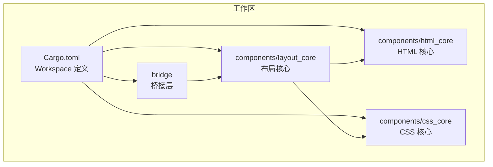
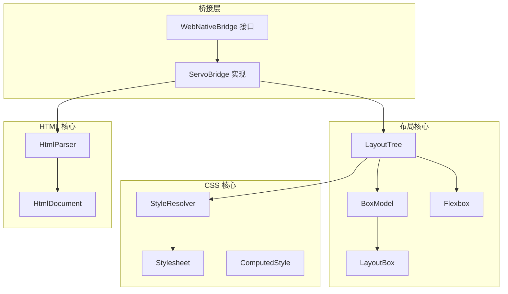
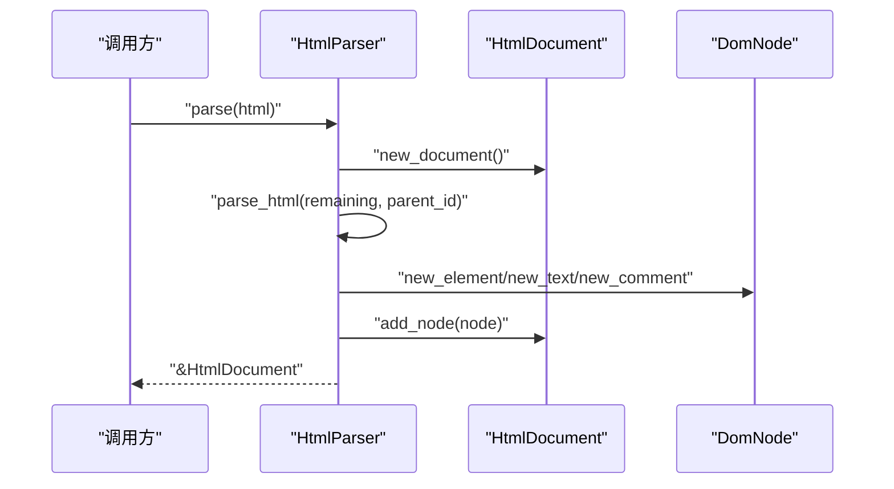
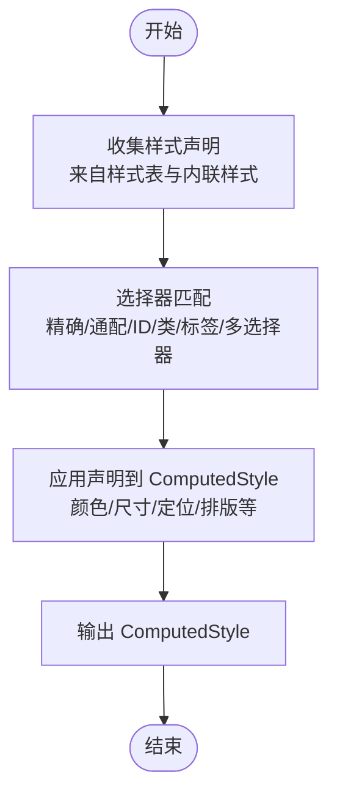
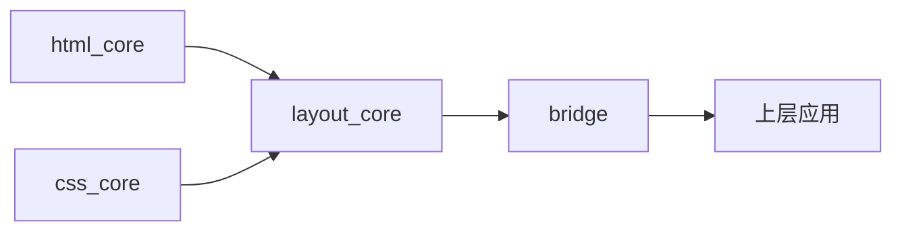

# 核心组件架构

<cite>
**本文档引用的文件**
- [Cargo.toml](file://Cargo.toml)
- [README.md](file://README.md)
- [FEATURES.md](file://FEATURES.md)
- [components/html_core/lib.rs](file://components/html_core/lib.rs)
- [components/html_core/dom.rs](file://components/html_core/dom.rs)
- [components/html_core/parser.rs](file://components/html_core/parser.rs)
- [components/css_core/lib.rs](file://components/css_core/lib.rs)
- [components/css_core/stylesheet.rs](file://components/css_core/stylesheet.rs)
- [components/css_core/declaration.rs](file://components/css_core/declaration.rs)
- [components/css_core/cascade.rs](file://components/css_core/cascade.rs)
- [components/layout_core/lib.rs](file://components/layout_core/lib.rs)
- [components/layout_core/box_model.rs](file://components/layout_core/box_model.rs)
- [components/layout_core/flexbox.rs](file://components/layout_core/flexbox.rs)
- [components/layout_core/tree.rs](file://components/layout_core/tree.rs)
- [bridge/lib.rs](file://bridge/lib.rs)
- [bridge/bridge.rs](file://bridge/bridge.rs)
- [bridge/servo_impl.rs](file://bridge/servo_impl.rs)
</cite>

## 目录
1. [引言](#引言)
2. [项目结构](#项目结构)
3. [核心组件](#核心组件)
4. [架构总览](#架构总览)
5. [详细组件分析](#详细组件分析)
6. [依赖分析](#依赖分析)
7. [性能考虑](#性能考虑)
8. [故障排除指南](#故障排除指南)
9. [结论](#结论)
10. [附录](#附录)

## 引言
本文件面向 Servo-Zero 的核心组件架构，系统性阐述 html_core、css_core、layout_core 三大组件的职责边界、设计原则与实现细节，并说明组件间接口契约与数据传递机制。同时，结合特性标志（features）的设计，解释如何通过条件编译实现功能的灵活启用与组合，以及桥接层 bridge 如何将这些核心能力暴露给上层应用。

Servo-Zero 的目标是在不依赖 SpiderMonkey 的前提下，提供独立的 HTML 解析、CSS 解析与级联、样式计算以及布局引擎，从而支撑 Web 页面的渲染与交互。该架构强调模块化、可插拔与可扩展性，便于在不同运行时环境中按需启用相应功能。

## 项目结构
仓库采用工作区（workspace）组织，核心模块位于 components 子目录，桥接层位于 bridge 子目录。Cargo.toml 定义了工作区成员与共享依赖，包括渲染/几何库、布局引擎、并行处理与网络等。



**图表来源**
- [Cargo.toml:1-37](file://Cargo.toml#L1-L37)

**章节来源**
- [Cargo.toml:1-37](file://Cargo.toml#L1-L37)

## 核心组件
本节概述三大核心组件的职责与对外接口：

- html_core：提供独立的 HTML 解析与 DOM 结构表示，支持基本的节点类型、属性与查询能力。对外导出 HtmlDocument 与 HtmlParser，提供 new_document() 工厂函数。
- css_core：提供 CSS 解析、样式表结构、声明与级联计算。对外导出 Stylesheet、Declaration、StyleResolver 与 ComputedStyle，并提供颜色解析、长度单位解析等工具函数。
- layout_core：提供盒模型、Flexbox 布局与布局树构建。对外导出 LayoutBox、LayoutNode、LayoutRect、DisplayType、PositionType、FlexboxLayout 与 LayoutTree，并提供 LayoutResult 作为布局结果的数据结构。

这些组件通过清晰的模块边界与最小依赖耦合，形成“解析 → 样式 → 布局”的数据流。

**章节来源**
- [components/html_core/lib.rs:1-15](file://components/html_core/lib.rs#L1-L15)
- [components/css_core/lib.rs:1-207](file://components/css_core/lib.rs#L1-L207)
- [components/layout_core/lib.rs:1-22](file://components/layout_core/lib.rs#L1-L22)

## 架构总览
整体架构遵循“解析 → 样式 → 布局”的流水线式处理，桥接层 WebNativeBridge 作为统一入口，协调各核心组件并向上层提供一致的 API。



**图表来源**
- [bridge/bridge.rs:117-262](file://bridge/bridge.rs#L117-L262)
- [bridge/servo_impl.rs:19-413](file://bridge/servo_impl.rs#L19-L413)
- [components/html_core/parser.rs:5-153](file://components/html_core/parser.rs#L5-L153)
- [components/html_core/dom.rs:115-316](file://components/html_core/dom.rs#L115-L316)
- [components/css_core/stylesheet.rs:13-210](file://components/css_core/stylesheet.rs#L13-L210)
- [components/css_core/cascade.rs:86-271](file://components/css_core/cascade.rs#L86-L271)
- [components/layout_core/tree.rs:12-241](file://components/layout_core/tree.rs#L12-L241)
- [components/layout_core/box_model.rs:1-210](file://components/layout_core/box_model.rs#L1-L210)
- [components/layout_core/flexbox.rs:1-167](file://components/layout_core/flexbox.rs#L1-L167)

## 详细组件分析

### HTML 核心组件（html_core）
职责与设计原则
- 独立解析：基于 html5ever 思想实现的轻量级 HTML 解析器，不依赖 SpiderMonkey。
- DOM 抽象：提供 HtmlDocument 与 DomNode，支持文档、元素、文本、注释等节点类型，具备属性管理与查询能力。
- 最小 API：仅暴露必要的工厂函数与解析器，避免引入不必要的复杂性。

内部结构与模块组织
- lib.rs：模块导出与公共 API（new_document、HtmlDocument、HtmlParser）。
- dom.rs：DOM 数据结构与文档管理（节点类型、属性、父子关系、查询）。
- parser.rs：HTML 解析器实现（递归解析、标签处理、自闭合标签、注释跳过）。

关键流程（HTML 解析序列）


**图表来源**
- [components/html_core/parser.rs:18-135](file://components/html_core/parser.rs#L18-L135)
- [components/html_core/dom.rs:115-172](file://components/html_core/dom.rs#L115-L172)

**章节来源**
- [components/html_core/lib.rs:1-15](file://components/html_core/lib.rs#L1-L15)
- [components/html_core/dom.rs:1-316](file://components/html_core/dom.rs#L1-L316)
- [components/html_core/parser.rs:1-153](file://components/html_core/parser.rs#L1-L153)

### CSS 核心组件（css_core）
职责与设计原则
- 独立解析与级联：提供 CSS 文本解析、样式表结构、声明与级联计算，不依赖 SpiderMonkey。
- 工具函数：颜色解析（名称、十六进制、rgb/rgba）、长度单位解析（px/em/rem/%/auto）。
- 可扩展样式：支持内联样式覆盖与多样式表合并。

内部结构与模块组织
- lib.rs：模块导出与公共工具（颜色解析、长度单位解析、Length 枚举）。
- stylesheet.rs：样式表解析与规则索引（选择器索引、规则添加、查询）。
- declaration.rs：声明结构（property/value）。
- cascade.rs：样式解析器（StyleResolver）与计算样式（ComputedStyle），包含选择器匹配与声明应用逻辑。

关键流程（样式计算流程）


**图表来源**
- [components/css_core/cascade.rs:128-198](file://components/css_core/cascade.rs#L128-L198)
- [components/css_core/cascade.rs:200-257](file://components/css_core/cascade.rs#L200-L257)

**章节来源**
- [components/css_core/lib.rs:1-207](file://components/css_core/lib.rs#L1-L207)
- [components/css_core/stylesheet.rs:1-210](file://components/css_core/stylesheet.rs#L1-L210)
- [components/css_core/declaration.rs:1-18](file://components/css_core/declaration.rs#L1-L18)
- [components/css_core/cascade.rs:1-271](file://components/css_core/cascade.rs#L1-L271)

### 布局核心组件（layout_core）
职责与设计原则
- 盒模型与布局：提供 LayoutBox、LayoutNode、LayoutRect 等基础结构，支持显示类型与定位类型。
- Flexbox 支持：实现 Flexbox 布局算法，支持主轴/交叉轴、换行与对齐策略。
- 布局树：将 DOM 与样式结合，生成布局树并进行递归布局计算。

内部结构与模块组织
- lib.rs：模块导出与布局结果结构（LayoutResult）。
- box_model.rs：盒模型定义（LayoutRect、LayoutNode、DisplayType、PositionType、SideValues、LayoutBox）。
- flexbox.rs：Flexbox 布局算法（FlexDirection、FlexWrap、AlignItems、JustifyContent、FlexItem、FlexboxLayout）。
- tree.rs：布局树（LayoutTree）实现，负责从 DOM 与样式解析器获取信息，构建布局树并执行布局。

关键流程（布局树构建与计算）
```mermaid
sequenceDiagram
participant Client as "调用方"
participant Tree as "LayoutTree"
participant Doc as "HtmlDocument"
participant Resolver as "StyleResolver"
participant Box as "LayoutBox"
Client->>Tree : "layout()"
Tree->>Doc : "root_id()/get_node()"
Tree->>Resolver : "compute_style(selector)"
Resolver-->>Tree : "ComputedStyle"
Tree->>Tree : "build_selector()/parse_display()"
Tree->>Box : "LayoutBox : : from_node()"
Tree-->>Client : "布局结果"
```

**图表来源**
- [components/layout_core/tree.rs:61-159](file://components/layout_core/tree.rs#L61-L159)
- [components/layout_core/box_model.rs:155-210](file://components/layout_core/box_model.rs#L155-L210)

**章节来源**
- [components/layout_core/lib.rs:1-22](file://components/layout_core/lib.rs#L1-L22)
- [components/layout_core/box_model.rs:1-210](file://components/layout_core/box_model.rs#L1-L210)
- [components/layout_core/flexbox.rs:1-167](file://components/layout_core/flexbox.rs#L1-L167)
- [components/layout_core/tree.rs:1-241](file://components/layout_core/tree.rs#L1-L241)

### 桥接层（bridge）
职责与设计原则
- 统一接口：WebNativeBridge 定义跨平台的 Web→Native 桥接接口，屏蔽底层实现差异。
- 条件编译：通过特性标志（如 html）控制功能启用，实现“按需装配”。
- 实现示例：ServoBridge 提供具体实现，整合 html_core、css_core、layout_core，并提供渲染、事件绑定、网络与文件操作等能力。

接口契约与数据传递机制
- 输入：HTML 字符串、CSS 文本、DOM 查询选择器、视口尺寸、事件坐标等。
- 输出：布局矩形、颜色结构、PNG 图像字节、文件读写结果等。
- 数据转换：桥接层在 WebNativeBridge 与核心组件之间进行数据结构转换（如 Color、LayoutRect、LayoutNode）。

特性标志（features）与独立性设计
- html：启用 HTML 解析与 DOM 能力；未启用时，桥接层仍可使用纯布局能力（无 HTML）。
- 其他特性：可通过在 Cargo.toml 中新增特性标志，进一步拆分网络、渲染等能力，保持核心组件的独立性。

**章节来源**
- [bridge/lib.rs:1-13](file://bridge/lib.rs#L1-L13)
- [bridge/bridge.rs:117-262](file://bridge/bridge.rs#L117-L262)
- [bridge/servo_impl.rs:35-44](file://bridge/servo_impl.rs#L35-L44)
- [bridge/servo_impl.rs:270-413](file://bridge/servo_impl.rs#L270-L413)

## 依赖分析
组件间依赖关系与耦合度
- html_core 与 layout_core：LayoutTree 依赖 HtmlDocument 与 DOM 结构，但不直接依赖 CSS，体现“布局只关心 DOM 与样式结果”的设计。
- css_core 与 layout_core：LayoutTree 通过 StyleResolver 与 ComputedStyle 获取样式，再由 BoxModel/Flexbox 进行布局计算。
- bridge：ServoBridge 同时依赖 html_core、css_core、layout_core，但通过特性标志实现按需启用。



**图表来源**
- [components/layout_core/tree.rs:3-8](file://components/layout_core/tree.rs#L3-L8)
- [bridge/servo_impl.rs:5-7](file://bridge/servo_impl.rs#L5-L7)

**章节来源**
- [components/layout_core/tree.rs:12-241](file://components/layout_core/tree.rs#L12-L241)
- [bridge/servo_impl.rs:19-413](file://bridge/servo_impl.rs#L19-L413)

## 性能考虑
- 解析阶段：HTML 解析采用递归扫描与简单状态机，适合中等规模文档；对于超大文档建议分片或流式处理。
- 样式阶段：选择器匹配与声明应用为线性扫描，建议在样式表数量较多时优化选择器索引与缓存。
- 布局阶段：盒模型与 Flexbox 计算为 O(n) 遍历，建议在频繁更新场景下减少重布局次数，采用增量更新策略。
- 并发与内存：工作区已引入 rayon 等并行库，可在未来扩展并行布局或样式计算（需谨慎处理共享状态）。

## 故障排除指南
常见问题与排查要点
- HTML 未生效：确认是否启用了 html 特性；未启用时 set_html 将被忽略。
- 样式不生效：检查选择器是否正确（ID/类/标签），确认内联样式优先级高于样式表。
- 布局异常：检查 display/position 设置与尺寸单位（px/em/rem/%/auto），确保父容器尺寸上下文有效。
- 颜色解析失败：确认颜色格式（名称、#RGB/#RGBA、rgb()/rgba()），避免非法值导致解析失败。

**章节来源**
- [bridge/servo_impl.rs:35-44](file://bridge/servo_impl.rs#L35-L44)
- [components/css_core/cascade.rs:156-198](file://components/css_core/cascade.rs#L156-L198)
- [components/css_core/lib.rs:104-127](file://components/css_core/lib.rs#L104-L127)
- [components/layout_core/tree.rs:190-200](file://components/layout_core/tree.rs#L190-L200)

## 结论
Servo-Zero 的核心组件架构以“解析 → 样式 → 布局”为主线，通过清晰的模块边界与最小依赖实现了高内聚、低耦合的设计。特性标志（features）使组件具备灵活的启用能力，桥接层 WebNativeBridge 则提供了统一的对外接口。该架构既保证了可扩展性，又为后续引入更多布局算法、渲染后端与网络能力奠定了坚实基础。

## 附录
- 特性标志参考：通过在 Cargo.toml 中定义特性，控制 html 等功能的启用与禁用，实现按需装配与最小化依赖。
- 扩展建议：未来可引入更多布局算法（Grid、多列等）、渲染后端（GPU 加速）、网络栈（HTTP/HTTPS、缓存）与脚本引擎（可选）。

**章节来源**
- [Cargo.toml:19-37](file://Cargo.toml#L19-L37)
- [FEATURES.md](file://FEATURES.md)