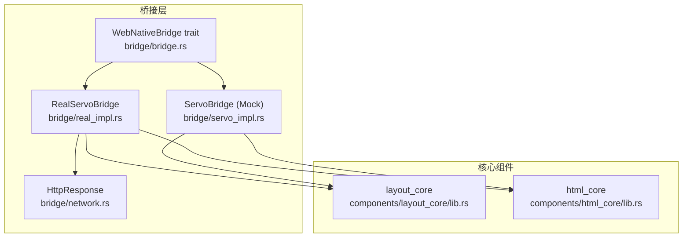
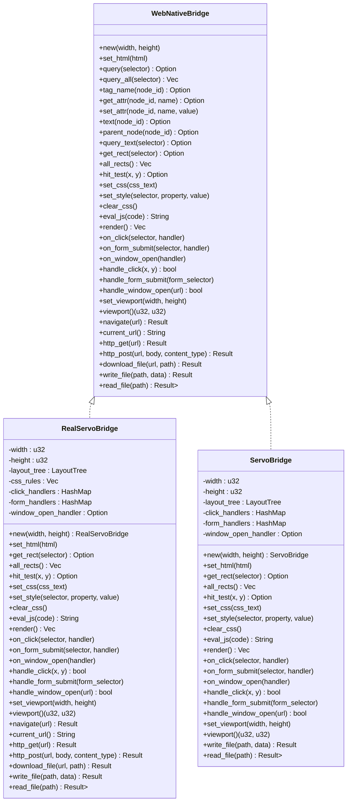
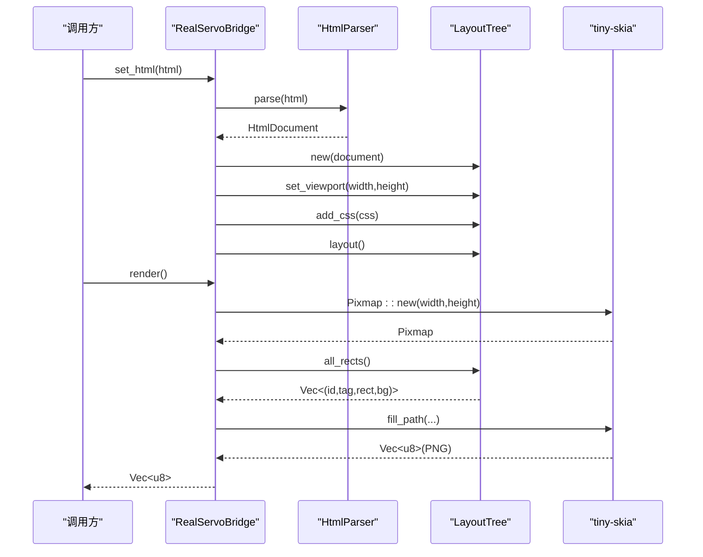
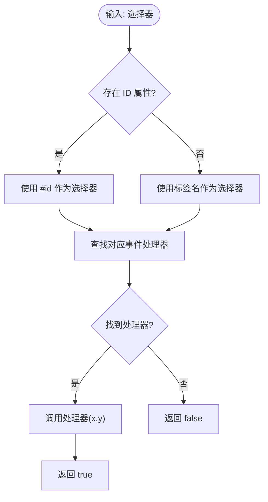
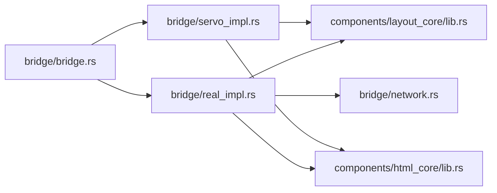

# 桥接层设计

<cite>
**本文引用的文件**
- [bridge/lib.rs](file://bridge/lib.rs)
- [bridge/bridge.rs](file://bridge/bridge.rs)
- [bridge/real_impl.rs](file://bridge/real_impl.rs)
- [bridge/servo_impl.rs](file://bridge/servo_impl.rs)
- [bridge/network.rs](file://bridge/network.rs)
- [Cargo.toml](file://Cargo.toml)
- [README.md](file://README.md)
- [components/layout_core/lib.rs](file://components/layout_core/lib.rs)
- [components/html_core/lib.rs](file://components/html_core/lib.rs)
</cite>

## 目录
1. [简介](#简介)
2. [项目结构](#项目结构)
3. [核心组件](#核心组件)
4. [架构总览](#架构总览)
5. [详细组件分析](#详细组件分析)
6. [依赖关系分析](#依赖关系分析)
7. [性能考量](#性能考量)
8. [故障排除指南](#故障排除指南)
9. [结论](#结论)
10. [附录](#附录)

## 简介
本设计文档聚焦 Servo-Zero 的桥接层，系统性阐述 WebNativeBridge trait 的设计理念与接口抽象，深入分析 RealServoBridge 与 ServoBridge 两种实现的差异与适用场景，并解释桥接层如何实现 Web 与 Native 系统的解耦，以及如何通过 trait 抽象支持不同的运行模式。文档还涵盖事件处理机制、错误处理策略、性能优化考虑，并提供与其他组件的交互关系图与接口调用流程，最后给出扩展与定制指导。

## 项目结构
桥接层位于 bridge 子目录，采用“统一接口 + 双实现”的设计：
- bridge/bridge.rs：定义 WebNativeBridge trait 与数据结构（颜色、布局矩形、布局节点、声明、事件处理器等）
- bridge/real_impl.rs：生产级 RealServoBridge 实现，集成 HTML 解析、CSS 布局、渲染与可选网络功能
- bridge/servo_impl.rs：Mock 实现 ServoBridge，用于测试与参考，具备可选 HTML 功能
- bridge/network.rs：HTTP 响应类型定义
- bridge/lib.rs：库入口与导出

图表来源
- [bridge/bridge.rs:114-262](file://bridge/bridge.rs#L114-L262)
- [bridge/real_impl.rs:61-371](file://bridge/real_impl.rs#L61-L371)
- [bridge/servo_impl.rs:74-412](file://bridge/servo_impl.rs#L74-L412)
- [bridge/network.rs:5-53](file://bridge/network.rs#L5-L53)
- [components/layout_core/lib.rs:9-11](file://components/layout_core/lib.rs#L9-L11)
- [components/html_core/lib.rs:8-9](file://components/html_core/lib.rs#L8-L9)

章节来源
- [bridge/lib.rs:1-13](file://bridge/lib.rs#L1-L13)
- [README.md:16-31](file://README.md#L16-L31)

## 核心组件
本节深入分析 WebNativeBridge trait 的接口抽象与设计原则，以及关键数据结构。

- 设计理念与抽象原则
  - 统一接口：通过 trait 抽象 Web 与 Native 的交互边界，屏蔽底层实现细节
  - 可插拔实现：支持 Mock 与生产实现，便于测试与部署
  - 默认实现：大量方法提供默认实现，外部项目只需实现必要接口
  - 运行时可选能力：通过 feature 标记控制网络等可选功能
  - 事件驱动：提供事件绑定与处理方法，支持点击、表单提交、window.open 等

- 关键数据结构
  - 颜色 Color：RGBA 表示，支持常量与十六进制解析
  - 布局矩形 LayoutRect：f32 坐标与尺寸
  - 布局节点 LayoutNode：DOM 节点 ID、标签名、位置与背景
  - CSS 声明 Declaration：属性与值对
  - 事件处理器类型别名：EventHandler、FormHandler、WindowOpenHandler

- 接口分类
  - DOM 读写：设置 HTML、查询节点、属性读写、文本获取、父子关系
  - 布局：获取矩形、全部节点、命中测试
  - CSS 操作：添加规则、内联样式、清除规则
  - JS 执行：占位方法，默认不支持
  - 渲染：生成 PNG 图像
  - 事件绑定与处理：点击、表单提交、window.open
  - 工具：视口设置与获取
  - 网络：导航、HTTP GET/POST、下载、当前 URL
  - 文件：读写

章节来源
- [bridge/bridge.rs:5-75](file://bridge/bridge.rs#L5-L75)
- [bridge/bridge.rs:114-262](file://bridge/bridge.rs#L114-L262)

## 架构总览
桥接层通过 WebNativeBridge trait 将 Web 内容与 Native 渲染、布局、网络等功能解耦。RealServoBridge 作为生产实现，整合 html_core、css_core、layout_core 与 tiny-skia 渲染；ServoBridge 作为 Mock 实现，用于测试与参考。

图表来源
- [bridge/bridge.rs:114-262](file://bridge/bridge.rs#L114-L262)
- [bridge/real_impl.rs:11-371](file://bridge/real_impl.rs#L11-L371)
- [bridge/servo_impl.rs:10-412](file://bridge/servo_impl.rs#L10-L412)

## 详细组件分析

### WebNativeBridge Trait 分析
- 设计目标
  - 提供 Web 与 Native 的统一抽象，屏蔽底层实现差异
  - 支持多种运行模式（默认、嵌入、最小化），通过 feature 控制能力
  - 事件驱动的交互模型，便于与 UI 框架集成
- 接口设计原则
  - 方法默认实现：减少实现负担，仅需覆盖必要接口
  - 类型安全：使用结构化数据（如 LayoutRect、LayoutNode、Color）
  - 可扩展性：预留网络、文件等可选能力
- 关键接口说明
  - DOM 读写：query/query_all/tag_name/get_attr/set_attr/text/parent_node
  - 布局：get_rect/all_rects/hit_test
  - CSS：set_css/set_style/clear_css
  - 渲染：render 返回 PNG 字节
  - 事件：on_* 绑定，handle_* 处理
  - 网络：navigate/http_get/http_post/download_file/current_url
  - 文件：write_file/read_file

章节来源
- [bridge/bridge.rs:114-262](file://bridge/bridge.rs#L114-L262)

### RealServoBridge 实现分析
- 适用场景
  - 生产环境，需要完整 HTML/CSS/布局/渲染能力
  - 需要可选网络功能（通过 feature 控制）
- 核心实现要点
  - HTML 解析：使用 html_core::parser::HtmlParser 解析并构建 DOM
  - CSS 应用：支持 <style> 标签提取与动态规则添加
  - 布局：基于 layout_core::LayoutTree 计算位置与背景
  - 渲染：tiny-skia 绘制，按深度排序确保正确覆盖
  - 事件：基于标签名或 ID 的事件绑定与处理
  - 网络：可选 feature 下使用 reqwest 进行 HTTP 请求与下载
  - 文件：标准库文件读写
- 性能优化
  - 布局树重建与重新布局仅在必要时触发
  - 渲染前对节点进行排序，减少绘制开销
  - 使用 HashMap 快速索引事件处理器

图表来源
- [bridge/real_impl.rs:101-125](file://bridge/real_impl.rs#L101-L125)
- [bridge/real_impl.rs:154-205](file://bridge/real_impl.rs#L154-L205)

章节来源
- [bridge/real_impl.rs:11-371](file://bridge/real_impl.rs#L11-L371)

### ServoBridge 实现分析（Mock）
- 适用场景
  - 测试与参考，快速验证逻辑
  - 在未启用 HTML 功能时提供基础能力
- 核心实现要点
  - 条件编译：feature "html" 下提供完整 DOM 能力
  - 事件处理：优先使用 ID 选择器，否则回退到标签名
  - 渲染：空白画布，便于测试渲染流程
  - 文件操作：标准库文件读写
- 与 RealServoBridge 的差异
  - 缺少网络功能（无 feature 控制）
  - DOM 能力按 feature 开关
  - 事件绑定更简单（仅标签名或 ID）

图表来源
- [bridge/servo_impl.rs:215-231](file://bridge/servo_impl.rs#L215-L231)

章节来源
- [bridge/servo_impl.rs:10-412](file://bridge/servo_impl.rs#L10-L412)

### 事件处理机制
- 事件绑定
  - on_click/on_form_submit/on_window_open 将处理器存储在 HashMap 中
  - 选择器作为键，支持标签名或 ID
- 事件处理
  - handle_click：命中测试后根据选择器查找处理器并调用
  - handle_form_submit：收集表单字段并调用处理器
  - handle_window_open：调用 window open 处理器，返回是否处理
- 错误处理
  - 未启用 HTML 功能时，DOM 查询返回 None
  - 未绑定处理器时，事件处理返回 false

章节来源
- [bridge/real_impl.rs:207-237](file://bridge/real_impl.rs#L207-L237)
- [bridge/servo_impl.rs:203-245](file://bridge/servo_impl.rs#L203-L245)

### 错误处理策略
- 网络功能
  - 未启用 network feature 时，网络相关方法返回错误
  - 使用 Result 包装错误信息，便于上层处理
- 文件操作
  - 标准库错误转换为字符串错误消息
- JS 执行
  - 默认不支持 JS，记录警告并返回空字符串
- DOM 能力
  - 未启用 HTML feature 时，DOM 相关方法返回默认值或 None

章节来源
- [bridge/real_impl.rs:252-269](file://bridge/real_impl.rs#L252-L269)
- [bridge/real_impl.rs:336-339](file://bridge/real_impl.rs#L336-L339)
- [bridge/servo_impl.rs:343-346](file://bridge/servo_impl.rs#L343-L346)

## 依赖关系分析
桥接层与核心组件的依赖关系如下：

图表来源
- [bridge/bridge.rs:114-262](file://bridge/bridge.rs#L114-L262)
- [bridge/real_impl.rs:61-371](file://bridge/real_impl.rs#L61-L371)
- [bridge/servo_impl.rs:74-412](file://bridge/servo_impl.rs#L74-L412)
- [components/layout_core/lib.rs:9-11](file://components/layout_core/lib.rs#L9-L11)
- [components/html_core/lib.rs:8-9](file://components/html_core/lib.rs#L8-L9)
- [bridge/network.rs:5-53](file://bridge/network.rs#L5-L53)

章节来源
- [Cargo.toml:19-37](file://Cargo.toml#L19-L37)
- [README.md:136-156](file://README.md#L136-L156)

## 性能考量
- 布局与渲染
  - 仅在 HTML 更新或样式变更后触发布局计算
  - 渲染前对节点按深度排序，确保覆盖顺序正确
- 事件处理
  - 使用 HashMap 快速查找事件处理器
  - 命中测试后立即调用处理器，避免多余遍历
- 网络与文件
  - 网络功能按需启用，避免不必要的依赖
  - 文件操作使用标准库，简单可靠
- 可扩展性
  - 通过 feature 控制能力，减小二进制体积
  - Mock 实现便于快速测试，减少开发成本

## 故障排除指南
- 无法进行网络请求
  - 检查是否启用了 network feature
  - 确认运行时环境具备网络访问权限
- DOM 查询返回 None
  - 确认已设置 HTML 或启用了 HTML feature
  - 检查选择器是否正确
- 渲染结果为空
  - 确认已设置 HTML 并完成布局
  - 检查视口尺寸与背景设置
- 事件未触发
  - 确认已绑定相应事件处理器
  - 检查命中测试坐标是否正确
- 文件读写失败
  - 检查路径是否存在且具有读写权限
  - 确认文件系统状态

章节来源
- [bridge/real_impl.rs:252-269](file://bridge/real_impl.rs#L252-L269)
- [bridge/servo_impl.rs:274-287](file://bridge/servo_impl.rs#L274-L287)

## 结论
Servo-Zero 的桥接层通过 WebNativeBridge trait 实现了 Web 与 Native 的解耦，提供了统一的接口抽象与双实现方案。RealServoBridge 适用于生产环境，具备完整的 HTML/CSS/布局/渲染与可选网络能力；ServoBridge 适用于测试与参考，具备可选的 HTML 能力。该设计支持多种运行模式，具备良好的扩展性与性能表现，能够满足不同场景下的需求。

## 附录
- 扩展与定制指导
  - 新增功能：在 WebNativeBridge 中添加新方法，提供默认实现
  - 替换渲染器：实现自定义渲染逻辑，保持接口一致
  - 自定义事件：扩展事件处理器类型，支持更多事件源
  - 功能开关：通过 feature 控制能力，实现最小化部署
- 最佳实践
  - 优先使用 Mock 实现进行单元测试
  - 在生产环境中启用必要的 feature
  - 合理管理事件处理器，避免内存泄漏
  - 定期更新布局树，确保渲染一致性