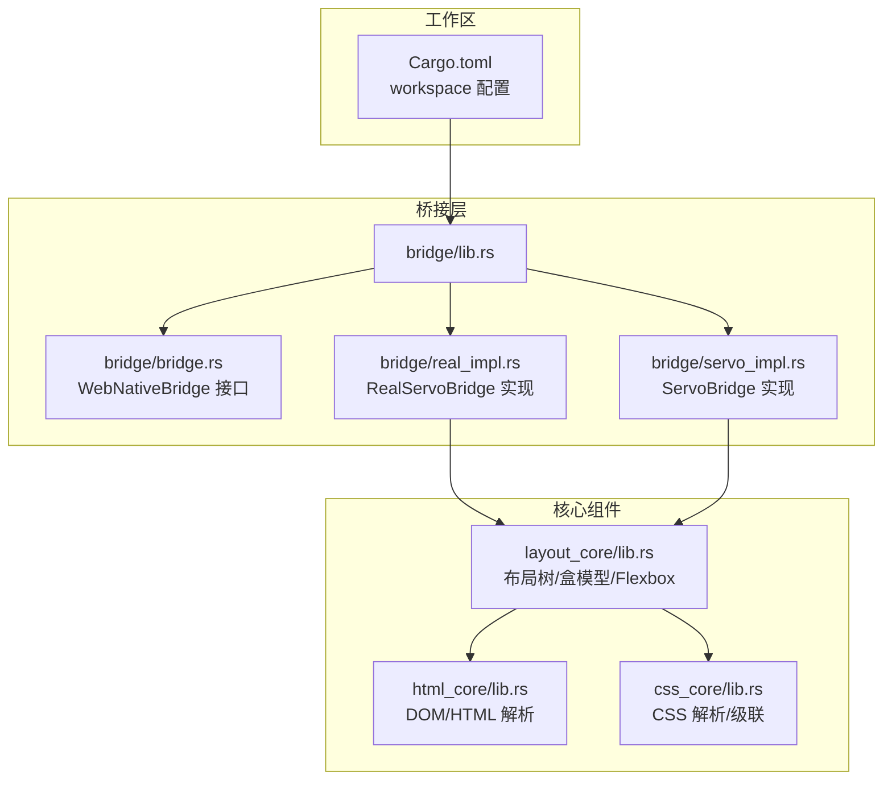
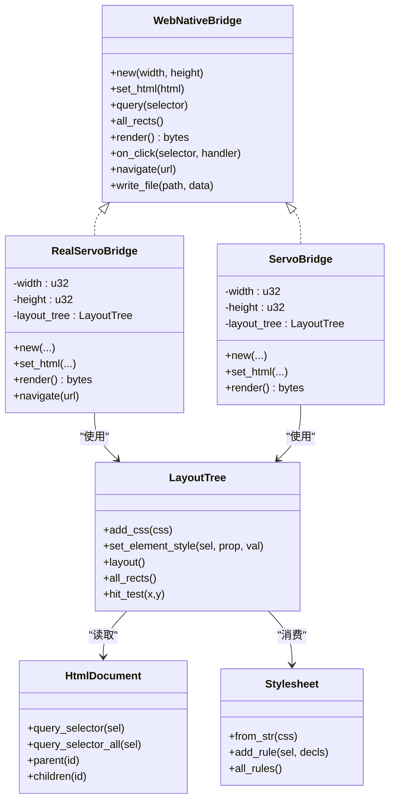
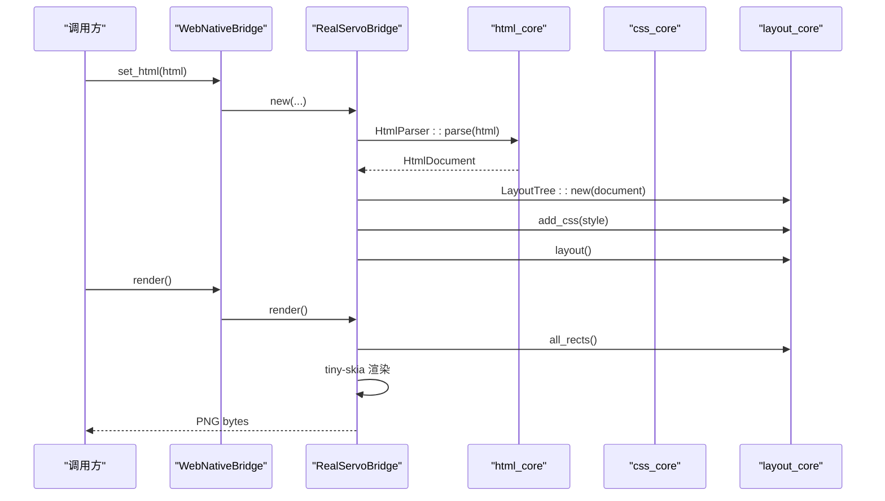
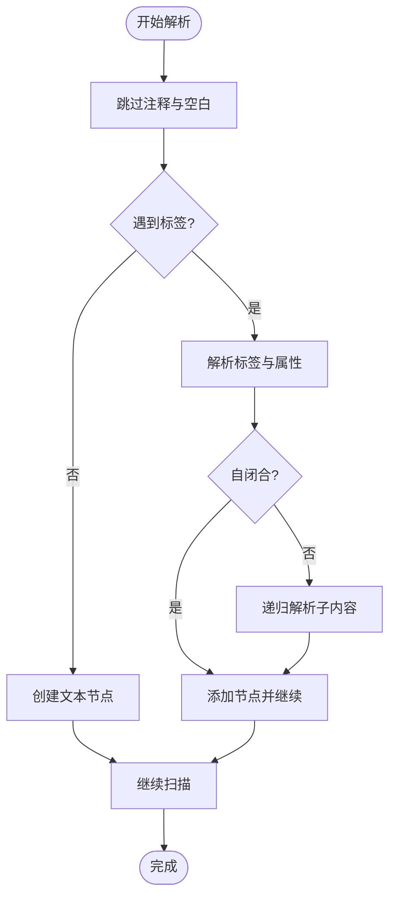
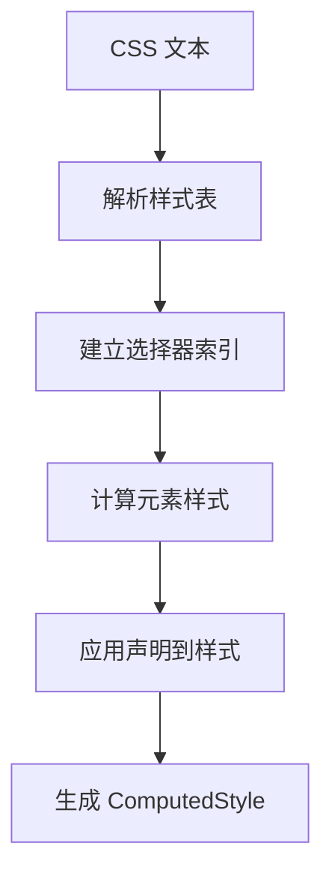
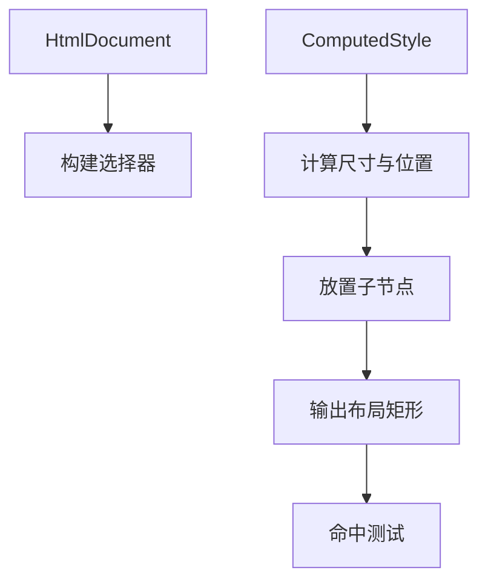
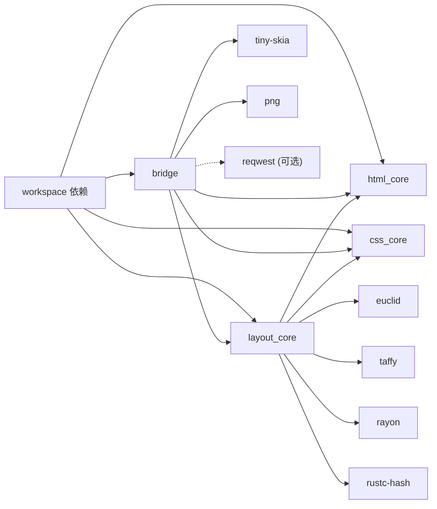
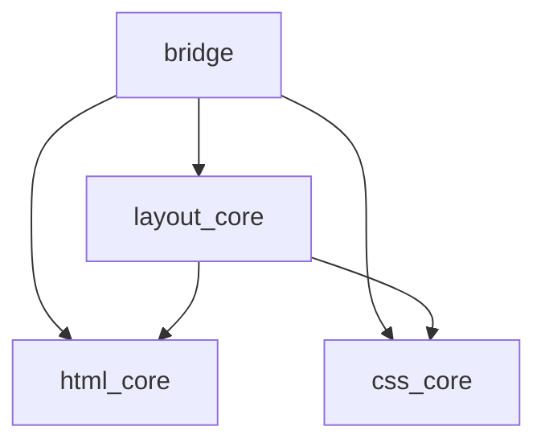

# 模块化设计原则

<cite>
**本文档引用的文件**
- [Cargo.toml](file://Cargo.toml)
- [README.md](file://README.md)
- [FEATURES.md](file://FEATURES.md)
- [bridge/lib.rs](file://bridge/lib.rs)
- [bridge/bridge.rs](file://bridge/bridge.rs)
- [bridge/real_impl.rs](file://bridge/real_impl.rs)
- [bridge/servo_impl.rs](file://bridge/servo_impl.rs)
- [components/html_core/lib.rs](file://components/html_core/lib.rs)
- [components/html_core/dom.rs](file://components/html_core/dom.rs)
- [components/html_core/parser.rs](file://components/html_core/parser.rs)
- [components/css_core/lib.rs](file://components/css_core/lib.rs)
- [components/css_core/stylesheet.rs](file://components/css_core/stylesheet.rs)
- [components/css_core/cascade.rs](file://components/css_core/cascade.rs)
- [components/layout_core/lib.rs](file://components/layout_core/lib.rs)
- [components/layout_core/tree.rs](file://components/layout_core/tree.rs)
- [components/layout_core/flexbox.rs](file://components/layout_core/flexbox.rs)
</cite>

## 目录
1. [引言](#引言)
2. [项目结构](#项目结构)
3. [核心组件](#核心组件)
4. [架构总览](#架构总览)
5. [详细组件分析](#详细组件分析)
6. [依赖关系分析](#依赖关系分析)
7. [性能考量](#性能考量)
8. [故障排除指南](#故障排除指南)
9. [结论](#结论)
10. [附录](#附录)

## 引言
本文件系统性阐述 Servo-Zero 的模块化设计原则与实现策略，围绕工作区（workspace）管理、crate 间依赖关系与特性标志（features）使用进行深入分析，并总结模块边界设计与接口抽象策略。同时，结合项目实际代码，给出模块化设计对可维护性、可扩展性与性能的影响评估，提供模块依赖图与特性矩阵，讨论最佳实践与常见陷阱，并为新模块开发与现有模块重构提供设计指导。

## 项目结构
Servo-Zero 采用多 crate 工作区组织，核心由“桥接层”和“三大核心组件”构成：
- 工作区（workspace）：统一版本、依赖与元数据配置
- 桥接层（bridge）：对外统一接口 WebNativeBridge，提供 mock 与生产实现
- 核心组件（components）：html_core、css_core、layout_core，分别负责 DOM/HTML 解析、CSS 解析与级联、布局计算

**图表来源**
- [Cargo.toml:1-37](file://Cargo.toml#L1-L37)
- [bridge/lib.rs:1-13](file://bridge/lib.rs#L1-L13)
- [bridge/bridge.rs:114-263](file://bridge/bridge.rs#L114-L263)
- [bridge/real_impl.rs:1-372](file://bridge/real_impl.rs#L1-L372)
- [bridge/servo_impl.rs:1-413](file://bridge/servo_impl.rs#L1-L413)
- [components/html_core/lib.rs:1-15](file://components/html_core/lib.rs#L1-L15)
- [components/css_core/lib.rs:1-207](file://components/css_core/lib.rs#L1-L207)
- [components/layout_core/lib.rs:1-22](file://components/layout_core/lib.rs#L1-L22)

**章节来源**
- [Cargo.toml:1-37](file://Cargo.toml#L1-L37)
- [README.md:16-31](file://README.md#L16-L31)

## 核心组件
- 桥接层（bridge）：定义统一接口 WebNativeBridge，提供 mock 与生产两种实现；通过特性标志控制网络能力与 HTML 能力的启用与否
- HTML 核心（html_core）：纯 Rust DOM 结构与 HTML 解析器，提供选择器查询、父子关系等基础能力
- CSS 核心（css_core）：样式表解析、声明解析与级联计算，支持颜色、长度等基础属性解析
- 布局核心（layout_core）：基于盒模型与 Flexbox 的布局树，整合 HTML 与 CSS，输出布局矩形与命中测试

**章节来源**
- [bridge/bridge.rs:114-263](file://bridge/bridge.rs#L114-L263)
- [components/html_core/lib.rs:1-15](file://components/html_core/lib.rs#L1-L15)
- [components/css_core/lib.rs:1-207](file://components/css_core/lib.rs#L1-L207)
- [components/layout_core/lib.rs:1-22](file://components/layout_core/lib.rs#L1-L22)

## 架构总览
模块化架构以“接口抽象 + 松耦合 + 特性开关”为核心设计思想：
- 接口抽象：WebNativeBridge 作为唯一对外契约，屏蔽底层实现细节
- 松耦合：桥接层仅依赖核心组件的公共 API，核心组件之间通过清晰的数据结构传递
- 特性开关：通过 features 控制网络与 HTML 能力，实现最小二乘的二进制与依赖体积

**图表来源**
- [bridge/bridge.rs:114-263](file://bridge/bridge.rs#L114-L263)
- [bridge/real_impl.rs:11-372](file://bridge/real_impl.rs#L11-L372)
- [bridge/servo_impl.rs:10-413](file://bridge/servo_impl.rs#L10-L413)
- [components/layout_core/tree.rs:12-241](file://components/layout_core/tree.rs#L12-L241)
- [components/html_core/dom.rs:115-316](file://components/html_core/dom.rs#L115-L316)
- [components/css_core/stylesheet.rs:13-210](file://components/css_core/stylesheet.rs#L13-L210)

## 详细组件分析

### 桥接层接口与实现
- WebNativeBridge：定义统一能力集合，包括 DOM 读写、布局查询、CSS 操作、渲染、事件绑定与处理、网络请求、文件操作等
- RealServoBridge：生产实现，组合 html_core、css_core、layout_core 与 tiny-skia 渲染
- ServoBridge：Mock 实现，用于测试与参考，支持条件编译下的 HTML 能力

**图表来源**
- [bridge/bridge.rs:114-263](file://bridge/bridge.rs#L114-L263)
- [bridge/real_impl.rs:101-125](file://bridge/real_impl.rs#L101-L125)
- [components/html_core/parser.rs:18-22](file://components/html_core/parser.rs#L18-L22)
- [components/layout_core/tree.rs:61-69](file://components/layout_core/tree.rs#L61-L69)

**章节来源**
- [bridge/bridge.rs:114-263](file://bridge/bridge.rs#L114-L263)
- [bridge/real_impl.rs:101-205](file://bridge/real_impl.rs#L101-L205)
- [bridge/servo_impl.rs:74-268](file://bridge/servo_impl.rs#L74-L268)

### HTML 核心：DOM 与解析
- DOM 结构：HtmlDocument 维护节点列表与根节点，提供选择器查询、父子关系、文本收集等
- 解析器：HtmlParser 递归解析 HTML，构建 DOM 树，支持注释、自闭合标签等

**图表来源**
- [components/html_core/parser.rs:24-135](file://components/html_core/parser.rs#L24-L135)
- [components/html_core/dom.rs:174-286](file://components/html_core/dom.rs#L174-L286)

**章节来源**
- [components/html_core/dom.rs:115-316](file://components/html_core/dom.rs#L115-L316)
- [components/html_core/parser.rs:18-146](file://components/html_core/parser.rs#L18-L146)

### CSS 核心：样式表与级联
- Stylesheet：从字符串解析样式表，建立选择器索引，支持规则增删
- Cascade：StyleResolver 聚合样式表与内联样式，计算元素最终样式，支持颜色、长度等属性解析

**图表来源**
- [components/css_core/stylesheet.rs:30-107](file://components/css_core/stylesheet.rs#L30-L107)
- [components/css_core/cascade.rs:128-154](file://components/css_core/cascade.rs#L128-L154)

**章节来源**
- [components/css_core/stylesheet.rs:13-210](file://components/css_core/stylesheet.rs#L13-L210)
- [components/css_core/cascade.rs:86-271](file://components/css_core/cascade.rs#L86-L271)
- [components/css_core/lib.rs:13-207](file://components/css_core/lib.rs#L13-L207)

### 布局核心：盒模型与 Flexbox
- LayoutTree：整合 HtmlDocument 与 StyleResolver，构建布局树，支持视口设置、布局计算、命中测试
- Flexbox：提供 FlexDirection、FlexWrap、AlignItems、JustifyContent 等枚举，实现主轴与交叉轴排布

**图表来源**
- [components/layout_core/tree.rs:61-159](file://components/layout_core/tree.rs#L61-L159)
- [components/layout_core/flexbox.rs:107-165](file://components/layout_core/flexbox.rs#L107-L165)

**章节来源**
- [components/layout_core/tree.rs:12-241](file://components/layout_core/tree.rs#L12-L241)
- [components/layout_core/flexbox.rs:1-167](file://components/layout_core/flexbox.rs#L1-L167)

## 依赖关系分析
- 工作区统一依赖：日志、几何、渲染、并行、URL 等
- 桥接层依赖：html-core、css-core、layout-core、tiny-skia、png、reqwest（可选）
- 核心组件依赖：layout_core 依赖 html-core 与 css-core，以及外部库如 euclid、taffy、rayon、rustc-hash

**图表来源**
- [Cargo.toml:19-37](file://Cargo.toml#L19-L37)
- [bridge/Cargo.toml:26-43](file://bridge/Cargo.toml#L26-L43)
- [components/layout_core/Cargo.toml:15-26](file://components/layout_core/Cargo.toml#L15-L26)

**章节来源**
- [Cargo.toml:19-37](file://Cargo.toml#L19-L37)
- [bridge/Cargo.toml:26-43](file://bridge/Cargo.toml#L26-L43)
- [components/layout_core/Cargo.toml:15-26](file://components/layout_core/Cargo.toml#L15-L26)

## 性能考量
- 二进制与编译时间：不同特性组合显著影响体积与编译时长，最小模式下依赖最少、启动最快
- 渲染路径：tiny-skia 渲染按节点排序绘制，复杂层级可能增加绘制开销
- 布局计算：layout_core 采用递归布局与简单尺寸推导，适合演示与轻量使用；复杂 Flexbox 场景建议关注 taFfy 集成的成熟度
- 并行与哈希：rayon 与 rustc-hash 提供并行与快速哈希，有助于提升大规模文档处理性能

**章节来源**
- [FEATURES.md:70-74](file://FEATURES.md#L70-L74)
- [bridge/real_impl.rs:154-205](file://bridge/real_impl.rs#L154-L205)
- [components/layout_core/tree.rs:61-159](file://components/layout_core/tree.rs#L61-L159)

## 故障排除指南
- 网络功能不可用：当未启用 network 特性时，导航、HTTP 请求与下载将返回错误提示
- HTML 功能不可用：在 embed 模式下，HTML 解析能力被禁用，相关方法返回默认值或空结果
- 渲染异常：若视口尺寸为 0 或布局未计算，渲染结果为空白或异常
- 事件处理：点击与表单事件需先绑定处理器，否则 handle_* 方法不会触发回调

**章节来源**
- [bridge/real_impl.rs:252-269](file://bridge/real_impl.rs#L252-L269)
- [bridge/servo_impl.rs:36-43](file://bridge/servo_impl.rs#L36-L43)
- [bridge/real_impl.rs:207-237](file://bridge/real_impl.rs#L207-L237)

## 结论
Servo-Zero 的模块化设计通过清晰的接口抽象与松耦合的组件划分，实现了可插拔的功能组合与可控的二进制体积。特性标志体系使同一套接口在不同场景下灵活启用/禁用能力，既满足“完整浏览器功能”，也支持“嵌入模式”和“最小模式”。建议在新增模块时遵循“单一职责、稳定接口、最小依赖”的原则，并通过特性开关与条件编译保障可维护性与可扩展性。

## 附录

### 模块依赖图（代码级）

**图表来源**
- [bridge/Cargo.toml:33-35](file://bridge/Cargo.toml#L33-L35)
- [components/layout_core/Cargo.toml:16-17](file://components/layout_core/Cargo.toml#L16-L17)

### 特性矩阵
- default：启用 html 与 network，提供完整浏览器功能
- html：启用 HTML 解析（内部依赖），用于需要 DOM/HTML 的场景
- network：启用 reqwest，提供 HTTP 请求与下载能力
- embed：关闭默认特性，仅保留 network，适用于嵌入场景

**章节来源**
- [FEATURES.md:3-11](file://FEATURES.md#L3-L11)
- [bridge/Cargo.toml:16-24](file://bridge/Cargo.toml#L16-L24)

### 设计最佳实践
- 明确模块边界：每个 crate 聚焦单一职责，暴露稳定的公共 API
- 接口先行：先定义 trait 与数据结构，再实现具体逻辑
- 条件编译：使用 #[cfg(feature)] 区分能力，避免引入无关依赖
- 数据驱动：通过结构化的数据（DOM、样式表、布局矩形）在模块间传递
- 可观测性：利用日志与 warn 提示，帮助用户理解能力缺失与行为差异

### 常见陷阱
- 过度耦合：桥接层直接依赖具体实现细节，导致升级困难
- 依赖爆炸：未使用特性开关，导致不必要的依赖进入最终二进制
- 接口膨胀：trait 过于宽泛，难以在不同模式下裁剪
- 渲染性能：未考虑节点数量与层级，导致渲染开销过大