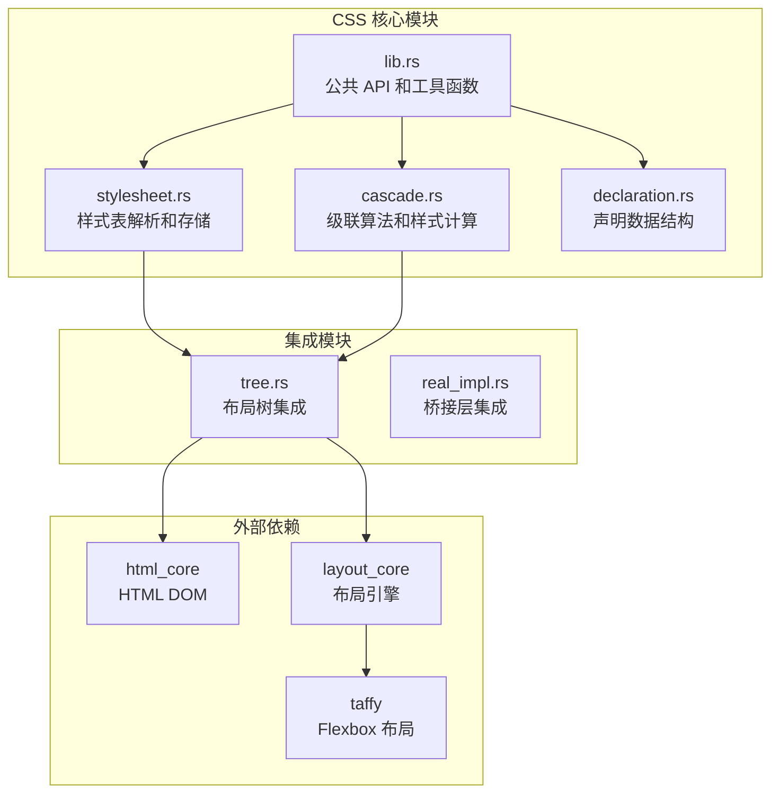
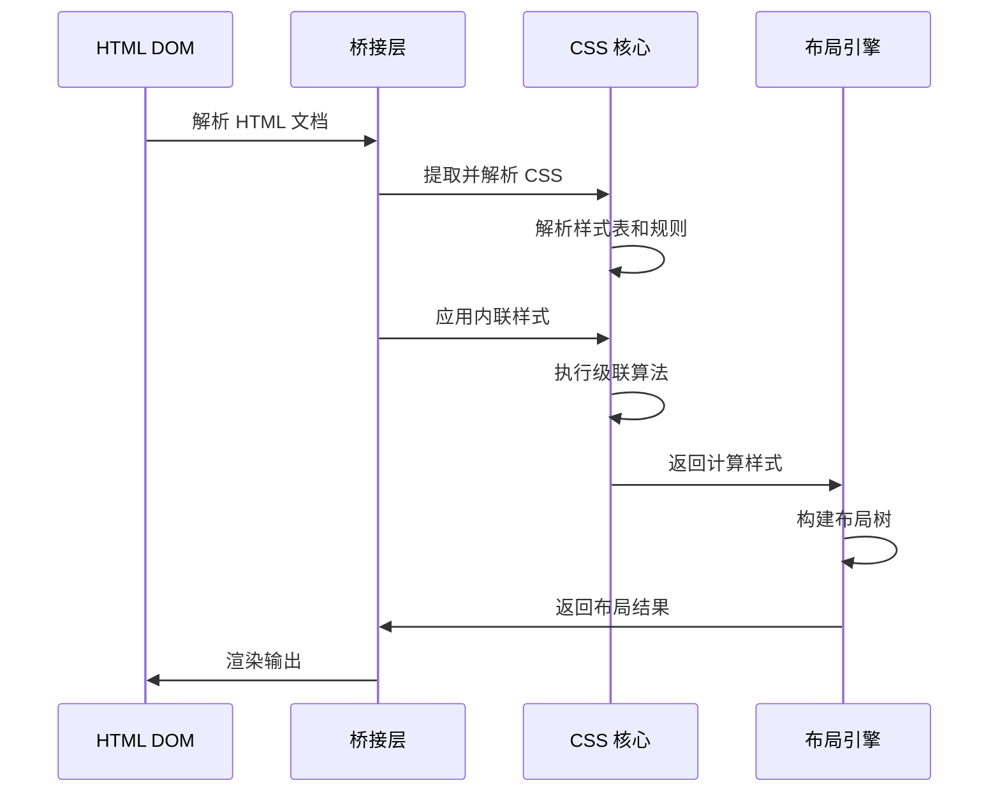
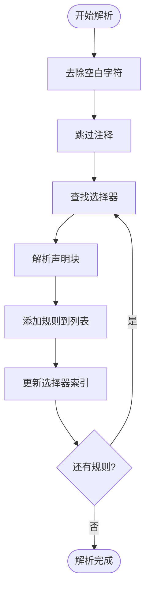
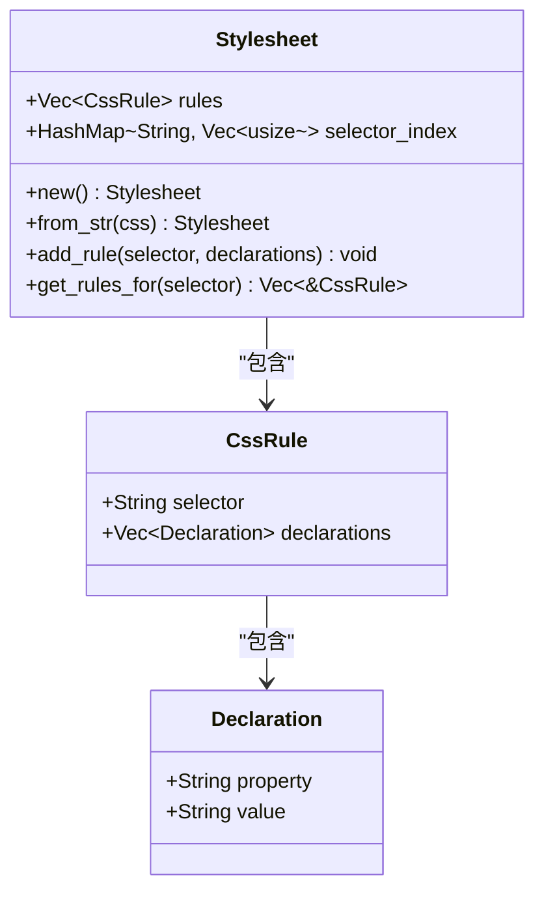
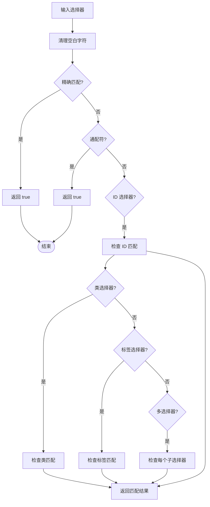
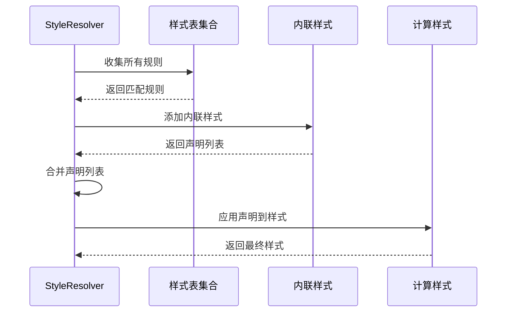
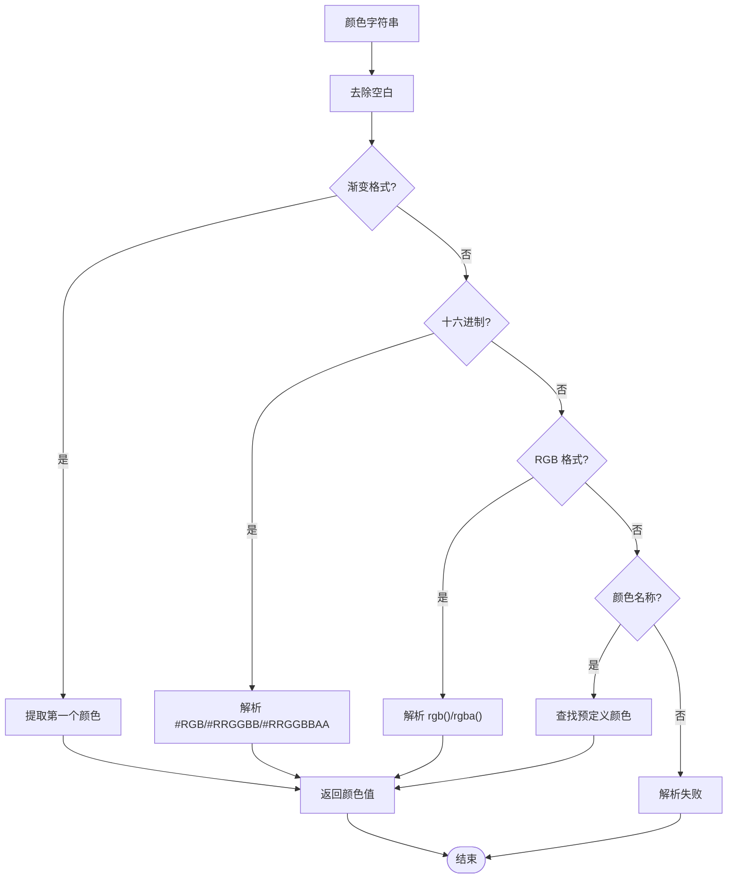
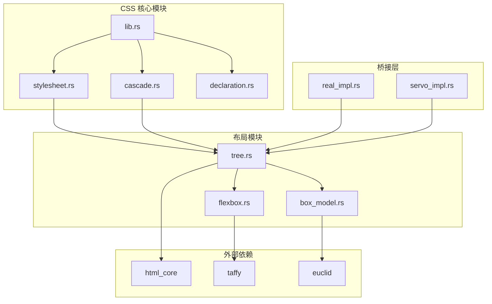

# CSS 处理模块

<cite>
**本文档引用的文件**
- [lib.rs](file://components/css_core/lib.rs)
- [stylesheet.rs](file://components/css_core/stylesheet.rs)
- [cascade.rs](file://components/css_core/cascade.rs)
- [declaration.rs](file://components/css_core/declaration.rs)
- [tree.rs](file://components/layout_core/tree.rs)
- [real_impl.rs](file://bridge/real_impl.rs)
- [README.md](file://README.md)
- [Cargo.toml](file://Cargo.toml)
</cite>

## 目录
1. [简介](#简介)
2. [项目结构](#项目结构)
3. [核心组件](#核心组件)
4. [架构概览](#架构概览)
5. [详细组件分析](#详细组件分析)
6. [依赖关系分析](#依赖关系分析)
7. [性能考虑](#性能考虑)
8. [故障排除指南](#故障排除指南)
9. [结论](#结论)

## 简介

CSS 处理模块是 Servo-Zero 浏览器渲染引擎的核心组件之一，提供了完整的 CSS 解析、选择器匹配和样式计算功能。该模块实现了独立的 CSS 引擎，不依赖 SpiderMonkey JavaScript 引擎，专注于提供高性能的 CSS 处理能力。

该模块的主要目标包括：
- 解析 CSS 规则和声明
- 实现选择器匹配算法
- 执行 CSS 级联算法
- 计算最终样式值
- 提供颜色和长度值解析
- 支持内联样式和动态样式更新

## 项目结构

CSS 处理模块位于 `components/css_core/` 目录下，采用模块化设计，包含以下核心文件：

**图表来源**
- [lib.rs:1-207](file://components/css_core/lib.rs#L1-L207)
- [stylesheet.rs:1-210](file://components/css_core/stylesheet.rs#L1-L210)
- [cascade.rs:1-271](file://components/css_core/cascade.rs#L1-L271)
- [tree.rs:1-241](file://components/layout_core/tree.rs#L1-L241)

**章节来源**
- [README.md:16-31](file://README.md#L16-L31)
- [Cargo.toml:1-37](file://Cargo.toml#L1-L37)

## 核心组件

### Stylesheet 样式表

Stylesheet 是 CSS 规则的容器，负责解析和存储 CSS 规则，并提供高效的查询机制。

主要特性：
- **规则存储**：使用向量存储所有 CSS 规则
- **选择器索引**：维护选择器到规则索引的映射
- **解析功能**：从 CSS 字符串解析规则
- **查询优化**：通过索引快速查找匹配规则

### Declaration 声明

Declaration 表示单个 CSS 属性声明，包含属性名和属性值。

核心字段：
- `property`: CSS 属性名称（如 "color", "width"）
- `value`: CSS 属性值（如 "#ff0000", "100px"）

### StyleResolver 样式解析器

StyleResolver 是 CSS 级联算法的核心实现，负责：
- 收集所有匹配的声明
- 应用级联规则
- 计算最终样式
- 处理内联样式优先级

### ComputedStyle 计算样式

ComputedStyle 存储最终计算出的样式值，包含各种 CSS 属性的最终状态。

**章节来源**
- [stylesheet.rs:6-210](file://components/css_core/stylesheet.rs#L6-L210)
- [declaration.rs:3-18](file://components/css_core/declaration.rs#L3-L18)
- [cascade.rs:8-271](file://components/css_core/cascade.rs#L8-L271)

## 架构概览

CSS 处理模块采用分层架构设计，各组件职责清晰分离：

**图表来源**
- [real_impl.rs:101-125](file://bridge/real_impl.rs#L101-L125)
- [tree.rs:61-69](file://components/layout_core/tree.rs#L61-L69)
- [cascade.rs:129-154](file://components/css_core/cascade.rs#L129-L154)

## 详细组件分析

### Stylesheet 解析器

Stylesheet 解析器实现了完整的 CSS 解析功能，支持多种 CSS 语法：

#### 解析流程

**图表来源**
- [stylesheet.rs:37-107](file://components/css_core/stylesheet.rs#L37-L107)

#### 选择器索引机制

Stylesheet 使用 HashMap 维护选择器到规则索引的映射：

**图表来源**
- [stylesheet.rs:14-18](file://components/css_core/stylesheet.rs#L14-L18)
- [stylesheet.rs:6-11](file://components/css_core/stylesheet.rs#L6-L11)

**章节来源**
- [stylesheet.rs:191-203](file://components/css_core/stylesheet.rs#L191-L203)

### 选择器匹配算法

选择器匹配算法支持多种 CSS 选择器类型：

#### 匹配规则

**图表来源**
- [cascade.rs:157-198](file://components/css_core/cascade.rs#L157-L198)

#### 选择器类型支持

| 选择器类型 | 匹配规则 | 示例 |
|-----------|----------|------|
| 精确匹配 | 完全相等 | `#header` |
| 通配符 | 匹配所有元素 | `*` |
| ID 选择器 | 包含 `#id` | `#main-content` |
| 类选择器 | 包含 `.class` | `.btn.primary` |
| 标签选择器 | 元素标签名 | `div`, `span` |
| 多选择器 | 逗号分隔 | `h1, h2, h3` |

**章节来源**
- [cascade.rs:156-198](file://components/css_core/cascade.rs#L156-L198)

### 级联算法实现

级联算法是 CSS 核心功能，负责确定最终样式值：

#### 级联流程

**图表来源**
- [cascade.rs:129-154](file://components/css_core/cascade.rs#L129-L154)

#### 优先级规则

CSS 级联算法遵循标准优先级规则：

1. **重要性**：`!important` 声明具有最高优先级
2. **来源**：内联样式 > 用户代理样式 > 用户样式 > 作者样式
3. **特异性**：ID 选择器 > 类选择器 > 标签选择器
4. **顺序**：后出现的声明覆盖先出现的声明

在当前实现中，内联样式具有最高优先级，其次是样式表中的声明。

**章节来源**
- [cascade.rs:132-151](file://components/css_core/cascade.rs#L132-L151)

### 样式计算引擎

样式计算引擎负责将 CSS 声明转换为最终可用的样式值：

#### 支持的 CSS 属性

| 属性类别 | 支持的属性 | 数据类型 |
|---------|-----------|----------|
| 颜色 | `color`, `background-color` | RGBA 颜色值 |
| 尺寸 | `width`, `height` | 字符串值 |
| 显示 | `display`, `position` | 字符串值 |
| 位置 | `left`, `right`, `top`, `bottom` | 字符串值 |
| 边距 | `margin`, `margin-top`, `margin-bottom`, `margin-left`, `margin-right` | 字符串值 |
| 内边距 | `padding`, `padding-top`, `padding-bottom`, `padding-left`, `padding-right` | 字符串值 |
| 边框 | `border-width`, `border-color` | 数值和颜色 |
| 字体 | `font-size`, `font-weight`, `font-family` | 字符串值 |
| 文本 | `text-align` | 字符串值 |

#### 颜色解析系统

颜色解析支持多种格式：

**图表来源**
- [lib.rs:44-102](file://components/css_core/lib.rs#L44-L102)

**章节来源**
- [cascade.rs:200-257](file://components/css_core/cascade.rs#L200-L257)
- [lib.rs:13-41](file://components/css_core/lib.rs#L13-L41)

### 长度单位解析

长度单位解析支持多种 CSS 长度单位：

| 单位 | 描述 | 转换规则 |
|------|------|----------|
| `px` | 像素 | 直接值 |
| `em` | 相对于字体大小 | `value × font_size` |
| `rem` | 相对于根元素字体大小 | `value × root_font_size` |
| `%` | 百分比 | `value/100 × parent_value` |
| `auto` | 自动计算 | `0.0` |

**章节来源**
- [lib.rs:159-207](file://components/css_core/lib.rs#L159-L207)

## 依赖关系分析

CSS 处理模块与其他组件的依赖关系如下：

**图表来源**
- [tree.rs:3-8](file://components/layout_core/tree.rs#L3-L8)
- [real_impl.rs:21-36](file://bridge/real_impl.rs#L21-L36)

### 关键依赖关系

1. **样式表到布局树**：LayoutTree 依赖 StyleResolver 来获取样式信息
2. **HTML DOM 集成**：通过 DOM 节点属性构建选择器
3. **颜色解析**：使用 lib.rs 中的颜色解析函数
4. **长度计算**：使用 Length 枚举进行单位转换

**章节来源**
- [tree.rs:161-188](file://components/layout_core/tree.rs#L161-L188)
- [lib.rs:44-102](file://components/css_core/lib.rs#L44-L102)

## 性能考虑

### 查询优化

1. **选择器索引**：使用 HashMap 快速查找匹配规则
2. **声明合并**：按出现顺序应用声明，避免重复计算
3. **内联样式缓存**：内联样式具有最高优先级，可减少后续处理

### 内存管理

1. **零拷贝设计**：使用字符串引用而非复制
2. **增量更新**：支持动态样式更新而不重建整个样式表
3. **对象池**：复用样式对象减少内存分配

### 并行处理

虽然当前实现未使用并行处理，但架构设计支持未来的并行优化：
- 样式表解析可以并行处理多个 CSS 文件
- 不同元素的样式计算可以并行执行

## 故障排除指南

### 常见问题及解决方案

#### CSS 解析错误

**问题**：CSS 规则无法正确解析
**原因**：语法错误或不支持的语法
**解决方案**：
1. 检查 CSS 语法是否符合规范
2. 确保选择器格式正确
3. 验证声明格式（属性名和值之间有冒号）

#### 选择器匹配失败

**问题**：样式未正确应用到元素
**原因**：选择器不匹配或优先级问题
**解决方案**：
1. 检查元素的 ID、类名和标签名
2. 验证选择器的特异性
3. 确认内联样式的优先级

#### 颜色解析失败

**问题**：颜色值无法正确解析
**原因**：颜色格式不支持或值无效
**解决方案**：
1. 使用支持的颜色格式（#RGB, #RRGGBB, rgb(), 颜色名称）
2. 检查颜色值的有效性
3. 确认透明度值的范围（0-255）

#### 长度单位解析错误

**问题**：尺寸值计算不正确
**原因**：单位格式错误或上下文缺失
**解决方案**：
1. 使用正确的单位格式（px, em, rem, %）
2. 提供必要的上下文信息（父元素尺寸、字体大小）
3. 检查百分比计算的基数

**章节来源**
- [lib.rs:104-157](file://components/css_core/lib.rs#L104-L157)
- [stylesheet.rs:109-176](file://components/css_core/stylesheet.rs#L109-L176)

## 结论

CSS 处理模块为 Servo-Zero 提供了完整的 CSS 处理能力，具有以下特点：

### 技术优势

1. **模块化设计**：清晰的组件分离和职责划分
2. **高性能实现**：使用索引和缓存优化查询性能
3. **标准兼容**：支持主流 CSS 语法和选择器
4. **扩展性强**：易于添加新的 CSS 功能和属性

### 架构特色

1. **独立实现**：不依赖外部 JavaScript 引擎
2. **纯 Rust 实现**：跨平台兼容性和安全性
3. **渐进式集成**：与 HTML DOM 和布局引擎无缝集成
4. **动态更新**：支持运行时样式修改

### 发展方向

1. **增强选择器支持**：添加更复杂的 CSS 选择器
2. **性能优化**：实现并行处理和智能缓存
3. **功能扩展**：支持更多 CSS 属性和伪类
4. **调试工具**：提供样式分析和调试功能

该模块为构建高性能的 Web 渲染引擎奠定了坚实的基础，为后续的功能扩展和性能优化提供了良好的架构支撑。