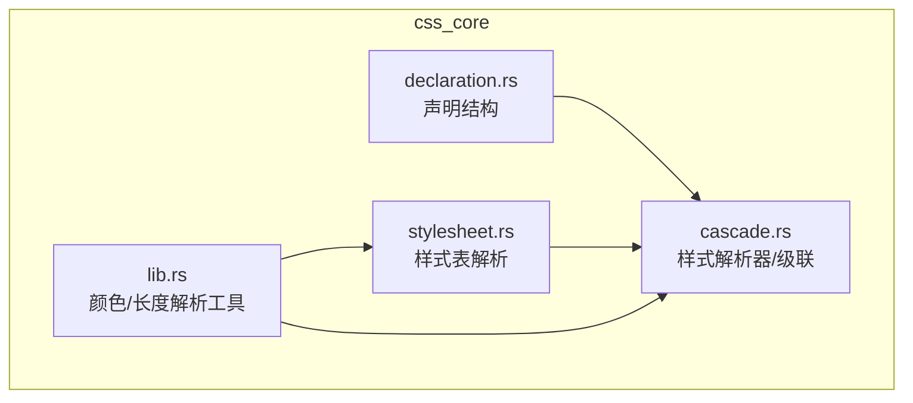
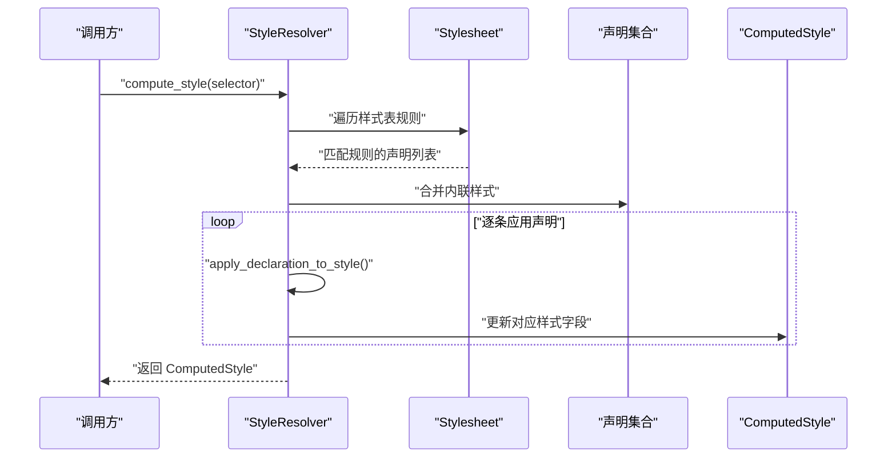
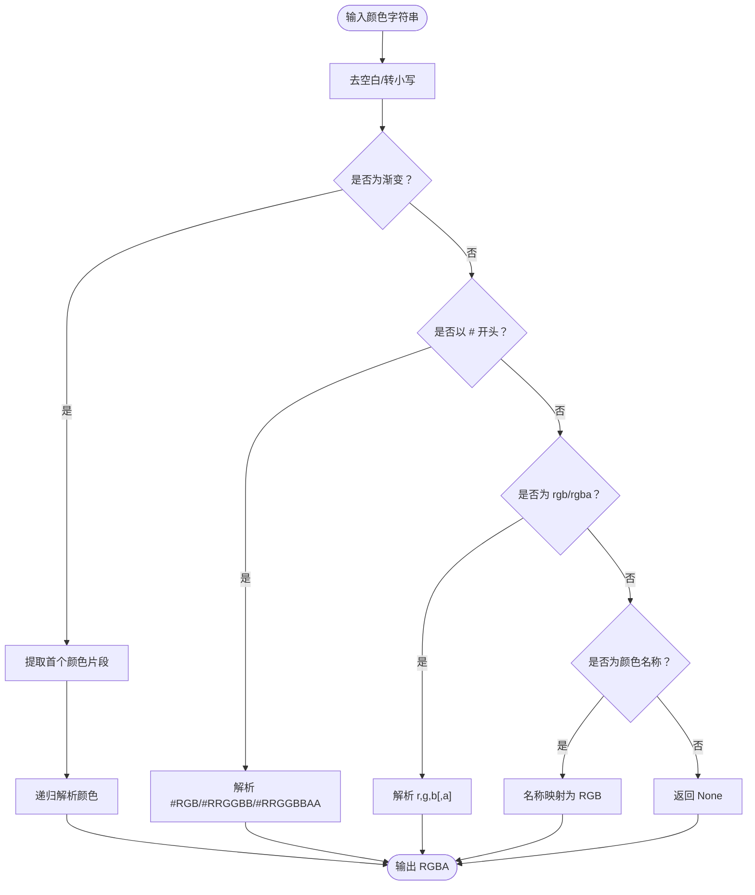
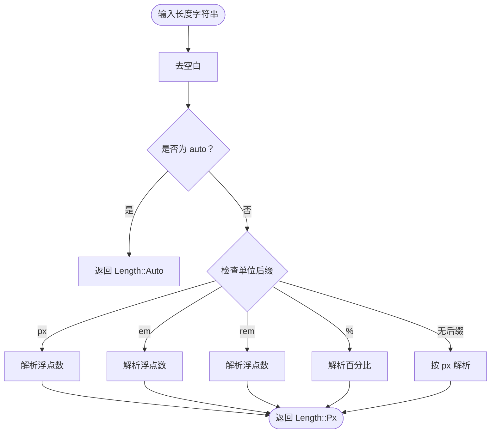
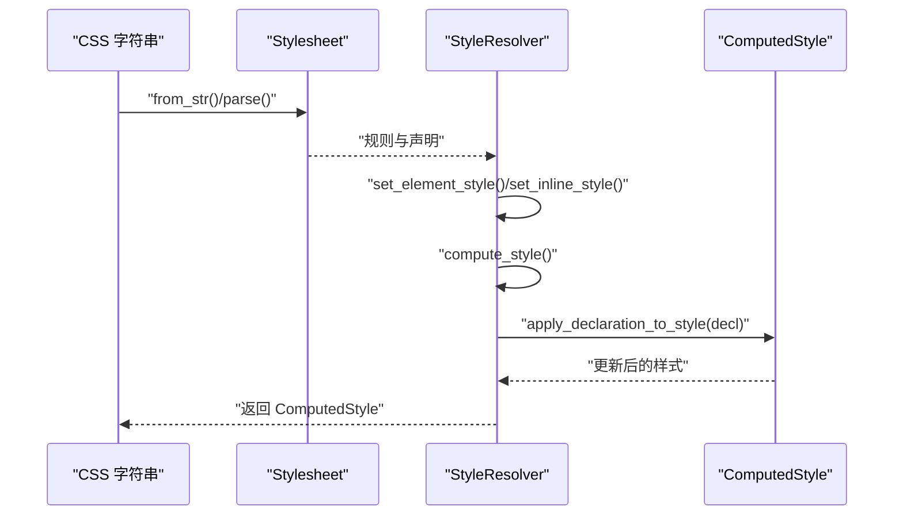
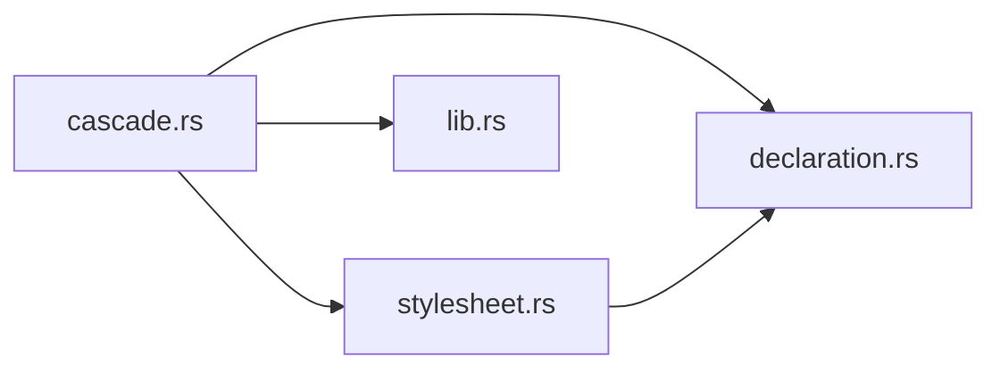

# 声明处理

<cite>
**本文引用的文件**
- [declaration.rs](file://components/css_core/declaration.rs)
- [lib.rs](file://components/css_core/lib.rs)
- [stylesheet.rs](file://components/css_core/stylesheet.rs)
- [cascade.rs](file://components/css_core/cascade.rs)
- [lib.rs（桥接层）](file://bridge/lib.rs)
- [bridge.rs](file://bridge/bridge.rs)
- [real_impl.rs](file://bridge/real_impl.rs)
- [Cargo.toml](file://Cargo.toml)
- [README.md](file://README.md)
</cite>

## 目录
1. [简介](#简介)
2. [项目结构](#项目结构)
3. [核心组件](#核心组件)
4. [架构总览](#架构总览)
5. [详细组件分析](#详细组件分析)
6. [依赖关系分析](#依赖关系分析)
7. [性能考量](#性能考量)
8. [故障排查指南](#故障排查指南)
9. [结论](#结论)
10. [附录](#附录)

## 简介
本文件聚焦于 Servo-Zero 中“CSS 声明处理”子系统，系统性阐述以下主题：
- Declaration 结构的设计与职责
- 属性值解析机制：颜色、长度、字体、边框等
- 属性值的验证、标准化与默认值处理
- 声明的继承规则与特殊属性处理
- 从 CSS 声明字符串到内部属性对象的完整转换流程
- 错误处理与兼容性注意事项

该模块位于 css_core 子系统中，提供独立的 CSS 解析、级联与样式计算能力，不依赖 SpiderMonkey。

## 项目结构
css_core 子系统由四个关键模块组成：
- declaration.rs：声明数据结构与构造
- stylesheet.rs：样式表解析与规则组织
- cascade.rs：样式解析器、级联与计算样式
- lib.rs：公共工具函数（颜色解析、长度解析等）

图表来源
- [declaration.rs:1-18](file://components/css_core/declaration.rs#L1-L18)
- [stylesheet.rs:1-210](file://components/css_core/stylesheet.rs#L1-L210)
- [cascade.rs:1-271](file://components/css_core/cascade.rs#L1-L271)
- [lib.rs:1-207](file://components/css_core/lib.rs#L1-L207)

章节来源
- [declaration.rs:1-18](file://components/css_core/declaration.rs#L1-L18)
- [stylesheet.rs:1-210](file://components/css_core/stylesheet.rs#L1-L210)
- [cascade.rs:1-271](file://components/css_core/cascade.rs#L1-L271)
- [lib.rs:1-207](file://components/css_core/lib.rs#L1-L207)

## 核心组件
- Declaration：最小的 CSS 声明单元，包含属性名与属性值两个字段，提供构造函数用于从字符串创建。
- Stylesheet：负责从 CSS 文本解析出规则（选择器 + 声明列表），并维护选择器索引以便快速查找。
- StyleResolver：负责收集来自样式表与内联样式的声明，按选择器匹配后应用到 ComputedStyle；支持多选择器、ID/类/标签选择器与通配符匹配。
- ComputedStyle：最终的样式结果容器，包含背景色、文本色、尺寸、定位、内外边距、边框、字体族/大小/粗细、对齐等属性，以及一个通用键值存储用于未识别属性。
- lib.rs：提供颜色解析（名称、十六进制、rgb/rgba、渐变首色）、长度解析（px/em/rem/%/auto）与单位换算（to_px）。

章节来源
- [declaration.rs:1-18](file://components/css_core/declaration.rs#L1-L18)
- [stylesheet.rs:6-210](file://components/css_core/stylesheet.rs#L6-L210)
- [cascade.rs:8-84](file://components/css_core/cascade.rs#L8-L84)
- [lib.rs:13-207](file://components/css_core/lib.rs#L13-L207)

## 架构总览
CSS 声明处理的整体流程如下：
- 输入：CSS 字符串或内联样式
- 解析：Stylesheet 将 CSS 文本拆分为规则与声明
- 匹配：StyleResolver 使用选择器匹配规则
- 应用：逐条应用声明到 ComputedStyle
- 输出：最终样式对象

图表来源
- [cascade.rs:128-154](file://components/css_core/cascade.rs#L128-L154)
- [stylesheet.rs:36-106](file://components/css_core/stylesheet.rs#L36-L106)
- [cascade.rs:200-257](file://components/css_core/cascade.rs#L200-L257)

## 详细组件分析

### Declaration 结构设计
- 字段
  - property: String，属性名（如 "color"、"width"）
  - value: String，属性值（如 "#fff"、"16px"）
- 行为
  - new(property, value)：构造函数，复制字符串到内部存储
- 设计要点
  - 保持声明的原始字符串形式，便于后续按属性类型进行解析与标准化
  - 采用 Clone 实现，便于在级联过程中多次传递与组合

章节来源
- [declaration.rs:4-17](file://components/css_core/declaration.rs#L4-L17)

### 样式表解析（Stylesheet）
- 功能
  - 从 CSS 文本解析出规则（selector → declarations）
  - 支持注释跳过、声明块解析、分号分割
  - 维护 selector → 规则索引，加速查询
- 关键流程
  - 解析选择器块边界（{ ... }）
  - 解析声明块中的每个属性: 值; 形式
  - 构造 CssRule 并加入 rules 列表
- 查询接口
  - get_rules_for(selector)：根据选择器快速定位规则
  - all_rules()：返回全部规则

章节来源
- [stylesheet.rs:29-106](file://components/css_core/stylesheet.rs#L29-L106)
- [stylesheet.rs:109-176](file://components/css_core/stylesheet.rs#L109-L176)
- [stylesheet.rs:191-202](file://components/css_core/stylesheet.rs#L191-L202)

### 样式解析器与级联（StyleResolver）
- 功能
  - 管理多个样式表与内联样式
  - 选择器匹配与声明收集
  - 将声明应用到 ComputedStyle
- 选择器匹配策略
  - 精确匹配、通配符 "*"、ID 选择器（#id）、类选择器（.class）、标签选择器（tag）
  - 多选择器逗号分隔
- 声明应用规则
  - 对已知属性进行类型化赋值（颜色、数字、字符串）
  - 其他属性存入通用映射（other）
- 内联样式优先级
  - 在最终阶段追加到声明列表，确保内联样式优先级最高

章节来源
- [cascade.rs:86-98](file://components/css_core/cascade.rs#L86-L98)
- [cascade.rs:128-154](file://components/css_core/cascade.rs#L128-L154)
- [cascade.rs:156-198](file://components/css_core/cascade.rs#L156-L198)
- [cascade.rs:200-257](file://components/css_core/cascade.rs#L200-L257)

### 计算样式（ComputedStyle）
- 字段概览
  - 颜色：background_color、color
  - 尺寸：width、height
  - 定位：display、position、left/right/top/bottom
  - 边距：margin_top/bottom/left/right
  - 内边距：padding_top/bottom/left/right
  - 边框：border_width（f32）、border_color
  - 字体：font_size、font_weight、font_family、text_align
  - 其他：other（HashMap<String, String>）
- 默认行为
  - 默认构造器初始化为空值
  - 提供 background() 与 foreground() 快捷访问

章节来源
- [cascade.rs:8-36](file://components/css_core/cascade.rs#L8-L36)
- [cascade.rs:44-84](file://components/css_core/cascade.rs#L44-L84)

### 颜色解析（lib.rs）
- 支持格式
  - 名称：如 "red"、"transparent"、"currentcolor"
  - 十六进制：#RGB、#RRGGBB、#RRGGBBAA
  - 函数：rgb()、rgba()，支持百分比与小数
  - 渐变：linear-gradient(...)、radial-gradient(...)，提取首个颜色
- 解析流程
  - 去除空白与转小写
  - 识别格式并分支解析
  - rgb/rgba 分量解析：支持 px、%、0~1 或 0~255 的混合
  - alpha 解析：支持 % 与小数
- 返回值
  - 成功时返回 RGBA(u8, u8, u8, u8)，失败返回 None

图表来源
- [lib.rs:43-102](file://components/css_core/lib.rs#L43-L102)
- [lib.rs:104-127](file://components/css_core/lib.rs#L104-L127)
- [lib.rs:129-157](file://components/css_core/lib.rs#L129-L157)

章节来源
- [lib.rs:13-41](file://components/css_core/lib.rs#L13-L41)
- [lib.rs:43-102](file://components/css_core/lib.rs#L43-L102)
- [lib.rs:104-157](file://components/css_core/lib.rs#L104-L157)

### 长度解析与单位换算（lib.rs）
- 支持单位
  - px、em、rem、%、auto
- 解析流程
  - trim 后判断关键字或后缀
  - 数字解析失败则返回 None
- 单位换算
  - to_px(self, parent_value, font_size)：将 em/rem/%/px 统一换算为 px
  - 注意：auto 换算为 0.0

图表来源
- [lib.rs:159-206](file://components/css_core/lib.rs#L159-L206)

章节来源
- [lib.rs:159-206](file://components/css_core/lib.rs#L159-L206)

### 声明应用与属性类型处理
- 已知属性映射
  - 颜色类：background、background-color、color、border-color
  - 尺寸类：width、height、left、right、top、bottom
  - 定位类：display、position
  - 边距/内边距：margin、margin-top/bottom/left/right、padding、padding-top/bottom/left/right
  - 边框：border、border-width、border-color
  - 字体类：font-size、font-weight、font-family、text-align
- 未知属性
  - 存入 ComputedStyle.other 映射，保留原样
- 特殊处理
  - border-width：尝试解析为 f32，失败则忽略
  - border：匹配 "border" 时也设置宽度（简化处理）
  - currentcolor：在颜色映射中作为特殊名称处理

章节来源
- [cascade.rs:200-257](file://components/css_core/cascade.rs#L200-L257)
- [lib.rs:14-41](file://components/css_core/lib.rs#L14-L41)

### 声明解析完整示例（从字符串到内部对象）
以下示例展示如何将一段 CSS 声明字符串转换为内部属性对象，并最终得到计算样式。

步骤
- 解析 CSS 文本为样式表
  - 通过 Stylesheet::from_str 或 Stylesheet::parse
  - 生成 CssRule（selector → declarations）
- 收集声明
  - 遍历匹配规则，收集 declarations
  - 追加内联样式（优先级最高）
- 应用声明
  - 对每条 Declaration，调用 apply_declaration_to_style
  - 颜色属性使用 parse_color 解析
  - 数值属性尝试解析为 f32（如 border-width）
  - 其他属性保存到 other
- 得到 ComputedStyle
  - 包含已识别属性与未识别属性的集合

图表来源
- [stylesheet.rs:29-106](file://components/css_core/stylesheet.rs#L29-L106)
- [cascade.rs:105-126](file://components/css_core/cascade.rs#L105-L126)
- [cascade.rs:128-154](file://components/css_core/cascade.rs#L128-L154)
- [cascade.rs:200-257](file://components/css_core/cascade.rs#L200-L257)

章节来源
- [stylesheet.rs:29-106](file://components/css_core/stylesheet.rs#L29-L106)
- [cascade.rs:105-126](file://components/css_core/cascade.rs#L105-L126)
- [cascade.rs:128-154](file://components/css_core/cascade.rs#L128-L154)
- [cascade.rs:200-257](file://components/css_core/cascade.rs#L200-L257)

## 依赖关系分析
- 模块间耦合
  - cascade.rs 依赖 declaration.rs（使用 Declaration）、stylesheet.rs（使用 Stylesheet）、lib.rs（使用 parse_color、Length）
  - stylesheet.rs 依赖 declaration.rs（创建 Declaration）
  - lib.rs 为工具模块，被 cascade.rs 与 stylesheet.rs 引用
- 外部依赖
  - 项目使用 taffy 作为布局引擎，与声明处理模块解耦
  - tiny-skia 用于渲染，与声明处理模块解耦
- 可能的循环依赖
  - 当前模块间无循环导入，结构清晰

图表来源
- [cascade.rs:3-6](file://components/css_core/cascade.rs#L3-L6)
- [stylesheet.rs:3-4](file://components/css_core/stylesheet.rs#L3-L4)
- [lib.rs:9-11](file://components/css_core/lib.rs#L9-L11)

章节来源
- [cascade.rs:3-6](file://components/css_core/cascade.rs#L3-L6)
- [stylesheet.rs:3-4](file://components/css_core/stylesheet.rs#L3-L4)
- [lib.rs:9-11](file://components/css_core/lib.rs#L9-L11)

## 性能考量
- 解析复杂度
  - 样式表解析：O(n) 遍历 CSS 文本，按块与分号切分
  - 选择器匹配：当前实现为线性扫描，复杂度 O(R)（R 为规则数）
  - 声明应用：O(D)（D 为声明数）
- 优化建议
  - 为选择器建立更高效的索引（如前缀树、哈希表）
  - 缓存 parse_color 与 Length::parse 的结果
  - 对 ComputedStyle 的字段进行懒计算或增量更新
- 内存占用
  - ComputedStyle 使用 HashMap 存储未识别属性，注意键数量控制
  - Declaration 保存原始字符串，避免重复拷贝

[本节为一般性指导，无需特定文件来源]

## 故障排查指南
- 常见问题
  - 颜色解析失败：检查格式是否为名称、#RGB/#RRGGBB/#RRGGBBAA、rgb()/rgba() 或渐变
  - 长度解析失败：确认单位是否为 px/em/rem/%/auto，数值是否可解析
  - 边框宽度解析失败：确认值是否为合法数字
  - 选择器不匹配：检查是否使用了精确匹配、通配符、ID/类/标签选择器
- 排查步骤
  - 打印中间结果：Declaration.property/value、parse_color/Length::parse 的返回值
  - 检查 Stylesheet::parse 是否正确切分声明块
  - 验证 StyleResolver::selector_matches 的匹配逻辑
- 兼容性
  - currentcolor 在颜色映射中作为特殊名称处理
  - 渐变首色提取仅取首个颜色片段，可能与标准不完全一致
  - 百分比与小数在 rgb/rgba 分量解析中均有支持，但需注意范围

章节来源
- [lib.rs:14-41](file://components/css_core/lib.rs#L14-L41)
- [lib.rs:43-102](file://components/css_core/lib.rs#L43-L102)
- [lib.rs:159-206](file://components/css_core/lib.rs#L159-L206)
- [stylesheet.rs:36-106](file://components/css_core/stylesheet.rs#L36-L106)
- [cascade.rs:156-198](file://components/css_core/cascade.rs#L156-L198)

## 结论
本模块提供了完整的 CSS 声明处理能力：从样式表解析、选择器匹配到声明应用与计算样式生成。颜色与长度解析覆盖主流格式，声明应用遵循优先级与类型化处理。未来可在选择器索引、缓存与增量更新方面进一步优化性能。

[本节为总结性内容，无需特定文件来源]

## 附录

### API 一览（路径）
- 声明结构
  - [Declaration::new:11-16](file://components/css_core/declaration.rs#L11-L16)
- 样式表
  - [Stylesheet::from_str:29-34](file://components/css_core/stylesheet.rs#L29-L34)
  - [Stylesheet::parse:36-106](file://components/css_core/stylesheet.rs#L36-L106)
  - [Stylesheet::add_rule:178-189](file://components/css_core/stylesheet.rs#L178-L189)
  - [Stylesheet::get_rules_for:191-197](file://components/css_core/stylesheet.rs#L191-L197)
- 样式解析器
  - [StyleResolver::new:92-98](file://components/css_core/cascade.rs#L92-L98)
  - [StyleResolver::add_stylesheet:100-103](file://components/css_core/cascade.rs#L100-L103)
  - [StyleResolver::add_css:105-109](file://components/css_core/cascade.rs#L105-L109)
  - [StyleResolver::set_inline_style:111-114](file://components/css_core/cascade.rs#L111-L114)
  - [StyleResolver::set_element_style:116-126](file://components/css_core/cascade.rs#L116-L126)
  - [StyleResolver::compute_style:128-154](file://components/css_core/cascade.rs#L128-L154)
  - [StyleResolver::clear:259-263](file://components/css_core/cascade.rs#L259-L263)
- 计算样式
  - [ComputedStyle::new:44-73](file://components/css_core/cascade.rs#L44-L73)
  - [ComputedStyle::background:75-78](file://components/css_core/cascade.rs#L75-L78)
  - [ComputedStyle::foreground:80-83](file://components/css_core/cascade.rs#L80-L83)
- 工具函数
  - [color_from_name:13-41](file://components/css_core/lib.rs#L13-L41)
  - [parse_color:43-102](file://components/css_core/lib.rs#L43-L102)
  - [Length::parse:169-194](file://components/css_core/lib.rs#L169-L194)
  - [Length::to_px:196-206](file://components/css_core/lib.rs#L196-L206)

### 项目与生态
- 工作区配置
  - [Cargo.toml:1-37](file://Cargo.toml#L1-L37)
- 项目说明
  - [README.md:1-183](file://README.md#L1-L183)