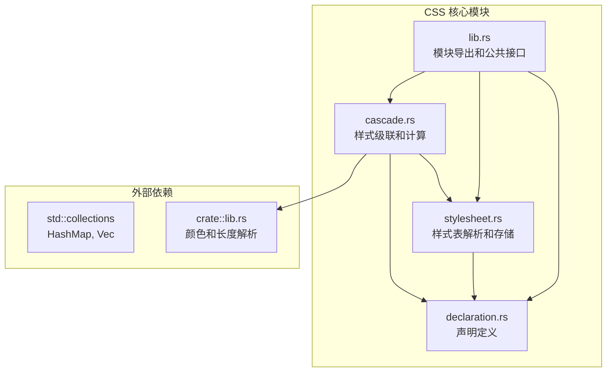
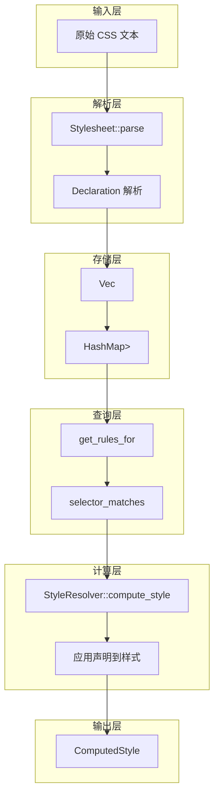
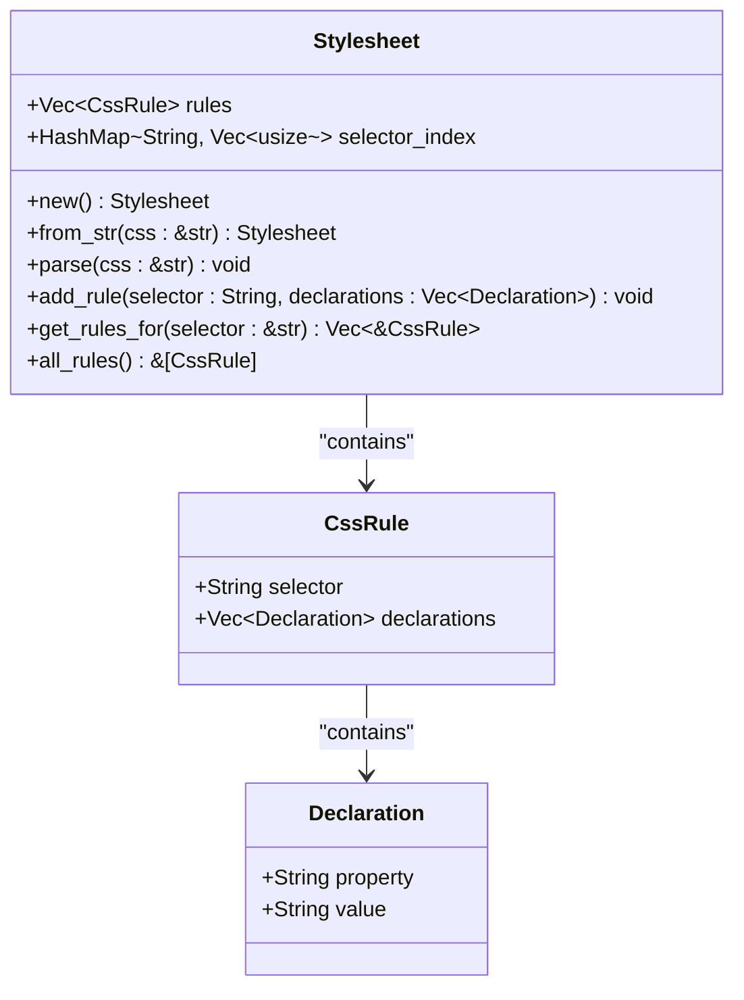
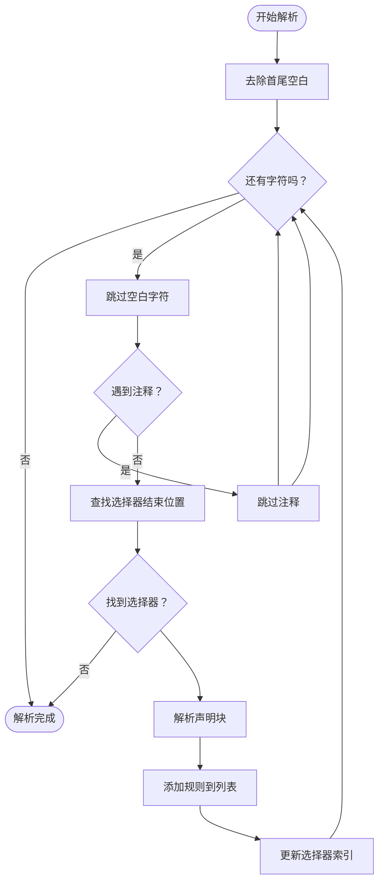
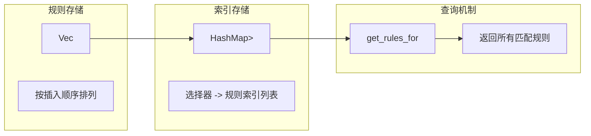
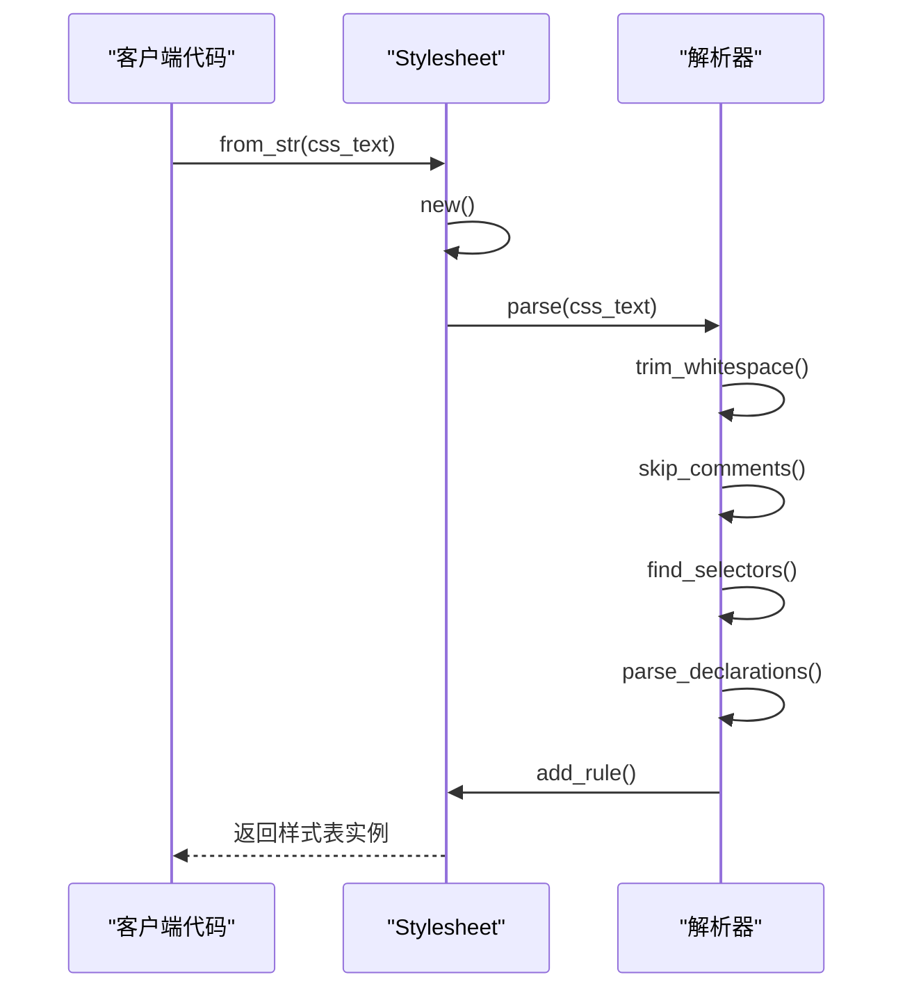
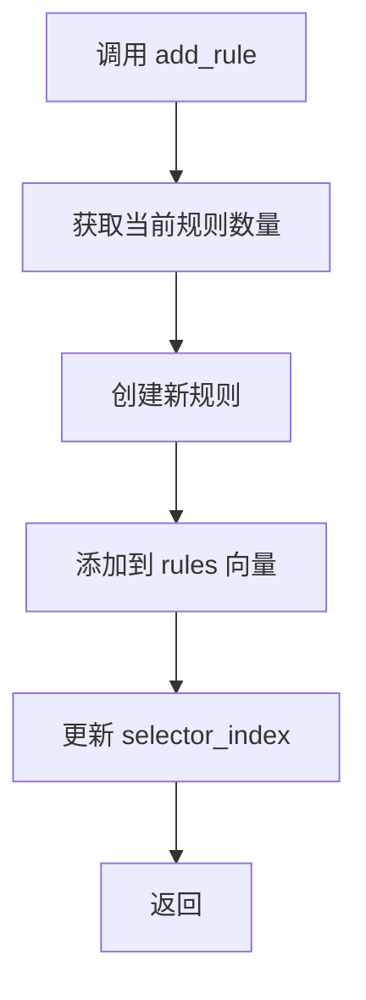
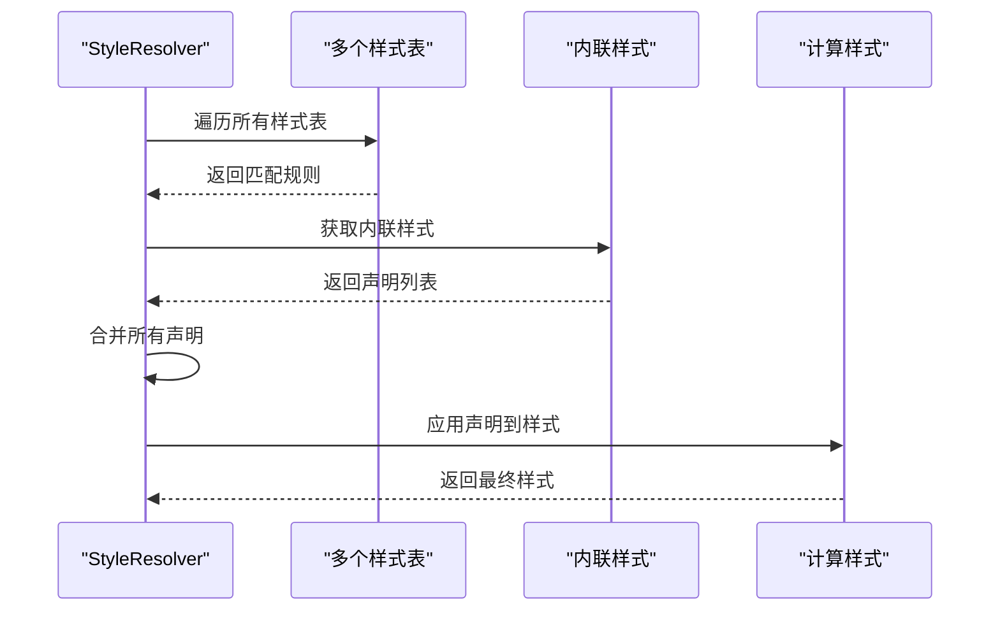
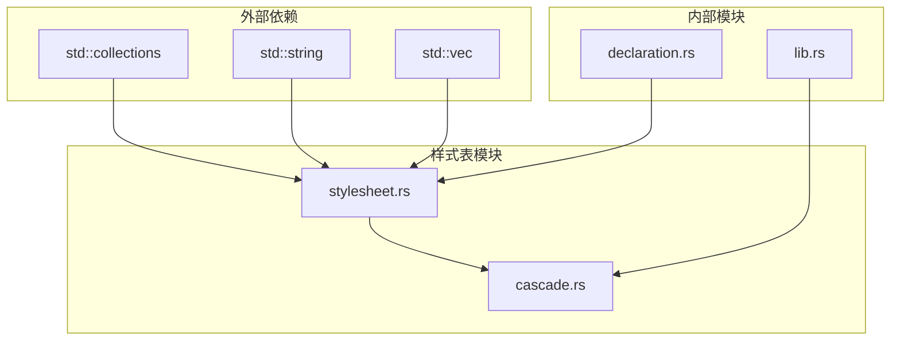

# 样式表解析

<cite>
**本文档引用的文件**
- [stylesheet.rs](file://components/css_core/stylesheet.rs)
- [lib.rs](file://components/css_core/lib.rs)
- [cascade.rs](file://components/css_core/cascade.rs)
- [declaration.rs](file://components/css_core/declaration.rs)
- [Cargo.toml](file://Cargo.toml)
- [README.md](file://README.md)
</cite>

## 目录
1. [简介](#简介)
2. [项目结构](#项目结构)
3. [核心组件](#核心组件)
4. [架构概览](#架构概览)
5. [详细组件分析](#详细组件分析)
6. [依赖关系分析](#依赖关系分析)
7. [性能考虑](#性能考虑)
8. [故障排除指南](#故障排除指南)
9. [结论](#结论)

## 简介

样式表解析模块是 Servo-Zero 浏览器渲染引擎的核心组件之一，负责将原始 CSS 文本解析为内部数据结构，并提供样式表的存储、索引和查询机制。该模块实现了完整的 CSS 规则解析、选择器匹配和样式计算功能，为整个渲染引擎提供基础的样式支持。

Servo-Zero 是一个基于 Servo 的轻量级 Web-Native 浏览器渲染引擎，完全用 Rust 实现，不依赖 SpiderMonkey JavaScript 引擎。该样式表解析模块作为独立的 CSS 核心模块，提供了纯 Rust 实现的 CSS 解析、级联和样式计算功能。

## 项目结构

样式表解析模块位于 `components/css_core/` 目录下，采用模块化设计，包含以下核心文件：



**图表来源**
- [lib.rs:1-207](file://components/css_core/lib.rs#L1-L207)
- [stylesheet.rs:1-210](file://components/css_core/stylesheet.rs#L1-L210)
- [cascade.rs:1-271](file://components/css_core/cascade.rs#L1-L271)
- [declaration.rs:1-18](file://components/css_core/declaration.rs#L1-L18)

**章节来源**
- [Cargo.toml:1-37](file://Cargo.toml#L1-L37)
- [README.md:157-183](file://README.md#L157-L183)

## 核心组件

样式表解析模块由四个主要组件构成，每个组件都有明确的职责分工：

### 数据结构设计

模块的核心数据结构包括：

1. **Declaration（声明）**：表示单个 CSS 属性-值对
2. **CssRule（CSS 规则）**：包含选择器和声明列表
3. **Stylesheet（样式表）**：存储和管理 CSS 规则及其索引
4. **ComputedStyle（计算样式）**：最终的样式结果

这些组件通过组合关系紧密协作，形成完整的样式处理管道。

**章节来源**
- [declaration.rs:1-18](file://components/css_core/declaration.rs#L1-L18)
- [stylesheet.rs:6-210](file://components/css_core/stylesheet.rs#L6-L210)
- [cascade.rs:8-84](file://components/css_core/cascade.rs#L8-L84)

## 架构概览

样式表解析模块采用分层架构设计，从底层的数据结构到高层的样式计算形成了清晰的抽象层次：



**图表来源**
- [stylesheet.rs:29-107](file://components/css_core/stylesheet.rs#L29-L107)
- [stylesheet.rs:191-202](file://components/css_core/stylesheet.rs#L191-L202)
- [cascade.rs:128-154](file://components/css_core/cascade.rs#L128-L154)

## 详细组件分析

### Stylesheet 结构分析

Stylesheet 是样式表解析模块的核心数据结构，负责存储和管理 CSS 规则：

#### 数据结构设计



**图表来源**
- [stylesheet.rs:14-18](file://components/css_core/stylesheet.rs#L14-L18)
- [stylesheet.rs:7-11](file://components/css_core/stylesheet.rs#L7-L11)
- [declaration.rs:4-8](file://components/css_core/declaration.rs#L4-L8)

#### 解析算法实现

Stylesheet::parse 方法实现了完整的 CSS 解析算法：



**图表来源**
- [stylesheet.rs:37-107](file://components/css_core/stylesheet.rs#L37-L107)

#### 存储和索引机制

样式表采用了双重存储策略：

1. **顺序存储**：使用 Vec<CssRule> 保持规则的插入顺序
2. **索引存储**：使用 HashMap<String, Vec<usize>> 为每个选择器维护索引列表

这种设计提供了 O(1) 的选择器查询能力和 O(n) 的遍历能力。

**章节来源**
- [stylesheet.rs:14-27](file://components/css_core/stylesheet.rs#L14-L27)
- [stylesheet.rs:191-202](file://components/css_core/stylesheet.rs#L191-L202)

### CSS 规则分类和组织

当前实现支持基本的 CSS 规则类型，但未实现完整的 CSS 规则分类：

#### 支持的规则类型

1. **规则集（Rule Sets）**：标准的 CSS 选择器规则
2. **媒体查询（Media Queries）**：未在当前实现中支持
3. **关键帧（Keyframes）**：未在当前实现中支持

#### 组织方式

CSS 规则按照以下方式进行组织：



**图表来源**
- [stylesheet.rs:17-18](file://components/css_core/stylesheet.rs#L17-L18)
- [stylesheet.rs:102-105](file://components/css_core/stylesheet.rs#L102-L105)

**章节来源**
- [stylesheet.rs:191-202](file://components/css_core/stylesheet.rs#L191-L202)

### 样式表加载流程

样式表加载流程提供了多种加载方式：

#### 从字符串加载



**图表来源**
- [stylesheet.rs:29-34](file://components/css_core/stylesheet.rs#L29-L34)
- [stylesheet.rs:37-107](file://components/css_core/stylesheet.rs#L37-L107)

#### 动态添加规则

样式表支持运行时动态添加规则：



**图表来源**
- [stylesheet.rs:178-189](file://components/css_core/stylesheet.rs#L178-L189)

**章节来源**
- [stylesheet.rs:29-34](file://components/css_core/stylesheet.rs#L29-L34)
- [stylesheet.rs:178-189](file://components/css_core/stylesheet.rs#L178-L189)

### 样式计算和级联

StyleResolver 负责样式表的级联计算和样式应用：

#### 计算流程



**图表来源**
- [cascade.rs:128-154](file://components/css_core/cascade.rs#L128-L154)

#### 选择器匹配算法

StyleResolver 实现了多种选择器类型的匹配：

```mermaid
flowchart TD
A[selector_matches] --> B{选择器类型}
B --> |精确匹配| C[element == rule]
B --> |通配符| D[rule == "*"]
B --> |ID 选择器| E[strip_prefix('#')]
B --> |类选择器| F[strip_prefix('.')]
B --> |标签选择器| G[检查前缀]
B --> |多选择器| H[split(',')]
E --> I[element 包含 ID]
F --> J[element 包含类名]
G --> K[element 以标签开头]
H --> L[任一匹配为真]
```

**图表来源**
- [cascade.rs:156-198](file://components/css_core/cascade.rs#L156-L198)

**章节来源**
- [cascade.rs:86-90](file://components/css_core/cascade.rs#L86-L90)
- [cascade.rs:128-154](file://components/css_core/cascade.rs#L128-L154)
- [cascade.rs:156-198](file://components/css_core/cascade.rs#L156-L198)

### 内存管理策略

样式表解析模块采用了高效的内存管理策略：

#### 数据结构优化

1. **零拷贝字符串处理**：使用 String 类型进行所有权转移
2. **向量预分配**：根据规则数量预估内存需求
3. **哈希表优化**：使用 HashMap 进行快速查找

#### 内存使用模式

```mermaid
graph TB
subgraph "内存分配"
A[Stylesheet::new]
B[Vec<CssRule>]
C[HashMap<String, Vec<usize>>]
end
subgraph "生命周期管理"
D[规则存储]
E[索引映射]
F[自动释放]
end
subgraph "查询优化"
G[O(1) 索引查找]
H[O(n) 遍历访问]
end
A --> B
A --> C
B --> D
C --> E
D --> F
E --> F
F --> G
F --> H
```

**图表来源**
- [stylesheet.rs:22-27](file://components/css_core/stylesheet.rs#L22-L27)
- [stylesheet.rs:17-18](file://components/css_core/stylesheet.rs#L17-L18)

**章节来源**
- [stylesheet.rs:22-27](file://components/css_core/stylesheet.rs#L22-L27)
- [stylesheet.rs:17-18](file://components/css_core/stylesheet.rs#L17-L18)

## 依赖关系分析

样式表解析模块的依赖关系相对简单，主要依赖于标准库和内部模块：



**图表来源**
- [stylesheet.rs:3](file://components/css_core/stylesheet.rs#L3)
- [cascade.rs:3-6](file://components/css_core/cascade.rs#L3-L6)

### 外部依赖

样式表模块仅依赖于 Rust 标准库的集合类型，这确保了模块的独立性和可移植性：

- **HashMap**：用于选择器索引存储
- **Vec**：用于规则列表存储
- **String**：用于字符串处理

### 内部依赖

模块之间存在清晰的依赖关系：

1. **declaration.rs**：提供 Declaration 类型定义
2. **lib.rs**：提供颜色和长度解析功能
3. **stylesheet.rs**：提供样式表解析功能
4. **cascade.rs**：提供样式计算功能

**章节来源**
- [stylesheet.rs:3](file://components/css_core/stylesheet.rs#L3)
- [cascade.rs:3-6](file://components/css_core/cascade.rs#L3-L6)

## 性能考虑

样式表解析模块在设计时充分考虑了性能优化：

### 时间复杂度分析

1. **解析阶段**：O(n)，其中 n 是 CSS 文本长度
2. **查询阶段**：O(k)，其中 k 是匹配规则数量
3. **级联阶段**：O(m)，其中 m 是所有声明数量

### 空间复杂度优化

1. **索引存储**：O(r + s)，其中 r 是规则数量，s 是选择器数量
2. **规则存储**：O(r × d)，其中 d 是平均声明数量

### 性能优化技巧

1. **选择器索引**：通过 HashMap 实现 O(1) 的选择器查找
2. **延迟解析**：仅在需要时解析 CSS 文本
3. **内存复用**：重用已解析的规则和声明
4. **批量操作**：支持批量添加样式表和规则

## 故障排除指南

### 常见问题和解决方案

#### CSS 解析错误

**问题**：CSS 文本解析失败或部分规则丢失

**原因**：
- 语法错误的 CSS 规则
- 注释未正确闭合
- 选择器格式不正确

**解决方案**：
- 检查 CSS 语法完整性
- 确保注释正确闭合
- 验证选择器格式

#### 查询性能问题

**问题**：样式查询响应缓慢

**原因**：
- 选择器索引缺失
- 规则数量过多
- 查询算法效率低

**解决方案**：
- 确保选择器正确索引
- 考虑分页或缓存策略
- 优化查询算法

#### 内存使用过高

**问题**：内存占用超出预期

**原因**：
- 规则重复存储
- 字符串重复分配
- 缓存未清理

**解决方案**：
- 实施规则去重机制
- 使用字符串池减少分配
- 定期清理缓存

**章节来源**
- [stylesheet.rs:37-107](file://components/css_core/stylesheet.rs#L37-L107)
- [stylesheet.rs:191-202](file://components/css_core/stylesheet.rs#L191-L202)

## 结论

样式表解析模块为 Servo-Zero 提供了完整的 CSS 解析和样式计算功能。模块采用模块化设计，具有清晰的职责分离和高效的内存管理策略。

### 主要成就

1. **完整的 CSS 解析**：支持基本的 CSS 规则解析和存储
2. **高效的查询机制**：通过索引实现快速的选择器查询
3. **灵活的样式计算**：支持多种选择器类型和样式级联
4. **良好的性能表现**：优化的时间和空间复杂度

### 未来改进方向

1. **扩展 CSS 规则支持**：添加媒体查询和关键帧支持
2. **增强选择器匹配**：实现更复杂的 CSS 选择器语法
3. **优化内存使用**：实施更激进的内存压缩策略
4. **提升解析性能**：采用更高效的解析算法

该模块为整个 Servo-Zero 渲染引擎奠定了坚实的样式处理基础，为后续的功能扩展提供了良好的架构支撑。