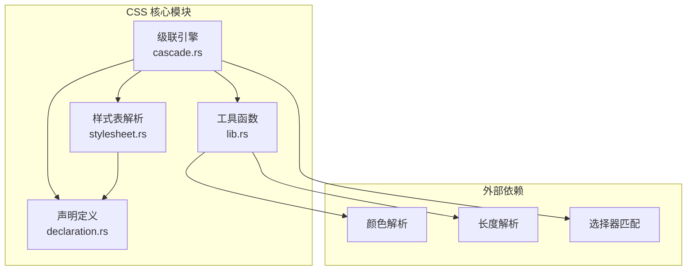
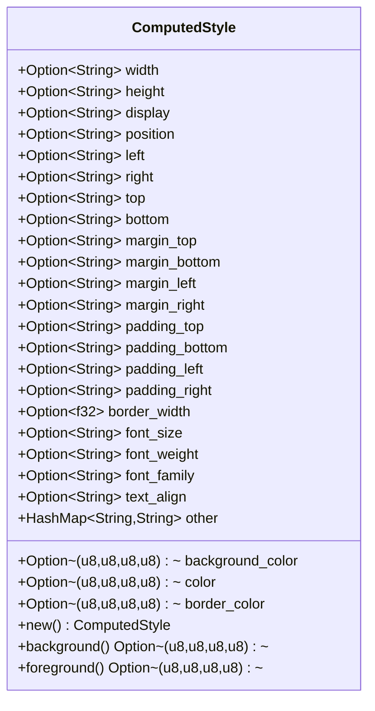
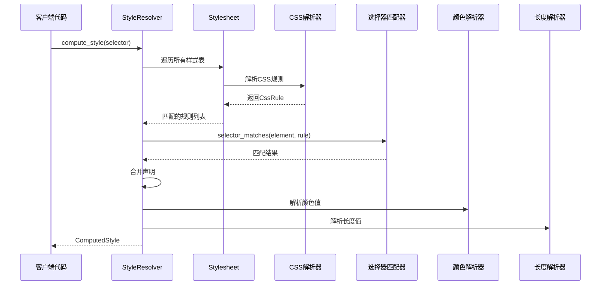
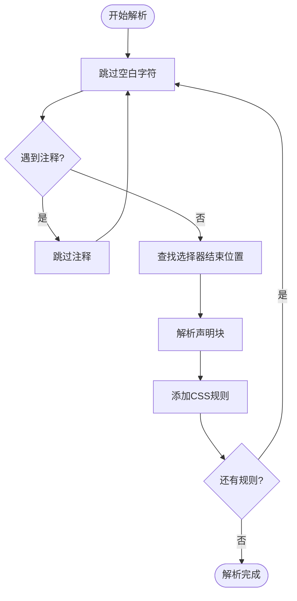
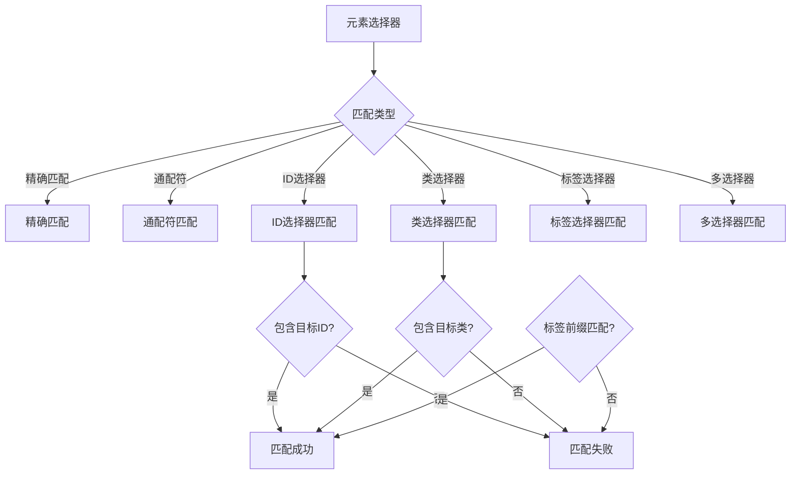
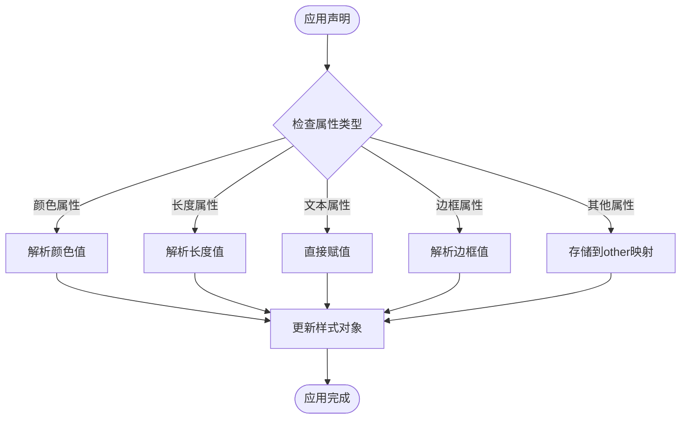
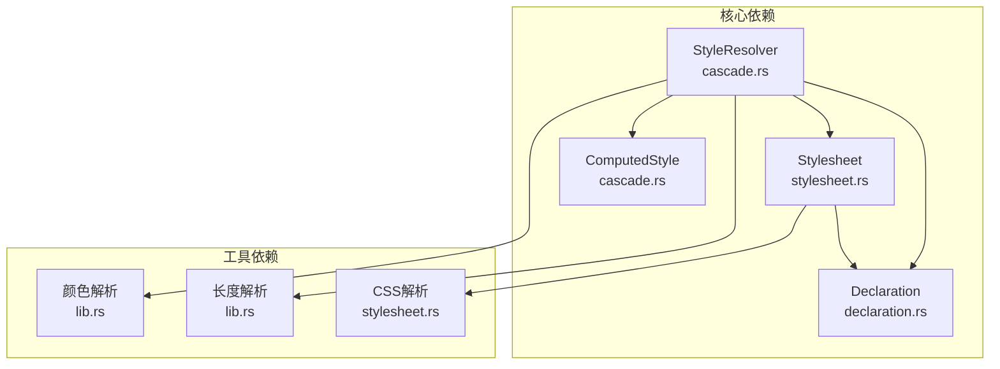

# 级联算法

<cite>
**本文档引用的文件**
- [lib.rs](file://components/css_core/lib.rs)
- [cascade.rs](file://components/css_core/cascade.rs)
- [declaration.rs](file://components/css_core/declaration.rs)
- [stylesheet.rs](file://components/css_core/stylesheet.rs)
- [README.md](file://README.md)
</cite>

## 目录
1. [简介](#简介)
2. [项目结构](#项目结构)
3. [核心组件](#核心组件)
4. [架构概览](#架构概览)
5. [详细组件分析](#详细组件分析)
6. [依赖关系分析](#依赖关系分析)
7. [性能考虑](#性能考虑)
8. [故障排除指南](#故障排除指南)
9. [结论](#结论)

## 简介

Servo-Zero 是一个基于 Servo 的轻量级 Web-Native 浏览器渲染引擎，提供了纯 Rust 实现的 CSS 级联算法。该项目实现了独立的 CSS 解析、级联和样式计算功能，不依赖 SpiderMonkey JavaScript 引擎。

CSS 级联算法是浏览器渲染引擎的核心组件之一，负责将多个来源的 CSS 规则合并为最终的计算样式。在 Servo-Zero 中，这一过程通过 `StyleResolver` 和 `ComputedStyle` 结构体协同完成，实现了完整的级联计算流程。

## 项目结构

Servo-Zero 采用模块化的组件架构，CSS 核心功能位于 `components/css_core/` 目录下：

**图表来源**
- [cascade.rs:1-271](file://components/css_core/cascade.rs#L1-L271)
- [stylesheet.rs:1-210](file://components/css_core/stylesheet.rs#L1-L210)
- [lib.rs:1-207](file://components/css_core/lib.rs#L1-L207)

**章节来源**
- [README.md:157-179](file://README.md#L157-L179)

## 核心组件

### ComputedStyle 结构体

`ComputedStyle` 是级联算法的输出结果，代表元素的最终计算样式。该结构体包含了丰富的 CSS 属性字段，涵盖了布局、外观和文本相关的样式属性。

**图表来源**
- [cascade.rs:8-84](file://components/css_core/cascade.rs#L8-L84)

### StyleResolver 主控制器

`StyleResolver` 是 CSS 级联算法的核心执行器，负责管理样式表、处理内联样式以及执行完整的级联计算流程。

**章节来源**
- [cascade.rs:86-271](file://components/css_core/cascade.rs#L86-L271)

## 架构概览

CSS 级联算法的完整工作流程如下：

**图表来源**
- [cascade.rs:128-154](file://components/css_core/cascade.rs#L128-L154)
- [stylesheet.rs:37-107](file://components/css_core/stylesheet.rs#L37-L107)

## 详细组件分析

### 样式表解析系统

`Stylesheet` 结构体实现了完整的 CSS 文本解析功能，支持多种 CSS 语法特性：

**图表来源**
- [stylesheet.rs:37-107](file://components/css_core/stylesheet.rs#L37-L107)

#### 选择器索引优化

样式表实现了选择器索引机制，通过 `selector_index` 字段加速规则查找：

**章节来源**
- [stylesheet.rs:17-27](file://components/css_core/stylesheet.rs#L17-L27)
- [stylesheet.rs:192-197](file://components/css_core/stylesheet.rs#L192-L197)

### 选择器匹配算法

`StyleResolver` 实现了灵活的选择器匹配逻辑，支持多种 CSS 选择器类型：

**图表来源**
- [cascade.rs:157-198](file://components/css_core/cascade.rs#L157-L198)

#### 选择器优先级处理

当前实现中，内联样式具有最高优先级，这体现了 CSS 优先级规则中的重要原则。内联样式的处理确保了用户样式能够覆盖外部样式表中的规则。

**章节来源**
- [cascade.rs:143-146](file://components/css_core/cascade.rs#L143-L146)

### 声明应用与样式合并

`apply_declaration_to_style` 函数实现了声明到计算样式的转换过程：

**图表来源**
- [cascade.rs:200-257](file://components/css_core/cascade.rs#L200-L257)

#### 颜色解析系统

颜色解析功能支持多种颜色表示格式：
- 十六进制颜色值（#RGB、#RRGGBB、#RRGGBBAA）
- RGB/RGBA 函数调用
- 颜色名称映射
- 渐变色提取（提取第一个颜色）

**章节来源**
- [lib.rs:44-102](file://components/css_core/lib.rs#L44-L102)

### 长度单位解析

长度解析系统支持多种 CSS 长度单位：
- 像素（px）
- 相对单位（em、rem）
- 百分比（%）
- 自动值（auto）

**章节来源**
- [lib.rs:159-207](file://components/css_core/lib.rs#L159-L207)

## 依赖关系分析

CSS 级联算法的组件间依赖关系清晰明确：

**图表来源**
- [cascade.rs:3-7](file://components/css_core/cascade.rs#L3-L7)
- [stylesheet.rs:3-4](file://components/css_core/stylesheet.rs#L3-L4)

### 外部依赖集成

项目集成了多个关键的外部依赖：

| 依赖库 | 功能 | 使用场景 |
|--------|------|----------|
| `rustc-hash` | 快速哈希 | 选择器索引和样式表优化 |
| `taffy` | Flexbox布局算法 | 布局计算 |
| `euclid` | 几何类型 | 布局坐标计算 |
| `rayon` | 并行处理 | 性能优化 |

**章节来源**
- [README.md:144-156](file://README.md#L144-L156)

## 性能考虑

### 缓存策略

当前实现中，主要的性能优化点包括：

1. **选择器索引缓存**：通过 `selector_index` 字段避免重复的规则扫描
2. **样式表缓存**：样式表解析结果在内存中保持，避免重复解析
3. **声明合并优化**：按声明顺序应用，后应用的声明覆盖先前的声明

### 内存使用优化

- 使用 `Option<T>` 类型避免不必要的内存分配
- 字符串值通过引用传递，减少复制开销
- 哈希表用于快速查找和去重

### 并行处理机会

虽然当前实现是单线程的，但以下组件具备并行处理潜力：
- 样式表解析（多个样式表可并行处理）
- 选择器匹配（不同元素可并行匹配）
- 声明应用（独立属性可并行处理）

## 故障排除指南

### 常见问题诊断

1. **样式未生效**
   - 检查选择器是否正确匹配
   - 验证内联样式优先级设置
   - 确认 CSS 语法正确性

2. **颜色解析失败**
   - 检查颜色值格式是否符合支持的格式
   - 验证十六进制颜色值的有效性
   - 确认颜色名称是否在支持列表中

3. **长度解析错误**
   - 验证长度单位是否正确
   - 检查数值格式是否有效
   - 确认相对单位的上下文环境

### 调试建议

- 使用 `compute_style` 方法逐步调试级联过程
- 检查 `all_rules()` 方法返回的规则列表
- 验证 `selector_matches` 方法的匹配结果
- 监控内存使用情况和性能指标

**章节来源**
- [cascade.rs:128-154](file://components/css_core/cascade.rs#L128-L154)

## 结论

Servo-Zero 的 CSS 级联算法实现展现了现代浏览器渲染引擎的核心能力。通过模块化的架构设计和清晰的组件分离，该实现提供了完整的 CSS 级联功能，包括：

1. **完整的级联流程**：从样式表解析到最终样式计算的完整链路
2. **灵活的选择器匹配**：支持多种 CSS 选择器类型的匹配算法
3. **高效的样式合并**：通过内联样式优先级和声明应用实现
4. **强大的工具支持**：颜色和长度解析功能确保样式值的正确处理

该实现为更复杂的 CSS 功能（如特异性计算、来源排序等）奠定了坚实的基础，同时保持了良好的性能和可维护性。未来可以在现有基础上扩展更高级的 CSS 规范支持，同时保持代码的清晰性和效率。