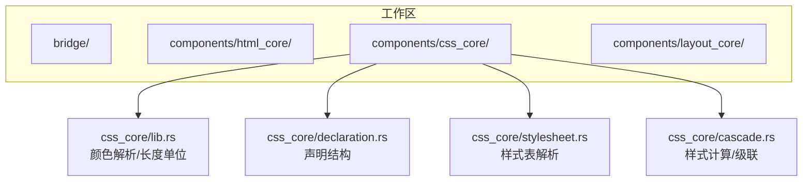
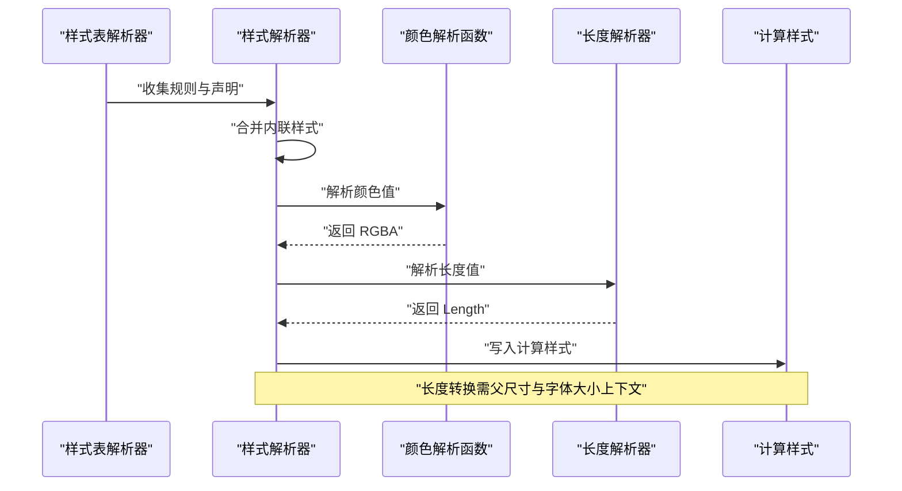
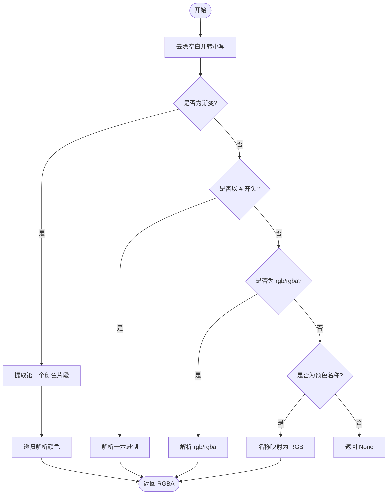
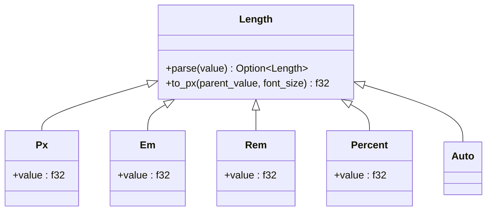
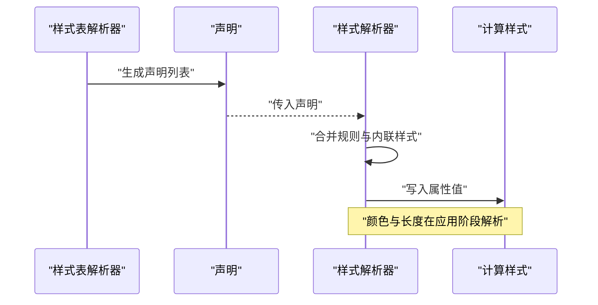
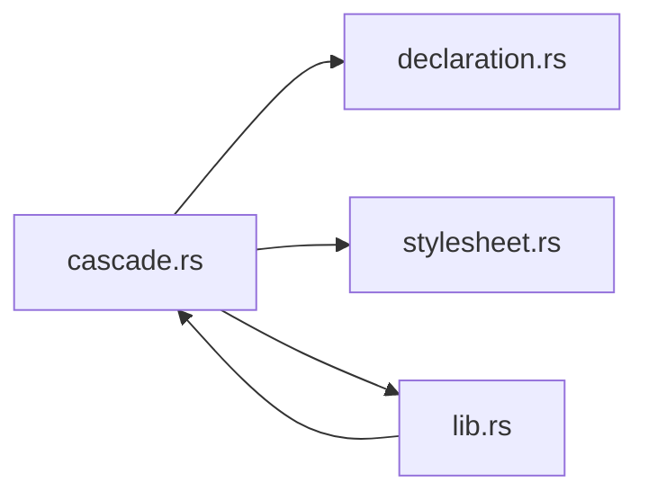

# 颜色和长度工具

<cite>
**本文引用的文件**
- [lib.rs](file://components/css_core/lib.rs)
- [declaration.rs](file://components/css_core/declaration.rs)
- [stylesheet.rs](file://components/css_core/stylesheet.rs)
- [cascade.rs](file://components/css_core/cascade.rs)
- [Cargo.toml](file://Cargo.toml)
- [README.md](file://README.md)
</cite>

## 目录
1. [简介](#简介)
2. [项目结构](#项目结构)
3. [核心组件](#核心组件)
4. [架构总览](#架构总览)
5. [详细组件分析](#详细组件分析)
6. [依赖关系分析](#依赖关系分析)
7. [性能考虑](#性能考虑)
8. [故障排查指南](#故障排查指南)
9. [结论](#结论)
10. [附录](#附录)

## 简介
本文件面向 CSS 颜色与长度处理工具，系统性梳理颜色解析函数与 Length 枚举的设计与实现，覆盖以下要点：
- 颜色解析：颜色名称映射、十六进制解析、RGB/RGBA 解析、渐变处理与首个颜色提取。
- 颜色标准化与透明度计算：分量归一化、alpha 值处理。
- 长度单位：px/em/rem/%/auto 的解析与相互转换，特别是相对单位到绝对像素的转换。
- 实际使用流程：从样式表解析到样式计算再到最终像素值的调用链。
- 边界情况与性能优化建议。

## 项目结构
本仓库采用多 crate 工作区组织，CSS 核心能力集中在 css_core 子模块中，包含样式表解析、声明定义、级联与样式计算等模块。颜色与长度工具位于 css_core 的公共导出接口中，供上层布局与渲染使用。

图表来源
- [Cargo.toml:1-37](file://Cargo.toml#L1-L37)
- [README.md:157-173](file://README.md#L157-L173)

章节来源
- [Cargo.toml:1-37](file://Cargo.toml#L1-L37)
- [README.md:157-173](file://README.md#L157-L173)

## 核心组件
- 颜色解析函数：提供统一入口解析多种颜色格式，并返回 RGBA 元组。
- 长度枚举 Length：封装 px/em/rem/%/auto，支持字符串解析与到像素的转换。
- 声明与样式表：声明结构体与样式表解析器，用于承载与组织 CSS 属性值。
- 样式计算器：将声明应用到目标元素，完成颜色与长度的解析与标准化。

章节来源
- [lib.rs:13-102](file://components/css_core/lib.rs#L13-L102)
- [lib.rs:159-206](file://components/css_core/lib.rs#L159-L206)
- [declaration.rs:1-18](file://components/css_core/declaration.rs#L1-L18)
- [stylesheet.rs:1-210](file://components/css_core/stylesheet.rs#L1-L210)
- [cascade.rs:1-271](file://components/css_core/cascade.rs#L1-L271)

## 架构总览
下图展示了从样式表到样式计算再到最终像素值的关键路径，以及颜色与长度处理在其中的位置。

图表来源
- [stylesheet.rs:30-106](file://components/css_core/stylesheet.rs#L30-L106)
- [cascade.rs:129-257](file://components/css_core/cascade.rs#L129-L257)
- [lib.rs:43-102](file://components/css_core/lib.rs#L43-L102)
- [lib.rs:159-206](file://components/css_core/lib.rs#L159-L206)

## 详细组件分析

### 颜色解析函数
- 支持的输入格式
  - 渐变：线性渐变与径向渐变，自动提取第一个颜色片段。
  - 十六进制：#RGB、#RRGGBB、#RRGGBBAA。
  - rgb()/rgba()：支持百分比与小数两种分量形式；alpha 可为百分比或小数。
  - 名称：常见 CSS 颜色名称映射。
- 解析策略
  - 渐变处理：剥离外层函数名与括号，按逗号分割，跳过方向与角度描述，取首个可解析的颜色。
  - 十六进制：根据长度区分 3/6/8 字段，分别进行双字符扩展或直接解析。
  - rgb()/rgba()：拆分三个主通道与一个可选 alpha，通道分量支持百分比或数值；alpha 支持百分比或数值。
  - 名称映射：统一转小写后匹配预定义集合。
- 标准化与透明度
  - 通道分量统一归一化：百分比按 0–100% 映射到 0–255；小于等于 1 的数值按 0–1 归一后再映射到 0–255。
  - alpha 值：百分比按 0–100% 映射到 0–1；否则按原值使用；最终存储为 0–255 的 u8。
- 边界情况
  - 输入为空、格式不匹配、数值解析失败时返回 None。
  - 渐变中无有效颜色片段时返回 None。
  - 透明色与 currentcolor 名称映射为黑色三元组，alpha 为 0。

图表来源
- [lib.rs:43-102](file://components/css_core/lib.rs#L43-L102)
- [lib.rs:104-127](file://components/css_core/lib.rs#L104-L127)
- [lib.rs:129-157](file://components/css_core/lib.rs#L129-L157)

章节来源
- [lib.rs:13-102](file://components/css_core/lib.rs#L13-L102)
- [lib.rs:104-127](file://components/css_core/lib.rs#L104-L127)
- [lib.rs:129-157](file://components/css_core/lib.rs#L129-L157)

### 长度单位解析与转换
- 支持单位
  - px：像素，绝对单位。
  - em：相对单位，相对于当前元素字体大小。
  - rem：相对单位，相对于根元素字体大小。
  - %：百分比，相对于父元素对应维度。
  - auto：特殊值，转换为 0。
- 解析逻辑
  - 自动识别单位后提取数值；未显式单位时默认按 px 处理。
- 转换到像素
  - to_px(parent_value, font_size)：根据单位类型进行转换。
  - em/rem：乘以 font_size。
  - %：乘以 parent_value 再除以 100。
  - px/auto：px 直接返回，auto 返回 0。

图表来源
- [lib.rs:159-206](file://components/css_core/lib.rs#L159-L206)

章节来源
- [lib.rs:159-206](file://components/css_core/lib.rs#L159-L206)

### 声明与样式表
- 声明结构：包含属性名与值，用于承载 CSS 属性。
- 样式表解析：从 CSS 文本解析出规则与声明块，支持注释与基本语法识别。
- 样式计算：将规则与内联样式合并，应用到目标元素，颜色与长度在此阶段被解析与标准化。

图表来源
- [stylesheet.rs:30-176](file://components/css_core/stylesheet.rs#L30-L176)
- [declaration.rs:1-18](file://components/css_core/declaration.rs#L1-L18)
- [cascade.rs:129-257](file://components/css_core/cascade.rs#L129-L257)

章节来源
- [declaration.rs:1-18](file://components/css_core/declaration.rs#L1-L18)
- [stylesheet.rs:1-210](file://components/css_core/stylesheet.rs#L1-L210)
- [cascade.rs:1-271](file://components/css_core/cascade.rs#L1-L271)

## 依赖关系分析
- 组件耦合
  - cascade.rs 依赖 declaration.rs 与 stylesheet.rs 提供的数据结构。
  - cascade.rs 在应用声明时调用 lib.rs 中的 parse_color 进行颜色解析。
  - lib.rs 作为公共模块，被 cascade.rs 导出使用。
- 外部依赖
  - 工作区依赖包括渲染、几何、并行与布局等库，但颜色与长度解析为纯 Rust 实现，不依赖外部渲染库。

图表来源
- [cascade.rs:1-271](file://components/css_core/cascade.rs#L1-L271)
- [declaration.rs:1-18](file://components/css_core/declaration.rs#L1-L18)
- [stylesheet.rs:1-210](file://components/css_core/stylesheet.rs#L1-L210)
- [lib.rs:1-207](file://components/css_core/lib.rs#L1-L207)

章节来源
- [cascade.rs:1-271](file://components/css_core/cascade.rs#L1-L271)
- [lib.rs:1-207](file://components/css_core/lib.rs#L1-L207)

## 性能考虑
- 颜色解析
  - 使用早期返回与短路逻辑减少不必要的解析步骤。
  - 十六进制解析通过固定长度分支避免循环开销。
  - rgb()/rgba() 分量解析采用一次性拆分与校验，避免重复分配。
- 长度解析
  - 单次字符串扫描与单位识别，复杂度 O(n)。
  - to_px 为常量时间操作，适合在布局阶段频繁调用。
- 建议
  - 对于高频颜色与长度解析场景，可在上层缓存解析结果以降低重复解析成本。
  - 在批量处理样式时，尽量复用解析器实例，减少临时对象分配。

## 故障排查指南
- 颜色解析失败
  - 检查输入格式是否符合预期（如 #RGB/#RRGGBB/#RRGGBBAA、rgb()/rgba()、颜色名称）。
  - 渐变解析仅取第一个颜色片段，若该片段无效会返回 None。
  - 透明色与 currentcolor 名称映射为黑色三元组，alpha 为 0。
- 长度解析失败
  - 确认单位后缀正确（px/em/rem/%），或输入为纯数字（默认 px）。
  - to_px 需要有效的父尺寸与字体大小参数，否则转换结果可能为 0。
- 样式应用异常
  - 检查样式表解析是否正确提取了规则与声明。
  - 确认内联样式优先级高于规则样式。

章节来源
- [lib.rs:43-102](file://components/css_core/lib.rs#L43-L102)
- [lib.rs:159-206](file://components/css_core/lib.rs#L159-L206)
- [stylesheet.rs:30-176](file://components/css_core/stylesheet.rs#L30-L176)
- [cascade.rs:129-257](file://components/css_core/cascade.rs#L129-L257)

## 结论
本实现提供了简洁而健壮的 CSS 颜色与长度处理工具：
- 颜色解析覆盖主流格式与渐变场景，具备良好的容错与标准化能力。
- 长度解析支持 px/em/rem/%/auto，转换逻辑清晰且易于集成到布局阶段。
- 通过模块化设计与清晰的调用链，便于在样式计算与布局过程中高效使用。

## 附录

### 示例：颜色解析流程
- 输入格式
  - 渐变：linear-gradient(to right, red, blue) → 提取第一个颜色片段 red。
  - 十六进制：#f00 → 解析为红色；#00ff00aa → 解析为绿色并带 alpha。
  - rgb/rgba：rgb(255, 0, 0)、rgb(100%, 0, 0)、rgba(255, 0, 0, 0.5)。
  - 名称：red、blue、transparent、currentcolor。
- 输出
  - 统一返回 RGBA 元组，alpha 为 0–255 的整数。

章节来源
- [lib.rs:43-102](file://components/css_core/lib.rs#L43-L102)
- [lib.rs:104-127](file://components/css_core/lib.rs#L104-L127)
- [lib.rs:129-157](file://components/css_core/lib.rs#L129-L157)

### 示例：长度解析与转换
- 输入格式
  - 100px、2em、1.5rem、50%、auto。
- 转换
  - to_px(1000.0, 16.0)：px 直接返回；em/rem 乘以 16；% 乘以 1000 再除以 100；auto 返回 0。

章节来源
- [lib.rs:159-206](file://components/css_core/lib.rs#L159-L206)