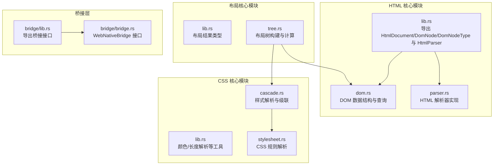
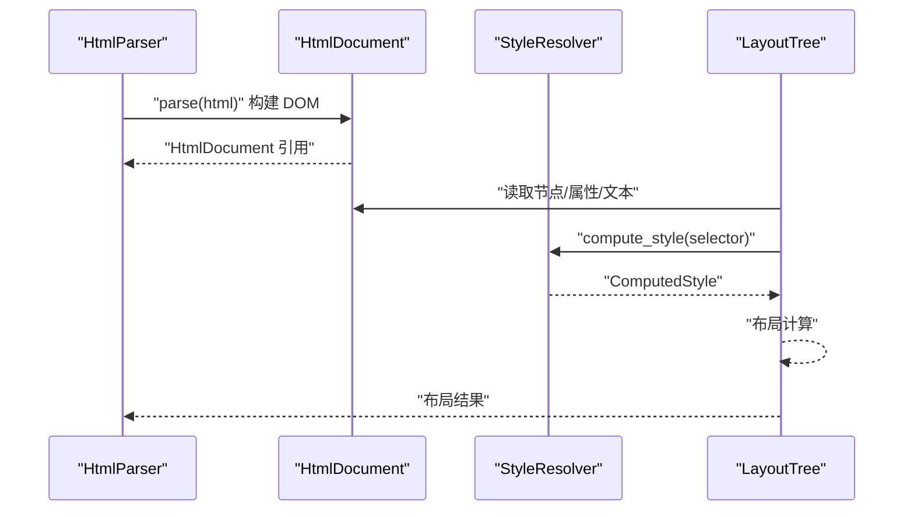
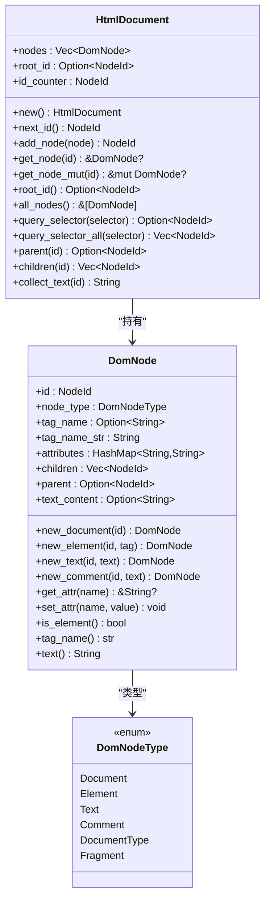
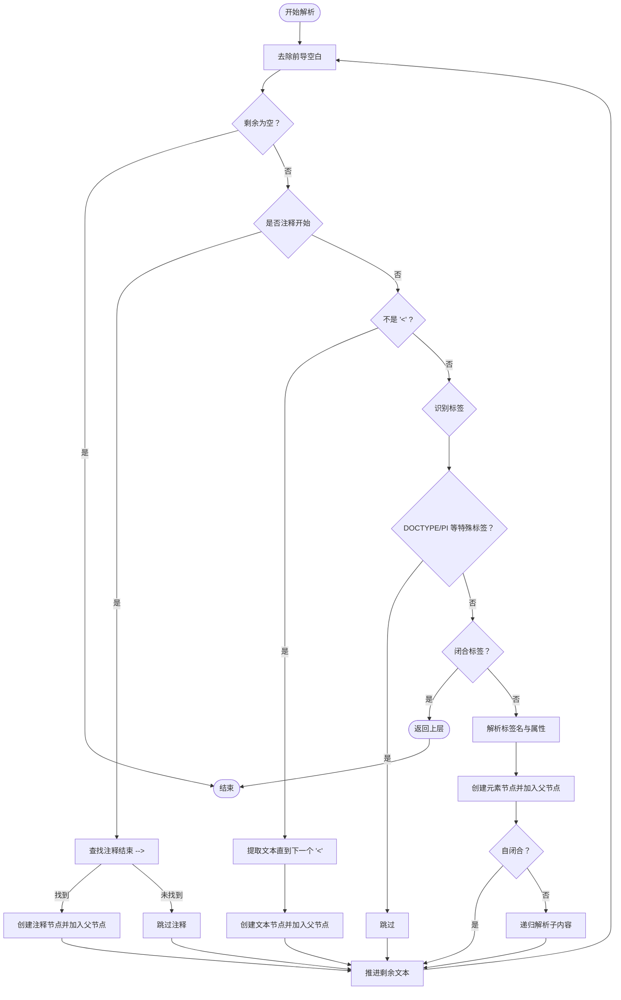
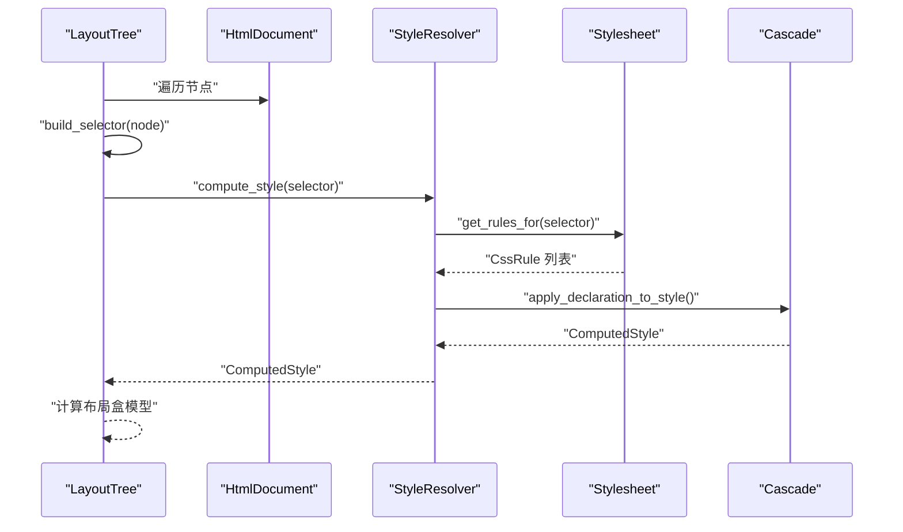
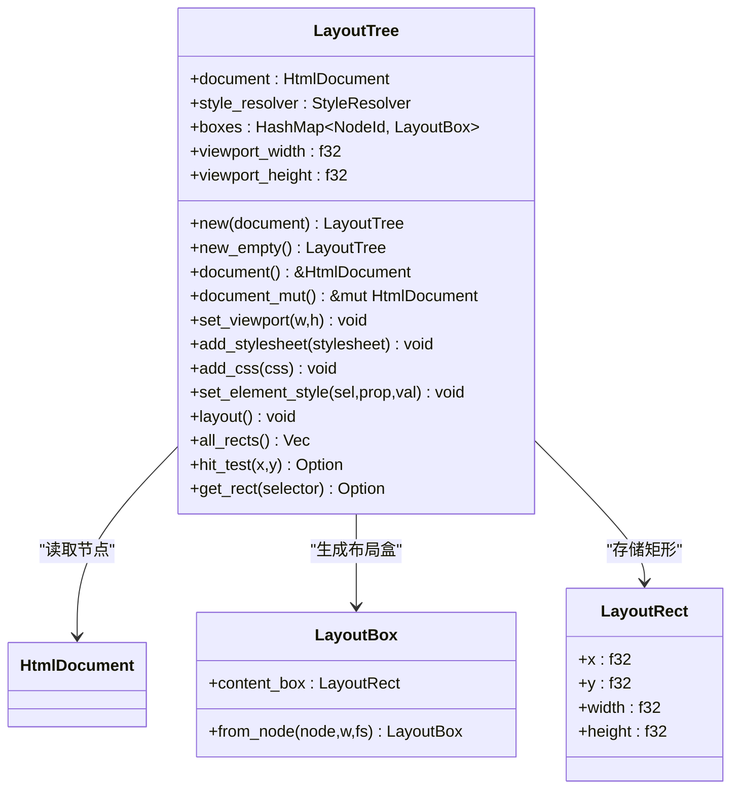
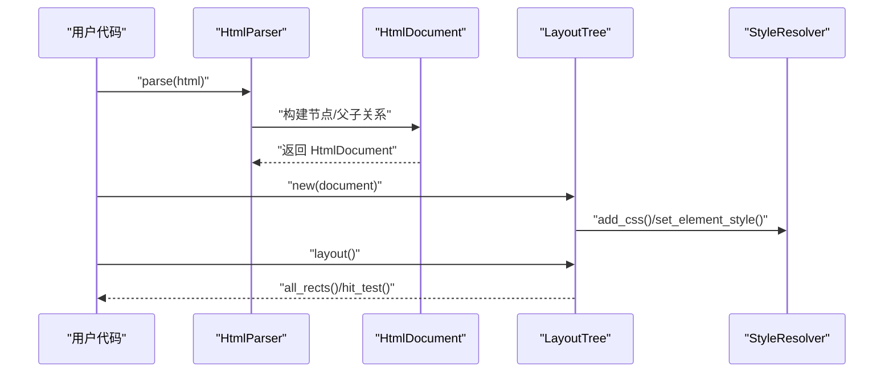
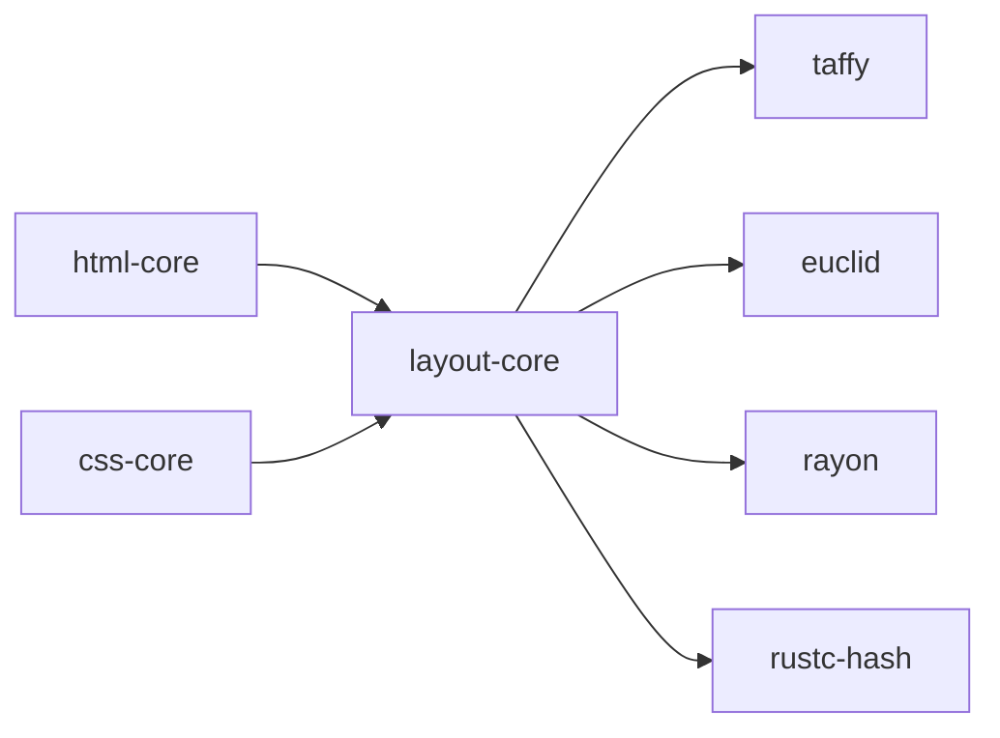

# HTML 解析模块

<cite>
**本文引用的文件**
- [components/html_core/lib.rs](file://components/html_core/lib.rs)
- [components/html_core/dom.rs](file://components/html_core/dom.rs)
- [components/html_core/parser.rs](file://components/html_core/parser.rs)
- [components/css_core/lib.rs](file://components/css_core/lib.rs)
- [components/css_core/stylesheet.rs](file://components/css_core/stylesheet.rs)
- [components/css_core/cascade.rs](file://components/css_core/cascade.rs)
- [components/layout_core/lib.rs](file://components/layout_core/lib.rs)
- [components/layout_core/tree.rs](file://components/layout_core/tree.rs)
- [bridge/lib.rs](file://bridge/lib.rs)
- [bridge/bridge.rs](file://bridge/bridge.rs)
- [Cargo.toml](file://Cargo.toml)
- [README.md](file://README.md)
</cite>

## 目录
1. [简介](#简介)
2. [项目结构](#项目结构)
3. [核心组件](#核心组件)
4. [架构总览](#架构总览)
5. [详细组件分析](#详细组件分析)
6. [依赖关系分析](#依赖关系分析)
7. [性能考量](#性能考量)
8. [故障排查指南](#故障排查指南)
9. [结论](#结论)
10. [附录](#附录)

## 简介
本文件面向 Servo-Zero 项目中的 HTML 解析模块，系统性阐述基于纯 Rust 的 HTML 解析器实现原理与数据结构设计，覆盖词法分析、语法解析与 DOM 树构建流程；详解 HtmlDocument、DomNode 类型系统与节点管理机制；文档化 HtmlParser 的 API 接口（解析方法、错误处理与性能优化）；提供从原始 HTML 到 DOM 树的完整示例；解释与 CSS 与布局模块的数据交互方式；并给出常见解析问题的调试技巧与最佳实践。

## 项目结构
HTML 解析模块位于 components/html_core 子目录中，对外通过 lib.rs 暴露 HtmlDocument、DomNode、DomNodeType 以及 HtmlParser，并提供 new_document() 工厂函数创建空文档。该模块不依赖 SpiderMonkey，采用纯 Rust 实现。

图表来源
- [components/html_core/lib.rs:1-15](file://components/html_core/lib.rs#L1-L15)
- [components/html_core/dom.rs:1-316](file://components/html_core/dom.rs#L1-L316)
- [components/html_core/parser.rs:1-153](file://components/html_core/parser.rs#L1-L153)
- [components/css_core/lib.rs:1-207](file://components/css_core/lib.rs#L1-L207)
- [components/css_core/stylesheet.rs:1-210](file://components/css_core/stylesheet.rs#L1-L210)
- [components/css_core/cascade.rs:1-271](file://components/css_core/cascade.rs#L1-L271)
- [components/layout_core/lib.rs:1-22](file://components/layout_core/lib.rs#L1-L22)
- [components/layout_core/tree.rs:1-241](file://components/layout_core/tree.rs#L1-L241)
- [bridge/lib.rs:1-13](file://bridge/lib.rs#L1-L13)
- [bridge/bridge.rs:1-263](file://bridge/bridge.rs#L1-L263)

章节来源
- [components/html_core/lib.rs:1-15](file://components/html_core/lib.rs#L1-L15)
- [README.md:16-31](file://README.md#L16-L31)

## 核心组件
- HtmlDocument：文档容器，维护节点数组、根节点 ID 与自增 ID 计数器，提供节点增删查、选择器查询、父子关系与文本收集等能力。
- DomNode：DOM 节点，包含节点类型、标签名（小写）、属性字典、子节点 ID 列表、父节点 ID、文本内容等。
- DomNodeType：节点类型枚举，涵盖 Document、Element、Text、Comment、DocumentType、Fragment。
- HtmlParser：HTML 解析器，负责将字符串解析为 DOM 树，支持注释、文本、标签、属性与自闭合标签处理。

章节来源
- [components/html_core/dom.rs:8-316](file://components/html_core/dom.rs#L8-L316)
- [components/html_core/parser.rs:5-153](file://components/html_core/parser.rs#L5-L153)

## 架构总览
HTML 解析模块与 CSS、布局模块的交互路径如下：解析器生成 HtmlDocument，布局模块通过 LayoutTree 读取 HtmlDocument 并结合 StyleResolver 计算样式，最终输出布局结果。

图表来源
- [components/html_core/parser.rs:18-22](file://components/html_core/parser.rs#L18-L22)
- [components/layout_core/tree.rs:61-69](file://components/layout_core/tree.rs#L61-L69)
- [components/css_core/cascade.rs:129-154](file://components/css_core/cascade.rs#L129-L154)

## 详细组件分析

### HtmlDocument 与 DomNode 类型系统
- DomNodeType：抽象了文档、元素、文本、注释、文档类型与片段等节点类型，便于后续布局与样式处理时进行类型判断。
- DomNode：统一承载节点元信息（类型、标签、属性、父子关系、文本），并提供便捷访问器如 get_attr、tag_name、text 等。
- HtmlDocument：维护节点列表与根节点 ID，提供 next_id、add_node、get_node/get_node_mut、query_selector/query_selector_all、parent/children、collect_text 等方法，支撑 DOM 查询与遍历。

图表来源
- [components/html_core/dom.rs:115-316](file://components/html_core/dom.rs#L115-L316)

章节来源
- [components/html_core/dom.rs:8-316](file://components/html_core/dom.rs#L8-L316)

### HtmlParser 解析流程与 API
- API 接口
  - new()：创建解析器实例，内部初始化空 HtmlDocument。
  - parse(html)：对外暴露的解析入口，返回当前文档引用。
  - document()/document_mut()：获取只读/可变文档引用。
- 解析算法要点
  - 词法分析：逐字符扫描，跳过注释、处理文本节点、识别标签起止。
  - 语法解析：识别 DOCTYPE/PI 等特殊标签并跳过；解析标签名与属性；处理自闭合标签与闭合标签。
  - DOM 树构建：为每个节点分配唯一 ID，建立父子关系，将节点加入 HtmlDocument。
- 错误处理与健壮性
  - 对不完整标签、缺失闭合等情况采取“尽量容错”的策略（例如未找到闭合标签时提前结束或跳过），避免崩溃。
  - 注释与文本节点均被正确插入，保证内容完整性。
- 性能优化建议
  - 使用 trim_start/trim 合理切片，减少不必要的拷贝。
  - 属性解析按需分割，避免重复解析。
  - 自闭合标签集合预置，快速判定减少分支。

图表来源
- [components/html_core/parser.rs:24-135](file://components/html_core/parser.rs#L24-L135)

章节来源
- [components/html_core/parser.rs:10-153](file://components/html_core/parser.rs#L10-L153)

### 与 CSS 模块的数据交互
- 选择器构建：LayoutTree 在布局阶段根据 HtmlDocument 节点构建选择器字符串（优先 ID，其次标签，再拼接类），交由 StyleResolver 计算样式。
- 样式解析：StyleResolver 从多个 Stylesheet 中收集匹配规则，合并内联样式，应用到 ComputedStyle。
- 颜色与长度解析：css_core 提供颜色解析与长度单位解析工具，供布局计算时转换为像素值。

图表来源
- [components/layout_core/tree.rs:161-188](file://components/layout_core/tree.rs#L161-L188)
- [components/css_core/cascade.rs:129-154](file://components/css_core/cascade.rs#L129-L154)
- [components/css_core/stylesheet.rs:191-203](file://components/css_core/stylesheet.rs#L191-L203)
- [components/css_core/lib.rs:139-207](file://components/css_core/lib.rs#L139-L207)

章节来源
- [components/layout_core/tree.rs:1-241](file://components/layout_core/tree.rs#L1-L241)
- [components/css_core/cascade.rs:1-271](file://components/css_core/cascade.rs#L1-L271)
- [components/css_core/stylesheet.rs:1-210](file://components/css_core/stylesheet.rs#L1-L210)
- [components/css_core/lib.rs:1-207](file://components/css_core/lib.rs#L1-L207)

### 与布局模块的数据交互
- 布局树构建：LayoutTree 以 HtmlDocument 为输入，遍历节点，结合 StyleResolver 计算的样式，生成布局盒模型与矩形区域。
- 交互接口：LayoutTree 提供 layout()、all_rects()、hit_test()、get_rect() 等方法，支持渲染与命中测试。
- 视口与尺寸：支持设置视口尺寸，长度单位解析依赖 css_core 的 Length 类型。

图表来源
- [components/layout_core/tree.rs:12-19](file://components/layout_core/tree.rs#L12-L19)
- [components/layout_core/tree.rs:217-240](file://components/layout_core/tree.rs#L217-L240)
- [components/layout_core/lib.rs:13-22](file://components/layout_core/lib.rs#L13-L22)

章节来源
- [components/layout_core/tree.rs:1-241](file://components/layout_core/tree.rs#L1-L241)
- [components/layout_core/lib.rs:1-22](file://components/layout_core/lib.rs#L1-L22)

### 完整示例：从原始 HTML 到 DOM 树
以下流程展示了从原始 HTML 字符串到 DOM 树的转换过程，以及与 CSS/布局的衔接：

图表来源
- [components/html_core/parser.rs:18-22](file://components/html_core/parser.rs#L18-L22)
- [components/layout_core/tree.rs:21-30](file://components/layout_core/tree.rs#L21-L30)
- [components/layout_core/tree.rs:53-59](file://components/layout_core/tree.rs#L53-L59)
- [components/layout_core/tree.rs:61-69](file://components/layout_core/tree.rs#L61-L69)

章节来源
- [components/html_core/parser.rs:18-22](file://components/html_core/parser.rs#L18-L22)
- [components/layout_core/tree.rs:21-69](file://components/layout_core/tree.rs#L21-L69)

## 依赖关系分析
- 组件间耦合
  - layout-core 依赖 html-core（DomNode、HtmlDocument）与 css-core（StyleResolver、ComputedStyle、Length）。
  - html-core 与 css-core、layout-core 彼此独立，通过清晰的接口传递数据。
- 外部依赖
  - 布局使用 taffy（Flexbox 算法）、euclid（几何类型）、rayon（并行）、rustc-hash（哈希）。
  - CSS 颜色与长度解析工具来自 css-core。
- 特性开关
  - 仓库通过 Cargo.toml workspace 统一管理依赖版本，html-core 与 css-core 作为独立库参与编译。

图表来源
- [Cargo.toml:19-37](file://Cargo.toml#L19-L37)
- [components/layout_core/Cargo.toml:15-26](file://components/layout_core/Cargo.toml#L15-L26)

章节来源
- [Cargo.toml:1-37](file://Cargo.toml#L1-L37)
- [components/layout_core/Cargo.toml:1-26](file://components/layout_core/Cargo.toml#L1-L26)

## 性能考量
- 字符串处理
  - 使用切片与 find/trim 等原地操作，避免大对象复制。
  - 属性解析仅在必要时分割字符串，减少内存分配。
- DOM 存储
  - Vec 存储节点，索引访问 O(1)，适合频繁遍历与查询。
  - next_id 自增计数器避免重复 ID。
- 选择器查询
  - query_selector/query_selector_all 采用深度优先搜索，复杂度 O(N)；可考虑为常用 ID/类选择器建立索引以进一步优化。
- 布局计算
  - LayoutTree 采用递归布局，先子后父，合理利用缓存与增量更新（若扩展）可降低重复计算。

## 故障排查指南
- 常见问题
  - 标签未闭合：解析器会尝试继续解析，但可能导致子树不完整。建议检查 HTML 结构，确保闭合标签正确。
  - 属性值未加引号：解析器按空格分隔属性，可能误判。建议统一使用双引号包裹属性值。
  - 注释未闭合：解析器会跳过直至遇到 "-->"，避免阻塞后续解析。
  - 自闭合标签误判：解析器内置常见自闭合标签集合，若遇到非标准标签，可显式添加 "/" 以标记自闭合。
- 调试技巧
  - 使用 HtmlDocument::collect_text() 快速验证文本节点是否正确提取。
  - 使用 query_selector/query_selector_all 验证节点是否存在及层级关系。
  - 在 LayoutTree 中打印 all_rects() 输出，核对布局矩形与预期一致。
  - 若样式异常，检查 StyleResolver 的 add_css/set_element_style 输入是否正确，确认选择器匹配逻辑。
- 最佳实践
  - 保持 HTML 结构简洁，避免冗余嵌套。
  - CSS 选择器尽量使用稳定标识（ID/类），提升查询效率。
  - 分步调试：先验证 DOM，再验证样式，最后验证布局。

## 结论
本模块以纯 Rust 实现了轻量、可扩展的 HTML 解析与 DOM 树构建，配合 CSS 样式解析与布局计算，形成完整的前端渲染链路。其设计强调模块解耦、接口清晰与易调试性，适合嵌入式与跨平台场景使用。未来可在选择器索引、并行解析与更严格的 HTML 规范校验方面持续演进。

## 附录
- 关键 API 路径参考
  - HtmlParser::parse → [components/html_core/parser.rs:18-22](file://components/html_core/parser.rs#L18-L22)
  - HtmlDocument::query_selector → [components/html_core/dom.rs:174-189](file://components/html_core/dom.rs#L174-L189)
  - LayoutTree::layout → [components/layout_core/tree.rs:61-69](file://components/layout_core/tree.rs#L61-L69)
  - StyleResolver::compute_style → [components/css_core/cascade.rs:129-154](file://components/css_core/cascade.rs#L129-L154)
- 示例用法参考
  - README 中的使用示例 → [README.md:81-118](file://README.md#L81-L118)