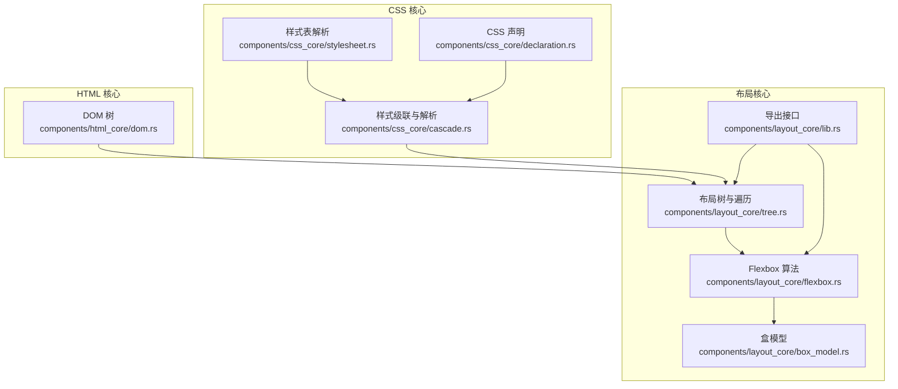
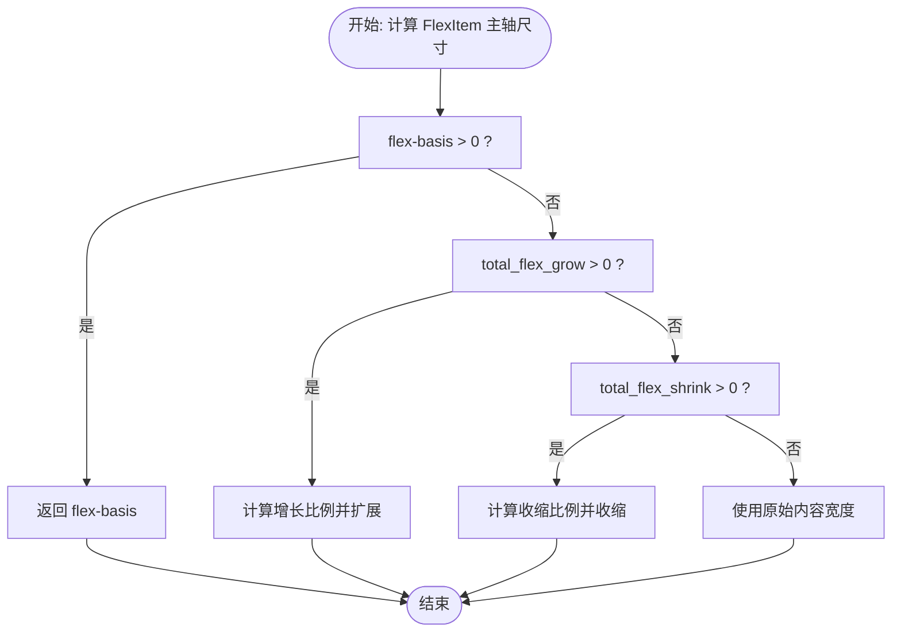
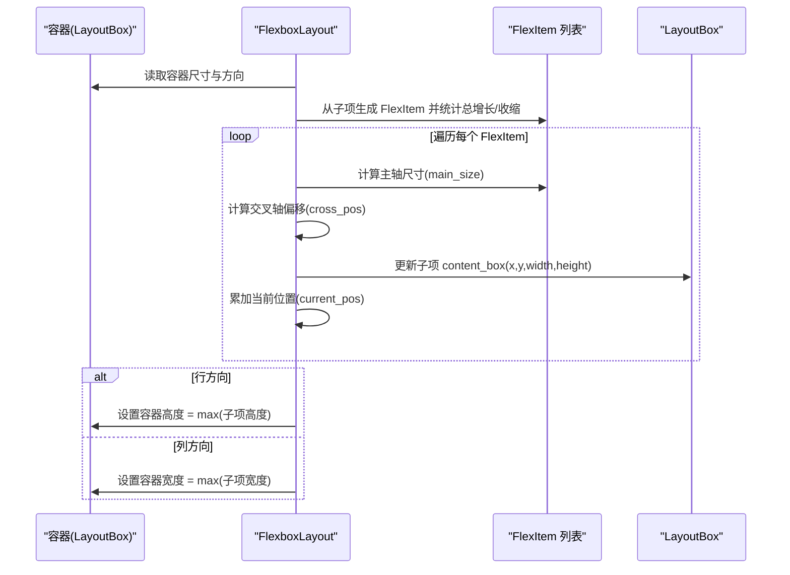
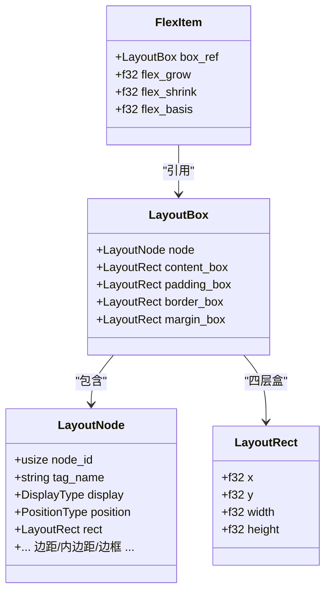
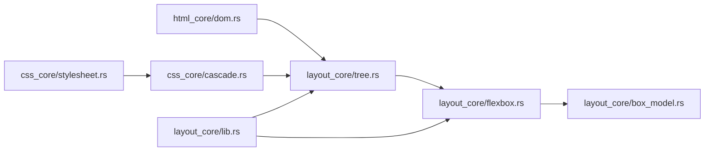

# Flexbox 布局算法

<cite>
**本文引用的文件**
- [flexbox.rs](file://components/layout_core/flexbox.rs)
- [box_model.rs](file://components/layout_core/box_model.rs)
- [tree.rs](file://components/layout_core/tree.rs)
- [cascade.rs](file://components/css_core/cascade.rs)
- [stylesheet.rs](file://components/css_core/stylesheet.rs)
- [declaration.rs](file://components/css_core/declaration.rs)
- [dom.rs](file://components/html_core/dom.rs)
- [lib.rs](file://components/layout_core/lib.rs)
- [Cargo.toml](file://Cargo.toml)
- [README.md](file://README.md)
</cite>

## 目录
1. [引言](#引言)
2. [项目结构](#项目结构)
3. [核心组件](#核心组件)
4. [架构总览](#架构总览)
5. [详细组件分析](#详细组件分析)
6. [依赖关系分析](#依赖关系分析)
7. [性能考虑](#性能考虑)
8. [故障排查指南](#故障排查指南)
9. [结论](#结论)
10. [附录：Flexbox 示例与计算流程](#附录flexbox-示例与计算流程)

## 引言
本文件系统性阐述 Servo-Zero 中 Flexbox 布局算法的实现与设计，覆盖主轴/交叉轴计算、flex-direction、justify-content、align-items 等属性的处理逻辑，以及弹性项目的排列、换行与空间分配机制。同时给出复杂场景（嵌套容器、多行布局、动态内容）的处理思路与性能优化建议，并通过端到端示例展示从 CSS 规则到最终布局结果的计算过程。

## 项目结构
Servo-Zero 将渲染引擎拆分为多个模块，其中与 Flexbox 直接相关的模块为 layout_core（布局核心）、css_core（CSS 解析与级联）与 html_core（DOM）。Flexbox 算法位于 layout_core 的 flexbox.rs 中，配合 box_model.rs 的盒模型数据结构，由 tree.rs 驱动整棵布局树的遍历与计算。



**图表来源**
- [dom.rs:115-316](file://components/html_core/dom.rs#L115-L316)
- [stylesheet.rs:13-210](file://components/css_core/stylesheet.rs#L13-L210)
- [cascade.rs:86-271](file://components/css_core/cascade.rs#L86-L271)
- [declaration.rs:1-18](file://components/css_core/declaration.rs#L1-L18)
- [tree.rs:12-241](file://components/layout_core/tree.rs#L12-L241)
- [flexbox.rs:1-167](file://components/layout_core/flexbox.rs#L1-L167)
- [box_model.rs:15-210](file://components/layout_core/box_model.rs#L15-L210)
- [lib.rs:1-22](file://components/layout_core/lib.rs#L1-L22)

**章节来源**
- [README.md:16-31](file://README.md#L16-L31)
- [Cargo.toml:1-37](file://Cargo.toml#L1-L37)

## 核心组件
- Flexbox 算法实现：负责主轴/交叉轴计算、空间分配、对齐与换行策略。
- 盒模型：提供 LayoutBox/LayoutRect 等几何信息，承载内容/内边距/边框/外边距盒。
- 样式解析：将 CSS 声明转换为 ComputedStyle，驱动布局决策。
- 布局树：自上而下遍历 DOM，结合样式计算每个节点的布局盒，并在需要时调用 Flexbox 算法。

**章节来源**
- [flexbox.rs:87-167](file://components/layout_core/flexbox.rs#L87-L167)
- [box_model.rs:15-210](file://components/layout_core/box_model.rs#L15-L210)
- [tree.rs:61-160](file://components/layout_core/tree.rs#L61-L160)
- [cascade.rs:86-271](file://components/css_core/cascade.rs#L86-L271)

## 架构总览
Flexbox 在 Servo-Zero 中采用“样式驱动 + 自顶向下布局”的模式：
- DOM 节点进入布局树后，先解析样式（display、flex 相关属性等），再决定是否应用 Flexbox 算法。
- Flexbox 算法基于容器方向（row/column 及反向）、换行策略（nowrap/wrap/wrap-reverse）与对齐策略（justify-content、align-items）进行主轴/交叉轴的尺寸与位置计算。
- 最终将计算结果写回 LayoutBox 的 content_box，形成完整的布局树。

```mermaid
sequenceDiagram
participant DOM as "DOM 节点"
participant Tree as "布局树(tree.rs)"
participant CSS as "样式解析(cascade.rs)"
participant Flex as "Flexbox(flexbox.rs)"
participant Box as "盒模型(box_model.rs)"
DOM->>Tree : 递归遍历节点
Tree->>CSS : 计算元素样式(display/align/justify等)
CSS-->>Tree : 返回 ComputedStyle
Tree->>Tree : 判断 display 是否为 flex
alt 是 flex 容器
Tree->>Flex : 调用 FlexboxLayout.layout(...)
Flex->>Box : 读取/更新 LayoutBox.content_box
Flex-->>Tree : 写回各子项位置与尺寸
else 非 flex 容器
Tree->>Tree : 按常规布局处理
end
Tree-->>DOM : 完成布局树构建
```

**图表来源**
- [tree.rs:71-160](file://components/layout_core/tree.rs#L71-L160)
- [cascade.rs:128-154](file://components/css_core/cascade.rs#L128-L154)
- [flexbox.rs:106-167](file://components/layout_core/flexbox.rs#L106-L167)
- [box_model.rs:155-210](file://components/layout_core/box_model.rs#L155-L210)

## 详细组件分析

### Flexbox 数据模型与枚举
- 方向：Row、RowReverse、Column、ColumnReverse
- 换行：NoWrap、Wrap、WrapReverse
- 对齐：AlignItems（FlexStart、FlexEnd、Center、Stretch、Baseline）
- 主轴对齐：JustifyContent（FlexStart、FlexEnd、Center、SpaceBetween、SpaceAround、SpaceEvenly）

这些枚举用于控制 Flexbox 算法的行为，贯穿于布局计算的各个阶段。

**章节来源**
- [flexbox.rs:5-41](file://components/layout_core/flexbox.rs#L5-L41)

### FlexItem 结构与主轴尺寸计算
FlexItem 从 LayoutBox 派生，记录 flex-grow/shrink/basis 等弹性参数，并提供主轴尺寸计算方法：
- 若设置了 flex-basis 且大于 0，则直接使用该基准值。
- 否则根据容器主轴剩余空间与总弹性系数按比例分配（增长）或收缩（收缩）。
- 当既无增长也无收缩时，回退到原始内容盒宽度。



**图表来源**
- [flexbox.rs:56-85](file://components/layout_core/flexbox.rs#L56-L85)

**章节来源**
- [flexbox.rs:44-85](file://components/layout_core/flexbox.rs#L44-L85)

### FlexboxLayout 布局流程
FlexboxLayout 的 layout 方法执行以下步骤：
- 判空与方向判断：根据方向确定主轴长度（容器宽度或高度）。
- 构造 FlexItem 列表并汇总总增长/收缩系数。
- 逐项计算主轴尺寸与交叉轴位置（align-items 决定）。
- 更新子项 content_box 的 x/y/宽/高，并累加当前位置。
- 根据方向更新容器尺寸（行方向取最大高度，列方向取最大宽度）。



**图表来源**
- [flexbox.rs:106-167](file://components/layout_core/flexbox.rs#L106-L167)

**章节来源**
- [flexbox.rs:87-167](file://components/layout_core/flexbox.rs#L87-L167)

### 盒模型与布局树集成
- LayoutBox 包含 content/padding/border/margin 四层盒，便于后续绘制与命中测试。
- LayoutTree 在遍历 DOM 时，依据 ComputedStyle 设置节点属性，并在必要时调用 Flexbox 算法。
- 样式解析由 cascade.rs 提供，支持 display、position、尺寸等属性的提取与应用。



**图表来源**
- [box_model.rs:15-210](file://components/layout_core/box_model.rs#L15-L210)
- [flexbox.rs:44-85](file://components/layout_core/flexbox.rs#L44-L85)

**章节来源**
- [box_model.rs:155-210](file://components/layout_core/box_model.rs#L155-L210)
- [tree.rs:71-160](file://components/layout_core/tree.rs#L71-L160)
- [cascade.rs:128-200](file://components/css_core/cascade.rs#L128-L200)

## 依赖关系分析
- 组件耦合
  - layout_core/flexbox.rs 仅依赖 layout_core/box_model.rs 的 LayoutBox/LayoutRect。
  - layout_core/tree.rs 依赖 html_core/dom.rs 与 css_core/cascade.rs/stylesheet.rs，负责将 DOM 与样式整合为布局树。
  - 组件间通过 lib.rs 导出统一接口，便于上层桥接层使用。
- 外部依赖
  - README 指出 layout_core 使用 taffy 作为 Flexbox 算法实现（尽管当前仓库中未见 taffy 的直接调用代码，仍作为整体架构背景说明）。



**图表来源**
- [dom.rs:115-316](file://components/html_core/dom.rs#L115-L316)
- [stylesheet.rs:13-210](file://components/css_core/stylesheet.rs#L13-L210)
- [cascade.rs:86-271](file://components/css_core/cascade.rs#L86-L271)
- [tree.rs:12-241](file://components/layout_core/tree.rs#L12-L241)
- [flexbox.rs:1-167](file://components/layout_core/flexbox.rs#L1-L167)
- [box_model.rs:15-210](file://components/layout_core/box_model.rs#L15-L210)
- [lib.rs:1-22](file://components/layout_core/lib.rs#L1-L22)

**章节来源**
- [README.md:144-151](file://README.md#L144-L151)
- [Cargo.toml:28-29](file://Cargo.toml#L28-L29)

## 性能考虑
- 时间复杂度
  - 单次 Flexbox 布局对子项数量为 n 的线性复杂度 O(n)，主要开销在遍历与求和（增长/收缩系数）。
  - 样式解析与选择器匹配在布局树构建阶段完成，通常与 DOM 结构规模相关。
- 空间复杂度
  - 需要为每个子项构造 FlexItem，额外空间为 O(n)。
- 优化建议
  - 缓存样式计算结果，避免重复解析相同选择器。
  - 在容器尺寸稳定时，尽量减少不必要的重排；对频繁变化的子项，考虑分批布局或增量更新。
  - 合理使用 flex-basis 与 flex-shrink/grow，减少反复迭代的计算量。
  - 对于多行换行场景，可预先估算行数与行高，降低跨行重算成本。

[本节为通用性能指导，不直接分析具体文件]

## 故障排查指南
- 常见问题
  - 子项未按预期换行：检查容器宽度与子项 flex-basis/width 之和是否超过容器主轴尺寸。
  - 交叉轴对齐异常：确认 align-items 设置与子项自身尺寸的关系。
  - 主轴间距不符合预期：核对 justify-content 与容器主轴剩余空间的分配逻辑。
- 调试方法
  - 输出每一步的主轴尺寸与交叉轴偏移，定位偏差来源。
  - 使用 hit_test 与 all_rects 辅助验证布局盒是否正确写入。
  - 逐步缩小选择器范围，验证样式解析是否符合预期。

**章节来源**
- [tree.rs:202-240](file://components/layout_core/tree.rs#L202-L240)
- [box_model.rs:206-209](file://components/layout_core/box_model.rs#L206-L209)

## 结论
本实现以简洁的数据结构与清晰的流程实现了 Flexbox 的核心算法：主轴/交叉轴分离、增长/收缩与基准值协同、对齐与间距策略。通过与样式解析和布局树的紧密协作，能够稳定地将 CSS 规则转化为最终的布局结果。对于复杂场景（嵌套容器、多行、动态内容），建议在样式层面合理规划 flex 参数，并在布局树构建阶段做好缓存与增量更新，以获得更好的性能与可维护性。

[本节为总结性内容，不直接分析具体文件]

## 附录：Flexbox 示例与计算流程

### 示例一：基础行方向布局
- CSS 规则
  - 容器：display:flex; flex-direction:row; justify-content:flex-start; align-items:center
  - 子项：若干块级元素，部分设置 flex-grow/flex-shrink
- 计算步骤
  - 读取容器方向与尺寸，确定主轴为宽度。
  - 为每个子项计算主轴尺寸：若存在 flex-basis 则直接使用；否则按增长/收缩系数分配剩余空间。
  - 交叉轴按 align-items=Center 计算偏移，使子项垂直居中。
  - 写回每个子项的 content_box，并更新容器尺寸（取最大高度）。

**章节来源**
- [flexbox.rs:106-167](file://components/layout_core/flexbox.rs#L106-L167)

### 示例二：列方向与反向
- CSS 规则
  - 容器：flex-direction:column-reverse
  - 子项：固定高度，无弹性参数
- 计算步骤
  - 主轴为高度，按从底部向上的顺序累加子项高度。
  - 交叉轴按 align-items=Stretch，使子项横向填满容器宽度。

**章节来源**
- [flexbox.rs:112-151](file://components/layout_core/flexbox.rs#L112-L151)

### 示例三：多行与换行
- CSS 规则
  - 容器：flex-wrap:wrap; 容器宽度固定
  - 子项：固定宽度，无弹性参数
- 计算步骤
  - 逐项累加主轴尺寸，当超过容器宽度时换行。
  - 每行独立计算交叉轴尺寸与对齐，行间按换行方向累积垂直位置。

**章节来源**
- [flexbox.rs:14-20](file://components/layout_core/flexbox.rs#L14-L20)
- [flexbox.rs:106-167](file://components/layout_core/flexbox.rs#L106-L167)

### 示例四：嵌套弹性容器
- CSS 规则
  - 外层容器：flex-direction:row
  - 内层容器：display:flex; flex-direction:column
  - 子项：内层子项设置 flex-grow
- 计算步骤
  - 先对外层进行行方向布局，得到内层容器的尺寸。
  - 再对内层容器进行列方向布局，按其子项的弹性参数分配高度。

**章节来源**
- [tree.rs:71-160](file://components/layout_core/tree.rs#L71-L160)
- [flexbox.rs:106-167](file://components/layout_core/flexbox.rs#L106-L167)