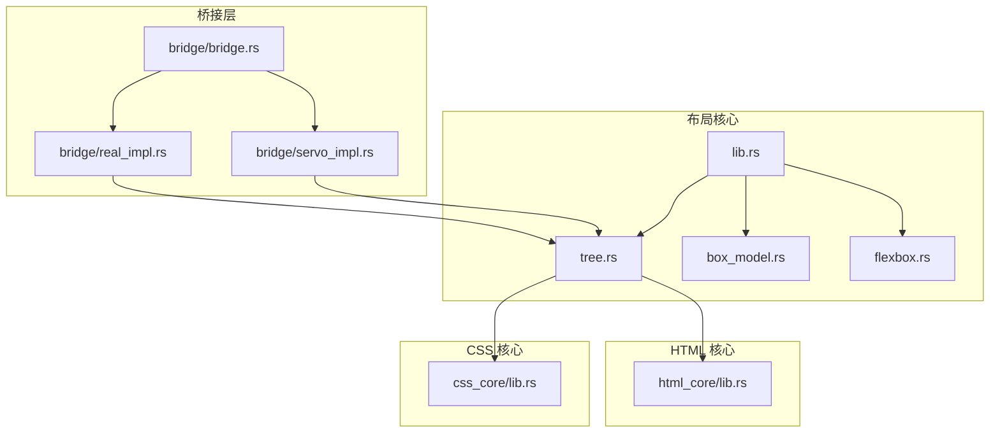
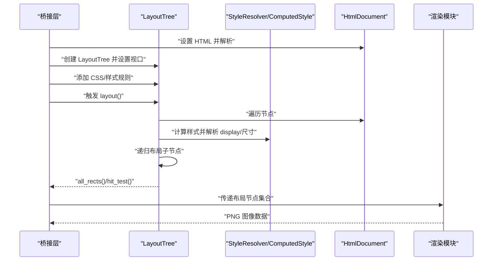
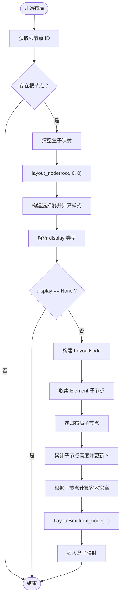
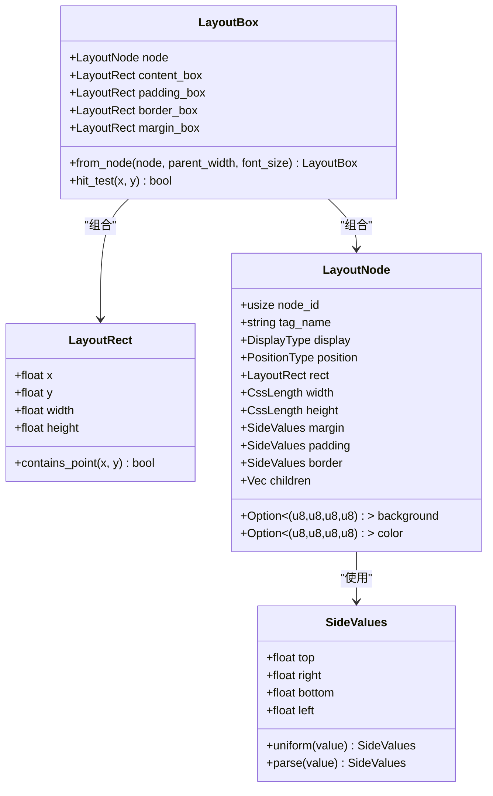
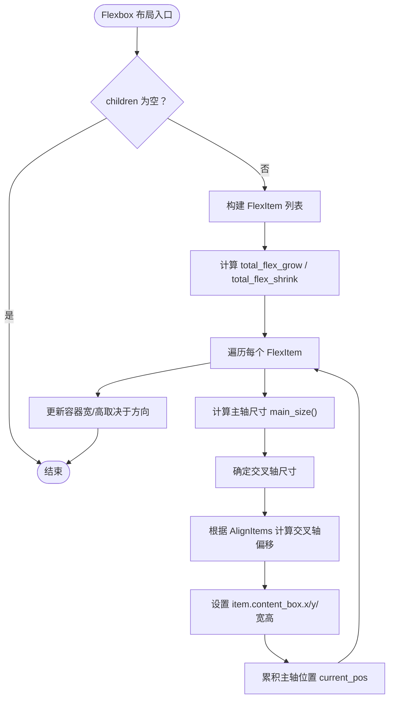
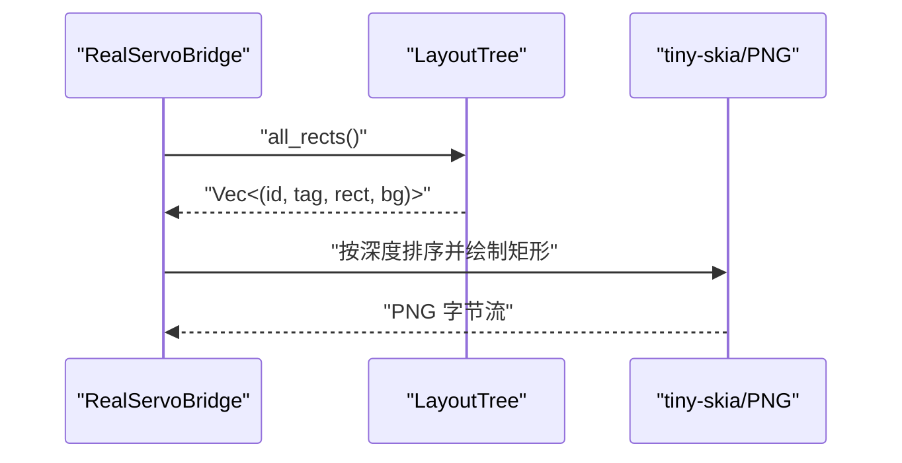
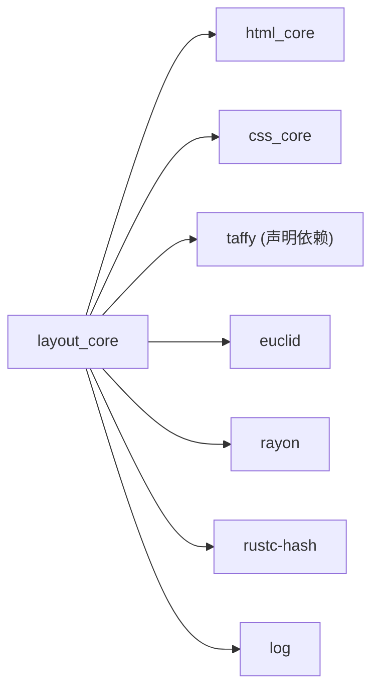

# 布局引擎模块

<cite>
**本文引用的文件**
- [README.md](file://README.md)
- [Cargo.toml](file://components/layout_core/Cargo.toml)
- [lib.rs](file://components/layout_core/lib.rs)
- [tree.rs](file://components/layout_core/tree.rs)
- [box_model.rs](file://components/layout_core/box_model.rs)
- [flexbox.rs](file://components/layout_core/flexbox.rs)
- [css_core/lib.rs](file://components/css_core/lib.rs)
- [html_core/lib.rs](file://components/html_core/lib.rs)
- [bridge/bridge.rs](file://bridge/bridge.rs)
- [bridge/real_impl.rs](file://bridge/real_impl.rs)
- [bridge/servo_impl.rs](file://bridge/servo_impl.rs)
</cite>

## 目录
1. [简介](#简介)
2. [项目结构](#项目结构)
3. [核心组件](#核心组件)
4. [架构总览](#架构总览)
5. [详细组件分析](#详细组件分析)
6. [依赖关系分析](#依赖关系分析)
7. [性能考虑](#性能考虑)
8. [故障排查指南](#故障排查指南)
9. [结论](#结论)
10. [附录](#附录)

## 简介
本文件系统性地阐述布局引擎模块的设计与实现，重点覆盖：
- 布局树构建与遍历
- 盒模型定义与尺寸计算
- Flexbox 布局算法（主轴/交叉轴、伸缩与收缩）
- 从样式信息到最终布局结果的完整流程
- 布局缓存与增量更新策略建议
- 性能优化与调试方法
- 与渲染模块的数据传递接口

该布局引擎模块独立于 SpiderMonkey，采用纯 Rust 实现，结合 CSS 核心模块与 HTML 核心模块，提供盒模型与 Flexbox 布局能力，并通过桥接层向渲染模块输出布局结果。

## 项目结构
布局引擎位于 components/layout_core，主要由以下文件组成：
- lib.rs：导出布局核心类型与结果结构
- tree.rs：布局树构建与布局计算入口
- box_model.rs：盒模型数据结构与尺寸计算
- flexbox.rs：Flexbox 布局算法与枚举

同时，布局引擎依赖 css_core 与 html_core，通过桥接层 bridge 将布局结果传递给渲染模块。

图表来源
- [lib.rs:1-22](file://components/layout_core/lib.rs#L1-L22)
- [tree.rs:1-241](file://components/layout_core/tree.rs#L1-L241)
- [box_model.rs:1-210](file://components/layout_core/box_model.rs#L1-L210)
- [flexbox.rs:1-167](file://components/layout_core/flexbox.rs#L1-L167)
- [css_core/lib.rs:1-207](file://components/css_core/lib.rs#L1-L207)
- [html_core/lib.rs:1-15](file://components/html_core/lib.rs#L1-L15)
- [bridge/bridge.rs:1-263](file://bridge/bridge.rs#L1-L263)
- [bridge/real_impl.rs:1-205](file://bridge/real_impl.rs#L1-L205)
- [bridge/servo_impl.rs:1-192](file://bridge/servo_impl.rs#L1-L192)

章节来源
- [README.md:1-183](file://README.md#L1-L183)
- [Cargo.toml:1-26](file://components/layout_core/Cargo.toml#L1-L26)

## 核心组件
- 布局树 LayoutTree：负责从 DOM 与样式计算中构建布局树，递归布局节点，生成每个节点的盒模型矩形。
- 盒模型 BoxModel：定义 LayoutRect、LayoutNode、LayoutBox 以及边距/内边距/边框等四边值，提供从节点到各盒尺寸的转换。
- Flexbox 布局 FlexboxLayout：定义 Flex 方向、换行、对齐等枚举，实现主轴/交叉轴计算与伸缩/收缩逻辑。
- 布局结果 LayoutResult：对外暴露布局结果，包含节点 ID、标签名、矩形与背景色等。

章节来源
- [lib.rs:9-21](file://components/layout_core/lib.rs#L9-L21)
- [tree.rs:13-19](file://components/layout_core/tree.rs#L13-L19)
- [box_model.rs:6-210](file://components/layout_core/box_model.rs#L6-L210)
- [flexbox.rs:6-167](file://components/layout_core/flexbox.rs#L6-L167)

## 架构总览
布局引擎的控制流从桥接层发起，经过 HTML 解析与 CSS 样式计算，最终生成布局树与盒模型，再由桥接层传递给渲染模块进行绘制。

图表来源
- [bridge/real_impl.rs:101-125](file://bridge/real_impl.rs#L101-L125)
- [tree.rs:61-159](file://components/layout_core/tree.rs#L61-L159)
- [css_core/lib.rs:1-207](file://components/css_core/lib.rs#L1-L207)
- [html_core/lib.rs:1-15](file://components/html_core/lib.rs#L1-L15)

## 详细组件分析

### 布局树构建与布局计算（LayoutTree）
- 数据结构
  - 布局树持有 HtmlDocument、StyleResolver、节点到盒的映射、视口尺寸。
- 关键流程
  - 初始化：创建空布局树或基于 HtmlDocument；设置视口大小。
  - 样式解析：为每个元素构建选择器，查询 ComputedStyle，解析 display 类型。
  - 节点布局：递归遍历子节点，计算每个节点的宽高与位置；若未显式设置尺寸，则根据子节点高度推导容器高度。
  - 盒模型转换：将 LayoutNode 转换为 LayoutBox，计算 content/padding/border/margin 四种盒的矩形。
  - 查询接口：all_rects 返回节点 ID、标签名、矩形与背景；hit_test 支持命中测试；get_rect 支持按选择器查询矩形。
- 与 Flexbox 的关系
  - 当 display 为 Flex 时，当前实现以简单线性布局为主；Flexbox 算法在 flexbox.rs 中定义，可作为后续扩展集成点。

图表来源
- [tree.rs:61-159](file://components/layout_core/tree.rs#L61-L159)

章节来源
- [tree.rs:21-241](file://components/layout_core/tree.rs#L21-L241)

### 盒模型定义与尺寸计算（BoxModel）
- 数据结构
  - LayoutRect：包含 x/y/width/height。
  - SideValues：四边值（top/right/bottom/left），支持统一值与多值解析。
  - LayoutNode：包含节点 ID、标签名、显示类型、定位类型、尺寸、边距/内边距/边框、子节点列表等。
  - LayoutBox：包含 content/padding/border/margin 四种盒矩形。
- 尺寸计算
  - 从 CssLength 到像素：支持 px/em/rem/%，并根据父元素尺寸与字体大小换算。
  - 盒尺寸计算：content_box 基于内容宽高；padding_box 在 content_box 基础上加上内边距；border_box 在 padding_box 基础上加上边框；margin_box 在 border_box 基础上加上外边距。
- 边距处理
  - SideValues 支持 1/2/3/4 个分量的解析，用于 margin/padding/border 的四边赋值。

图表来源
- [box_model.rs:6-210](file://components/layout_core/box_model.rs#L6-L210)

章节来源
- [box_model.rs:6-210](file://components/layout_core/box_model.rs#L6-L210)
- [css_core/lib.rs:159-207](file://components/css_core/lib.rs#L159-L207)

### Flexbox 布局算法实现
- 枚举与数据结构
  - FlexDirection：Row/RowReverse/Column/ColumnReverse
  - FlexWrap：NoWrap/Wrap/WrapReverse
  - AlignItems：FlexStart/FlexEnd/Center/Stretch/Baseline
  - JustifyContent：FlexStart/FlexEnd/Center/SpaceBetween/SpaceAround/SpaceEvenly
  - FlexItem：包装 LayoutBox，携带 flex_grow/flex_shrink/flex_basis/min_size/max_size。
- 主轴与交叉轴
  - 根据方向判断主轴（行：宽度；列：高度），交叉轴相反。
  - 主轴尺寸计算：优先使用 flex_basis；否则根据 flex_grow/总 flex_grow 分配剩余空间；或根据 flex_shrink/总 flex_shrink 缩减。
  - 交叉轴对齐：AlignItems 决定交叉轴起点、终点、居中、拉伸或基线对齐。
- 容器尺寸更新
  - 行方向：容器高度取子项最大高度；列方向：容器宽度取子项最大宽度。

图表来源
- [flexbox.rs:107-165](file://components/layout_core/flexbox.rs#L107-L165)

章节来源
- [flexbox.rs:6-167](file://components/layout_core/flexbox.rs#L6-L167)

### 从样式到布局的完整示例（流程说明）
- 步骤
  - HTML 解析：桥接层解析 HTML，构建 HtmlDocument。
  - CSS 注入：桥接层将 CSS 规则注入 LayoutTree，或通过 set_css/set_style 动态更新。
  - 样式计算：LayoutTree 为每个节点构建选择器，查询 ComputedStyle，解析 display/width/height 等。
  - 布局计算：LayoutTree 递归布局，叶子节点默认高度，容器高度根据子节点累计推导。
  - 盒模型：LayoutBox.from_node 将节点尺寸转换为 content/padding/border/margin 四种盒。
  - 结果输出：all_rects/hit_test/get_rect 提供布局结果，供渲染模块使用。
- 示例路径
  - HTML 设置与布局触发：[bridge/real_impl.rs:101-125](file://bridge/real_impl.rs#L101-L125)
  - 样式注入与重新布局：[bridge/servo_impl.rs:174-182](file://bridge/servo_impl.rs#L174-L182)
  - 样式计算与布局树构建：[tree.rs:61-159](file://components/layout_core/tree.rs#L61-L159)
  - 盒模型转换：[box_model.rs:166-204](file://components/layout_core/box_model.rs#L166-L204)

章节来源
- [bridge/real_impl.rs:101-125](file://bridge/real_impl.rs#L101-L125)
- [bridge/servo_impl.rs:174-182](file://bridge/servo_impl.rs#L174-L182)
- [tree.rs:61-159](file://components/layout_core/tree.rs#L61-L159)
- [box_model.rs:166-204](file://components/layout_core/box_model.rs#L166-L204)

### 布局缓存与增量更新策略（建议）
- 现状
  - 当前实现每次布局均清空盒子映射并重新计算，适合演示与简单场景。
- 建议策略
  - 标记变更：记录节点的样式/结构变更，仅对受影响节点及其祖先进行重排。
  - 盒缓存：缓存 LayoutBox 的 content/padding/border/margin 矩形，避免重复计算。
  - 子树复用：当子节点未变化时，直接复用其 LayoutBox，减少递归成本。
  - 批处理：批量应用样式更新后再统一触发布局，降低频繁重建开销。
  - 与 Flexbox 集成：在 Flexbox 布局阶段引入增量标记，仅对 flex 项进行主轴/交叉轴重算。

[本节为通用优化建议，不直接分析具体文件，故无“章节来源”]

### 与渲染模块的数据传递接口
- 桥接层接口
  - LayoutRect/Color/LayoutNode：统一布局节点数据结构。
  - all_rects/hit_test/get_rect：提供布局结果与命中测试。
- 实现示例
  - RealServoBridge：解析 HTML、注入 CSS、重建布局树、触发布局，随后收集 all_rects 并按深度排序绘制。
  - ServoBridge（Mock）：提供最小化布局树与基本接口。
- 与 tiny-skia 的配合
  - 按 y/x/面积排序，确保父元素先渲染、子元素后覆盖，实现正确的视觉层级。

图表来源
- [bridge/real_impl.rs:160-205](file://bridge/real_impl.rs#L160-L205)
- [bridge/bridge.rs:77-96](file://bridge/bridge.rs#L77-L96)

章节来源
- [bridge/bridge.rs:77-263](file://bridge/bridge.rs#L77-L263)
- [bridge/real_impl.rs:154-205](file://bridge/real_impl.rs#L154-L205)
- [bridge/servo_impl.rs:1-192](file://bridge/servo_impl.rs#L1-L192)

## 依赖关系分析
- 组件耦合
  - layout_core 依赖 html_core 与 css_core，形成清晰的分层：DOM 解析 → 样式计算 → 布局 → 渲染。
  - 布局树与盒模型紧密耦合，Flexbox 算法可作为独立模块扩展接入。
- 外部依赖
  - taffy：已在依赖中声明，可用于更完整的 Flexbox 实现（当前仓库中未直接使用 taffy 的布局函数，但已声明依赖）。
  - euclid/rayon/rustc-hash/log：几何类型、并行处理、哈希与日志支持。

图表来源
- [Cargo.toml:15-22](file://components/layout_core/Cargo.toml#L15-L22)

章节来源
- [Cargo.toml:15-22](file://components/layout_core/Cargo.toml#L15-L22)

## 性能考虑
- 时间复杂度
  - 布局树遍历：O(N)，N 为元素数量。
  - 样式计算：O(S)，S 为样式规则数；选择器匹配与级联影响整体时间。
  - 盒模型转换：O(1) 每节点。
- 空间复杂度
  - 盒映射：O(N)。
  - Flexbox 临时数组：O(M)，M 为子项数。
- 优化建议
  - 选择器缓存：缓存 ComputedStyle 与选择器结果，避免重复解析。
  - 并行化：利用 rayon 对独立子树并行布局（需谨慎处理共享状态）。
  - 减少字符串解析：将 CSS 长度与颜色解析结果缓存为数值。
  - 增量布局：仅对变更节点重算，避免整树重建。
  - Flexbox 优化：在 Flexbox 布局中提前过滤不可见项（如 display:none），减少迭代次数。

[本节为通用性能讨论，不直接分析具体文件，故无“章节来源”]

## 故障排查指南
- 常见问题
  - 样式未生效：检查选择器是否正确构建，确认 ComputedStyle 是否被正确计算。
  - 布局异常：检查 display 解析与节点递归顺序，确认容器高度是否按子节点累计。
  - 盒尺寸错误：核对 CssLength.to_px 的父尺寸与字体大小参数，确保百分比与 em/rem 正确换算。
  - Flexbox 未按预期：确认 FlexDirection/AlignItems/JustifyContent 设置，检查 flex_grow/flex_shrink 是否为零导致未分配空间。
- 调试方法
  - 输出 all_rects：打印节点 ID、标签名与矩形，验证布局树构建。
  - hit_test：验证点击区域与命中测试逻辑。
  - 日志：启用日志记录关键步骤（如选择器构建、样式计算、盒模型转换）。
  - 渲染对比：将 all_rects 绘制到 PNG，直观查看布局结果。

章节来源
- [tree.rs:202-239](file://components/layout_core/tree.rs#L202-L239)
- [box_model.rs:166-204](file://components/layout_core/box_model.rs#L166-L204)
- [flexbox.rs:107-165](file://components/layout_core/flexbox.rs#L107-L165)
- [bridge/real_impl.rs:154-205](file://bridge/real_impl.rs#L154-L205)

## 结论
本布局引擎模块以清晰的分层设计实现了盒模型与 Flexbox 布局能力，结合 CSS 与 HTML 核心模块，提供了从样式到布局再到渲染的完整链路。当前实现注重可读性与可扩展性，建议在后续版本中引入增量布局与更完善的 Flexbox 算法（可考虑集成 taffy），以进一步提升性能与兼容性。

## 附录
- 关键接口路径
  - 布局树初始化与布局：[tree.rs:22-69](file://components/layout_core/tree.rs#L22-L69)
  - 样式解析与 display 判断：[tree.rs:77-200](file://components/layout_core/tree.rs#L77-L200)
  - 盒模型转换：[box_model.rs:166-204](file://components/layout_core/box_model.rs#L166-L204)
  - Flexbox 布局：[flexbox.rs:107-165](file://components/layout_core/flexbox.rs#L107-L165)
  - 桥接层布局结果输出：[bridge/real_impl.rs:86-99](file://bridge/real_impl.rs#L86-L99)