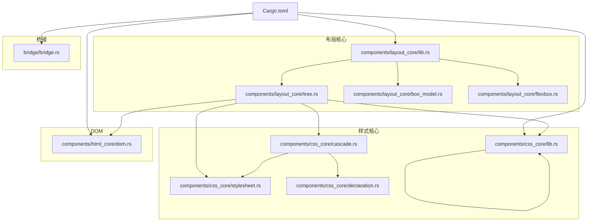
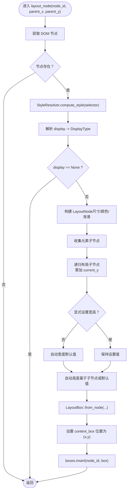
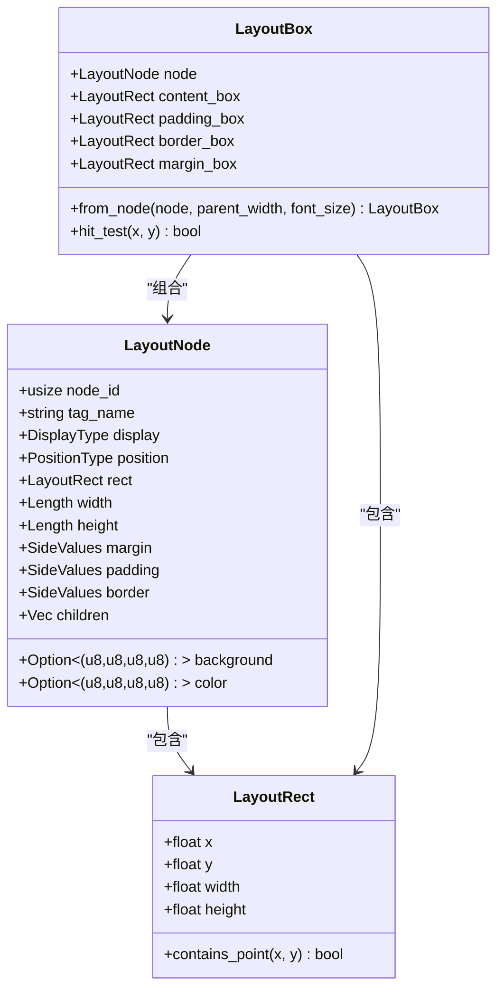
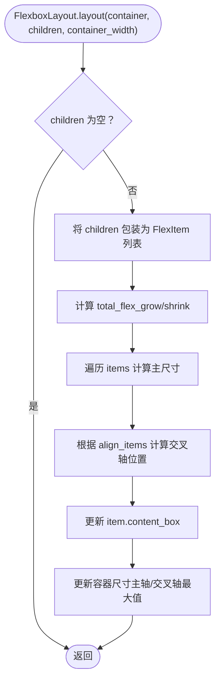
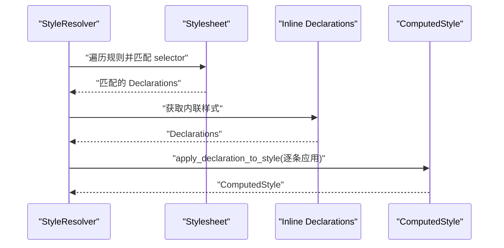
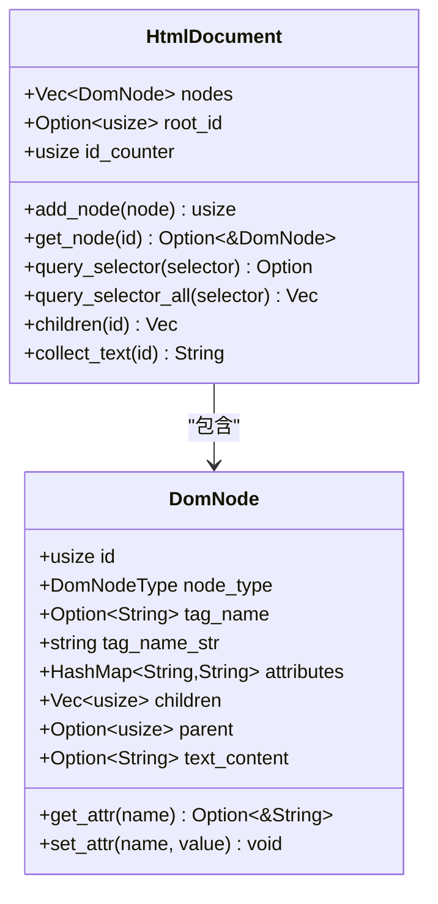
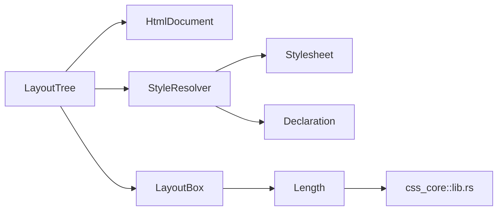

# 布局树构建

<cite>
**本文引用的文件**
- [lib.rs](file://components/layout_core/lib.rs)
- [tree.rs](file://components/layout_core/tree.rs)
- [box_model.rs](file://components/layout_core/box_model.rs)
- [flexbox.rs](file://components/layout_core/flexbox.rs)
- [dom.rs](file://components/html_core/dom.rs)
- [lib.rs](file://components/css_core/lib.rs)
- [cascade.rs](file://components/css_core/cascade.rs)
- [stylesheet.rs](file://components/css_core/stylesheet.rs)
- [declaration.rs](file://components/css_core/declaration.rs)
- [bridge.rs](file://bridge/bridge.rs)
- [Cargo.toml](file://Cargo.toml)
</cite>

## 目录
1. [简介](#简介)
2. [项目结构](#项目结构)
3. [核心组件](#核心组件)
4. [架构总览](#架构总览)
5. [详细组件分析](#详细组件分析)
6. [依赖关系分析](#依赖关系分析)
7. [性能考量](#性能考量)
8. [故障排查指南](#故障排查指南)
9. [结论](#结论)
10. [附录](#附录)

## 简介
本文件面向希望理解 Servo 无 SpiderMonkey 版本中“布局树构建”的读者，系统性阐述：
- 布局树的数据结构设计与节点关系维护
- 从 DOM 到布局树的转换流程（样式解析、盒模型计算、布局算法）
- 布局树的遍历策略与层级管理
- 递归布局算法（从根节点开始）与核心计算步骤
- 内存管理、节点缓存与增量更新策略
- 完整示例：如何将 DOM 结构转换为布局树
- 优化技巧与性能注意事项

## 项目结构
该仓库采用多模块工作区组织，布局核心位于 components/layout_core，样式解析位于 components/css_core，DOM 结构位于 components/html_core，桥接接口位于 bridge。



图表来源
- [Cargo.toml:1-37](file://Cargo.toml#L1-L37)
- [lib.rs:1-22](file://components/layout_core/lib.rs#L1-L22)
- [tree.rs:1-241](file://components/layout_core/tree.rs#L1-L241)
- [box_model.rs:1-210](file://components/layout_core/box_model.rs#L1-L210)
- [flexbox.rs:1-167](file://components/layout_core/flexbox.rs#L1-L167)
- [dom.rs:1-316](file://components/html_core/dom.rs#L1-L316)
- [lib.rs:1-207](file://components/css_core/lib.rs#L1-L207)
- [cascade.rs:1-271](file://components/css_core/cascade.rs#L1-L271)
- [stylesheet.rs:1-210](file://components/css_core/stylesheet.rs#L1-L210)
- [declaration.rs:1-18](file://components/css_core/declaration.rs#L1-L18)
- [bridge.rs:1-263](file://bridge/bridge.rs#L1-L263)

章节来源
- [Cargo.toml:1-37](file://Cargo.toml#L1-L37)

## 核心组件
- 布局树 LayoutTree：负责从 DOM 和样式计算结果生成布局盒，并进行递归布局计算；维护节点到布局盒的映射，提供命中测试与矩形查询。
- 盒模型 LayoutBox/LayoutNode/LayoutRect：描述元素的盒模型四层（content/padding/border/margin），以及尺寸、边距、内边距、边框等。
- Flexbox 布局器 FlexboxLayout：提供 Flex 方向、换行、对齐等参数下的主轴/交叉轴布局计算。
- 样式解析 StyleResolver/ComputedStyle：从样式表与内联样式中计算每个元素的最终样式。
- DOM HtmlDocument/DomNode：描述文档树结构，提供节点查询、父子关系与文本收集等能力。
- 长度单位 Length：统一处理 px/em/rem/%/auto 等 CSS 长度单位及换算。

章节来源
- [lib.rs:9-21](file://components/layout_core/lib.rs#L9-L21)
- [tree.rs:12-19](file://components/layout_core/tree.rs#L12-L19)
- [box_model.rs:25-210](file://components/layout_core/box_model.rs#L25-L210)
- [flexbox.rs:87-167](file://components/layout_core/flexbox.rs#L87-L167)
- [cascade.rs:86-271](file://components/css_core/cascade.rs#L86-L271)
- [dom.rs:115-316](file://components/html_core/dom.rs#L115-L316)
- [lib.rs:159-206](file://components/css_core/lib.rs#L159-L206)

## 架构总览
布局树构建的整体流程如下：
- 输入：HTML 文档（DOM）、CSS 样式表与内联样式
- 样式阶段：StyleResolver 基于选择器匹配与声明应用，输出 ComputedStyle
- 节点阶段：将 ComputedStyle 转换为 LayoutNode，并结合 Length 单位换算得到像素尺寸
- 盒模型阶段：LayoutBox.from_node 将 LayoutNode 转换为四层盒模型矩形
- 布局阶段：LayoutTree.layout_node 递归布局，计算每个节点的位置与尺寸
- 输出：布局树映射（节点 ID -> LayoutBox），支持命中测试与矩形查询

```mermaid
sequenceDiagram
participant Doc as "HtmlDocument"
participant Resolver as "StyleResolver"
participant Tree as "LayoutTree"
participant Box as "LayoutBox"
Doc->>Tree : "获取根节点 ID"
Tree->>Doc : "get_node(node_id)"
Tree->>Resolver : "compute_style(selector)"
Resolver-->>Tree : "ComputedStyle"
Tree->>Tree : "构建 LayoutNode尺寸/显示类型/颜色"
Tree->>Box : "LayoutBox : : from_node(LayoutNode, parent_width, font_size)"
Box-->>Tree : "content/padding/border/margin 矩形"
Tree->>Tree : "递归布局子节点并累加高度/间距"
Tree-->>Tree : "插入 boxes[node_id] = LayoutBox"
```

图表来源
- [tree.rs:61-159](file://components/layout_core/tree.rs#L61-L159)
- [box_model.rs:165-204](file://components/layout_core/box_model.rs#L165-L204)
- [cascade.rs:128-154](file://components/css_core/cascade.rs#L128-L154)
- [dom.rs:154-162](file://components/html_core/dom.rs#L154-L162)

## 详细组件分析

### 布局树 LayoutTree
- 数据结构
  - document：持有 HtmlDocument
  - style_resolver：持有 StyleResolver
  - boxes：HashMap<NodeId, LayoutBox>，缓存已计算的布局盒
  - viewport_width/viewport_height：视口尺寸，用于百分比换算
- 关键方法
  - new/new_empty：构造函数
  - set_viewport：设置视口
  - add_stylesheet/add_css/set_element_style：注入样式
  - layout：入口，清空缓存后从根节点开始递归布局
  - layout_node：核心递归算法
    - 通过 build_selector 生成选择器
    - 通过 StyleResolver.compute_style 获取 ComputedStyle
    - 解析 display，若为 None 则跳过
    - 构建 LayoutNode（含尺寸、颜色、背景等）
    - 收集元素子节点（过滤非 Element）
    - 递归布局子节点并累加纵向位置
    - 若未显式设置宽高，则按子节点计算高度或给默认值
    - 调用 LayoutBox::from_node 生成四层盒模型矩形
    - 将节点位置设置为 (parent_x, parent_y)，并将结果放入 boxes
  - build_selector：优先 ID，其次标签名，再拼接类选择器
  - parse_display：将字符串映射到 DisplayType
  - all_rects/hit_test/get_rect：查询布局结果



图表来源
- [tree.rs:71-159](file://components/layout_core/tree.rs#L71-L159)

章节来源
- [tree.rs:12-241](file://components/layout_core/tree.rs#L12-L241)

### 盒模型与矩形
- LayoutRect：包含 x/y/width/height
- LayoutNode：包含节点 ID、标签名、显示类型、定位类型、尺寸、边距/内边距/边框、颜色、背景、子节点列表
- LayoutBox：包含 LayoutNode 与四层矩形（content/padding/border/margin）
- from_node：根据父宽与字体大小，将 Length 转换为像素，计算四层矩形
- hit_test：基于 border_box 进行命中测试



图表来源
- [box_model.rs:5-210](file://components/layout_core/box_model.rs#L5-L210)

章节来源
- [box_model.rs:5-210](file://components/layout_core/box_model.rs#L5-L210)

### Flexbox 布局器
- FlexDirection/FlexWrap/AlignItems/JustifyContent：控制容器布局方向、换行与对齐
- FlexItem：包装 LayoutBox，记录 flex-grow/shrink/basis 等
- FlexboxLayout.layout：按主轴/交叉轴计算子项位置与尺寸，更新容器尺寸



图表来源
- [flexbox.rs:106-166](file://components/layout_core/flexbox.rs#L106-L166)

章节来源
- [flexbox.rs:1-167](file://components/layout_core/flexbox.rs#L1-L167)

### 样式解析与选择器匹配
- ComputedStyle：聚合背景、前景、宽高、display、position、内外边距、边框、字体等属性
- StyleResolver：支持添加样式表、内联样式、设置元素内联样式；compute_style 合并规则与内联样式并应用声明
- 选择器匹配：精确匹配、通配符、ID、类、标签、多选择器
- 颜色解析：支持 hex、rgb/rgba、颜色名称与渐变首色提取
- 长度解析：px/em/rem/%/auto，to_px 需要父尺寸与字体大小



图表来源
- [cascade.rs:128-154](file://components/css_core/cascade.rs#L128-L154)
- [stylesheet.rs:191-202](file://components/css_core/stylesheet.rs#L191-L202)
- [lib.rs:43-102](file://components/css_core/lib.rs#L43-L102)
- [lib.rs:169-206](file://components/css_core/lib.rs#L169-L206)

章节来源
- [cascade.rs:86-271](file://components/css_core/cascade.rs#L86-L271)
- [stylesheet.rs:1-210](file://components/css_core/stylesheet.rs#L1-L210)
- [declaration.rs:1-18](file://components/css_core/declaration.rs#L1-L18)
- [lib.rs:1-207](file://components/css_core/lib.rs#L1-L207)

### DOM 结构与查询
- HtmlDocument：维护节点数组、根节点 ID、ID 分配器；提供 add_node、get_node、query_selector/query_selector_all、父子查询、文本收集等
- DomNode：包含节点类型、标签名、属性、子节点列表、父节点、文本内容



图表来源
- [dom.rs:115-316](file://components/html_core/dom.rs#L115-L316)

章节来源
- [dom.rs:1-316](file://components/html_core/dom.rs#L1-L316)

### 长度单位与颜色工具
- Length：统一解析 px/em/rem/%/auto，并提供 to_px(parent, font_size)
- color_from_name/parse_color：颜色解析与名称映射

章节来源
- [lib.rs:159-206](file://components/css_core/lib.rs#L159-L206)
- [lib.rs:43-102](file://components/css_core/lib.rs#L43-L102)

## 依赖关系分析
- 组件耦合
  - LayoutTree 依赖 HtmlDocument、StyleResolver、Length、LayoutBox
  - StyleResolver 依赖 Stylesheet、Declaration、颜色解析工具
  - LayoutBox 依赖 Length
- 外部依赖
  - 工作区 Cargo.toml 中声明了 euclid、tiny-skia、png、taffy、rayon、rustc-hash、url 等库，可用于渲染、几何、并行与网络等扩展功能



图表来源
- [tree.rs:3-8](file://components/layout_core/tree.rs#L3-L8)
- [cascade.rs:86-90](file://components/css_core/cascade.rs#L86-L90)
- [stylesheet.rs:13-18](file://components/css_core/stylesheet.rs#L13-L18)
- [declaration.rs:3-8](file://components/css_core/declaration.rs#L3-L8)
- [box_model.rs:3-3](file://components/layout_core/box_model.rs#L3-L3)
- [lib.rs:159-167](file://components/css_core/lib.rs#L159-L167)

章节来源
- [Cargo.toml:19-37](file://Cargo.toml#L19-L37)

## 性能考量
- 时间复杂度
  - 样式计算：O(Rules + Declarations)，选择器匹配与声明应用线性
  - 布局递归：O(N) 遍历 DOM 节点，每节点常数时间（含子节点递归）
- 空间复杂度
  - boxes 缓存：O(N) 存储每个节点对应的 LayoutBox
  - DOM 与样式表：O(DOM + Rules + Declarations)
- 优化建议
  - 选择器索引：Stylesheet 已内置 selector_index，可进一步利用减少重复匹配
  - 缓存策略：LayoutTree.clear 在每次布局前清空 boxes，避免脏数据；可考虑增量更新时仅重建受影响子树
  - 单位换算：to_px 需要父尺寸与字体大小，尽量在上层传入稳定上下文，减少重复计算
  - 并行化：工作区引入 rayon，可在大规模布局时考虑并行化子树处理（需谨慎处理共享状态）

[本节为通用性能讨论，无需特定文件来源]

## 故障排查指南
- 样式未生效
  - 检查选择器是否正确（build_selector 优先 ID，其次标签名，再拼类）
  - 确认内联样式优先级高于样式表
- 布局异常
  - display: none 的节点不会参与布局
  - 自动宽高：若未显式设置，会按子节点计算高度或使用默认值
- 命中测试
  - hit_test 基于 border_box，确保元素具有可见边框或 padding
- 查询布局
  - all_rects 返回节点 ID、标签名、矩形与背景色
  - get_rect 通过选择器查询矩形

章节来源
- [tree.rs:161-239](file://components/layout_core/tree.rs#L161-L239)
- [box_model.rs:206-209](file://components/layout_core/box_model.rs#L206-L209)

## 结论
本布局系统以“样式 -> 节点 -> 盒模型 -> 布局树”的清晰路径实现 DOM 到布局树的转换。通过 StyleResolver 的声明合并与 ComputedStyle 的集中存储，LayoutTree 的 layout_node 递归算法简洁高效。盒模型与 Flexbox 布局器提供了良好的扩展性。建议在实际工程中结合选择器索引与增量更新策略，进一步提升性能与可维护性。

[本节为总结，无需特定文件来源]

## 附录

### 示例：从 DOM 到布局树的完整流程
- 步骤
  1) 构造 HtmlDocument 并添加节点（元素/文本/注释）
  2) 构造 StyleResolver，添加样式表或内联样式
  3) 调用 LayoutTree::new(document)，设置视口
  4) 调用 LayoutTree::layout 开始递归布局
  5) 通过 all_rects/hit_test/get_rect 获取布局结果
- 注意
  - display: none 的节点会被跳过
  - 未显式设置宽高的元素会按子节点计算高度或使用默认值
  - 盒模型由 LayoutBox::from_node 生成，包含 content/padding/border/margin 矩形

章节来源
- [tree.rs:21-69](file://components/layout_core/tree.rs#L21-L69)
- [dom.rs:115-173](file://components/html_core/dom.rs#L115-L173)
- [box_model.rs:165-204](file://components/layout_core/box_model.rs#L165-L204)