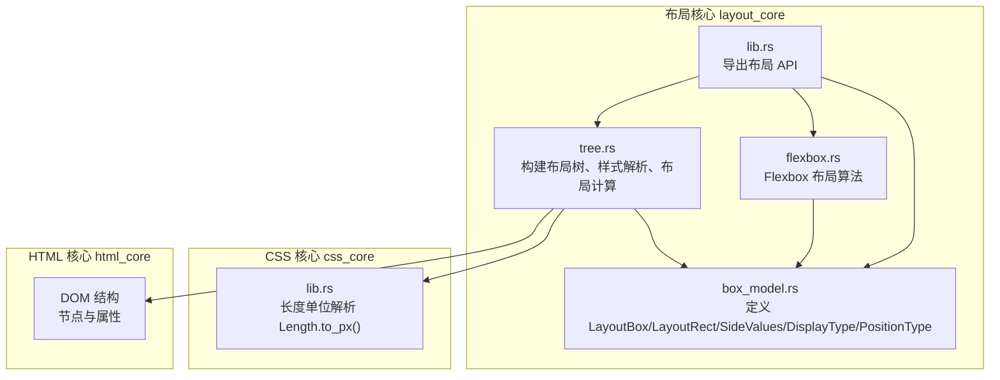
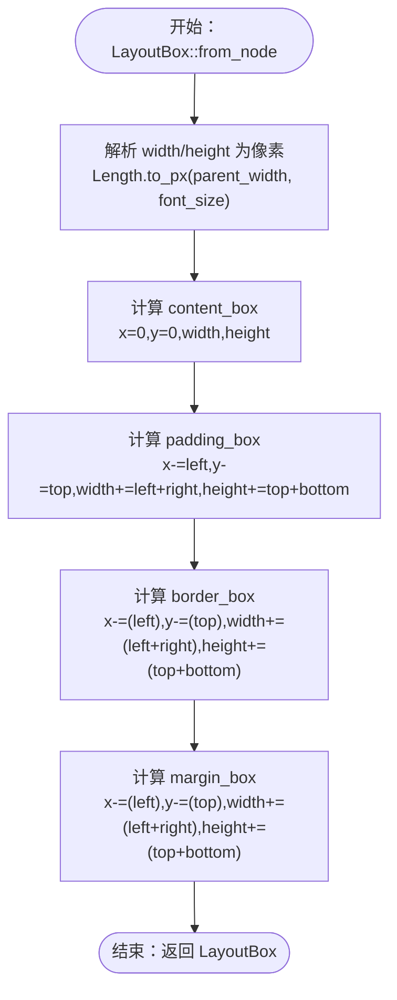
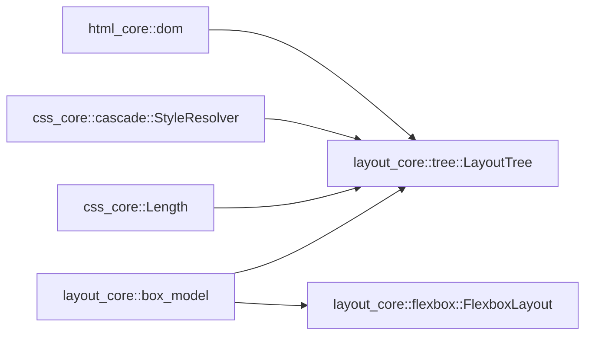

# 盒模型实现

<cite>
**本文引用的文件**
- [box_model.rs](file://components/layout_core/box_model.rs)
- [tree.rs](file://components/layout_core/tree.rs)
- [lib.rs](file://components/layout_core/lib.rs)
- [flexbox.rs](file://components/layout_core/flexbox.rs)
- [lib.rs](file://components/css_core/lib.rs)
- [README.md](file://README.md)
</cite>

## 目录
1. [简介](#简介)
2. [项目结构](#项目结构)
3. [核心组件](#核心组件)
4. [架构总览](#架构总览)
5. [详细组件分析](#详细组件分析)
6. [依赖关系分析](#依赖关系分析)
7. [性能考量](#性能考量)
8. [故障排查指南](#故障排查指南)
9. [结论](#结论)
10. [附录](#附录)

## 简介
本文件系统性阐述 Servo-Zero 中的盒模型实现，重点覆盖以下方面：
- LayoutBox、LayoutRect 与相关类型的定义与用途
- 盒模型尺寸计算规则：内容区、内边距、边框、外边距的层级关系与计算流程
- 不同显示类型（DisplayType）对盒模型的影响
- 定位类型（PositionType）在布局中的处理逻辑
- 盒模型在布局计算中的作用：尺寸约束、溢出与重叠检测
- 实际示例：从 CSS 尺寸到最终布局尺寸的转换过程
- 调试技巧与常见问题解决方案

## 项目结构
本项目采用模块化设计，布局核心位于 layout_core，CSS 核心位于 css_core，HTML 核心位于 html_core。盒模型实现集中在 layout_core 的 box_model.rs，并由 tree.rs 驱动整体布局流程。



图表来源
- [box_model.rs:1-210](file://components/layout_core/box_model.rs#L1-L210)
- [tree.rs:1-241](file://components/layout_core/tree.rs#L1-L241)
- [flexbox.rs:1-167](file://components/layout_core/flexbox.rs#L1-L167)
- [lib.rs:1-22](file://components/layout_core/lib.rs#L1-L22)
- [lib.rs:159-206](file://components/css_core/lib.rs#L159-L206)

章节来源
- [README.md:16-31](file://README.md#L16-L31)
- [lib.rs:1-22](file://components/layout_core/lib.rs#L1-L22)

## 核心组件
本节聚焦盒模型相关的核心数据结构与枚举类型，解释其职责与相互关系。

- LayoutRect：表示二维矩形，包含 x、y、width、height，用于描述盒模型各层级的位置与尺寸。
- SideValues：四边值结构，包含 top、right、bottom、left，用于统一处理 margin/padding/border 的四向配置。
- LayoutNode：布局节点，承载元素的显示类型、定位类型、尺寸（width/height）、盒模型四边值等信息。
- LayoutBox：盒模型容器，包含 content_box、padding_box、border_box、margin_box 四层矩形，以及原始 LayoutNode。
- DisplayType：显示类型枚举，控制元素是否参与布局及布局方式（none/block/inline/inline-block/flex/grid）。
- PositionType：定位类型枚举，控制元素的定位策略（static/relative/absolute/fixed）。

章节来源
- [box_model.rs:5-23](file://components/layout_core/box_model.rs#L5-L23)
- [box_model.rs:95-153](file://components/layout_core/box_model.rs#L95-L153)
- [box_model.rs:25-61](file://components/layout_core/box_model.rs#L25-L61)
- [box_model.rs:155-209](file://components/layout_core/box_model.rs#L155-L209)
- [box_model.rs:63-93](file://components/layout_core/box_model.rs#L63-L93)

## 架构总览
盒模型在布局流程中的位置如下：DOM 节点经由样式解析得到 ComputedStyle，随后生成 LayoutNode，再通过 LayoutBox::from_node 计算四层盒模型，最终由 LayoutTree 统一管理与查询。

```mermaid
sequenceDiagram
participant DOM as "DOM 节点"
participant Resolver as "样式解析器"
participant Tree as "布局树 LayoutTree"
participant Node as "LayoutNode"
participant Box as "LayoutBox"
DOM->>Resolver : "构建选择器并解析样式"
Resolver-->>Tree : "ComputedStyle"
Tree->>Tree : "解析 DisplayType/PositionType"
Tree->>Node : "构造 LayoutNode含 width/height/margin/padding/border"
Node-->>Tree : "LayoutNode"
Tree->>Box : "LayoutBox : : from_node(LayoutNode, parent_width, font_size)"
Box-->>Tree : "content_box/padding_box/border_box/margin_box"
Tree-->>Tree : "存储盒模型并提供查询/命中测试"
```

图表来源
- [tree.rs:71-159](file://components/layout_core/tree.rs#L71-L159)
- [box_model.rs:165-204](file://components/layout_core/box_model.rs#L165-L204)

## 详细组件分析

### LayoutRect：盒模型几何基元
- 字段：x、y、width、height，均以浮点数表示，便于精确布局。
- 方法：
  - new：构造函数
  - contains_point：判断点是否落入矩形内部，用于命中测试

章节来源
- [box_model.rs:5-23](file://components/layout_core/box_model.rs#L5-L23)

### SideValues：四边值与解析
- 字段：top、right、bottom、left，用于统一表达 margin/padding/border。
- 方法：
  - uniform：生成均匀四边值
  - parse：解析 CSS 方言字符串（支持 1/2/3/4 个值的简写），返回对应四边值

章节来源
- [box_model.rs:95-153](file://components/layout_core/box_model.rs#L95-L153)

### LayoutNode：布局节点承载
- 字段：node_id、tag_name、display、position、rect、background、color、width、height、margin、padding、border、children
- 行为：
  - new：默认 display 为 Block，position 为 Static，rect 初始为空，width/height 默认 Auto，margin/padding/border 默认为零

章节来源
- [box_model.rs:25-61](file://components/layout_core/box_model.rs#L25-L61)

### LayoutBox：盒模型容器
- 字段：node、content_box、padding_box、border_box、margin_box
- 关键方法：
  - from_node：基于 LayoutNode 与父宽、字体大小，计算 content_box、padding_box、border_box、margin_box 的位置与尺寸
  - hit_test：基于 border_box 进行命中测试

尺寸计算流程（from_node 内部）：
- 将 width/height 从 CSS 长度转换为像素（依赖 Length.to_px）
- content_box：以 (0,0) 为中心，宽高为转换后的 width/height（非负）
- padding_box：在 content_box 基础上分别向四周扩展 padding 的对应边
- border_box：在 padding_box 基础上反向扩展 border 的对应边
- margin_box：在 border_box 基础上反向扩展 margin 的对应边

章节来源
- [box_model.rs:155-209](file://components/layout_core/box_model.rs#L155-L209)
- [lib.rs:159-206](file://components/css_core/lib.rs#L159-L206)

### DisplayType：显示类型对盒模型的影响
- None：元素不参与布局，不生成盒模型
- Block：块级元素，通常独占一行
- Inline：内联元素，与其他内联元素在同一行
- InlineBlock：内联块，既保持内联特性又允许设置宽高
- Flex/Grid：进入相应布局模式（Flexbox/Grid）

在 LayoutTree::layout_node 中，会读取 ComputedStyle 的 display 属性并解析为 DisplayType；若为 None，则直接跳过该节点的布局。

章节来源
- [box_model.rs:63-78](file://components/layout_core/box_model.rs#L63-L78)
- [tree.rs:190-200](file://components/layout_core/tree.rs#L190-L200)

### PositionType：定位类型处理逻辑
- Static：静态定位，默认流式布局
- Relative：相对定位，偏移量相对于自身正常位置
- Absolute/Fixed：绝对定位，脱离文档流，定位参考视口或最近的定位祖先

当前实现中，LayoutNode 的 position 初始化为 Static；在 tree.rs 的布局过程中未见对 position 的专门处理逻辑（如偏移）。因此，定位类型对盒模型的直接影响在当前版本中未体现。

章节来源
- [box_model.rs:80-93](file://components/layout_core/box_model.rs#L80-L93)
- [tree.rs:86-88](file://components/layout_core/tree.rs#L86-L88)

### 盒模型尺寸计算规则与层级关系
- 内容区（content_box）：元素实际内容区域，宽高由 CSS width/height 转换而来
- 内边距（padding_box）：在内容区基础上向外扩展 padding
- 边框（border_box）：在内边距基础上向外扩展 border
- 外边距（margin_box）：在边框基础上向外扩展 margin
- 命中测试：hit_test 使用 border_box 判断点击是否落在元素上



图表来源
- [box_model.rs:165-204](file://components/layout_core/box_model.rs#L165-L204)
- [lib.rs:196-206](file://components/css_core/lib.rs#L196-L206)

章节来源
- [box_model.rs:165-209](file://components/layout_core/box_model.rs#L165-L209)

### 盒模型在布局计算中的作用
- 尺寸约束：content_box 的宽高决定后续 padding/border/margin 的边界
- 溢出处理：当前实现未显式处理溢出（overflow），仅按盒模型矩形进行渲染
- 重叠检测：hit_test 基于 border_box，可检测点击是否落在元素上；tree.rs 的 hit_test 返回命中列表并按插入顺序逆序，确保最上层元素优先被选中

章节来源
- [box_model.rs:206-209](file://components/layout_core/box_model.rs#L206-L209)
- [tree.rs:217-232](file://components/layout_core/tree.rs#L217-L232)

### 实际示例：从 CSS 尺寸到最终布局尺寸的转换
- 输入：元素的 CSS width/height（可能为 px/em/rem/%/auto），以及 margin/padding/border 的四边值
- 上下文：父容器宽度 parent_width、字体大小 font_size
- 步骤：
  1) 使用 Length.to_px 将 width/height 转换为像素
  2) 以 (0,0) 为中心生成 content_box
  3) 依据 padding 四边扩展生成 padding_box
  4) 依据 border 四边扩展生成 border_box
  5) 依据 margin 四边扩展生成 margin_box
- 输出：LayoutBox（包含 content_box/padding_box/border_box/margin_box）

章节来源
- [box_model.rs:165-204](file://components/layout_core/box_model.rs#L165-L204)
- [lib.rs:196-206](file://components/css_core/lib.rs#L196-L206)

### Flexbox 与盒模型的协同
- Flexbox 布局器接收 LayoutBox 列表，基于主轴/交叉轴计算每个子项的 content_box 位置与尺寸
- FlexItem 从 LayoutBox 克隆，结合 flex-grow/flex-shrink 等属性调整主轴尺寸
- 最终更新容器 content_box 的尺寸（例如在行方向时取最大高度）

章节来源
- [flexbox.rs:87-167](file://components/layout_core/flexbox.rs#L87-L167)

## 依赖关系分析
- LayoutTree 依赖：
  - html_core::dom：DOM 节点与属性
  - css_core::cascade：样式解析与 ComputedStyle
  - css_core::Length：长度单位解析与 to_px
  - box_model：LayoutBox/LayoutNode/LayoutRect/DisplayType/PositionType
- Flexbox 依赖 box_model::LayoutBox



图表来源
- [tree.rs:3-8](file://components/layout_core/tree.rs#L3-L8)
- [flexbox.rs:3](file://components/layout_core/flexbox.rs#L3)

章节来源
- [tree.rs:3-8](file://components/layout_core/tree.rs#L3-L8)
- [flexbox.rs:3](file://components/layout_core/flexbox.rs#L3)

## 性能考量
- 盒模型计算为 O(1) 操作，主要开销来自样式解析与 DOM 遍历
- 当前布局树遍历为单次 DFS，时间复杂度近似 O(N)，其中 N 为元素数量
- 若引入复杂布局（如 Grid/Flex 的多轮计算），建议：
  - 缓存中间结果（如已转换的长度值）
  - 合理拆分计算阶段（先计算 content_box，再计算 padding/border/margin）
  - 在命中测试时优先使用包围盒（如 border_box）减少逐像素检测

## 故障排查指南
- 元素不显示
  - 检查 DisplayType 是否为 None（None 不参与布局）
  - 检查 width/height 是否为 Auto 且无子元素导致高度未计算
- 点击无效
  - 检查 hit_test 是否落在 border_box 内
  - 确认元素 z-index（通过插入顺序逆序实现）与遮挡关系
- 尺寸异常
  - 检查 CSS 长度单位（px/em/rem/%）与父宽/字体大小的转换
  - 确认 margin/padding/border 是否正确叠加
- 定位偏移无效
  - 当前 PositionType 未影响布局位置，需在布局阶段增加定位偏移逻辑

章节来源
- [tree.rs:82-84](file://components/layout_core/tree.rs#L82-L84)
- [tree.rs:133-147](file://components/layout_core/tree.rs#L133-L147)
- [box_model.rs:206-209](file://components/layout_core/box_model.rs#L206-L209)
- [lib.rs:196-206](file://components/css_core/lib.rs#L196-L206)

## 结论
本实现提供了清晰的盒模型抽象：LayoutBox 以四层矩形完整表达 CSS 盒模型，配合 LayoutTree 的样式解析与布局流程，实现了从 CSS 到像素布局的转换。当前版本对 DisplayType 的处理较为直接，PositionType 的影响尚未体现在布局位置中。未来可在以下方面增强：
- 引入更完善的溢出与重叠处理
- 扩展 PositionType 的布局偏移逻辑
- 优化复杂布局场景下的计算与缓存策略

## 附录
- API 导出：layout_core::lib.rs 将 LayoutBox、LayoutRect、LayoutNode、DisplayType、PositionType、FlexboxLayout、LayoutTree 暴露给外部使用
- 示例用法：README.md 展示了如何通过桥接层设置 HTML/CSS 并进行事件绑定与渲染

章节来源
- [lib.rs:9-11](file://components/layout_core/lib.rs#L9-L11)
- [README.md:81-118](file://README.md#L81-L118)