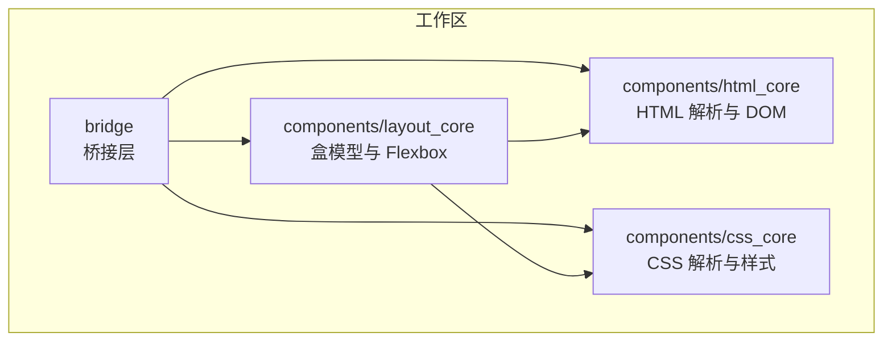
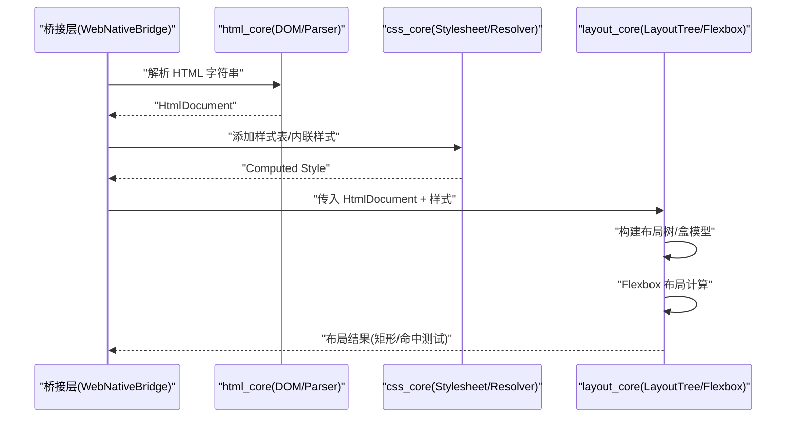
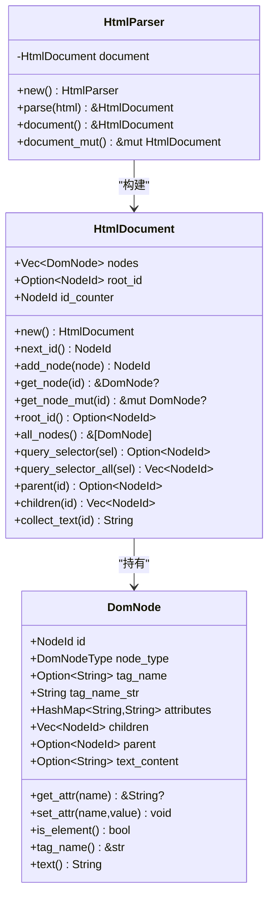
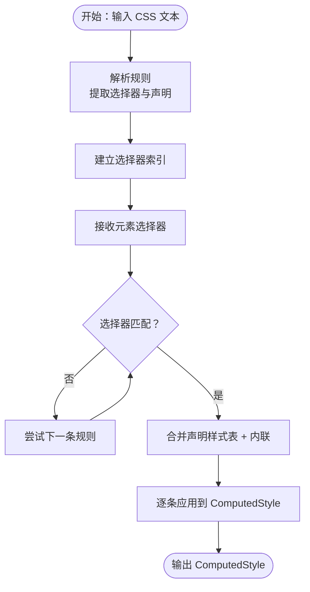
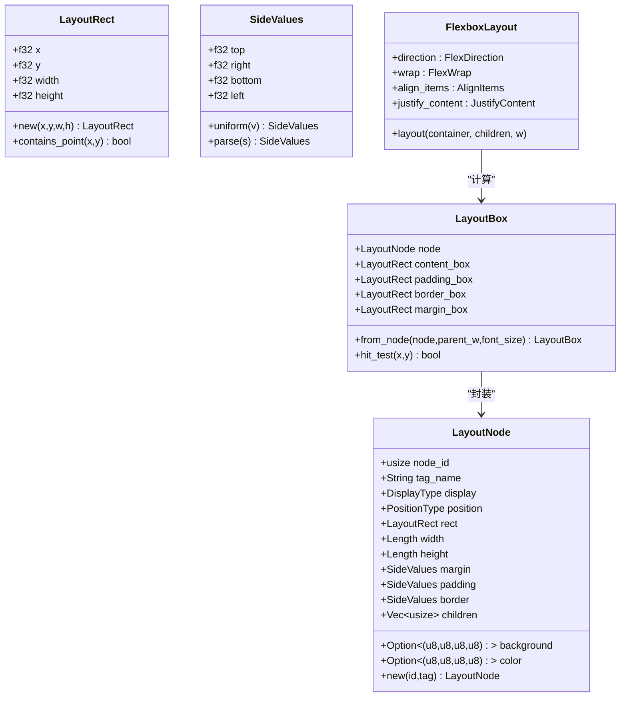
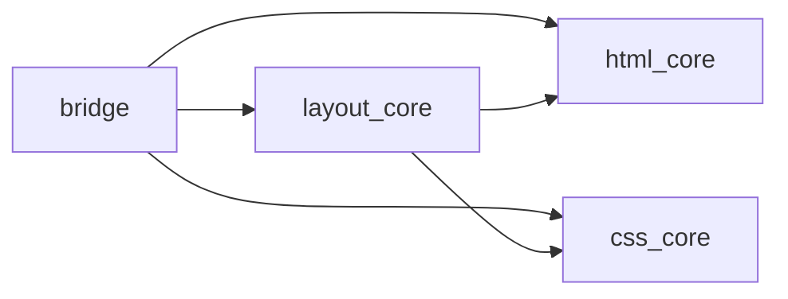

# 核心组件

<cite>
**本文引用的文件**
- [README.md](file://README.md)
- [Cargo.toml](file://Cargo.toml)
- [components/html_core/lib.rs](file://components/html_core/lib.rs)
- [components/html_core/dom.rs](file://components/html_core/dom.rs)
- [components/html_core/parser.rs](file://components/html_core/parser.rs)
- [components/css_core/lib.rs](file://components/css_core/lib.rs)
- [components/css_core/stylesheet.rs](file://components/css_core/stylesheet.rs)
- [components/css_core/declaration.rs](file://components/css_core/declaration.rs)
- [components/css_core/cascade.rs](file://components/css_core/cascade.rs)
- [components/layout_core/lib.rs](file://components/layout_core/lib.rs)
- [components/layout_core/box_model.rs](file://components/layout_core/box_model.rs)
- [components/layout_core/flexbox.rs](file://components/layout_core/flexbox.rs)
- [components/layout_core/tree.rs](file://components/layout_core/tree.rs)
- [bridge/lib.rs](file://bridge/lib.rs)
- [bridge/bridge.rs](file://bridge/bridge.rs)
</cite>

## 目录
1. [简介](#简介)
2. [项目结构](#项目结构)
3. [核心组件](#核心组件)
4. [架构总览](#架构总览)
5. [详细组件分析](#详细组件分析)
6. [依赖分析](#依赖分析)
7. [性能考虑](#性能考虑)
8. [故障排查指南](#故障排查指南)
9. [结论](#结论)
10. [附录](#附录)

## 简介
本文件面向开发者，系统性梳理 Servo-Zero 的三大核心组件：html_core（HTML 解析与 DOM）、css_core（CSS 解析、级联与样式计算）、layout_core（盒模型与 Flexbox 布局），并说明它们之间的数据流与协作方式。同时提供 API 参考、使用示例与算法实现要点，帮助读者深入理解该渲染引擎的工作原理。

## 项目结构
Servo-Zero 采用多 crate 工作区组织，核心由 bridge（桥接层）与 components（html_core / css_core / layout_core）组成。README 对整体架构与特性进行了概述；Cargo.toml 描述了工作区成员与依赖。

图表来源
- [README.md:16-31](file://README.md#L16-L31)
- [Cargo.toml:1-7](file://Cargo.toml#L1-L7)

章节来源
- [README.md:16-31](file://README.md#L16-L31)
- [Cargo.toml:1-7](file://Cargo.toml#L1-L7)

## 核心组件
- html_core：基于纯 Rust 的 HTML5 解析器，生成 DOM 树，提供节点查询与遍历能力。
- css_core：CSS 解析、选择器匹配、级联与样式计算，包含颜色与长度解析工具。
- layout_core：基于盒模型与 Flexbox 的布局引擎，负责计算元素矩形区域并支持命中测试。

章节来源
- [README.md:43-48](file://README.md#L43-L48)
- [components/html_core/lib.rs:1-15](file://components/html_core/lib.rs#L1-L15)
- [components/css_core/lib.rs:1-12](file://components/css_core/lib.rs#L1-L12)
- [components/layout_core/lib.rs:1-12](file://components/layout_core/lib.rs#L1-L12)

## 架构总览
下图展示三者之间的依赖关系与数据传递路径：桥接层通过 html_core 生成 DOM，通过 css_core 进行样式解析与计算，再由 layout_core 生成布局树并进行 Flexbox 计算，最终驱动渲染。

图表来源
- [components/layout_core/tree.rs:61-159](file://components/layout_core/tree.rs#L61-L159)
- [components/css_core/cascade.rs:129-154](file://components/css_core/cascade.rs#L129-L154)
- [components/html_core/parser.rs:18-22](file://components/html_core/parser.rs#L18-L22)

## 详细组件分析

### HTML 解析与 DOM（html_core）
- 功能概要
  - 提供 HtmlParser 以字符串形式解析 HTML，生成 HtmlDocument。
  - HtmlDocument 维护节点列表、根节点 ID 与节点分配策略，并提供查询与遍历能力。
- 关键数据结构
  - DomNodeType：文档、元素、文本、注释、文档类型、片段。
  - DomNode：包含节点 ID、类型、标签名、属性、父子关系、文本内容等。
  - HtmlDocument：管理节点集合、分配唯一 ID、提供查询与文本收集。
- 解析流程
  - HtmlParser.parse 接收 HTML 字符串，递归处理注释、文本与标签，构建 DOM 树并维护父子关系。
- 查询与遍历
  - 支持按 ID、类、标签的简单选择器查询，以及遍历收集文本内容。
- API 参考（摘自导出）
  - HtmlParser：new()/parse()/document()/document_mut()
  - HtmlDocument：new()/add_node()/get_node()/query_selector()/all_nodes()/collect_text()
  - new_document()

图表来源
- [components/html_core/dom.rs:19-121](file://components/html_core/dom.rs#L19-L121)
- [components/html_core/dom.rs:116-172](file://components/html_core/dom.rs#L116-L172)
- [components/html_core/parser.rs:5-152](file://components/html_core/parser.rs#L5-L152)

章节来源
- [components/html_core/lib.rs:1-15](file://components/html_core/lib.rs#L1-L15)
- [components/html_core/dom.rs:1-316](file://components/html_core/dom.rs#L1-L316)
- [components/html_core/parser.rs:1-153](file://components/html_core/parser.rs#L1-L153)

### CSS 解析、级联与样式计算（css_core）
- 功能概要
  - Stylesheet：从 CSS 文本解析规则，建立选择器索引，便于快速匹配。
  - Declaration：表示单条属性声明。
  - StyleResolver：合并样式表与内联样式，执行选择器匹配，应用声明到 ComputedStyle。
  - 提供颜色解析（名称、十六进制、rgb/rgba、渐变首色提取）与长度单位解析（px/em/rem/%/auto）。
- 关键数据结构
  - CssRule：选择器 + 声明列表。
  - Stylesheet：规则数组 + 选择器索引。
  - Declaration：property/value。
  - ComputedStyle：汇总背景、前景、尺寸、定位、内外边距、边框、字体等。
- 选择器匹配与样式计算
  - 支持精确匹配、通配符、ID、类、标签、多选择器逗号分隔。
  - 内联样式优先级最高，随后叠加样式表规则。
- API 参考（摘自导出）
  - Stylesheet：new()/from_str()/parse()/add_rule()/get_rules_for()/all_rules()
  - Declaration：new()
  - StyleResolver：new()/add_stylesheet()/add_css()/set_inline_style()/set_element_style()/compute_style()/clear()
  - 工具函数：color_from_name()/parse_color()/Length::parse()/Length::to_px()

图表来源
- [components/css_core/stylesheet.rs:30-106](file://components/css_core/stylesheet.rs#L30-L106)
- [components/css_core/cascade.rs:129-154](file://components/css_core/cascade.rs#L129-L154)
- [components/css_core/cascade.rs:156-198](file://components/css_core/cascade.rs#L156-L198)
- [components/css_core/cascade.rs:200-257](file://components/css_core/cascade.rs#L200-L257)

章节来源
- [components/css_core/lib.rs:1-207](file://components/css_core/lib.rs#L1-L207)
- [components/css_core/stylesheet.rs:1-210](file://components/css_core/stylesheet.rs#L1-L210)
- [components/css_core/declaration.rs:1-18](file://components/css_core/declaration.rs#L1-L18)
- [components/css_core/cascade.rs:1-271](file://components/css_core/cascade.rs#L1-L271)

### 盒模型与 Flexbox 布局（layout_core）
- 功能概要
  - LayoutTree：整合 HtmlDocument 与 StyleResolver，构建布局树，计算每个节点的 LayoutBox（内容/内边距/边框/外边距盒）。
  - FlexboxLayout：实现 Flexbox 方向、换行、对齐等算法，计算主轴与交叉轴尺寸与位置。
  - 支持命中测试、矩形查询、视口设置。
- 关键数据结构
  - LayoutRect：x/y/width/height。
  - LayoutNode：节点元信息（显示类型、定位类型、尺寸、边距/内边距/边框、背景/前景、子节点）。
  - LayoutBox：由 LayoutNode 与上下文推导出四层盒。
  - FlexDirection/FlexWrap/AlignItems/JustifyContent：Flex 参数枚举。
  - FlexItem：包装 LayoutBox 并携带 flex-grow/shrink/basis 等。
- 布局流程
  - 从根节点开始，递归遍历元素节点，构建 LayoutNode，计算宽高与盒模型，再进行 Flexbox 布局。
  - 支持根据子节点自动调整容器尺寸。
- API 参考（摘自导出）
  - LayoutTree：new()/new_empty()/document()/document_mut()/set_viewport()/add_stylesheet()/add_css()/set_element_style()/layout()/all_rects()/hit_test()/get_rect()
  - FlexboxLayout：layout(container, children, container_width)
  - 盒模型：LayoutBox::from_node()/hit_test()

图表来源
- [components/layout_core/box_model.rs:5-210](file://components/layout_core/box_model.rs#L5-L210)
- [components/layout_core/flexbox.rs:1-167](file://components/layout_core/flexbox.rs#L1-L167)

章节来源
- [components/layout_core/lib.rs:1-22](file://components/layout_core/lib.rs#L1-L22)
- [components/layout_core/box_model.rs:1-210](file://components/layout_core/box_model.rs#L1-L210)
- [components/layout_core/flexbox.rs:1-167](file://components/layout_core/flexbox.rs#L1-L167)
- [components/layout_core/tree.rs:1-241](file://components/layout_core/tree.rs#L1-L241)

## 依赖分析
- 模块耦合
  - layout_core 依赖 html_core（DOM 节点信息）与 css_core（ComputedStyle/Length）。
  - bridge 作为上层入口，协调三者并暴露统一 API。
- 外部依赖
  - taffy：Flexbox 布局算法（在 README 中提及，但源码中未直接出现，可能在桥接实现中使用）。
  - euclid/tiny-skia/png/log/serde 等运行时依赖。
- 特性开关
  - network/embed：控制网络功能与嵌入模式（见 README 与 Cargo.toml）。

图表来源
- [README.md:136-156](file://README.md#L136-L156)
- [Cargo.toml:19-37](file://Cargo.toml#L19-L37)

章节来源
- [README.md:136-156](file://README.md#L136-L156)
- [Cargo.toml:19-37](file://Cargo.toml#L19-L37)

## 性能考虑
- DOM 遍历与样式匹配
  - html_core 的查询采用深度优先搜索，复杂度与节点数线性相关；建议尽量使用具体选择器（如 ID）减少匹配范围。
  - css_core 的选择器匹配与声明合并为线性扫描，建议控制规则数量与选择器复杂度。
- 盒模型与 Flexbox 计算
  - layout_core 的布局树构建为一次遍历，Flexbox 计算涉及多项聚合（如总 flex-grow），注意容器与子项数量。
- 实践建议
  - 合理拆分样式表，避免过多通配与深层嵌套。
  - 在高频交互场景中，缓存布局结果并在视口变化时增量更新。

## 故障排查指南
- HTML 解析异常
  - 现象：解析后 DOM 缺失节点或属性错误。
  - 排查：确认输入 HTML 是否包含非法标签、未闭合标签或注释干扰；检查 HtmlParser 的递归解析逻辑。
- 样式未生效
  - 现象：元素未按预期显示背景/尺寸/定位。
  - 排查：核对选择器匹配是否正确；确认内联样式的优先级高于样式表；检查 Length 解析与父尺寸上下文。
- 布局错位或尺寸异常
  - 现象：元素重叠、溢出或尺寸为 0。
  - 排查：检查 DisplayType 与 PositionType；确认 Flexbox 参数与容器尺寸；验证盒模型四层盒计算。
- 命中测试失败
  - 现象：点击无响应。
  - 排查：确认 hit_test 坐标系与布局矩形一致；检查 z-index（通过返回顺序判断）。

章节来源
- [components/html_core/parser.rs:24-135](file://components/html_core/parser.rs#L24-L135)
- [components/css_core/cascade.rs:156-198](file://components/css_core/cascade.rs#L156-L198)
- [components/layout_core/box_model.rs:166-209](file://components/layout_core/box_model.rs#L166-L209)
- [components/layout_core/tree.rs:217-232](file://components/layout_core/tree.rs#L217-L232)

## 结论
Servo-Zero 通过 html_core、css_core、layout_core 的清晰分工与稳定接口，实现了从 HTML 到布局再到渲染的完整链路。开发者可在桥接层之上以统一 API 操控 DOM、样式与布局，并结合 tiny-skia 进行渲染输出。建议在工程实践中遵循选择器与样式设计规范，关注布局树构建与 Flexbox 计算的性能开销，以获得更稳定的运行表现。

## 附录

### 组件间数据流与 API 参考（摘要）
- html_core
  - HtmlParser::parse → HtmlDocument
  - HtmlDocument::query_selector/query_selector_all → NodeId
- css_core
  - Stylesheet::from_str → Stylesheet
  - StyleResolver::compute_style → ComputedStyle
  - color_from_name/parse_color/Length::parse/Length::to_px
- layout_core
  - LayoutTree::layout → 布局树（含盒模型）
  - FlexboxLayout::layout → 子项定位与尺寸
  - LayoutTree::all_rects/hit_test/get_rect → 查询与命中测试

章节来源
- [components/html_core/parser.rs:18-22](file://components/html_core/parser.rs#L18-L22)
- [components/html_core/dom.rs:174-202](file://components/html_core/dom.rs#L174-L202)
- [components/css_core/lib.rs:13-102](file://components/css_core/lib.rs#L13-L102)
- [components/css_core/cascade.rs:129-154](file://components/css_core/cascade.rs#L129-L154)
- [components/layout_core/tree.rs:61-159](file://components/layout_core/tree.rs#L61-L159)
- [components/layout_core/flexbox.rs:106-165](file://components/layout_core/flexbox.rs#L106-L165)
- [components/layout_core/box_model.rs:166-209](file://components/layout_core/box_model.rs#L166-L209)