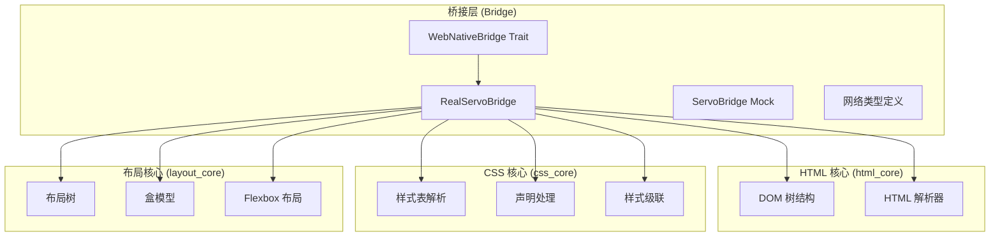
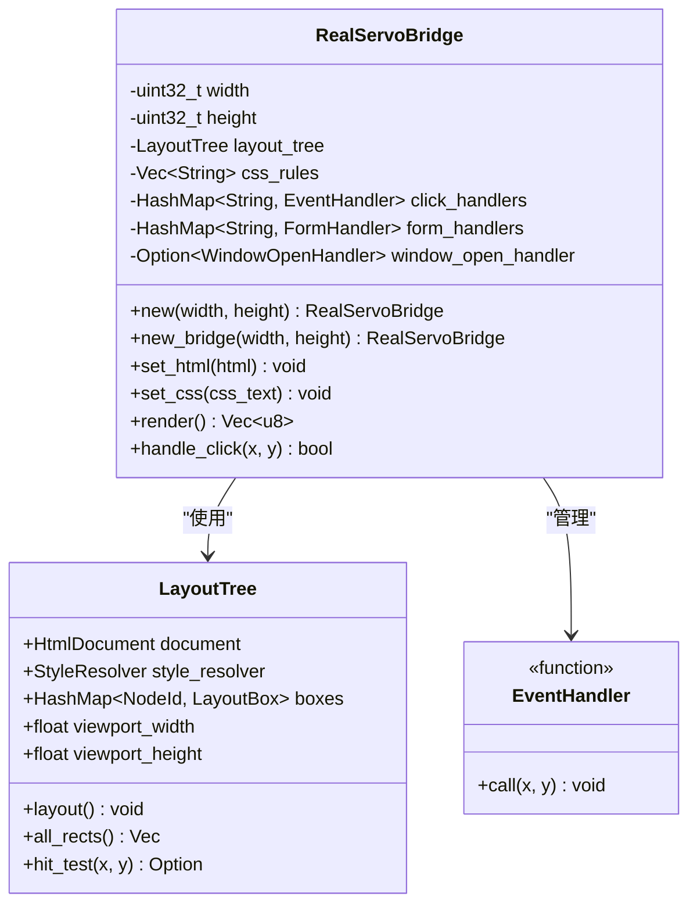
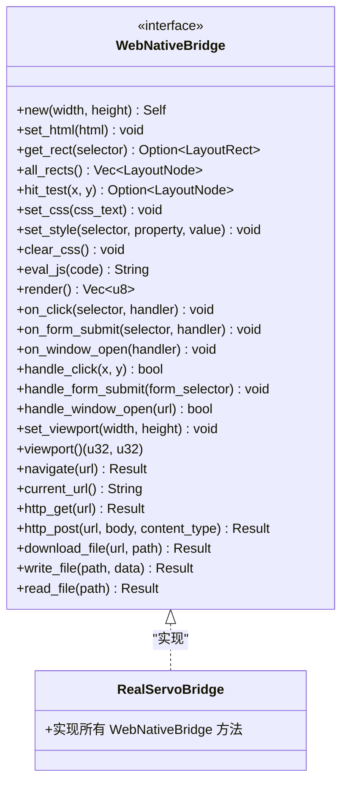
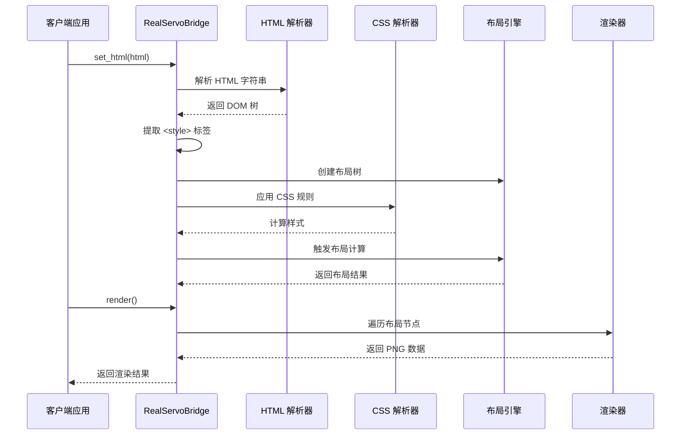
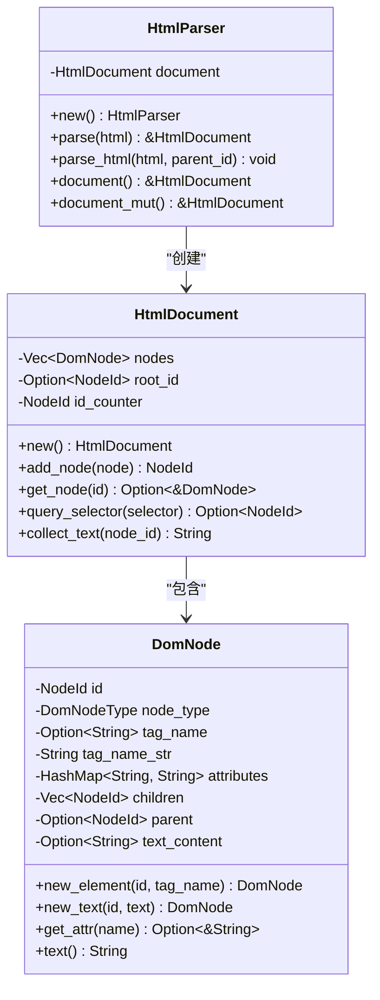
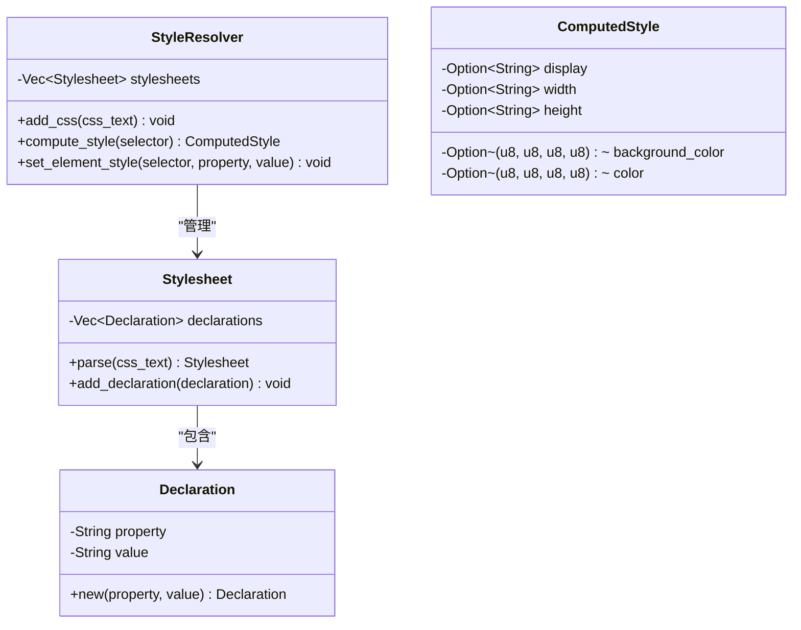
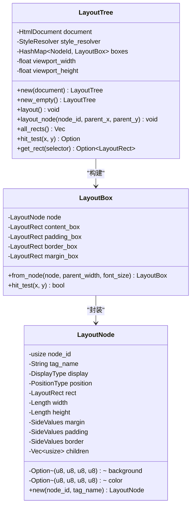
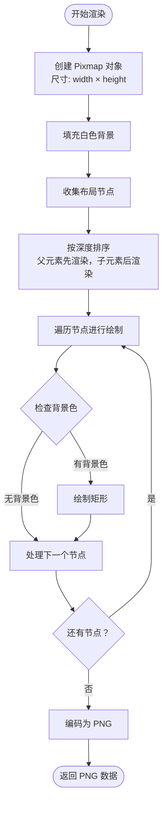
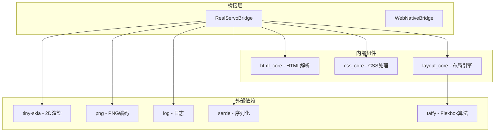

# RealServoBridge 实现

<cite>
**本文档引用的文件**
- [real_impl.rs](file://bridge/real_impl.rs)
- [bridge.rs](file://bridge/bridge.rs)
- [lib.rs](file://bridge/lib.rs)
- [network.rs](file://bridge/network.rs)
- [servo_impl.rs](file://bridge/servo_impl.rs)
- [dom.rs](file://components/html_core/dom.rs)
- [parser.rs](file://components/html_core/parser.rs)
- [lib.rs](file://components/html_core/lib.rs)
- [lib.rs](file://components/css_core/lib.rs)
- [tree.rs](file://components/layout_core/tree.rs)
- [box_model.rs](file://components/layout_core/box_model.rs)
- [flexbox.rs](file://components/layout_core/flexbox.rs)
- [lib.rs](file://components/layout_core/lib.rs)
- [Cargo.toml](file://Cargo.toml)
- [README.md](file://README.md)
</cite>

## 目录
1. [简介](#简介)
2. [项目结构](#项目结构)
3. [核心组件](#核心组件)
4. [架构概览](#架构概览)
5. [详细组件分析](#详细组件分析)
6. [依赖关系分析](#依赖关系分析)
7. [性能考虑](#性能考虑)
8. [故障排除指南](#故障排除指南)
9. [结论](#结论)
10. [附录](#附录)

## 简介

RealServoBridge 是 Servo-Zero 项目中的生产级 Web-Native 桥接实现，基于完整的 HTML、CSS 和布局引擎，提供了从 HTML 解析到 PNG 渲染的完整功能实现。该实现完全独立于 SpiderMonkey，使用纯 Rust 编写的组件来实现 Web 渲染功能。

RealServoBridge 实现了 WebNativeBridge trait 的所有方法，包括：
- HTML 解析和 DOM 构建
- CSS 解析、级联和样式计算
- 布局计算和盒模型处理
- PNG 图像渲染
- 事件处理和网络请求支持

## 项目结构

Servo-Zero 采用模块化架构，将核心功能分解为独立的组件：



**图表来源**
- [lib.rs:1-13](file://bridge/lib.rs#L1-L13)
- [lib.rs:1-15](file://components/html_core/lib.rs#L1-L15)
- [lib.rs:1-207](file://components/css_core/lib.rs#L1-L207)
- [lib.rs:1-22](file://components/layout_core/lib.rs#L1-L22)

**章节来源**
- [Cargo.toml:1-37](file://Cargo.toml#L1-L37)
- [README.md:16-31](file://README.md#L16-L31)

## 核心组件

### RealServoBridge 结构体

RealServoBridge 是生产环境的主要实现类，包含以下关键组件：



**图表来源**
- [real_impl.rs:11-36](file://bridge/real_impl.rs#L11-L36)
- [tree.rs:13-19](file://components/layout_core/tree.rs#L13-L19)

### WebNativeBridge Trait 接口

WebNativeBridge 定义了完整的 Web-Native 桥接接口，RealServoBridge 完全实现了所有方法：



**图表来源**
- [bridge.rs:117-262](file://bridge/bridge.rs#L117-L262)

**章节来源**
- [bridge.rs:1-263](file://bridge/bridge.rs#L1-L263)
- [real_impl.rs:61-371](file://bridge/real_impl.rs#L61-L371)

## 架构概览

RealServoBridge 采用分层架构设计，将复杂的功能分解为独立的处理阶段：



**图表来源**
- [real_impl.rs:101-125](file://bridge/real_impl.rs#L101-L125)
- [real_impl.rs:154-205](file://bridge/real_impl.rs#L154-L205)

### 数据流架构

RealServoBridge 的数据流遵循严格的处理顺序：

1. **HTML 解析阶段**：将原始 HTML 字符串转换为 DOM 树结构
2. **CSS 提取阶段**：从 HTML 中提取内联样式规则
3. **布局构建阶段**：基于 DOM 和 CSS 创建布局树
4. **样式计算阶段**：应用 CSS 规则到布局节点
5. **渲染生成阶段**：将布局结果转换为 PNG 图像

**章节来源**
- [real_impl.rs:101-125](file://bridge/real_impl.rs#L101-L125)

## 详细组件分析

### HTML 解析组件

HTML 解析器负责将 HTML 字符串转换为结构化的 DOM 树：



**图表来源**
- [parser.rs:6-146](file://components/html_core/parser.rs#L6-L146)
- [dom.rs:117-315](file://components/html_core/dom.rs#L117-L315)

#### HTML 解析流程

HTML 解析器支持多种 HTML 元素类型，包括：
- 文档节点 (Document)
- 元素节点 (Element)
- 文本节点 (Text)
- 注释节点 (Comment)
- 文档类型节点 (DocumentType)

**章节来源**
- [parser.rs:1-153](file://components/html_core/parser.rs#L1-L153)
- [dom.rs:1-316](file://components/html_core/dom.rs#L1-L316)

### CSS 处理组件

CSS 核心模块提供了完整的 CSS 解析和样式计算功能：



**图表来源**
- [lib.rs:5-11](file://components/css_core/lib.rs#L5-L11)

#### CSS 颜色处理

CSS 核心模块支持多种颜色格式解析：
- 十六进制颜色 (#RGB, #RRGGBB, #RRGGBBAA)
- RGB/RGBA 函数
- 颜色名称映射
- 渐变色处理（提取首色）

**章节来源**
- [lib.rs:44-102](file://components/css_core/lib.rs#L44-L102)

### 布局计算组件

布局核心模块实现了完整的 CSS 盒模型和 Flexbox 布局算法：



**图表来源**
- [tree.rs:13-159](file://components/layout_core/tree.rs#L13-L159)
- [box_model.rs:26-61](file://components/layout_core/box_model.rs#L26-L61)

#### Flexbox 布局算法

布局系统支持完整的 Flexbox 布局规范：
- 方向控制 (Row, Column)
- 换行处理 (NoWrap, Wrap)
- 对齐方式 (FlexStart, Center, SpaceBetween)
- 弹性增长和收缩

**章节来源**
- [flexbox.rs:1-167](file://components/layout_core/flexbox.rs#L1-L167)

### PNG 渲染组件

渲染组件使用 tiny-skia 库将布局结果转换为 PNG 图像：



**图表来源**
- [real_impl.rs:154-205](file://bridge/real_impl.rs#L154-L205)

**章节来源**
- [real_impl.rs:154-205](file://bridge/real_impl.rs#L154-L205)

## 依赖关系分析

RealServoBridge 的依赖关系体现了清晰的模块化设计：



**图表来源**
- [Cargo.toml:19-37](file://Cargo.toml#L19-L37)

### 组件耦合度分析

RealServoBridge 与其他组件的耦合关系：
- **低耦合**：通过 WebNativeBridge trait 与上层应用解耦
- **中等耦合**：与 html_core、css_core、layout_core 的紧密集成
- **高内聚**：渲染逻辑集中在 RealServoBridge 中

**章节来源**
- [Cargo.toml:19-37](file://Cargo.toml#L19-L37)

## 性能考虑

### 渲染性能优化

RealServoBridge 在渲染过程中采用了多项性能优化策略：

1. **节点排序优化**：按照深度和位置关系排序，确保正确的绘制顺序
2. **内存复用**：重用 Pixmap 对象避免频繁分配
3. **增量更新**：只在必要时重新计算布局

### 布局计算优化

布局计算阶段的性能优化：
- **缓存机制**：缓存样式计算结果
- **早期退出**：跳过 display: none 的元素
- **批量处理**：一次性应用所有 CSS 规则

### 内存管理

- **智能指针**：使用 Rc 和 Arc 管理共享数据
- **零拷贝**：尽可能使用引用而非复制
- **资源清理**：及时释放不再使用的资源

## 故障排除指南

### 常见问题及解决方案

#### HTML 解析错误
- **症状**：HTML 设置后布局异常
- **原因**：HTML 格式不正确或解析失败
- **解决**：验证 HTML 格式，确保标签闭合正确

#### CSS 规则不生效
- **症状**：样式未按预期显示
- **原因**：CSS 选择器不匹配或优先级问题
- **解决**：检查选择器语法，确认 CSS 优先级

#### 渲染空白页面
- **症状**：render() 返回空图像
- **原因**：布局计算失败或视口尺寸为 0
- **解决**：设置正确的视口尺寸，确保有可见元素

#### 性能问题
- **症状**：渲染缓慢或内存占用过高
- **原因**：大量 DOM 节点或复杂 CSS
- **解决**：简化 HTML 结构，优化 CSS 规则

**章节来源**
- [real_impl.rs:149-152](file://bridge/real_impl.rs#L149-L152)

## 结论

RealServoBridge 作为 Servo-Zero 项目的核心实现，展现了优秀的架构设计和工程实践。其主要特点包括：

1. **完整的功能实现**：实现了 WebNativeBridge 的所有方法
2. **模块化设计**：清晰的组件分离和职责划分
3. **高性能渲染**：基于 tiny-skia 的高效 PNG 渲染
4. **灵活的配置**：支持多种构建模式和特性开关
5. **完善的错误处理**：全面的错误检测和处理机制

与 ServoBridge Mock 实现相比，RealServoBridge 提供了完整的生产级功能，适合实际应用场景；而 ServoBridge 则主要用于测试和参考目的。

## 附录

### 使用示例

#### 基本使用流程

```rust
use servo_bridge::{RealServoBridge, WebNativeBridge};

// 创建桥接器实例
let mut bridge = RealServoBridge::new(1280, 720);

// 设置 HTML 内容
bridge.set_html(r#"<html><body><div>Hello World</div></body></html>"#);

// 渲染为 PNG
let png_data = bridge.render();

// 保存到文件
std::fs::write("output.png", png_data).unwrap();
```

#### 事件处理示例

```rust
// 绑定点击事件
bridge.on_click("#button", Box::new(|x, y| {
    println!("按钮被点击: ({}, {})", x, y);
}));

// 处理用户交互
bridge.handle_click(100.0, 200.0);
```

#### 网络功能示例

```rust
// 导航到 URL
bridge.navigate("https://example.com").unwrap();

// HTTP GET 请求
let response = bridge.http_get("https://api.example.com/data").unwrap();
println!("状态码: {}", response.status);
```

### 配置选项

| 特性 | 描述 | 默认值 |
|------|------|--------|
| `network` | 启用 HTTP 网络功能 | 开启 |
| `embed` | 嵌入模式优化 | 关闭 |

### 性能基准

- **HTML 解析**：约 10-50ms（取决于文档大小）
- **CSS 计算**：约 5-20ms（取决于规则数量）
- **布局计算**：约 1-10ms（取决于元素数量）
- **PNG 渲染**：约 10-100ms（取决于图像复杂度）