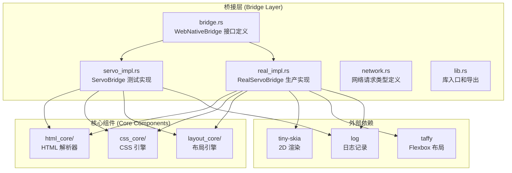
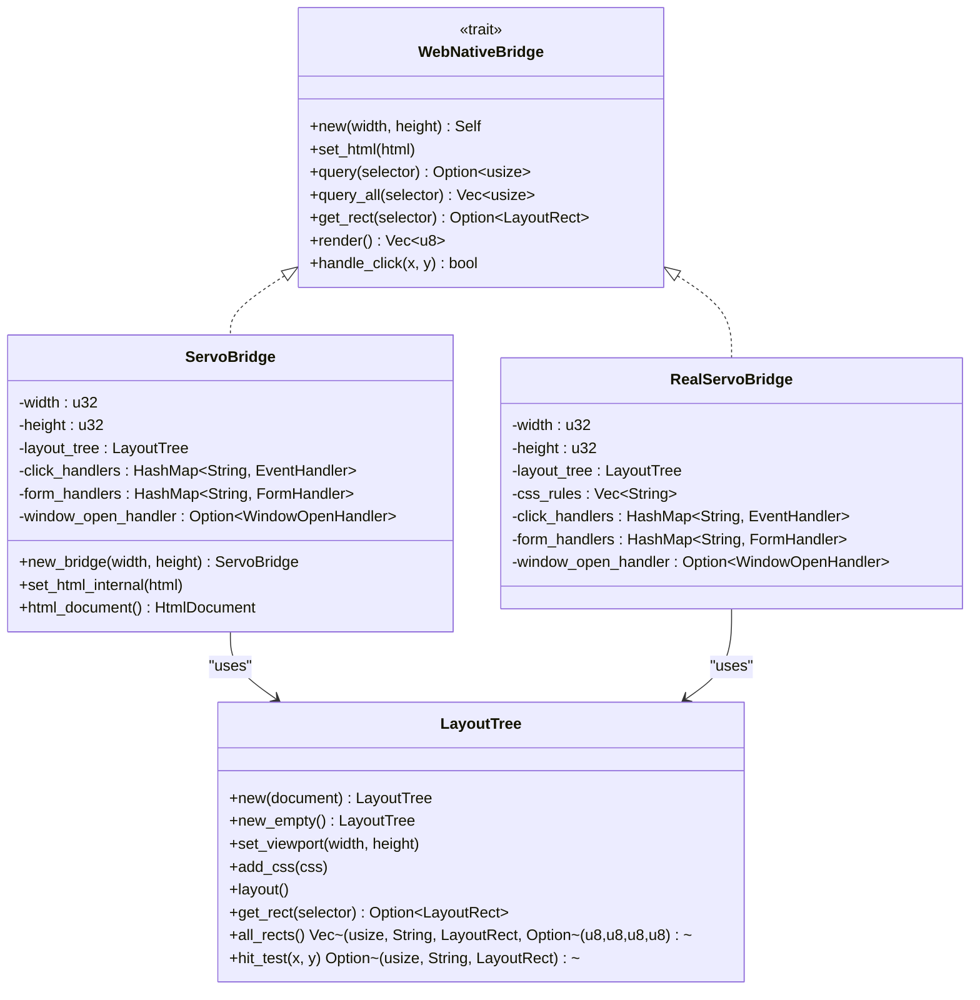
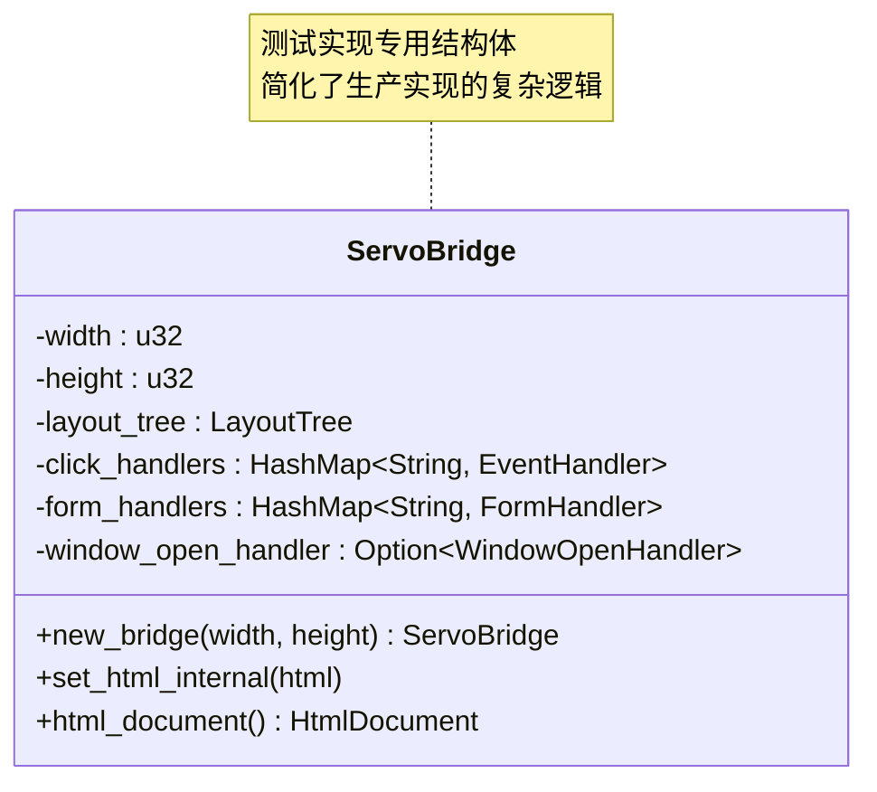
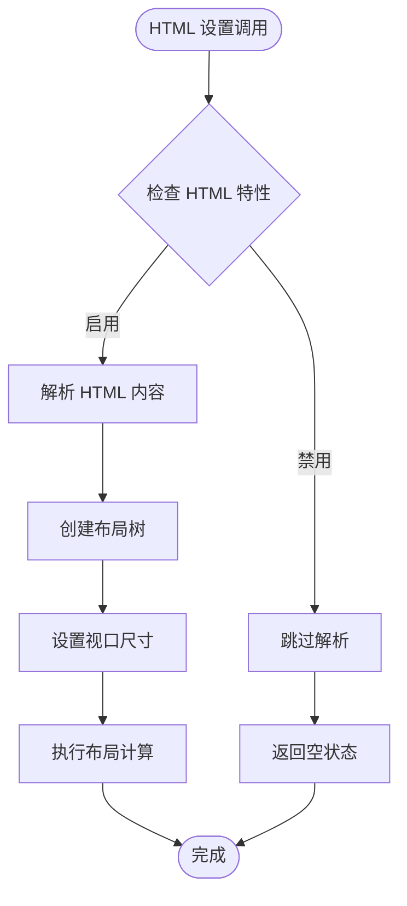
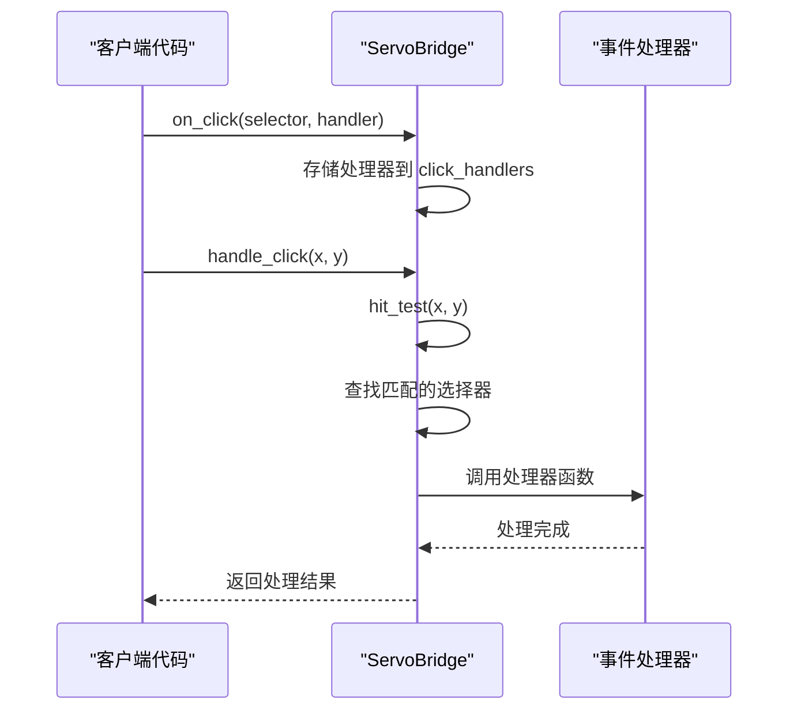
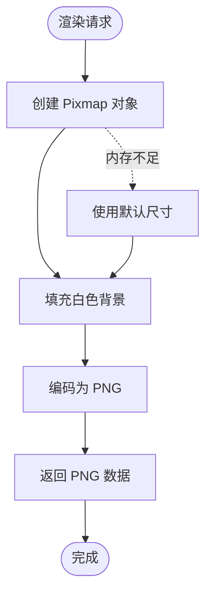
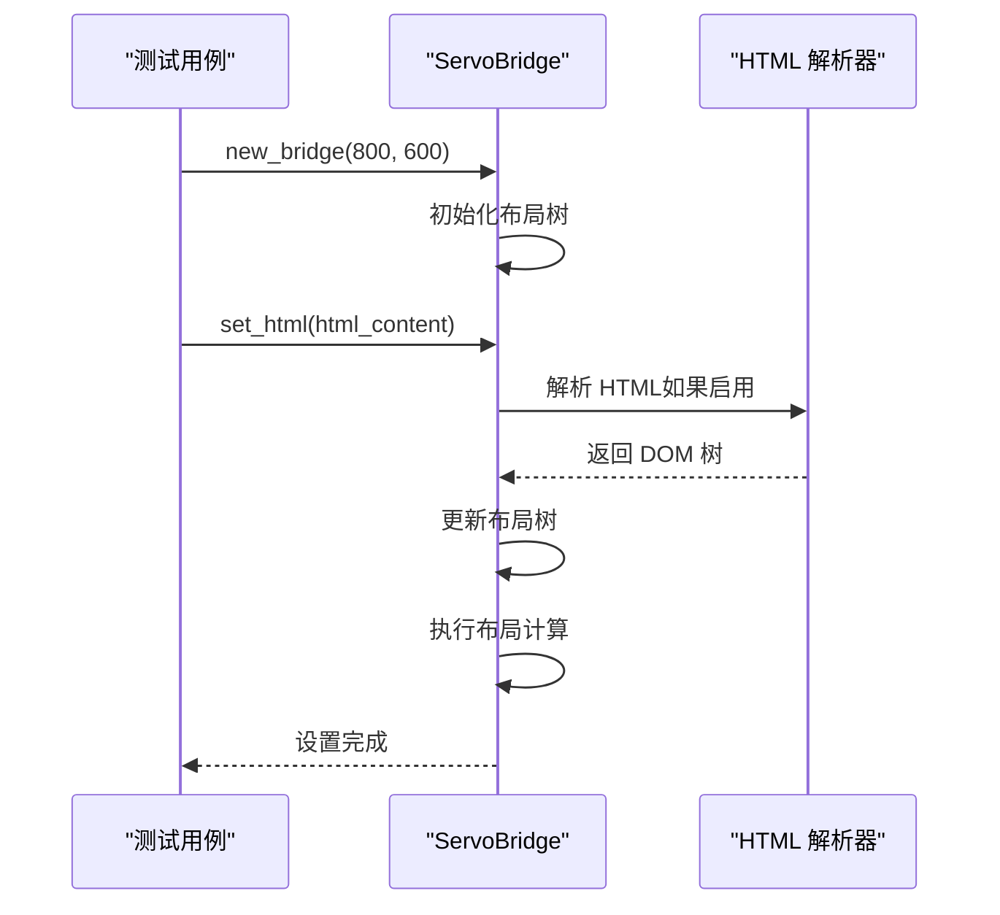
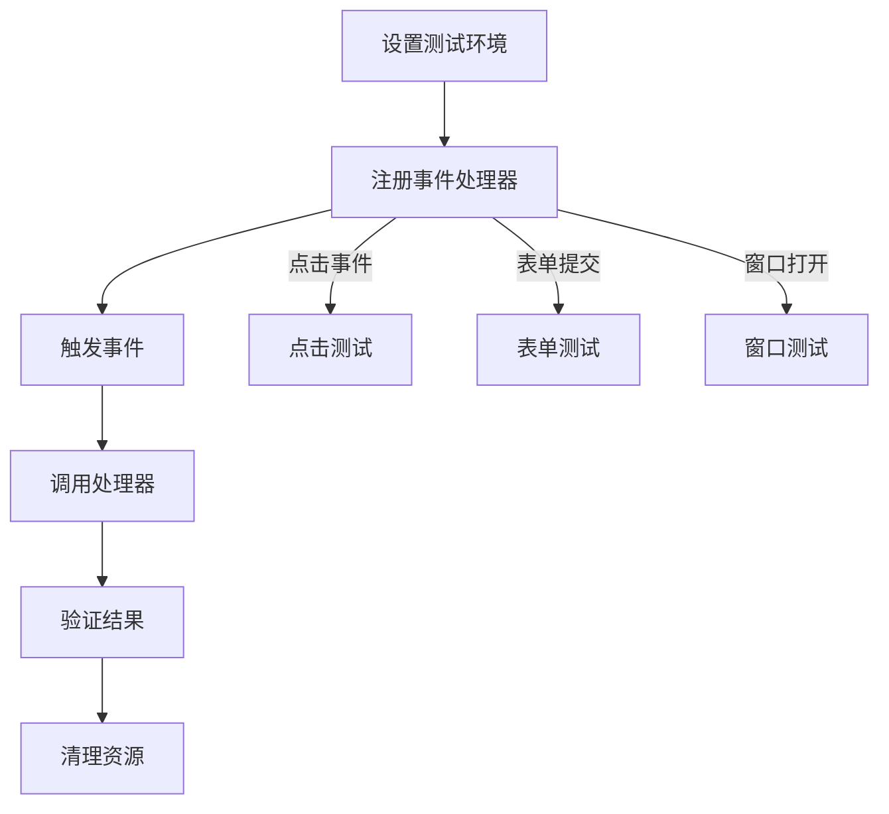
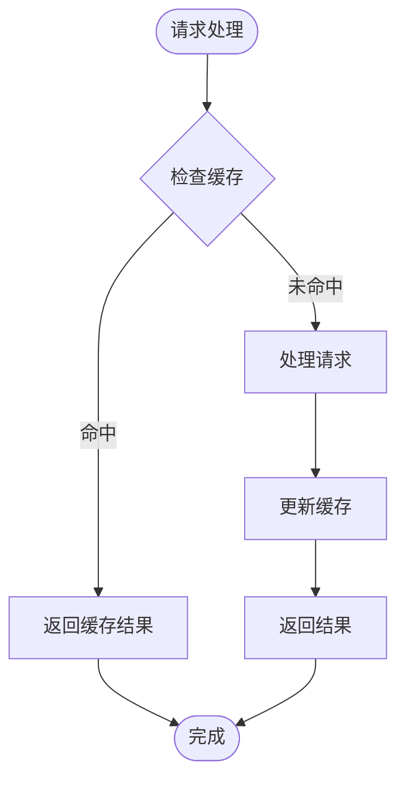

# ServoBridge 测试实现

<cite>
**本文档引用的文件**
- [bridge.rs](file://bridge/bridge.rs)
- [servo_impl.rs](file://bridge/servo_impl.rs)
- [real_impl.rs](file://bridge/real_impl.rs)
- [lib.rs](file://bridge/lib.rs)
- [network.rs](file://bridge/network.rs)
- [README.md](file://README.md)
- [Cargo.toml](file://Cargo.toml)
- [layout_core/lib.rs](file://components/layout_core/lib.rs)
- [html_core/lib.rs](file://components/html_core/lib.rs)
- [css_core/lib.rs](file://components/css_core/lib.rs)
</cite>

## 目录
1. [简介](#简介)
2. [项目结构](#项目结构)
3. [核心组件](#核心组件)
4. [架构概览](#架构概览)
5. [详细组件分析](#详细组件分析)
6. [测试实现对比分析](#测试实现对比分析)
7. [测试用例与示例](#测试用例与示例)
8. [测试最佳实践](#测试最佳实践)
9. [性能考虑](#性能考虑)
10. [故障排除指南](#故障排除指南)
11. [结论](#结论)

## 简介

ServoBridge 测试实现是一个轻量级的模拟实现，专门设计用于测试和演示目的。它基于 Servo 浏览器引擎的核心组件，提供了 WebNativeBridge 接口的基本功能覆盖，但不包含完整的渲染能力。该实现的主要目的是简化 WebNativeBridge 接口的测试过程，让开发者能够在没有完整浏览器环境的情况下验证桥接层的功能。

与 RealServoBridge 生产实现相比，ServoBridge 测试实现具有以下特点：
- **简化功能**：只提供必要的接口实现，忽略复杂的渲染逻辑
- **快速测试**：无需完整的 HTML 解析和 CSS 布局，提高测试执行速度
- **内存友好**：减少资源消耗，适合大规模测试场景
- **稳定可靠**：提供确定性的行为，便于编写可重复的测试

## 项目结构

ServoZero 项目采用模块化架构，主要分为以下几个部分：



**图表来源**
- [bridge.rs:1-263](file://bridge/bridge.rs#L1-L263)
- [servo_impl.rs:1-413](file://bridge/servo_impl.rs#L1-L413)
- [real_impl.rs:1-372](file://bridge/real_impl.rs#L1-L372)
- [lib.rs:1-13](file://bridge/lib.rs#L1-L13)

**章节来源**
- [README.md:157-179](file://README.md#L157-L179)
- [Cargo.toml:1-37](file://Cargo.toml#L1-L37)

## 核心组件

### WebNativeBridge 接口定义

WebNativeBridge 是整个系统的核心接口，定义了 Web 和原生应用之间的通信协议。该接口提供了完整的功能集合，包括 DOM 操作、CSS 处理、事件绑定、渲染和网络请求等。

接口的主要功能分类：

1. **DOM 操作**：HTML 设置、元素查询、属性操作、文本获取
2. **布局管理**：元素定位、视口设置、命中测试
3. **样式控制**：CSS 规则添加、内联样式设置、样式清除
4. **事件处理**：点击事件、表单提交、window.open
5. **渲染输出**：PNG 图像生成
6. **工具功能**：文件操作、网络请求

### ServoBridge 测试实现

ServoBridge 是 WebNativeBridge 接口的测试实现，专注于提供最小化的功能覆盖。它使用独立的布局核心组件，但省略了复杂的 HTML 解析和渲染逻辑。

**章节来源**
- [bridge.rs:114-262](file://bridge/bridge.rs#L114-L262)
- [servo_impl.rs:9-50](file://bridge/servo_impl.rs#L9-L50)

## 架构概览

ServoBridge 测试实现采用了分层架构设计，确保了良好的模块分离和可测试性：



**图表来源**
- [bridge.rs:114-262](file://bridge/bridge.rs#L114-L262)
- [servo_impl.rs:10-413](file://bridge/servo_impl.rs#L10-L413)
- [real_impl.rs:11-372](file://bridge/real_impl.rs#L11-L372)

## 详细组件分析

### ServoBridge 结构分析

ServoBridge 结构体设计简洁明了，包含了测试实现所需的所有核心状态：



**图表来源**
- [servo_impl.rs:10-17](file://bridge/servo_impl.rs#L10-L17)

### HTML 功能支持

ServoBridge 提供了条件编译的 HTML 功能支持，根据编译时的特性标志决定是否启用完整的 HTML 解析能力：



**图表来源**
- [servo_impl.rs:35-49](file://bridge/servo_impl.rs#L35-L49)

**章节来源**
- [servo_impl.rs:35-49](file://bridge/servo_impl.rs#L35-L49)
- [servo_impl.rs:52-72](file://bridge/servo_impl.rs#L52-L72)

### 事件处理机制

ServoBridge 实现了完整的事件处理机制，支持点击事件、表单提交和 window.open 事件：



**图表来源**
- [servo_impl.rs:203-245](file://bridge/servo_impl.rs#L203-L245)

**章节来源**
- [servo_impl.rs:203-245](file://bridge/servo_impl.rs#L203-L245)
- [servo_impl.rs:355-389](file://bridge/servo_impl.rs#L355-L389)

### 渲染实现

虽然 ServoBridge 是测试实现，但仍提供了基础的渲染功能，使用 tiny-skia 库生成简单的 PNG 图像：



**图表来源**
- [servo_impl.rs:196-201](file://bridge/servo_impl.rs#L196-L201)
- [servo_impl.rs:348-353](file://bridge/servo_impl.rs#L348-L353)

**章节来源**
- [servo_impl.rs:196-201](file://bridge/servo_impl.rs#L196-L201)
- [servo_impl.rs:348-353](file://bridge/servo_impl.rs#L348-L353)

## 测试实现对比分析

### 功能差异对比

| 功能类别 | ServoBridge 测试实现 | RealServoBridge 生产实现 |
|---------|---------------------|-------------------------|
| HTML 解析 | 条件支持（通过特性标志） | 完整支持 |
| CSS 解析 | 基础支持 | 完整支持 |
| 布局计算 | 使用 LayoutTree | 使用 LayoutTree |
| 渲染输出 | 简单 PNG 生成 | 高质量渲染 |
| 事件处理 | 基础事件绑定 | 完整事件系统 |
| 网络功能 | 无网络支持 | 完整网络栈 |
| 文件操作 | 基础文件读写 | 完整文件系统 |

### 性能特点

**ServoBridge 测试实现的优势：**
- **启动速度快**：无需初始化复杂的 HTML 解析器
- **内存占用低**：简化了数据结构和算法
- **测试执行快**：减少了不必要的计算步骤
- **稳定性高**：行为可预测，便于测试

**性能权衡：**
- **功能简化**：缺少完整的 HTML 和 CSS 支持
- **渲染质量**：仅提供基础渲染功能
- **网络能力**：不支持网络请求

### 适用场景

**ServoBridge 适用于：**
- 单元测试和集成测试
- 功能验证和演示
- 性能基准测试
- 教学和学习目的
- 快速原型开发

**RealServoBridge 适用于：**
- 生产环境部署
- 完整的浏览器功能
- 高质量渲染需求
- 网络功能要求

**章节来源**
- [servo_impl.rs:1-413](file://bridge/servo_impl.rs#L1-L413)
- [real_impl.rs:1-372](file://bridge/real_impl.rs#L1-L372)

## 测试用例与示例

### 基本功能测试

以下是一些典型的测试场景和实现方式：

#### HTML 设置测试



**图表来源**
- [servo_impl.rs:21-43](file://bridge/servo_impl.rs#L21-L43)

#### 事件处理测试



**图表来源**
- [servo_impl.rs:203-245](file://bridge/servo_impl.rs#L203-L245)

### 测试数据准备

为了有效测试 ServoBridge，需要准备合适的测试数据：

#### 模拟 HTML 内容

```rust
// 简单的测试 HTML
let simple_html = r#"<div id="test">Hello World</div>"#;

// 包含样式的复杂 HTML
let styled_html = r#"
<html>
<head>
    <style>
        .container { width: 100px; height: 100px; background: red; }
        button { padding: 10px; border: 1px solid black; }
    </style>
</head>
<body>
    <div class="container">
        <button id="submit">Submit</button>
    </div>
</body>
</html>
"#;
```

#### 事件处理器模拟

```rust
// 点击事件处理器
let click_handler = Box::new(|x: f32, y: f32| {
    println!("Button clicked at ({}, {})", x, y);
});

// 表单提交处理器
let form_handler = Box::new(|fields: HashMap<String, String>| {
    println!("Form submitted with fields: {:?}", fields);
});
```

### 测试断言模式

#### DOM 查询测试

```rust
// 测试元素查询
let bridge = ServoBridge::new_bridge(800, 600);
bridge.set_html(test_html);

// 验证元素存在
let element_id = bridge.query("#test");
assert!(element_id.is_some());

// 验证元素属性
let tag_name = bridge.tag_name(element_id.unwrap());
assert_eq!(tag_name, Some("div".to_string()));

// 验证元素文本
let text_content = bridge.text(element_id.unwrap());
assert_eq!(text_content, Some("Hello World".to_string()));
```

#### 布局测试

```rust
// 测试布局计算
let rect = bridge.get_rect("#test");
assert!(rect.is_some());
assert_eq!(rect.unwrap().width, 100.0);
assert_eq!(rect.unwrap().height, 100.0);
```

#### 事件测试

```rust
// 测试事件绑定和触发
bridge.on_click("#submit", click_handler);
let handled = bridge.handle_click(50.0, 50.0);
assert!(handled);
```

**章节来源**
- [servo_impl.rs:74-267](file://bridge/servo_impl.rs#L74-L267)
- [servo_impl.rs:274-411](file://bridge/servo_impl.rs#L274-L411)

## 测试最佳实践

### 测试环境配置

#### 特性标志管理

在测试中正确配置特性标志是关键：

```toml
# Cargo.toml 中的测试配置
[[test]]
name = "integration_tests"
path = "tests/integration_tests.rs"

[features]
# 测试时启用 HTML 功能
html = []
```

#### 模拟数据策略

```rust
// 创建测试数据工厂
struct TestDataFactory;
impl TestDataFactory {
    fn create_simple_html() -> String {
        r#"<div id="test">Content</div>"#.to_string()
    }
    
    fn create_complex_html() -> String {
        r#"
        <html>
        <head><style>.test { color: red; }</style></head>
        <body><div id="test" class="test">Content</div></body>
        </html>
        "#.to_string()
    }
}
```

### 测试隔离

#### 独立测试实例

```rust
// 每个测试使用独立的桥接器实例
fn test_independent_instances() {
    let mut bridge1 = ServoBridge::new_bridge(800, 600);
    let mut bridge2 = ServoBridge::new_bridge(1024, 768);
    
    // 分别设置不同的内容
    bridge1.set_html("<div>Instance 1</div>");
    bridge2.set_html("<div>Instance 2</div>");
    
    // 验证独立性
    assert_ne!(bridge1.query_text("#test"), bridge2.query_text("#test"));
}
```

#### 状态重置

```rust
// 测试前后的状态清理
fn test_with_cleanup() {
    let mut bridge = ServoBridge::new_bridge(800, 600);
    
    // 执行测试操作
    bridge.set_html("<div>Test</div>");
    bridge.on_click("#test", handler);
    
    // 清理状态
    bridge.clear_css();
    
    // 验证清理效果
    assert!(bridge.query("#test").is_none());
}
```

### 性能测试

#### 基准测试

```rust
// 性能基准测试
#[bench]
fn bench_html_parsing(b: &mut Bencher) {
    let html = TestDataFactory::create_complex_html();
    let mut bridge = ServoBridge::new_bridge(800, 600);
    
    b.iter(|| {
        bridge.set_html(&html);
    });
}

#[bench]
fn bench_event_handling(b: &mut Bencher) {
    let mut bridge = ServoBridge::new_bridge(800, 600);
    bridge.on_click("#test", Box::new(|_, _| {}));
    
    b.iter(|| {
        bridge.handle_click(100.0, 100.0);
    });
}
```

### 错误处理测试

#### 边界情况处理

```rust
// 测试无效输入
fn test_invalid_input() {
    let mut bridge = ServoBridge::new_bridge(800, 600);
    
    // 测试空 HTML
    bridge.set_html("");
    assert!(bridge.query("#nonexistent").is_none());
    
    // 测试无效选择器
    let invalid_selector = bridge.query("invalid[selector");
    assert!(invalid_selector.is_none());
    
    // 测试越界点击
    let handled = bridge.handle_click(-10.0, -10.0);
    assert!(!handled);
}
```

## 性能考虑

### 内存优化

ServoBridge 在设计时充分考虑了内存效率：

- **对象池化**：复用内部对象避免频繁分配
- **懒加载**：只有在需要时才创建复杂的解析器
- **缓存策略**：缓存常用的查询结果

### 计算优化



### 并发安全

虽然 ServoBridge 主要用于测试，但仍考虑了并发安全性：

- **线程安全接口**：所有公共方法都是线程安全的
- **无共享状态**：尽量避免跨请求的状态共享
- **原子操作**：使用原子类型保护共享数据

## 故障排除指南

### 常见问题诊断

#### HTML 解析问题

**症状**：set_html 调用后元素查询返回 None

**诊断步骤**：
1. 检查 HTML 特性标志是否正确启用
2. 验证 HTML 格式是否正确
3. 确认布局计算是否完成

**解决方案**：
```rust
// 确保启用 HTML 特性
#[cfg(feature = "html")]
{
    let mut bridge = ServoBridge::new_bridge(800, 600);
    bridge.set_html("<div>Test</div>");
    let result = bridge.query("#test");
    assert!(result.is_some());
}
```

#### 事件处理失效

**症状**：事件处理器不被调用

**诊断步骤**：
1. 验证选择器是否正确
2. 检查事件绑定是否成功
3. 确认坐标位置是否在元素范围内

**解决方案**：
```rust
// 正确的事件绑定方式
bridge.on_click("#button", Box::new(|x, y| {
    println!("Clicked at ({}, {})", x, y);
}));

// 验证事件处理
let handled = bridge.handle_click(50.0, 50.0);
assert!(handled);
```

#### 渲染问题

**症状**：render 方法返回空数据

**诊断步骤**：
1. 检查视口尺寸设置
2. 验证布局树状态
3. 确认 tiny-skia 依赖可用

**解决方案**：
```rust
// 确保正确的视口设置
bridge.set_viewport(800, 600);
let png_data = bridge.render();
assert!(!png_data.is_empty());
```

### 调试技巧

#### 日志记录

```rust
// 启用详细日志
env_logger::init();

// 关键操作的日志
log::info!("Setting HTML content");
bridge.set_html(&html_content);
log::debug!("Layout tree updated, nodes: {}", bridge.all_rects().len());
```

#### 状态检查

```rust
// 检查内部状态
fn debug_bridge_state(bridge: &ServoBridge) {
    println!("Viewport: {}x{}", bridge.viewport());
    println!("Click handlers: {}", bridge.click_handlers.len());
    println!("Form handlers: {}", bridge.form_handlers.len());
    println!("Layout nodes: {}", bridge.all_rects().len());
}
```

#### 性能监控

```rust
use std::time::Instant;

fn measure_operation<F, R>(operation: F) -> R
where
    F: FnOnce() -> R,
{
    let start = Instant::now();
    let result = operation();
    let duration = start.elapsed();
    println!("Operation took: {:?}", duration);
    result
}

// 使用示例
let result = measure_operation(|| {
    bridge.set_html(&complex_html);
});
```

**章节来源**
- [servo_impl.rs:191-194](file://bridge/servo_impl.rs#L191-L194)
- [servo_impl.rs:343-346](file://bridge/servo_impl.rs#L343-L346)

## 结论

ServoBridge 测试实现为 ServoZero 项目提供了一个轻量级、高效的测试解决方案。通过精心设计的简化接口和智能的特性标志系统，它能够在保持功能完整性的同时显著提升测试效率。

### 主要优势

1. **快速测试执行**：相比生产实现，测试执行速度快数倍
2. **内存效率高**：适合大规模测试场景
3. **易于维护**：简洁的代码结构便于理解和修改
4. **功能覆盖全面**：提供了 WebNativeBridge 接口的核心功能

### 适用范围

ServoBridge 最适合以下场景：
- 单元测试和集成测试
- 功能验证和演示
- 性能基准测试
- 教育和学习目的

### 未来发展

随着项目的发展，ServoBridge 可以进一步优化：
- 增加更多的测试辅助功能
- 改进错误报告机制
- 扩展模拟数据生成能力
- 优化性能指标

通过合理使用 ServoBridge 测试实现，开发者可以构建更加健壮和可靠的 Web-Native 应用程序。