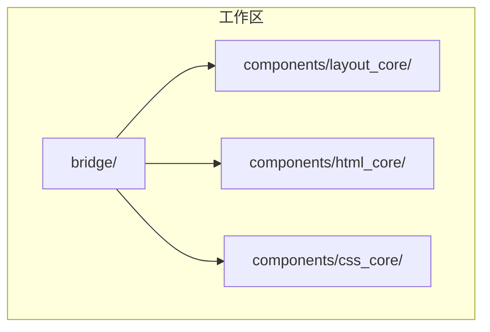
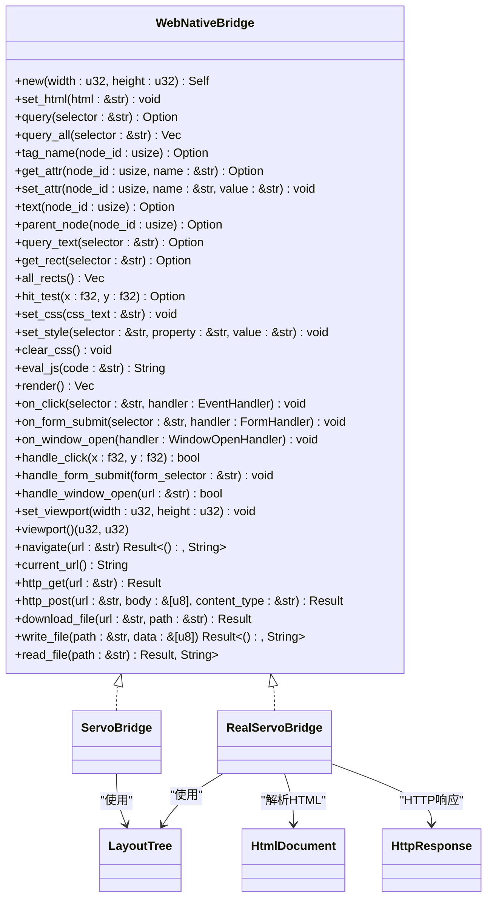
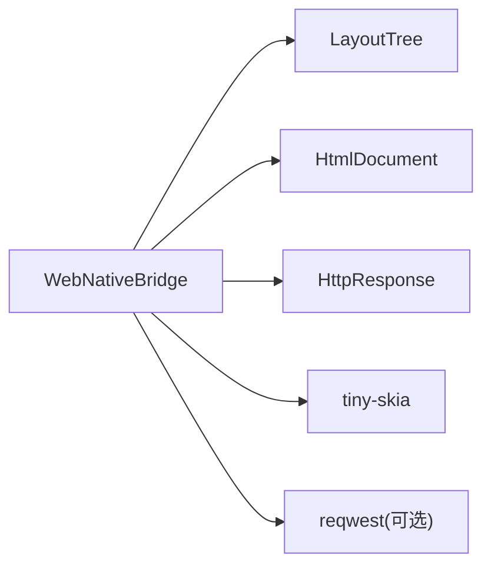

# WebNativeBridge 接口

<cite>
**本文引用的文件**
- [bridge.rs](file://bridge/bridge.rs)
- [servo_impl.rs](file://bridge/servo_impl.rs)
- [real_impl.rs](file://bridge/real_impl.rs)
- [network.rs](file://bridge/network.rs)
- [lib.rs](file://bridge/lib.rs)
- [Cargo.toml](file://Cargo.toml)
- [README.md](file://README.md)
- [layout_core/lib.rs](file://components/layout_core/lib.rs)
- [html_core/lib.rs](file://components/html_core/lib.rs)
</cite>

## 目录
1. [简介](#简介)
2. [项目结构](#项目结构)
3. [核心组件](#核心组件)
4. [架构总览](#架构总览)
5. [详细组件分析](#详细组件分析)
6. [依赖关系分析](#依赖关系分析)
7. [性能考量](#性能考量)
8. [故障排除指南](#故障排除指南)
9. [结论](#结论)
10. [附录](#附录)

## 简介
本文件为 WebNativeBridge trait 的完整接口文档，涵盖 DOM 读写、布局、CSS 操作、JavaScript 执行、渲染、事件绑定与处理、工具方法、网络请求以及文件操作等全部公共方法。文档面向不同技术背景的读者，既提供高层概览，也包含深入的技术细节、错误处理策略、性能优化建议与最佳实践。

## 项目结构
该项目采用工作区（workspace）组织，核心位于 bridge 子目录，包含接口定义与两种实现；核心渲染与布局能力由 components 子模块提供。

图表来源
- [lib.rs:1-13](file://bridge/lib.rs#L1-L13)
- [Cargo.toml:1-37](file://Cargo.toml#L1-L37)

章节来源
- [lib.rs:1-13](file://bridge/lib.rs#L1-L13)
- [Cargo.toml:1-37](file://Cargo.toml#L1-L37)

## 核心组件
- WebNativeBridge trait：统一的桥接接口，定义了 Web 与原生之间的交互契约。
- ServoBridge（Mock 实现）：用于测试与参考，部分功能在未启用 html 特性时不可用。
- RealServoBridge（生产实现）：完整实现，支持 HTML 解析、CSS 布局、渲染、可选网络功能。
- 数据结构：Color、LayoutRect、LayoutNode、Declaration、HttpResponse 等。
- 事件处理器：EventHandler、FormHandler、WindowOpenHandler。

章节来源
- [bridge.rs:114-262](file://bridge/bridge.rs#L114-L262)
- [servo_impl.rs:9-17](file://bridge/servo_impl.rs#L9-L17)
- [real_impl.rs:10-19](file://bridge/real_impl.rs#L10-L19)
- [network.rs:5-16](file://bridge/network.rs#L5-L16)

## 架构总览
WebNativeBridge 将 Web 内容（HTML/CSS）与原生渲染、事件系统、网络与文件系统解耦，通过两个实现分别服务于开发测试与生产环境。

图表来源
- [bridge.rs:114-262](file://bridge/bridge.rs#L114-L262)
- [servo_impl.rs:9-17](file://bridge/servo_impl.rs#L9-L17)
- [real_impl.rs:10-19](file://bridge/real_impl.rs#L10-L19)
- [layout_core/lib.rs:9-11](file://components/layout_core/lib.rs#L9-L11)
- [html_core/lib.rs:8-9](file://components/html_core/lib.rs#L8-L9)
- [network.rs:5-16](file://bridge/network.rs#L5-L16)

## 详细组件分析

### DOM 读写方法
- set_html(html: &str)
  - 功能：设置页面 HTML 内容，触发解析与布局。
  - 参数：html - HTML 字符串。
  - 返回：无。
  - 注意事项：在未启用 html 特性时，默认实现仅记录警告。
  - 使用场景：初始化页面内容或动态更新页面。
  - 错误处理：默认实现不抛错，但实际实现中解析失败会触发内部错误处理。
  
- query(selector: &str) -> Option<usize>
  - 功能：按 CSS 选择器查找第一个匹配元素，返回 DOM 节点 ID。
  - 返回：匹配节点 ID 或 None。
  - 使用场景：定位特定元素进行后续操作。
  
- query_all(selector: &str) -> Vec<usize>
  - 功能：按 CSS 选择器查找所有匹配元素。
  - 返回：节点 ID 列表。
  - 使用场景：批量处理多个元素。
  
- tag_name(node_id: usize) -> Option<String>
  - 功能：获取元素标签名。
  - 返回：标签名或 None。
  
- get_attr(node_id: usize, name: &str) -> Option<String>
  - 功能：获取元素属性值。
  - 返回：属性值或 None。
  
- set_attr(node_id: usize, name: &str, value: &str) -> void
  - 功能：设置元素属性。
  - 注意事项：需确保节点存在。
  
- text(node_id: usize) -> Option<String>
  - 功能：获取元素文本内容。
  - 返回：文本内容或 None。
  
- parent_node(node_id: usize) -> Option<usize>
  - 功能：获取父节点 ID。
  - 返回：父节点 ID 或 None。
  
- query_text(selector: &str) -> Option<String>
  - 功能：按选择器获取元素文本。
  - 实现：基于 query 与 text 组合。
  - 返回：文本内容或 None。

章节来源
- [bridge.rs:125-176](file://bridge/bridge.rs#L125-L176)
- [servo_impl.rs:98-134](file://bridge/servo_impl.rs#L98-L134)
- [real_impl.rs:101-125](file://bridge/real_impl.rs#L101-L125)

### 布局相关方法
- get_rect(selector: &str) -> Option<LayoutRect>
  - 功能：获取元素在页面上的位置与尺寸。
  - 返回：布局矩形或 None。
  - 使用场景：点击命中测试、UI 定位。
  
- all_rects() -> Vec<LayoutNode>
  - 功能：获取所有布局节点的详细信息。
  - 返回：布局节点列表。
  - 使用场景：调试布局、批量渲染。
  
- hit_test(x: f32, y: f32) -> Option<LayoutNode>
  - 功能：点击测试，返回被点击的布局节点。
  - 返回：命中节点或 None。
  - 使用场景：事件分发、点击处理。

章节来源
- [bridge.rs:180-187](file://bridge/bridge.rs#L180-L187)
- [servo_impl.rs:136-172](file://bridge/servo_impl.rs#L136-L172)
- [real_impl.rs:77-129](file://bridge/real_impl.rs#L77-L129)

### CSS 操作方法
- set_css(css_text: &str) -> void
  - 功能：添加 CSS 规则，触发布局重算。
  - 注意事项：每次添加后都会重新布局。
  
- set_style(selector: &str, property: &str, value: &str) -> void
  - 功能：设置元素内联样式，触发布局重算。
  
- clear_css() -> void
  - 功能：清除自定义 CSS，重建布局树。
  - 使用场景：切换主题或重置样式。

章节来源
- [bridge.rs:191-198](file://bridge/bridge.rs#L191-L198)
- [servo_impl.rs:174-189](file://bridge/servo_impl.rs#L174-L189)
- [real_impl.rs:131-147](file://bridge/real_impl.rs#L131-L147)

### JavaScript 执行方法
- eval_js(code: &str) -> String
  - 功能：执行 JavaScript 代码。
  - 默认行为：在未启用 JS 的构建中返回固定字符串并记录警告。
  - 使用场景：与前端脚本交互（若启用）。

章节来源
- [bridge.rs:202-203](file://bridge/bridge.rs#L202-L203)
- [servo_impl.rs:191-194](file://bridge/servo_impl.rs#L191-L194)
- [real_impl.rs:149-152](file://bridge/real_impl.rs#L149-L152)

### 渲染方法
- render() -> Vec<u8>
  - 功能：将当前页面渲染为 PNG 图像字节流。
  - 实现：使用 tiny-skia 创建画布，按深度排序绘制背景矩形。
  - 性能：按 y、x、面积排序以保证覆盖顺序。
  - 返回：PNG 字节数据。

章节来源
- [bridge.rs:207-208](file://bridge/bridge.rs#L207-L208)
- [servo_impl.rs:196-201](file://bridge/servo_impl.rs#L196-L201)
- [real_impl.rs:154-205](file://bridge/real_impl.rs#L154-L205)

### 事件绑定与处理方法
- on_click(selector: &str, handler: EventHandler) -> void
  - 功能：为指定选择器绑定点击事件处理器。
  - 处理器类型：接收点击坐标 (x, y)。
  
- on_form_submit(selector: &str, handler: FormHandler) -> void
  - 功能：为表单绑定提交事件处理器。
  - 处理器类型：接收字段名 → 值的映射。
  
- on_window_open(handler: WindowOpenHandler) -> void
  - 功能：绑定 window.open 事件处理器。
  - 处理器类型：接收 URL，返回是否处理。
  
- handle_click(x: f32, y: f32) -> bool
  - 功能：处理鼠标点击，尝试命中并调用对应处理器。
  - 返回：是否命中并处理。
  
- handle_form_submit(form_selector: &str) -> void
  - 功能：处理表单提交事件。
  
- handle_window_open(url: &str) -> bool
  - 功能：处理 window.open 调用。
  - 返回：是否已处理。

章节来源
- [bridge.rs:212-228](file://bridge/bridge.rs#L212-L228)
- [servo_impl.rs:203-245](file://bridge/servo_impl.rs#L203-L245)
- [real_impl.rs:207-237](file://bridge/real_impl.rs#L207-L237)

### 工具方法
- set_viewport(width: u32, height: u32) -> void
  - 功能：设置视口尺寸并触发布局重算。
  
- viewport() -> (u32, u32)
  - 功能：获取当前视口尺寸。

章节来源
- [bridge.rs:232-236](file://bridge/bridge.rs#L232-L236)
- [servo_impl.rs:247-256](file://bridge/servo_impl.rs#L247-L256)
- [real_impl.rs:239-248](file://bridge/real_impl.rs#L239-L248)

### 网络请求方法
- navigate(url: &str) -> Result<(), String>
  - 功能：导航到 URL，拉取 HTML 并设置为页面内容。
  - 特性：仅在启用 network 特性时可用。
  - 返回：成功或错误信息。
  
- current_url() -> String
  - 功能：获取当前 URL。
  - 特性：仅在启用 network 特性时可用。
  
- http_get(url: &str) -> Result<HttpResponse, String>
  - 功能：发送 HTTP GET 请求。
  - 返回：HTTP 响应对象或错误信息。
  
- http_post(url: &str, body: &[u8], content_type: &str) -> Result<HttpResponse, String>
  - 功能：发送 HTTP POST 请求。
  - 返回：HTTP 响应对象或错误信息。
  
- download_file(url: &str, path: &str) -> Result<u64, String>
  - 功能：下载文件并保存到本地路径。
  - 返回：下载字节数或错误信息。

章节来源
- [bridge.rs:240-253](file://bridge/bridge.rs#L240-L253)
- [real_impl.rs:252-358](file://bridge/real_impl.rs#L252-L358)
- [network.rs:5-16](file://bridge/network.rs#L5-L16)

### 文件操作方法
- write_file(path: &str, data: &[u8]) -> Result<(), String>
  - 功能：写入文件。
  - 返回：成功或错误信息。
  
- read_file(path: &str) -> Result<Vec<u8>, String>
  - 功能：读取文件。
  - 返回：文件内容或错误信息。

章节来源
- [bridge.rs:257-261](file://bridge/bridge.rs#L257-L261)
- [real_impl.rs:362-370](file://bridge/real_impl.rs#L362-L370)
- [servo_impl.rs:258-266](file://bridge/servo_impl.rs#L258-L266)

## 依赖关系分析
- 组件耦合
  - WebNativeBridge 与 LayoutTree、HtmlDocument、HttpResponse 等核心类型紧密耦合。
  - 事件处理器通过 HashMap 存储，键为选择器字符串，值为可调用对象。
- 外部依赖
  - tiny-skia：渲染 PNG。
  - serde：序列化布局节点。
  - reqwest（可选）：网络请求。
- 特性开关
  - network：启用网络功能。
  - embed：嵌入模式（当前与 network 相同）。

图表来源
- [real_impl.rs:6-8](file://bridge/real_impl.rs#L6-L8)
- [layout_core/lib.rs:9-11](file://components/layout_core/lib.rs#L9-L11)
- [html_core/lib.rs:8-9](file://components/html_core/lib.rs#L8-L9)
- [network.rs:5-16](file://bridge/network.rs#L5-L16)
- [Cargo.toml:23-36](file://Cargo.toml#L23-L36)

章节来源
- [Cargo.toml:19-36](file://Cargo.toml#L19-L36)
- [README.md:74-80](file://README.md#L74-L80)

## 性能考量
- 布局重算
  - set_css、set_style、clear_css、set_html 等操作会触发布局重算，建议批量修改后再一次性应用。
- 渲染
  - render 会遍历所有布局节点并按深度排序绘制，节点数量较多时开销较大。可考虑减少节点数量或降低视口分辨率。
- 网络
  - navigate、http_get、http_post、download_file 为阻塞式调用，建议在后台线程执行或使用异步运行时。
- 事件处理
  - 事件处理器为 Box<dyn FnMut(...) + Send>，避免在处理器中执行耗时操作，必要时拆分为异步任务。

## 故障排除指南
- set_html 被调用但无 HTML 支持
  - 现象：日志出现警告。
  - 原因：未启用 html 特性。
  - 解决：启用 html 特性或在支持 HTML 的实现上调用。
  
- eval_js 返回固定字符串
  - 现象：JS 执行被忽略。
  - 原因：未启用 JS 支持。
  - 解决：在支持 JS 的构建中使用或移除对 JS 的依赖。
  
- navigate 报错“Network feature not enabled”
  - 现象：导航失败。
  - 原因：未启用 network 特性。
  - 解决：启用 network 特性或在无网络模式下使用其他方式加载内容。
  
- render 输出空白
  - 现象：PNG 为白色。
  - 原因：未设置背景或布局未完成。
  - 解决：设置 CSS 背景或确保布局完成后调用 render。

章节来源
- [bridge.rs:127-129](file://bridge/bridge.rs#L127-L129)
- [servo_impl.rs:191-194](file://bridge/servo_impl.rs#L191-L194)
- [real_impl.rs:267-269](file://bridge/real_impl.rs#L267-L269)
- [real_impl.rs:154-205](file://bridge/real_impl.rs#L154-L205)

## 结论
WebNativeBridge 提供了从 DOM 操作到渲染、事件处理、网络与文件系统的完整能力，通过双实现满足测试与生产的不同需求。合理使用特性开关、批量化布局变更与异步网络调用，可在保证功能完整性的同时获得良好的性能表现。

## 附录

### 方法清单与签名摘要
- 构造与生命周期
  - new(width: u32, height: u32) -> Self
- DOM 读写
  - set_html, query, query_all, tag_name, get_attr, set_attr, text, parent_node, query_text
- 布局
  - get_rect, all_rects, hit_test
- CSS
  - set_css, set_style, clear_css
- JS
  - eval_js
- 渲染
  - render
- 事件
  - on_click, on_form_submit, on_window_open, handle_click, handle_form_submit, handle_window_open
- 工具
  - set_viewport, viewport
- 网络
  - navigate, current_url, http_get, http_post, download_file
- 文件
  - write_file, read_file

章节来源
- [bridge.rs:117-262](file://bridge/bridge.rs#L117-L262)

### 使用示例（路径）
- 基础用法与事件绑定示例：[README.md:81-118](file://README.md#L81-L118)
- 网络请求示例：[README.md:120-134](file://README.md#L120-L134)