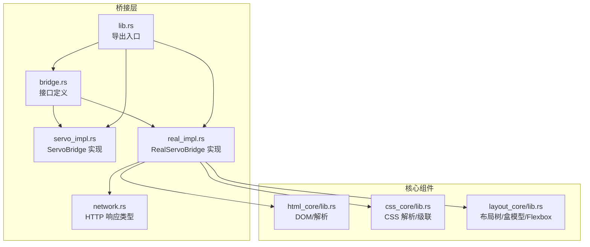
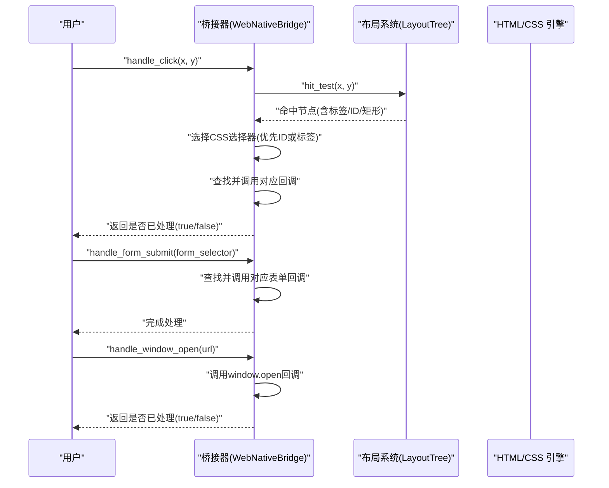
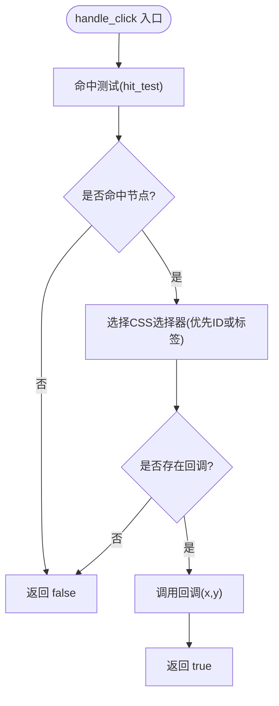
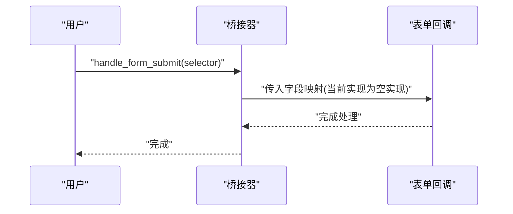
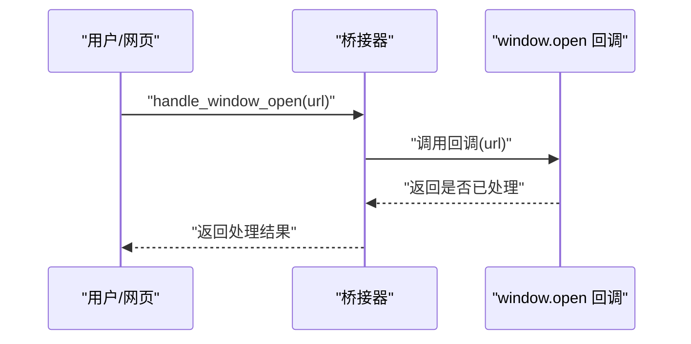
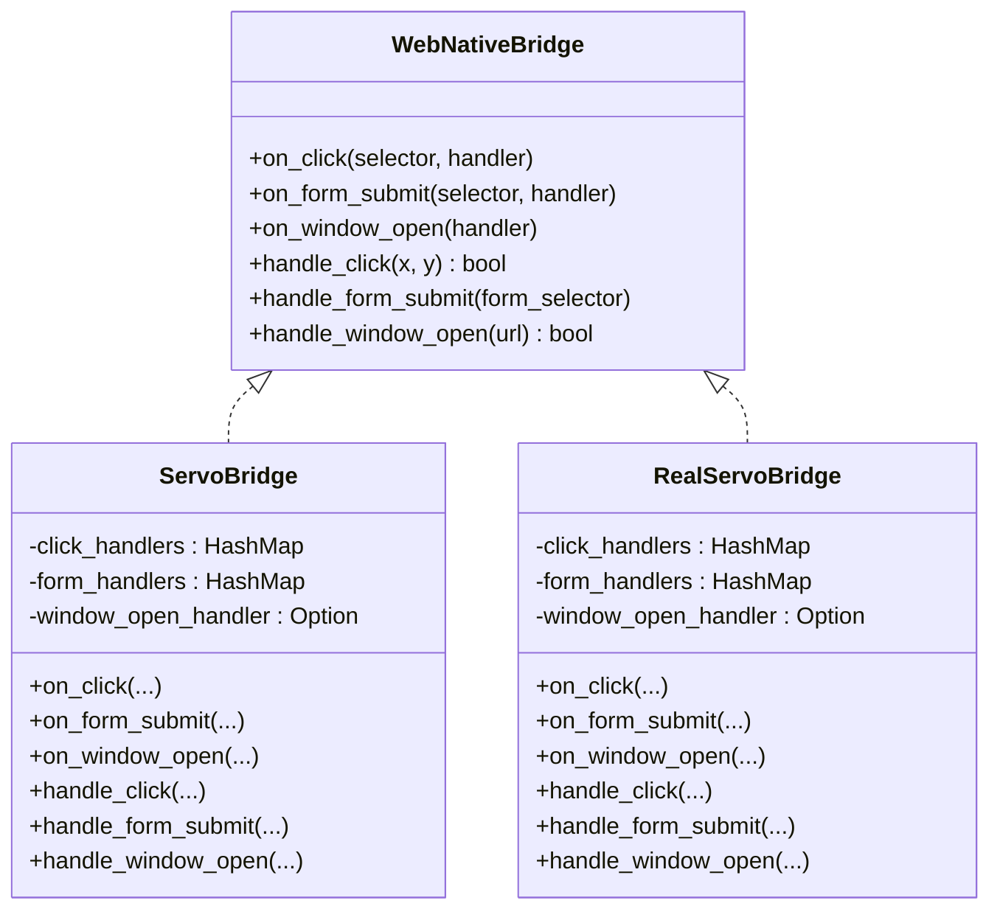
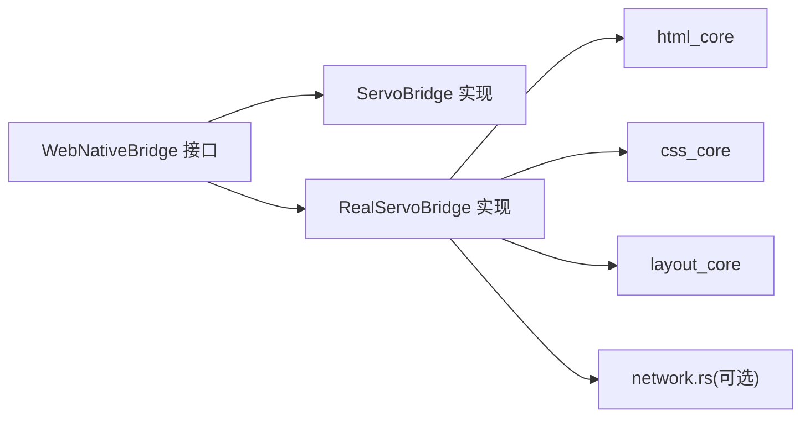

# 事件处理机制

<cite>
**本文引用的文件**
- [bridge.rs](file://bridge/bridge.rs)
- [servo_impl.rs](file://bridge/servo_impl.rs)
- [real_impl.rs](file://bridge/real_impl.rs)
- [network.rs](file://bridge/network.rs)
- [lib.rs](file://bridge/lib.rs)
- [README.md](file://README.md)
- [Cargo.toml](file://Cargo.toml)
- [layout_core/lib.rs](file://components/layout_core/lib.rs)
- [html_core/lib.rs](file://components/html_core/lib.rs)
- [css_core/lib.rs](file://components/css_core/lib.rs)
</cite>

## 目录
1. [简介](#简介)
2. [项目结构](#项目结构)
3. [核心组件](#核心组件)
4. [架构总览](#架构总览)
5. [详细组件分析](#详细组件分析)
6. [依赖关系分析](#依赖关系分析)
7. [性能考量](#性能考量)
8. [故障排查指南](#故障排查指南)
9. [结论](#结论)
10. [附录](#附录)

## 简介
本文件系统性阐述桥接层的事件处理机制，重点覆盖以下三类事件：
- 点击事件：on_click 与 handle_click
- 表单提交事件：on_form_submit 与 handle_form_submit
- window.open 事件：on_window_open 与 handle_window_open

文档将解释事件绑定方法的使用方式、回调函数的实现模式、事件触发机制与冒泡处理策略，并结合布局系统集成说明，提供完整的使用示例、最佳实践、性能优化建议与错误处理策略。

## 项目结构
桥接层位于 bridge 子目录，核心接口定义在 bridge.rs，提供两个实现：
- ServoBridge（mock 实现，用于测试与参考）
- RealServoBridge（生产实现，具备完整的 HTML/CSS/布局与渲染能力）

此外，网络相关类型定义在网络模块中，布局、HTML、CSS 核心组件分别提供解析与布局能力。

图表来源
- [bridge.rs:114-262](file://bridge/bridge.rs#L114-L262)
- [servo_impl.rs:1-413](file://bridge/servo_impl.rs#L1-L413)
- [real_impl.rs:1-372](file://bridge/real_impl.rs#L1-L372)
- [network.rs:1-54](file://bridge/network.rs#L1-L54)
- [lib.rs:1-13](file://bridge/lib.rs#L1-L13)
- [html_core/lib.rs:1-15](file://components/html_core/lib.rs#L1-L15)
- [css_core/lib.rs:1-207](file://components/css_core/lib.rs#L1-L207)
- [layout_core/lib.rs:1-22](file://components/layout_core/lib.rs#L1-L22)

章节来源
- [README.md:1-183](file://README.md#L1-L183)
- [lib.rs:1-13](file://bridge/lib.rs#L1-L13)

## 核心组件
本节聚焦事件处理相关的类型与接口定义，以及两个实现的关键行为。

- 事件处理器类型
  - 点击事件处理器：接收点击坐标 (x, y)，用于 on_click 回调
  - 表单提交处理器：接收字段名 → 值的映射，用于 on_form_submit 回调
  - window.open 处理器：接收 URL，返回是否已处理，用于 on_window_open 回调

- WebNativeBridge 接口中的事件相关方法
  - 绑定方法：on_click、on_form_submit、on_window_open
  - 触发方法：handle_click、handle_form_submit、handle_window_open

- 两个实现的行为差异
  - ServoBridge（mock）：在启用 html 功能时，点击事件选择器优先使用元素 id；否则回退到标签名
  - RealServoBridge（生产）：点击事件选择器始终基于标签名匹配

章节来源
- [bridge.rs:105-113](file://bridge/bridge.rs#L105-L113)
- [bridge.rs:210-229](file://bridge/bridge.rs#L210-L229)
- [servo_impl.rs:203-245](file://bridge/servo_impl.rs#L203-L245)
- [real_impl.rs:207-237](file://bridge/real_impl.rs#L207-L237)

## 架构总览
事件处理在桥接层内部的流转如下：
- 用户交互（如点击）触发 handle_click，内部进行命中测试（hit_test），根据命中节点选择合适的 CSS 选择器，匹配已注册的回调并执行
- 表单提交事件由 handle_form_submit 触发，内部遍历已注册的表单回调并执行
- window.open 事件由 handle_window_open 触发，内部调用已注册的 window.open 回调，返回是否已处理

图表来源
- [bridge.rs:210-229](file://bridge/bridge.rs#L210-L229)
- [servo_impl.rs:215-245](file://bridge/servo_impl.rs#L215-L245)
- [real_impl.rs:219-237](file://bridge/real_impl.rs#L219-L237)

## 详细组件分析

### 点击事件处理（on_click 与 handle_click）
- 绑定方式
  - on_click(selector, handler)：将 CSS 选择器与点击回调关联，存储在实现内部的哈希表中
- 触发机制
  - handle_click(x, y)：进行命中测试，定位到布局节点；随后根据实现差异选择 CSS 选择器（优先 id，否则标签名），匹配并调用回调
- 事件冒泡
  - 当前实现未显式实现“事件冒泡”到父元素的逻辑，而是基于命中节点的直接匹配
- 回调签名
  - 接收点击坐标 (x, y)，可用于进一步的业务判断（例如区域校验、多态行为）

图表来源
- [servo_impl.rs:215-231](file://bridge/servo_impl.rs#L215-L231)
- [real_impl.rs:219-227](file://bridge/real_impl.rs#L219-L227)

章节来源
- [bridge.rs:212-222](file://bridge/bridge.rs#L212-L222)
- [servo_impl.rs:203-245](file://bridge/servo_impl.rs#L203-L245)
- [real_impl.rs:207-237](file://bridge/real_impl.rs#L207-L237)

### 表单提交事件处理（on_form_submit 与 handle_form_submit）
- 绑定方式
  - on_form_submit(selector, handler)：将 CSS 选择器与表单提交回调关联
- 触发机制
  - handle_form_submit(form_selector)：根据选择器查找并调用对应的表单回调；当前生产实现中该方法为空实现（占位）
- 回调签名
  - 接收字段名 → 值的映射，便于进行表单数据收集与校验

图表来源
- [bridge.rs:215-225](file://bridge/bridge.rs#L215-L225)
- [real_impl.rs:229-229](file://bridge/real_impl.rs#L229-L229)

章节来源
- [bridge.rs:215-225](file://bridge/bridge.rs#L215-L225)
- [servo_impl.rs:233-237](file://bridge/servo_impl.rs#L233-L237)
- [real_impl.rs:229-229](file://bridge/real_impl.rs#L229-L229)

### window.open 事件处理（on_window_open 与 handle_window_open）
- 绑定方式
  - on_window_open(handler)：设置 window.open 的全局回调
- 触发机制
  - handle_window_open(url)：调用已注册的回调，返回是否已处理
- 用途
  - 常用于拦截 window.open 调用以实现文件下载、外部链接处理等

图表来源
- [bridge.rs:218-228](file://bridge/bridge.rs#L218-L228)
- [servo_impl.rs:239-245](file://bridge/servo_impl.rs#L239-L245)
- [real_impl.rs:231-237](file://bridge/real_impl.rs#L231-L237)

章节来源
- [bridge.rs:218-228](file://bridge/bridge.rs#L218-L228)
- [servo_impl.rs:211-245](file://bridge/servo_impl.rs#L211-L245)
- [real_impl.rs:215-237](file://bridge/real_impl.rs#L215-L237)

### 事件绑定与回调实现模式
- 回调类型
  - EventHandler：Box<dyn FnMut(f32, f32) + Send>
  - FormHandler：Box<dyn FnMut(HashMap<String, String>) + Send>
  - WindowOpenHandler：Box<dyn FnMut(&str) -> bool + Send>
- 绑定与触发
  - 绑定：on_* 方法将回调存入内部映射
  - 触发：handle_* 方法根据输入参数（坐标、选择器、URL）匹配并调用回调
- 生命周期
  - 回调以可变引用持有，允许在回调中修改状态或触发其他事件

章节来源
- [bridge.rs:105-113](file://bridge/bridge.rs#L105-L113)
- [bridge.rs:212-228](file://bridge/bridge.rs#L212-L228)

### 事件处理与布局系统的集成
- 命中测试（hit_test）
  - 通过布局树进行点击命中测试，返回命中节点及其标签名/矩形信息
- 选择器生成
  - ServoBridge（启用 html）：优先使用元素 id 生成选择器；若无 id 则使用标签名
  - RealServoBridge：始终使用标签名作为选择器
- 选择器匹配
  - 将回调注册时使用的 CSS 选择器与命中节点的标识进行匹配，从而决定是否调用回调

图表来源
- [bridge.rs:114-262](file://bridge/bridge.rs#L114-L262)
- [servo_impl.rs:9-33](file://bridge/servo_impl.rs#L9-L33)
- [real_impl.rs:10-19](file://bridge/real_impl.rs#L10-L19)

章节来源
- [servo_impl.rs:19-33](file://bridge/servo_impl.rs#L19-L33)
- [real_impl.rs:10-19](file://bridge/real_impl.rs#L10-L19)
- [layout_core/lib.rs:1-22](file://components/layout_core/lib.rs#L1-L22)

## 依赖关系分析
- 桥接层依赖核心组件
  - RealServoBridge 依赖 html_core、css_core、layout_core 提供的解析与布局能力
- 事件处理依赖布局树
  - 命中测试依赖 LayoutTree 的 hit_test 能力
- 网络功能（可选）
  - RealServoBridge 在启用 network 特性时支持导航、HTTP 请求与文件下载

图表来源
- [bridge.rs:114-262](file://bridge/bridge.rs#L114-L262)
- [real_impl.rs:1-372](file://bridge/real_impl.rs#L1-L372)
- [html_core/lib.rs:1-15](file://components/html_core/lib.rs#L1-L15)
- [css_core/lib.rs:1-207](file://components/css_core/lib.rs#L1-L207)
- [layout_core/lib.rs:1-22](file://components/layout_core/lib.rs#L1-L22)

章节来源
- [README.md:16-31](file://README.md#L16-L31)
- [Cargo.toml:1-37](file://Cargo.toml#L1-L37)

## 性能考量
- 命中测试复杂度
  - 命中测试依赖布局树，复杂度与布局节点数量相关；建议在高频点击场景下减少不必要的布局重算
- 回调查找
  - 回调存储采用 HashMap，查找为 O(1) 平均复杂度；避免在回调中执行阻塞操作
- 事件冒泡
  - 当前实现未实现事件冒泡，避免了逐层向上查找的开销；若需冒泡语义，应在回调中自行实现
- 渲染与事件耦合
  - 渲染过程与事件处理解耦，但渲染输出可能受布局树状态影响；确保在渲染前完成必要的布局计算

[本节为通用性能建议，无需特定文件引用]

## 故障排查指南
- 事件未触发
  - 检查是否正确绑定 on_click/on_form_submit/on_window_open
  - 确认 handle_* 是否被调用且传入的参数（坐标、选择器、URL）正确
- 选择器不匹配
  - ServoBridge（启用 html）优先使用 id 选择器；若元素无 id，将回退到标签名
  - RealServoBridge 始终使用标签名；请确保绑定时选择器与目标元素一致
- window.open 未处理
  - 确认已调用 on_window_open 注册回调；handle_window_open 返回 false 表示未处理
- 表单提交无效
  - 生产实现中 handle_form_submit 为空实现；如需表单数据收集，请在回调中自行实现
- 网络相关功能不可用
  - 需启用 network 特性；否则 navigate/http_get/http_post/download_file 将返回错误

章节来源
- [servo_impl.rs:215-245](file://bridge/servo_impl.rs#L215-L245)
- [real_impl.rs:219-237](file://bridge/real_impl.rs#L219-L237)
- [README.md:74-80](file://README.md#L74-L80)

## 结论
桥接层提供了简洁而清晰的事件处理接口，支持点击、表单提交与 window.open 三大事件类型。通过与布局系统的紧密集成，事件处理能够快速定位命中节点并精确匹配回调。当前实现未内置事件冒泡，但可通过回调扩展实现更复杂的交互语义。建议在实际应用中结合业务需求合理设计选择器与回调逻辑，确保事件处理的准确性与性能。

[本节为总结性内容，无需特定文件引用]

## 附录

### 使用示例（路径指引）
- 基础用法与事件绑定
  - 参考路径：[README.md:81-118](file://README.md#L81-L118)
- 网络示例（导航、HTTP 请求、文件下载）
  - 参考路径：[README.md:120-134](file://README.md#L120-L134)

### 最佳实践
- 选择器设计
  - 优先使用稳定的选择器（如 id），避免频繁变更导致回调失效
- 回调实现
  - 避免在回调中执行耗时操作；必要时异步处理或分批处理
- 事件冒泡
  - 若需要冒泡语义，可在回调中手动遍历父节点并调用相应逻辑
- 错误处理
  - 对 handle_* 的返回值进行检查；对 window.open 返回 false 的情况给出用户提示

### 性能优化建议
- 减少布局重算频率：批量更新后再统一布局
- 缓存命中结果：对热点区域可缓存命中节点与选择器映射
- 回调去抖：对高频事件（如拖拽）进行去抖处理

[本节为通用指导，无需特定文件引用]