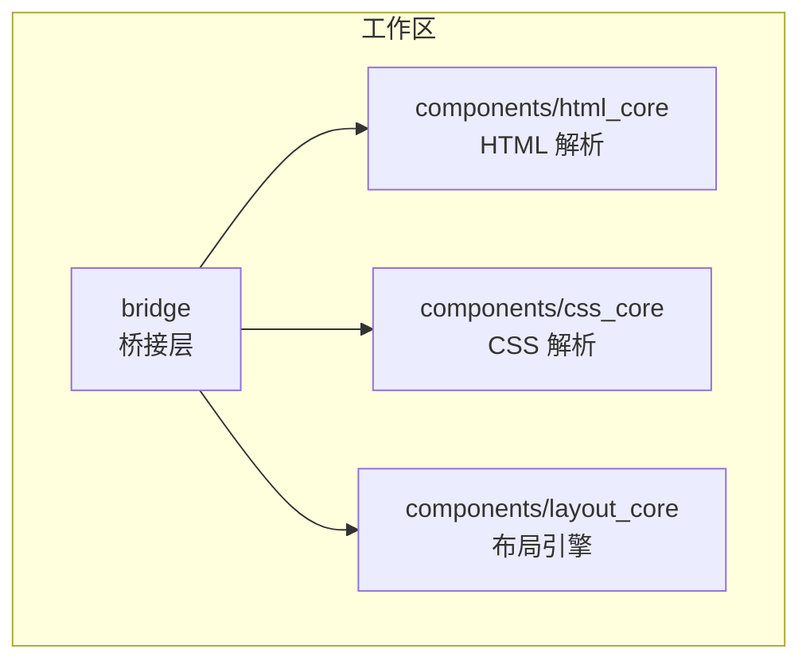
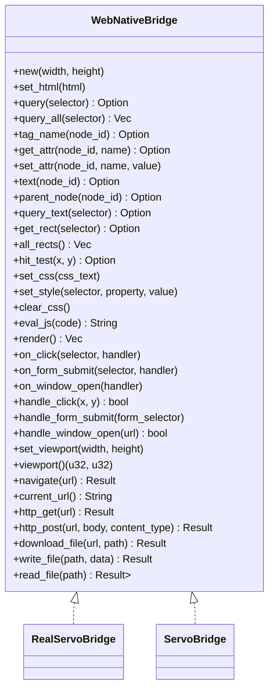
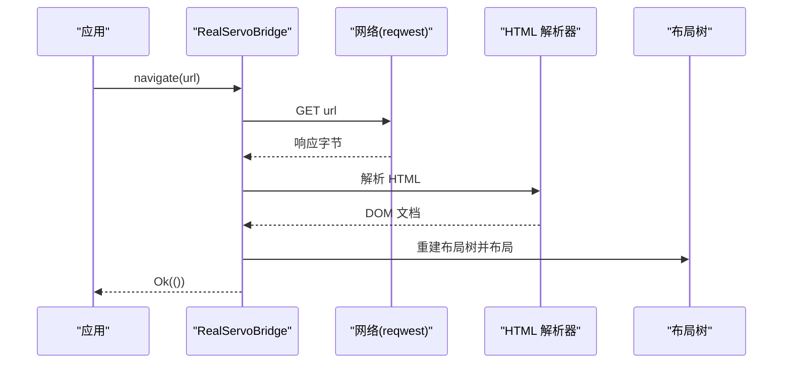
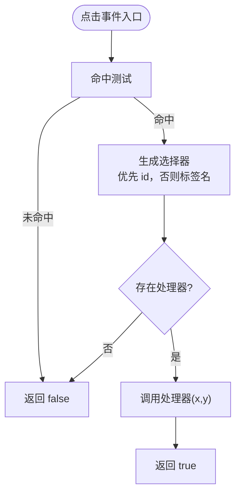
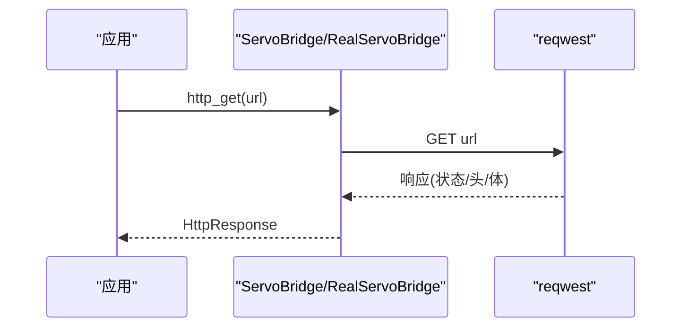
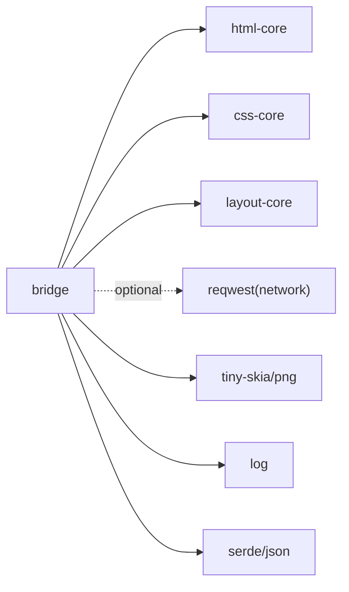

# 桥接层 API

<cite>
**本文引用的文件**
- [bridge/lib.rs](file://bridge/lib.rs)
- [bridge/bridge.rs](file://bridge/bridge.rs)
- [bridge/real_impl.rs](file://bridge/real_impl.rs)
- [bridge/servo_impl.rs](file://bridge/servo_impl.rs)
- [bridge/network.rs](file://bridge/network.rs)
- [bridge/Cargo.toml](file://bridge/Cargo.toml)
- [Cargo.toml](file://Cargo.toml)
- [README.md](file://README.md)
- [components/layout_core/lib.rs](file://components/layout_core/lib.rs)
- [components/html_core/lib.rs](file://components/html_core/lib.rs)
- [components/css_core/lib.rs](file://components/css_core/lib.rs)
</cite>

## 目录
1. [简介](#简介)
2. [项目结构](#项目结构)
3. [核心组件](#核心组件)
4. [架构总览](#架构总览)
5. [详细组件分析](#详细组件分析)
6. [依赖关系分析](#依赖关系分析)
7. [性能考虑](#性能考虑)
8. [故障排查指南](#故障排查指南)
9. [结论](#结论)
10. [附录](#附录)

## 简介
本文件为 Servo-Zero 桥接层的详细 API 文档，聚焦 WebNativeBridge trait 的公共接口、事件处理机制、网络功能以及两种实现（ServoBridge 与 RealServoBridge）的差异与适用场景。文档同时提供流程图与类图帮助理解数据流与组件交互，并给出错误处理、性能优化与最佳实践建议。

## 项目结构
Servo-Zero 采用工作区组织，核心桥接层位于 bridge 子目录，配套的 HTML/CSS/布局引擎作为独立组件提供能力：
- bridge：桥接层与实现，导出 WebNativeBridge trait 及其实现
- components/html_core：HTML 解析与 DOM
- components/css_core：CSS 解析、级联与样式计算
- components/layout_core：盒模型与 Flexbox 布局

图表来源
- [bridge/lib.rs:1-13](file://bridge/lib.rs#L1-L13)
- [bridge/Cargo.toml:32-35](file://bridge/Cargo.toml#L32-L35)
- [Cargo.toml:1-37](file://Cargo.toml#L1-L37)

章节来源
- [README.md:16-31](file://README.md#L16-L31)
- [bridge/lib.rs:1-13](file://bridge/lib.rs#L1-L13)
- [bridge/Cargo.toml:1-43](file://bridge/Cargo.toml#L1-L43)
- [Cargo.toml:1-37](file://Cargo.toml#L1-L37)

## 核心组件
本节概述 WebNativeBridge trait 的公共接口与数据结构，涵盖 DOM 操作、布局查询、样式设置、JS 执行占位、渲染、事件绑定与处理、网络与文件操作等。

- 数据结构
  - Color：RGBA 颜色，支持常量与十六进制/ARGB 解析
  - LayoutRect：元素布局矩形（x, y, width, height）
  - LayoutNode：布局节点信息（DOM 节点 ID、标签名、矩形、背景色）
  - Declaration：CSS 声明（属性名、值）
  - EventHandler/FormHandler/WindowOpenHandler：事件回调类型别名
  - HttpResponse：HTTP 响应（状态码、头、体、URL）

- WebNativeBridge trait 方法分类
  - DOM 读写：set_html、query、query_all、tag_name、get_attr、set_attr、text、parent_node、query_text
  - 布局：get_rect、all_rects、hit_test
  - CSS：set_css、set_style、clear_css
  - JS 执行：eval_js（默认返回空字符串）
  - 渲染：render（PNG 字节）
  - 事件：on_click、on_form_submit、on_window_open；handle_click、handle_form_submit、handle_window_open
  - 工具：set_viewport、viewport
  - 网络：navigate、current_url、http_get、http_post、download_file
  - 文件：write_file、read_file

章节来源
- [bridge/bridge.rs:1-263](file://bridge/bridge.rs#L1-L263)
- [bridge/network.rs:1-54](file://bridge/network.rs#L1-L54)

## 架构总览
桥接层通过 WebNativeBridge trait 抽象出统一接口，RealServoBridge 提供生产级实现（含 HTML/CSS/布局/渲染），ServoBridge 提供测试/参考实现（可选 HTML 功能）。网络功能由可选 feature 控制，未启用时对应方法返回错误。

图表来源
- [bridge/bridge.rs:114-263](file://bridge/bridge.rs#L114-L263)
- [bridge/real_impl.rs:10-372](file://bridge/real_impl.rs#L10-L372)
- [bridge/servo_impl.rs:9-413](file://bridge/servo_impl.rs#L9-L413)

## 详细组件分析

### WebNativeBridge trait 接口详解
- DOM 读写
  - set_html：设置页面 HTML，内部解析 HTML 并重建布局树，应用内联样式与已添加的 CSS，触发布局计算
  - query/query_all/tag_name/get_attr/set_attr/text/parent_node/query_text：元素查询与属性/文本读写
- 布局
  - get_rect：按选择器获取元素矩形
  - all_rects：获取全部布局节点列表
  - hit_test：基于坐标命中布局节点
- CSS
  - set_css：追加 CSS 规则并重新布局
  - set_style：设置元素内联样式并重新布局
  - clear_css：清空自定义 CSS 并重建布局树
- JS 执行
  - eval_js：默认不支持 JS，返回空字符串并记录警告
- 渲染
  - render：使用 tiny-skia 渲染布局树为 PNG 字节
- 事件
  - on_click/on_form_submit/on_window_open：注册事件处理器
  - handle_click/handle_form_submit/handle_window_open：分发事件并返回是否处理
- 工具
  - set_viewport/viewport：设置与获取视口尺寸
- 网络
  - navigate/current_url：导航到 URL（需启用 network feature）
  - http_get/http_post：发送 HTTP 请求（需启用 network feature）
  - download_file：下载文件并保存（需启用 network feature）
- 文件
  - write_file/read_file：本地文件读写

章节来源
- [bridge/bridge.rs:114-263](file://bridge/bridge.rs#L114-L263)

### RealServoBridge 实现
- 关键特性
  - 使用 html_core 解析 HTML，layout_core 构建布局树，tiny-skia 渲染
  - 支持 set_html、CSS 注入与布局、事件绑定与处理、渲染 PNG
  - 网络功能受 feature 控制：未启用时返回错误
- 事件处理
  - handle_click：命中布局节点后按标签名匹配处理器并调用
  - handle_form_submit：占位实现（当前为空）
  - handle_window_open：调用注册的 window.open 处理器
- 网络与文件
  - navigate：GET 请求后将响应 HTML 设置为页面内容
  - http_get/http_post：构造 HttpResponse 结构体
  - download_file：下载字节并写入本地路径
  - write_file/read_file：标准文件系统读写

图表来源
- [bridge/real_impl.rs:252-269](file://bridge/real_impl.rs#L252-L269)
- [bridge/real_impl.rs:101-125](file://bridge/real_impl.rs#L101-L125)

章节来源
- [bridge/real_impl.rs:1-372](file://bridge/real_impl.rs#L1-L372)

### ServoBridge 实现
- 关键特性
  - 提供 mock 实现，便于测试与参考
  - 可选 feature 支持 HTML DOM 查询与修改（html feature）
  - 未启用 html feature 时，DOM 相关方法返回默认值或空实现
- 事件处理
  - handle_click：根据命中节点生成选择器（优先 id，否则标签名），匹配处理器并调用
  - handle_form_submit：调用注册的表单处理器（传入空映射）
  - handle_window_open：调用 window.open 处理器
- 文件操作
  - write_file/read_file：文件系统读写

图表来源
- [bridge/servo_impl.rs:215-231](file://bridge/servo_impl.rs#L215-L231)

章节来源
- [bridge/servo_impl.rs:1-413](file://bridge/servo_impl.rs#L1-L413)

### 事件处理机制
- 点击事件
  - on_click：以选择器为键注册处理器
  - handle_click：命中测试后按选择器匹配处理器并执行
- 表单提交
  - on_form_submit：以选择器为键注册处理器
  - handle_form_submit：触发处理器并传入字段映射（当前为空）
- window.open
  - on_window_open：注册处理器
  - handle_window_open：调用处理器并返回是否处理

章节来源
- [bridge/bridge.rs:210-229](file://bridge/bridge.rs#L210-L229)
- [bridge/real_impl.rs:207-237](file://bridge/real_impl.rs#L207-L237)
- [bridge/servo_impl.rs:203-245](file://bridge/servo_impl.rs#L203-L245)

### 网络功能 API
- navigate(url)
  - 功能：发起 GET 请求并以响应 HTML 设置页面
  - 返回：Ok(()) 或错误字符串
  - 依赖：reqwest blocking GET
- http_get(url)
  - 功能：GET 请求，返回 HttpResponse（状态码、头、体、URL）
- http_post(url, body, content_type)
  - 功能：POST 请求，设置 Content-Type 头，返回 HttpResponse
- download_file(url, path)
  - 功能：下载文件并写入本地路径，返回下载字节数
- current_url
  - 功能：当前 URL（当前实现返回空字符串，具体取决于实现）

图表来源
- [bridge/real_impl.rs:282-301](file://bridge/real_impl.rs#L282-L301)
- [bridge/servo_impl.rs:274-287](file://bridge/servo_impl.rs#L274-L287)

章节来源
- [bridge/bridge.rs:238-262](file://bridge/bridge.rs#L238-L262)
- [bridge/network.rs:1-54](file://bridge/network.rs#L1-L54)

### 文件操作 API
- write_file(path, data)
  - 功能：写入二进制数据到本地路径
- read_file(path)
  - 功能：读取本地路径为二进制数据

章节来源
- [bridge/real_impl.rs:362-370](file://bridge/real_impl.rs#L362-L370)
- [bridge/servo_impl.rs:258-266](file://bridge/servo_impl.rs#L258-L266)

## 依赖关系分析
- 组件耦合
  - bridge 依赖 html-core、css-core、layout-core 三大核心组件
  - 网络功能依赖 reqwest（可选 feature）
  - 渲染依赖 tiny-skia 与 png 编码
- 外部依赖
  - log、serde、serde_json、url 等
- 特性开关
  - network：启用 HTTP 网络功能
  - embed：嵌入模式（与 network 同义）

图表来源
- [bridge/Cargo.toml:26-43](file://bridge/Cargo.toml#L26-L43)
- [Cargo.toml:19-37](file://Cargo.toml#L19-L37)

章节来源
- [bridge/Cargo.toml:16-25](file://bridge/Cargo.toml#L16-L25)
- [bridge/Cargo.toml:26-43](file://bridge/Cargo.toml#L26-L43)
- [Cargo.toml:19-37](file://Cargo.toml#L19-L37)

## 性能考虑
- 布局与渲染
  - set_css/set_style/clear_css 后均触发布局计算，建议批量更新后再一次性布局
  - render 会遍历所有布局节点并绘制，建议控制视口大小与节点数量
- 事件处理
  - on_click/on_form_submit/on_window_open 仅注册处理器，实际开销在 handle_* 时发生
  - 建议避免在处理器中进行重型同步操作
- 网络请求
  - navigate/http_get/http_post 为阻塞式调用，建议在后台线程或异步环境中使用
  - 对高频请求进行缓存与去重
- 文件操作
  - write_file/read_file 为同步 IO，建议批量写入与合理路径管理

## 故障排查指南
- JS 执行无效
  - eval_js 在默认实现中返回空字符串并记录警告，如需 JS 能力请启用相应实现或功能
- 网络功能不可用
  - navigate/http_get/http_post/download_file 在未启用 network feature 时返回错误字符串
  - 解决：构建时启用 network feature 或提供替代实现
- 事件未触发
  - 检查选择器是否正确，handle_click 依赖命中测试与处理器注册
  - window.open 未处理：确认已注册 on_window_open 处理器
- 渲染异常
  - render 返回空 PNG 或白屏：检查布局树是否正确重建与布局计算是否完成
- 文件读写失败
  - write_file/read_file 返回错误：检查路径权限与磁盘空间

章节来源
- [bridge/real_impl.rs:266-269](file://bridge/real_impl.rs#L266-L269)
- [bridge/real_impl.rs:303-306](file://bridge/real_impl.rs#L303-L306)
- [bridge/real_impl.rs:336-339](file://bridge/real_impl.rs#L336-L339)
- [bridge/real_impl.rs:355-358](file://bridge/real_impl.rs#L355-L358)
- [bridge/real_impl.rs:149-152](file://bridge/real_impl.rs#L149-L152)

## 结论
WebNativeBridge 为 Servo-Zero 提供了统一的 Web-Native 桥接接口，RealServoBridge 适合生产环境，ServoBridge 适合测试与参考。通过清晰的事件与网络 API，开发者可以快速集成 DOM 操作、CSS 布局、渲染与网络下载能力。建议结合特性开关与性能优化策略，按需启用网络与 HTML 功能，确保在最小二进制体积与完整功能之间取得平衡。

## 附录

### 使用示例（路径指引）
- 基础用法与事件绑定
  - 示例路径：[README.md:81-118](file://README.md#L81-L118)
- 网络请求示例
  - 示例路径：[README.md:120-134](file://README.md#L120-L134)

### API 一览表（方法签名与用途）
- DOM 读写
  - set_html(html)
  - query(selector)/query_all(selector)
  - tag_name(node_id)/get_attr/set_attr(node_id,name,value)
  - text(node_id)/parent_node(node_id)/query_text(selector)
- 布局
  - get_rect(selector)/all_rects()/hit_test(x,y)
- CSS
  - set_css(css_text)/set_style(selector,property,value)/clear_css()
- JS 执行
  - eval_js(code)
- 渲染
  - render()
- 事件
  - on_click/on_form_submit/on_window_open
  - handle_click(x,y)/handle_form_submit(form_selector)/handle_window_open(url)
- 工具
  - set_viewport(width,height)/viewport()
- 网络
  - navigate(url)/current_url()
  - http_get(url)/http_post(url,body,content_type)/download_file(url,path)
- 文件
  - write_file(path,data)/read_file(path)

章节来源
- [bridge/bridge.rs:114-263](file://bridge/bridge.rs#L114-L263)