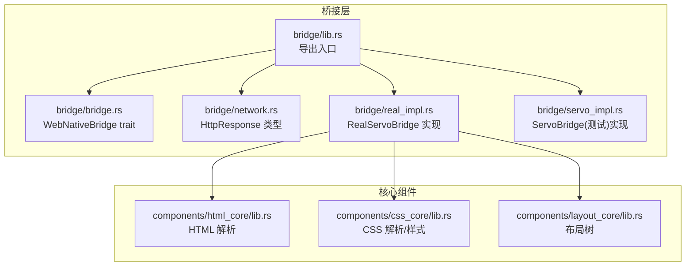
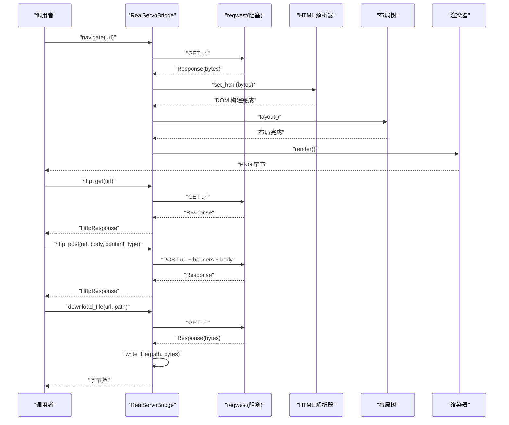
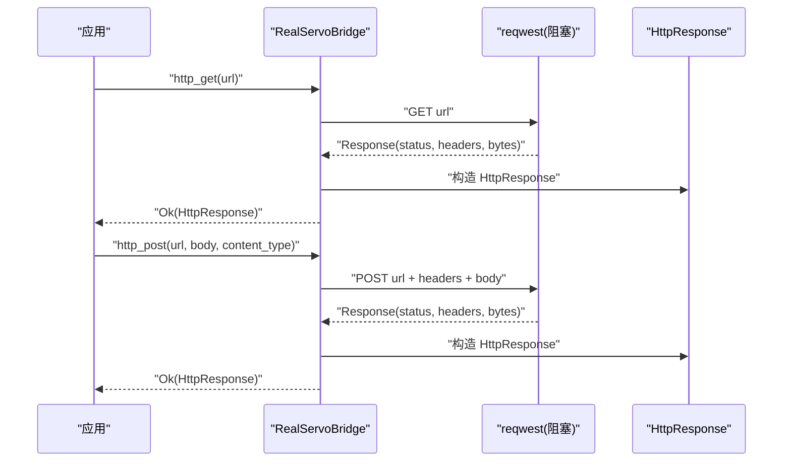
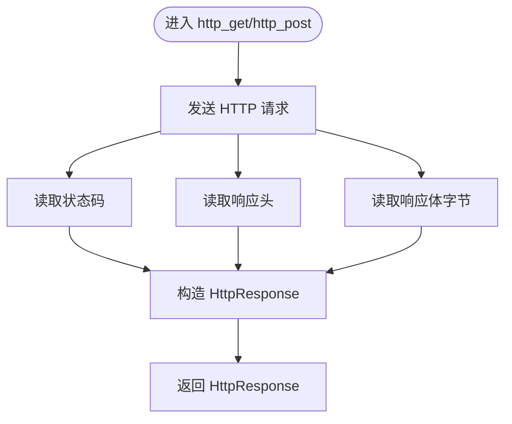
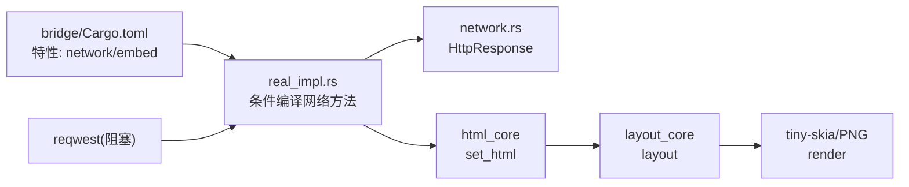

# 网络功能集成

<cite>
**本文引用的文件**
- [bridge/network.rs](file://bridge/network.rs)
- [bridge/bridge.rs](file://bridge/bridge.rs)
- [bridge/real_impl.rs](file://bridge/real_impl.rs)
- [bridge/servo_impl.rs](file://bridge/servo_impl.rs)
- [bridge/lib.rs](file://bridge/lib.rs)
- [bridge/Cargo.toml](file://bridge/Cargo.toml)
- [Cargo.toml](file://Cargo.toml)
- [README.md](file://README.md)
- [components/html_core/lib.rs](file://components/html_core/lib.rs)
- [components/css_core/lib.rs](file://components/css_core/lib.rs)
- [components/layout_core/lib.rs](file://components/layout_core/lib.rs)
</cite>

## 目录
1. [简介](#简介)
2. [项目结构](#项目结构)
3. [核心组件](#核心组件)
4. [架构总览](#架构总览)
5. [详细组件分析](#详细组件分析)
6. [依赖关系分析](#依赖关系分析)
7. [性能考量](#性能考量)
8. [故障排查指南](#故障排查指南)
9. [结论](#结论)
10. [附录](#附录)

## 简介
本文件面向桥接层的网络功能集成，系统性阐述 HTTP 请求处理、URL 导航与文件下载的完整实现。重点说明以下方法的使用方式与参数配置：
- navigate：导航到指定 URL，并将返回的 HTML 注入到桥接层进行解析与渲染
- http_get：发送 HTTP GET 请求，返回 HttpResponse 结构体
- http_post：发送 HTTP POST 请求，支持自定义 Content-Type 与请求体
- download_file：下载文件并保存到本地路径，返回字节数

同时，文档解释 HttpResponse 结构体的数据格式、状态码处理、错误处理策略、与浏览器兼容性的处理方式以及性能优化建议。为便于读者快速上手，提供从页面加载、API 调用到文件上传下载的完整示例路径与最佳实践。

## 项目结构
桥接层位于 bridge 子模块，网络功能由 WebNativeBridge trait 定义并通过 RealServoBridge 生产实现提供。网络能力通过 feature flag 控制，默认启用 network 功能；若禁用，则相关方法返回“未启用”的错误提示。

图表来源
- [bridge/lib.rs:1-13](file://bridge/lib.rs#L1-L13)
- [bridge/bridge.rs:117-262](file://bridge/bridge.rs#L117-L262)
- [bridge/network.rs:1-54](file://bridge/network.rs#L1-L54)
- [bridge/real_impl.rs:10-372](file://bridge/real_impl.rs#L10-L372)
- [bridge/servo_impl.rs:9-413](file://bridge/servo_impl.rs#L9-L413)
- [components/html_core/lib.rs:1-15](file://components/html_core/lib.rs#L1-L15)
- [components/css_core/lib.rs:1-207](file://components/css_core/lib.rs#L1-L207)
- [components/layout_core/lib.rs:1-22](file://components/layout_core/lib.rs#L1-L22)

章节来源
- [bridge/lib.rs:1-13](file://bridge/lib.rs#L1-L13)
- [bridge/bridge.rs:117-262](file://bridge/bridge.rs#L117-L262)
- [bridge/real_impl.rs:10-372](file://bridge/real_impl.rs#L10-L372)
- [bridge/servo_impl.rs:9-413](file://bridge/servo_impl.rs#L9-L413)
- [components/html_core/lib.rs:1-15](file://components/html_core/lib.rs#L1-L15)
- [components/css_core/lib.rs:1-207](file://components/css_core/lib.rs#L1-L207)
- [components/layout_core/lib.rs:1-22](file://components/layout_core/lib.rs#L1-L22)

## 核心组件
- WebNativeBridge trait：定义统一的桥接接口，包含 DOM 操作、布局、事件、JS 执行、渲染、网络与文件操作等方法。网络相关方法包括 navigate、http_get、http_post、download_file。
- HttpResponse：封装 HTTP 响应，包含状态码、响应头、响应体与最终 URL。提供便捷方法如 text()、set_header()、get_header()。
- RealServoBridge：生产实现，基于 reqwest 在启用 network 特性时提供网络能力；否则返回“未启用”错误。
- ServoBridge：Mock 实现，主要用于测试与参考，HTML 功能受 feature 控制。

章节来源
- [bridge/bridge.rs:117-262](file://bridge/bridge.rs#L117-L262)
- [bridge/network.rs:5-53](file://bridge/network.rs#L5-L53)
- [bridge/real_impl.rs:250-358](file://bridge/real_impl.rs#L250-L358)
- [bridge/servo_impl.rs:74-267](file://bridge/servo_impl.rs#L74-L267)

## 架构总览
网络功能在 RealServoBridge 中通过条件编译启用，使用 reqwest 的阻塞客户端发起 HTTP 请求。请求完成后，将响应数据转换为 HttpResponse 返回给调用方；navigate 方法还会将 HTML 响应注入到 HTML 解析器中，触发后续布局与渲染流程。

图表来源
- [bridge/real_impl.rs:252-358](file://bridge/real_impl.rs#L252-L358)
- [bridge/network.rs:5-53](file://bridge/network.rs#L5-L53)
- [components/html_core/lib.rs:8-9](file://components/html_core/lib.rs#L8-L9)
- [components/layout_core/lib.rs:9-11](file://components/layout_core/lib.rs#L9-L11)

## 详细组件分析

### WebNativeBridge 网络方法定义
- navigate(url: &str) -> Result<(), String>
  - 作用：导航到指定 URL，拉取 HTML 并注入到桥接层进行解析与渲染
  - 错误：feature 未启用时返回“未启用”错误
- http_get(url: &str) -> Result<HttpResponse, String>
  - 作用：发送 HTTP GET 请求，返回 HttpResponse
  - 错误：网络异常或响应体读取失败时返回错误
- http_post(url: &str, body: &[u8], content_type: &str) -> Result<HttpResponse, String>
  - 作用：发送 HTTP POST 请求，设置 Content-Type 并携带二进制请求体
  - 错误：网络异常或响应体读取失败时返回错误
- download_file(url: &str, path: &str) -> Result<u64, String>
  - 作用：下载文件并写入本地路径，返回下载字节数
  - 错误：网络异常或写入失败时返回错误

章节来源
- [bridge/bridge.rs:240-253](file://bridge/bridge.rs#L240-L253)

### HttpResponse 数据结构与状态码处理
- 字段
  - status: u16，HTTP 状态码
  - headers: HashMap<String, String>，响应头集合
  - body: Vec<u8>，原始响应体字节
  - url: String，最终 URL（可能与请求 URL 不同，处理重定向后）
- 方法
  - new(status, body)：构造函数
  - ok(body)：构造 200 成功响应
  - error(body)：构造 500 失败响应
  - text()：UTF-8 转换后的字符串表示
  - set_header(name, value)：设置响应头
  - get_header(name)：获取响应头

章节来源
- [bridge/network.rs:5-53](file://bridge/network.rs#L5-L53)

### RealServoBridge 网络实现细节
- navigate
  - 条件编译：feature = "network"
  - 流程：GET -> bytes -> UTF-8 -> set_html -> layout -> render
  - 当前 URL：在启用网络时返回空字符串（占位）
- http_get
  - 条件编译：feature = "network"
  - 流程：GET -> 状态码 -> headers -> bytes -> 构造 HttpResponse
- http_post
  - 条件编译：feature = "network"
  - 流程：POST + Content-Type + body -> 状态码 -> headers -> bytes -> 构造 HttpResponse
- download_file
  - 条件编译：feature = "network"
  - 流程：GET -> bytes -> write_file -> 返回字节数

章节来源
- [bridge/real_impl.rs:252-358](file://bridge/real_impl.rs#L252-L358)

### ServoBridge（Mock）网络能力
- 该实现主要用于测试与参考，网络方法在未启用 HTML feature 时不可用，但网络接口仍遵循 WebNativeBridge 定义。实际网络能力由 RealServoBridge 提供。

章节来源
- [bridge/servo_impl.rs:74-267](file://bridge/servo_impl.rs#L74-L267)

### 网络方法调用序列图

图表来源
- [bridge/real_impl.rs:281-334](file://bridge/real_impl.rs#L281-L334)
- [bridge/network.rs:5-53](file://bridge/network.rs#L5-L53)

### HttpResponse 状态码与头部处理流程

图表来源
- [bridge/real_impl.rs:281-334](file://bridge/real_impl.rs#L281-L334)
- [bridge/network.rs:5-53](file://bridge/network.rs#L5-L53)

## 依赖关系分析
- 特性控制
  - bridge/Cargo.toml 定义了 network、embed 特性，默认启用 network
  - RealServoBridge 的网络方法通过 #[cfg(feature = "network")] 条件编译启用
- 外部依赖
  - reqwest 0.12（阻塞客户端），启用 network 特性时可选依赖
  - log、serde、serde_json、url 等基础依赖
- 内部组件
  - HTML 解析器、CSS 样式与布局树在 navigate 场景下被调用，确保页面正确渲染

图表来源
- [bridge/Cargo.toml:16-42](file://bridge/Cargo.toml#L16-L42)
- [bridge/real_impl.rs:252-358](file://bridge/real_impl.rs#L252-L358)
- [bridge/network.rs:5-53](file://bridge/network.rs#L5-L53)
- [components/html_core/lib.rs:8-9](file://components/html_core/lib.rs#L8-L9)
- [components/layout_core/lib.rs:9-11](file://components/layout_core/lib.rs#L9-L11)

章节来源
- [bridge/Cargo.toml:16-42](file://bridge/Cargo.toml#L16-L42)
- [bridge/real_impl.rs:252-358](file://bridge/real_impl.rs#L252-L358)
- [bridge/network.rs:5-53](file://bridge/network.rs#L5-L53)
- [components/html_core/lib.rs:8-9](file://components/html_core/lib.rs#L8-L9)
- [components/layout_core/lib.rs:9-11](file://components/layout_core/lib.rs#L9-L11)

## 性能考量
- 阻塞网络客户端
  - reqwest 使用阻塞客户端，适合与渲染管线配合的同步场景；若需并发或异步，请评估切换至非阻塞客户端并重构调用链
- 响应体处理
  - HttpResponse.body 为 Vec<u8>，避免重复拷贝；如需流式处理，可在应用层自行封装
- 渲染与网络的顺序
  - navigate 将 HTML 注入后立即布局与渲染，建议在网络请求与渲染之间保持最小延迟
- 二进制下载
  - download_file 直接写入磁盘，注意磁盘 IO 对主线程的影响；可考虑后台线程或异步写入

[本节为通用性能建议，不直接分析具体文件]

## 故障排查指南
- 网络功能未启用
  - 现象：navigate/http_get/http_post/download_file 返回“未启用”
  - 处理：启用 network 特性或在构建时添加 --features "network"
- 网络请求失败
  - 现象：返回网络错误字符串
  - 处理：检查 URL 可达性、证书与代理设置；确认网络栈可用
- 响应体读取失败
  - 现象：返回“Body error: ...”
  - 处理：检查目标服务器响应格式与编码；必要时在应用层做降级处理
- 下载写入失败
  - 现象：返回“Write error: ...”
  - 处理：检查目标路径权限与磁盘空间；确保路径存在且可写
- navigate 未显示内容
  - 现象：页面空白或渲染异常
  - 处理：确认返回 HTML 是否有效；检查 CSS/JS 加载情况；必要时在应用层缓存并预处理

章节来源
- [bridge/real_impl.rs:266-269](file://bridge/real_impl.rs#L266-L269)
- [bridge/real_impl.rs:281-306](file://bridge/real_impl.rs#L281-L306)
- [bridge/real_impl.rs:308-339](file://bridge/real_impl.rs#L308-L339)
- [bridge/real_impl.rs:341-358](file://bridge/real_impl.rs#L341-L358)

## 结论
桥接层的网络功能以 WebNativeBridge 为核心接口，RealServoBridge 提供了完整的 HTTP GET/POST、URL 导航与文件下载能力。通过 feature 控制，用户可在“完整浏览器引擎”、“嵌入式优化”与“最小二进制”之间灵活选择。HttpResponse 提供了对状态码、响应头与响应体的统一访问，便于上层应用进行业务逻辑处理。结合阻塞式网络与渲染管线，可满足大多数桌面/嵌入式场景的页面加载与 API 调用需求。

[本节为总结性内容，不直接分析具体文件]

## 附录

### 使用示例（路径）
- 页面加载（navigate）
  - 示例路径：[README.md:120-134](file://README.md#L120-L134)
- HTTP GET（http_get）
  - 示例路径：[README.md:120-134](file://README.md#L120-L134)
- HTTP POST（http_post）
  - 示例路径：[README.md:120-134](file://README.md#L120-L134)
- 文件下载（download_file）
  - 示例路径：[README.md:120-134](file://README.md#L120-L134)
- 基础用法（set_html、事件绑定、渲染）
  - 示例路径：[README.md:81-118](file://README.md#L81-L118)

### 参数与行为说明
- navigate(url)
  - 输入：URL 字符串
  - 行为：拉取 HTML -> set_html -> 布局 -> 渲染
  - 输出：Result<(), String>
- http_get(url)
  - 输入：URL 字符串
  - 输出：Result<HttpResponse, String>
- http_post(url, body, content_type)
  - 输入：URL、请求体字节切片、Content-Type
  - 输出：Result<HttpResponse, String>
- download_file(url, path)
  - 输入：URL、本地路径
  - 输出：Result<u64, String>

章节来源
- [bridge/bridge.rs:240-253](file://bridge/bridge.rs#L240-L253)
- [README.md:81-134](file://README.md#L81-L134)

### 浏览器兼容性与安全考虑
- 浏览器兼容性
  - navigate 会将服务器返回的 HTML 注入到纯 Rust HTML 解析器中，不依赖 SpiderMonkey；对于复杂脚本与现代 Web API，建议在应用层做降级处理
- 安全考虑
  - 仅在可信网络环境下启用网络功能；对下载文件进行校验与沙箱隔离
  - 对敏感请求头与 Cookie 的处理需谨慎，避免泄露

[本节为通用指导，不直接分析具体文件]