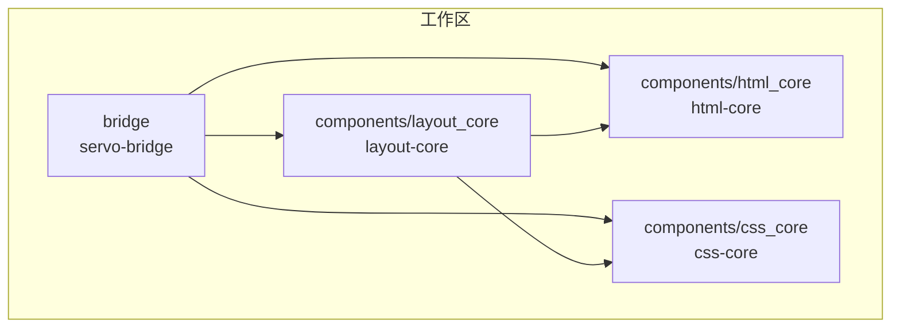
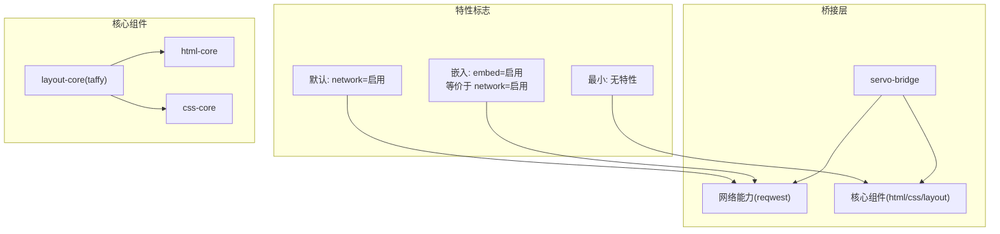
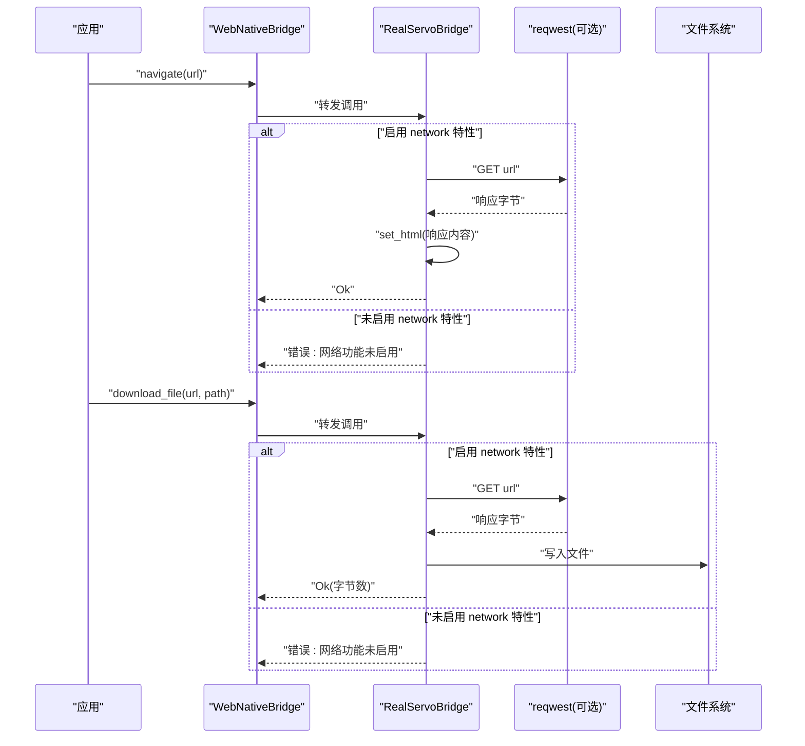
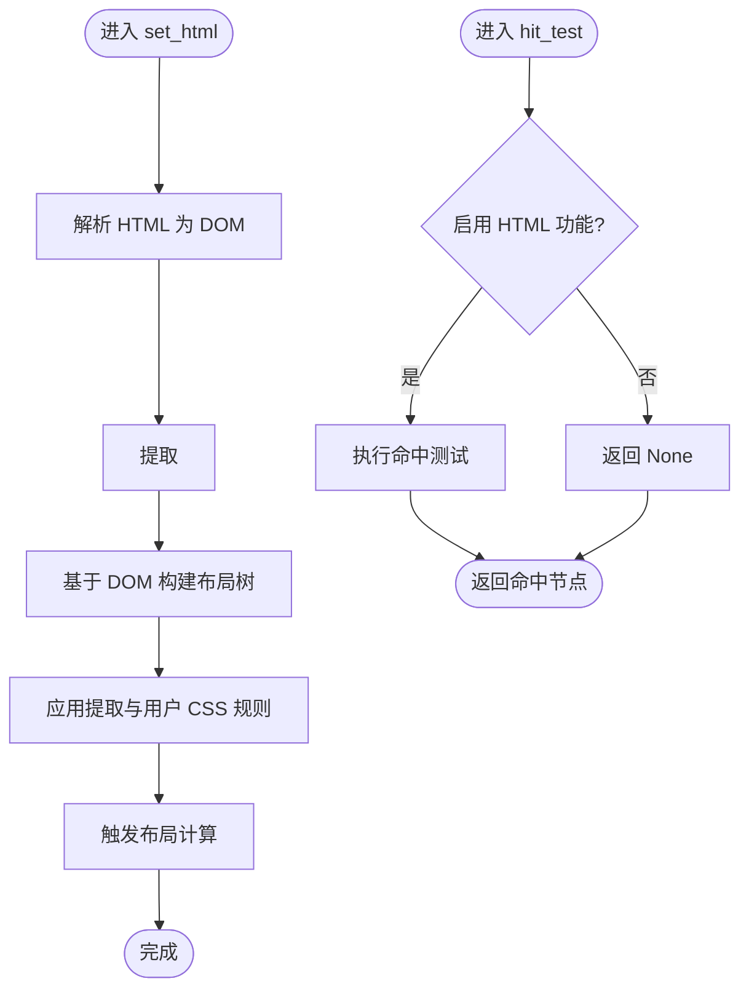
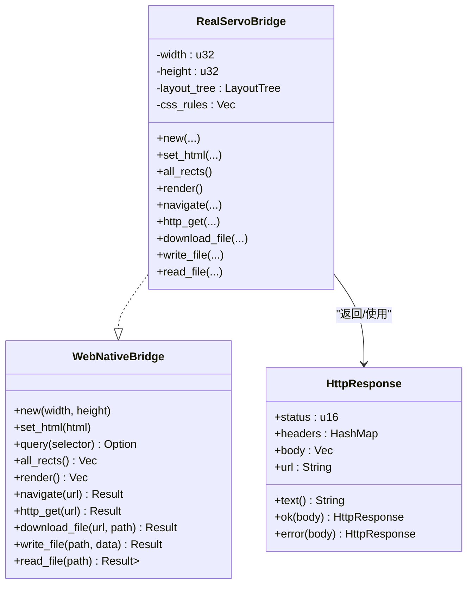
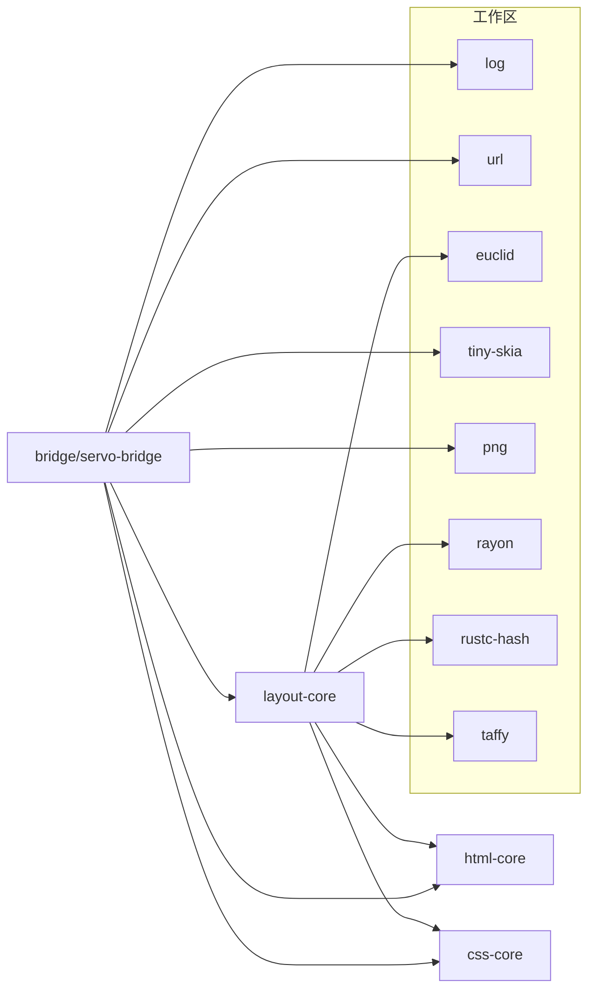

# 特性配置

<cite>
**本文引用的文件**
- [Cargo.toml](file://Cargo.toml)
- [FEATURES.md](file://FEATURES.md)
- [README.md](file://README.md)
- [bridge/Cargo.toml](file://bridge/Cargo.toml)
- [bridge/lib.rs](file://bridge/lib.rs)
- [bridge/bridge.rs](file://bridge/bridge.rs)
- [bridge/network.rs](file://bridge/network.rs)
- [bridge/real_impl.rs](file://bridge/real_impl.rs)
- [components/html_core/Cargo.toml](file://components/html_core/Cargo.toml)
- [components/css_core/Cargo.toml](file://components/css_core/Cargo.toml)
- [components/layout_core/Cargo.toml](file://components/layout_core/Cargo.toml)
- [components/layout_core/tree.rs](file://components/layout_core/tree.rs)
</cite>

## 目录
1. [简介](#简介)
2. [项目结构](#项目结构)
3. [核心组件](#核心组件)
4. [架构总览](#架构总览)
5. [详细组件分析](#详细组件分析)
6. [依赖关系分析](#依赖关系分析)
7. [性能考量](#性能考量)
8. [故障排查指南](#故障排查指南)
9. [结论](#结论)
10. [附录](#附录)

## 简介
本文件系统化阐述 Servo-Zero 的特性配置与三模式支持（默认、嵌入、最小），并提供特性标志的启用/禁用方法、构建模式的性能与二进制大小对比、特性对依赖项与编译时间的影响、特性组合的兼容性与限制，以及面向不同使用场景的最佳配置建议与优化指导。

## 项目结构
Servo-Zero 采用工作区组织，核心由桥接层与三大引擎组件构成：
- 桥接层（bridge）：统一的 WebNativeBridge 接口与生产实现，负责 DOM/CSS/布局/渲染/网络/文件等能力的对外暴露。
- 引擎组件（components）：html_core、css_core、layout_core，分别提供 HTML 解析、CSS 解析与级联、布局算法（基于 taffy）。
- 工作区根（Cargo.toml）：统一版本、许可证、Rust 版本、依赖版本管理与成员清单。

图表来源
- [Cargo.toml:1-7](file://Cargo.toml#L1-L7)
- [bridge/Cargo.toml:32-35](file://bridge/Cargo.toml#L32-L35)
- [components/layout_core/Cargo.toml:16-22](file://components/layout_core/Cargo.toml#L16-L22)

章节来源
- [Cargo.toml:1-37](file://Cargo.toml#L1-L37)
- [README.md:16-31](file://README.md#L16-L31)

## 核心组件
- 桥接层（bridge）
  - 提供 WebNativeBridge trait 与 RealServoBridge 生产实现，支持 DOM 读写、布局查询、CSS 操作、渲染、事件绑定、网络请求、文件操作等。
  - 网络能力通过特性标志控制；未启用时对应方法返回错误或空实现。
- 引擎组件（components）
  - html_core：纯 Rust HTML5 解析与 DOM 构建。
  - css_core：CSS 解析、级联、选择器匹配与颜色/长度解析。
  - layout_core：盒模型与 Flexbox 布局（基于 taffy），依赖 html_core 与 css_core。

章节来源
- [bridge/lib.rs:1-13](file://bridge/lib.rs#L1-L13)
- [bridge/bridge.rs:114-262](file://bridge/bridge.rs#L114-L262)
- [components/html_core/Cargo.toml:1-21](file://components/html_core/Cargo.toml#L1-L21)
- [components/css_core/Cargo.toml:1-20](file://components/css_core/Cargo.toml#L1-L20)
- [components/layout_core/Cargo.toml:1-26](file://components/layout_core/Cargo.toml#L1-L26)

## 架构总览
下图展示三模式（默认/嵌入/最小）在特性标志与依赖上的差异，以及与核心组件的关系。

图表来源
- [bridge/Cargo.toml:16-24](file://bridge/Cargo.toml#L16-L24)
- [bridge/Cargo.toml:42](file://bridge/Cargo.toml#L42)
- [components/layout_core/Cargo.toml:16-22](file://components/layout_core/Cargo.toml#L16-L22)

## 详细组件分析

### 三模式支持与适用场景
- 默认模式（default）
  - 等价于启用 network 特性，包含 HTML 解析、CSS 布局、渲染、网络请求、文件操作、事件系统。
  - 适合完整浏览器引擎需求。
- 嵌入模式（embed）
  - 等价于显式启用 network 特性（默认关闭默认特性），移除 HTML 解析以减小依赖与体积，保留 CSS 布局、渲染、网络、文件操作、事件系统。
  - 适合将 Servo-Zero 嵌入到其他程序，追求体积与启动速度优化。
- 最小模式（no features）
  - 关闭所有特性，仅保留 CSS 布局、渲染、事件系统，无网络与 HTML 解析。
  - 适合仅渲染已有 HTML、追求最小二进制与无外部依赖的场景。

章节来源
- [FEATURES.md:14-66](file://FEATURES.md#L14-L66)
- [README.md:35-41](file://README.md#L35-L41)

### 特性标志与启用/禁用方法
- 特性矩阵
  - default：完整浏览器功能（包含 html 与 network）。
  - html：HTML 解析（内部模块 html-core）。
  - network：网络请求（依赖 reqwest）。
  - embed：嵌入模式（启用 network，移除 html）。
- 启用/禁用示例
  - 默认构建：使用默认特性（即启用 network）。
  - 全量特性：显式启用 network。
  - 嵌入模式：关闭默认特性并启用 embed（等价于启用 network）。
  - 最小模式：关闭默认特性（不启用任何特性）。
- 构建命令参考
  - cargo build（默认特性）
  - cargo build --features "network"
  - cargo build --no-default-features
  - cargo test（测试默认特性）

章节来源
- [FEATURES.md:3-11](file://FEATURES.md#L3-L11)
- [README.md:58-72](file://README.md#L58-L72)
- [bridge/Cargo.toml:16-24](file://bridge/Cargo.toml#L16-L24)

### 网络能力与条件编译
- 接口与行为
  - WebNativeBridge trait 定义了导航、HTTP GET/POST、下载文件、读写文件等方法。
  - 当未启用 network 特性时，网络相关方法返回错误或空实现，避免编译期缺失依赖。
- 实现细节
  - navigate/http_get/download_file 等方法在启用 network 特性时使用 reqwest 执行阻塞请求，并将响应封装为 HttpResponse。
  - 未启用 network 特性时，对应方法返回“未启用网络”的错误信息。

图表来源
- [bridge/bridge.rs:240-253](file://bridge/bridge.rs#L240-L253)
- [bridge/real_impl.rs:250-358](file://bridge/real_impl.rs#L250-L358)
- [bridge/network.rs:1-54](file://bridge/network.rs#L1-L54)

章节来源
- [bridge/bridge.rs:114-262](file://bridge/bridge.rs#L114-L262)
- [bridge/real_impl.rs:250-358](file://bridge/real_impl.rs#L250-L358)
- [bridge/network.rs:1-54](file://bridge/network.rs#L1-L54)

### 布局流程与条件编译
- set_html 流程
  - 解析 HTML 生成 DOM。
  - 提取 <style> 标签内的 CSS。
  - 基于 DOM 构建布局树，设置视口尺寸。
  - 应用提取的 CSS 与用户添加的 CSS 规则。
  - 触发布局计算。
- hit_test 与 all_rects
  - hit_test 在启用 HTML 功能时进行命中测试；否则返回空结果。
  - all_rects 返回布局节点集合，包含位置与背景色等信息。

图表来源
- [bridge/real_impl.rs:101-125](file://bridge/real_impl.rs#L101-L125)
- [components/layout_core/tree.rs:12-107](file://components/layout_core/tree.rs#L12-L107)

章节来源
- [bridge/real_impl.rs:101-125](file://bridge/real_impl.rs#L101-L125)
- [components/layout_core/tree.rs:12-107](file://components/layout_core/tree.rs#L12-L107)

### 类型与接口概览
- WebNativeBridge 接口
  - 包含 DOM 读写、布局查询、CSS 操作、渲染、事件绑定、网络请求、文件操作等方法族。
  - 部分方法提供默认实现或空实现，便于在不同特性组合下保持一致性。
- HttpResponse
  - 封装状态码、响应头、响应体与 URL，提供常用便捷方法（如 text、ok/error 工厂方法）。

图表来源
- [bridge/bridge.rs:114-262](file://bridge/bridge.rs#L114-L262)
- [bridge/real_impl.rs:11-36](file://bridge/real_impl.rs#L11-L36)
- [bridge/network.rs:5-16](file://bridge/network.rs#L5-L16)

章节来源
- [bridge/bridge.rs:114-262](file://bridge/bridge.rs#L114-L262)
- [bridge/real_impl.rs:11-36](file://bridge/real_impl.rs#L11-L36)
- [bridge/network.rs:1-54](file://bridge/network.rs#L1-L54)

## 依赖关系分析
- 工作区统一依赖
  - 日志、渲染/几何、并行、URL 等在工作区层面统一版本管理，确保跨 crate 一致性。
- 桥接层依赖
  - 必需：log、serde/serde_json、url。
  - 可选：reqwest（启用 network 特性时）。
  - 内部：html-core、css-core、layout-core。
  - 渲染：tiny-skia、png。
- 引擎组件依赖
  - layout-core 依赖 html-core、css-core、euclid、rayon、rustc-hash、taffy。
  - html-core、css-core 依赖工作区日志。

图表来源
- [Cargo.toml:19-36](file://Cargo.toml#L19-L36)
- [bridge/Cargo.toml:26-42](file://bridge/Cargo.toml#L26-L42)
- [components/layout_core/Cargo.toml:16-22](file://components/layout_core/Cargo.toml#L16-L22)

章节来源
- [Cargo.toml:19-36](file://Cargo.toml#L19-L36)
- [bridge/Cargo.toml:26-42](file://bridge/Cargo.toml#L26-L42)
- [components/layout_core/Cargo.toml:16-22](file://components/layout_core/Cargo.toml#L16-L22)

## 性能考量
- 三模式性能与体积对比（仓库提供）
  - 默认：约 150 个依赖、约 25 秒编译、约 15MB 二进制。
  - 嵌入：约 100 个依赖、约 15 秒编译、约 10MB 二进制。
  - 最小：约 50 个依赖、约 5 秒编译、约 5MB 二进制。
- 影响因素
  - 依赖数量与编译时间呈正相关。
  - 二进制大小受网络栈（reqwest）、HTML 解析器、CSS/布局复杂度影响。
  - 渲染与并行（rayon）也会带来额外开销。

章节来源
- [FEATURES.md:68-74](file://FEATURES.md#L68-L74)

## 故障排查指南
- 症状：调用网络相关方法报错“网络功能未启用”
  - 原因：未启用 network 特性。
  - 处理：启用 network 特性或在应用侧降级处理。
- 症状：HTML 解析相关方法无效或警告
  - 原因：在嵌入/最小模式下移除了 HTML 解析。
  - 处理：在默认模式下使用 HTML 输入，或自行准备已解析的 DOM 结构。
- 症状：JS 执行返回“不支持”
  - 原因：Servo-Zero 不包含 JS 引擎。
  - 处理：在应用侧实现 JS 集成（例如通过外部运行时），或使用现有 eval_js 的空实现。

章节来源
- [bridge/bridge.rs:125-129](file://bridge/bridge.rs#L125-L129)
- [bridge/real_impl.rs:149-152](file://bridge/real_impl.rs#L149-L152)
- [bridge/real_impl.rs:266-269](file://bridge/real_impl.rs#L266-L269)

## 结论
- 三模式为不同场景提供了清晰的权衡：默认模式覆盖完整浏览器能力；嵌入模式在移除 HTML 解析的同时保留网络与渲染，适合嵌入式场景；最小模式仅保留核心渲染与布局，追求极致体积与无外部依赖。
- 特性标志通过条件编译精确控制网络能力与 HTML 能力，避免不必要的依赖与编译时间。
- 依据实际需求选择模式，并结合仓库提供的性能与体积数据进行评估，可获得最佳的工程实践效果。

## 附录

### 特性组合与兼容性说明
- 默认模式（默认启用 network）与嵌入模式（显式启用 embed 等价于启用 network）互为补充，前者强调完整性，后者强调嵌入优化。
- 最小模式与嵌入模式互斥启用（最小模式不启用任何特性），但均可与默认模式形成对比。
- 由于 HTML 解析在嵌入/最小模式中被移除，因此无法通过 set_html 注入 HTML；若需要 HTML 输入，请使用默认模式。

章节来源
- [FEATURES.md:3-11](file://FEATURES.md#L3-L11)
- [bridge/Cargo.toml:16-24](file://bridge/Cargo.toml#L16-L24)

### 最佳配置建议
- 完整浏览器引擎：使用默认特性（启用 network）。
- 嵌入到其他程序：关闭默认特性并启用 embed，以减少体积与依赖。
- 仅渲染已有 HTML：使用最小模式，避免网络与 HTML 解析。
- 与第三方集成（如 @irisverse/jade）：参考其使用 embed 模式的做法，关闭默认特性并启用 embed。

章节来源
- [FEATURES.md:76-93](file://FEATURES.md#L76-L93)
- [README.md:58-72](file://README.md#L58-L72)