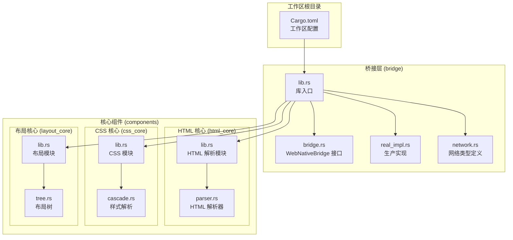
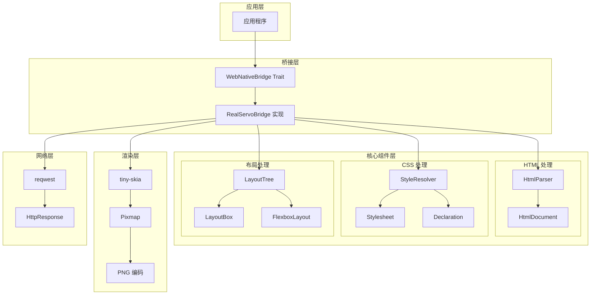
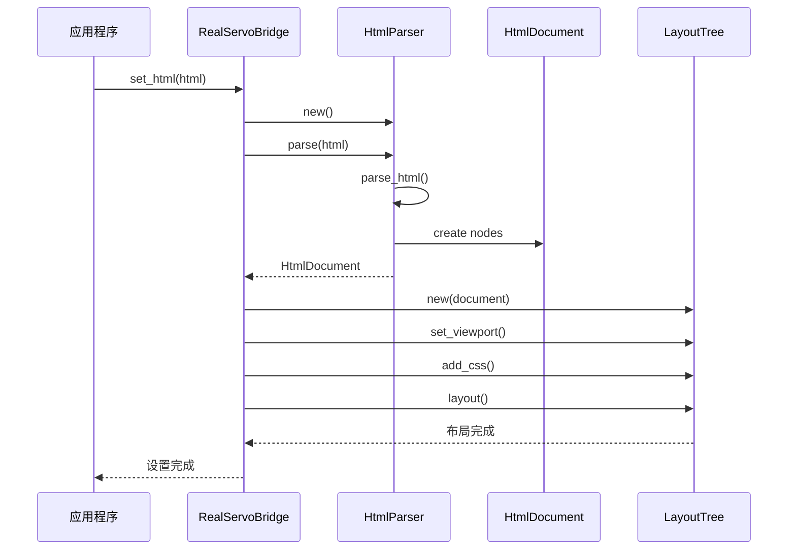
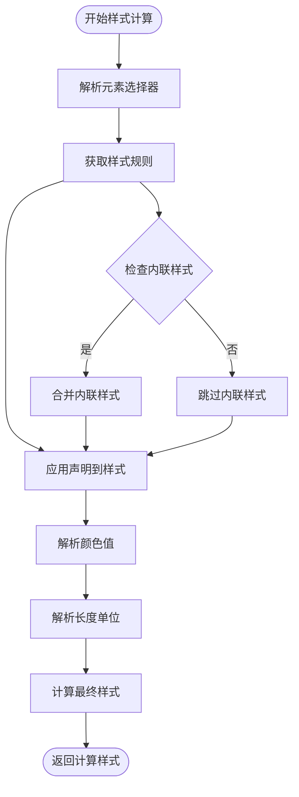
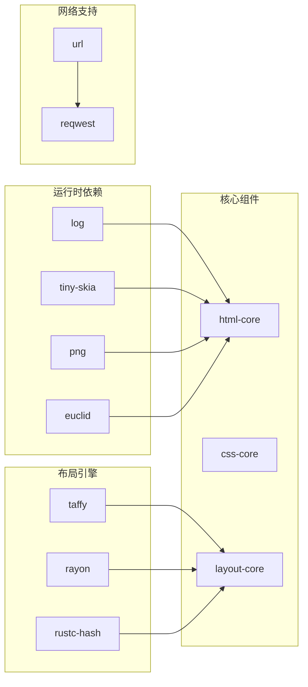
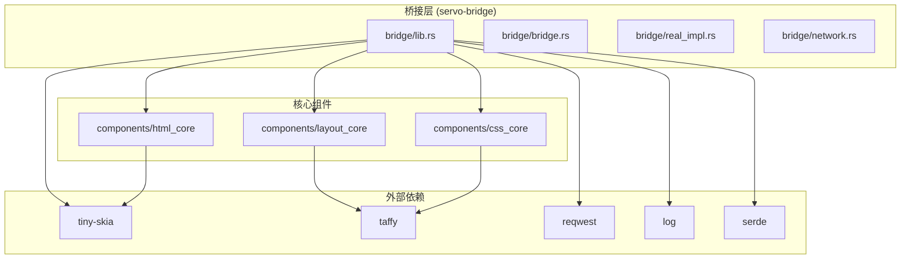

# 项目概述

<cite>
**本文档引用的文件**
- [README.md](file://README.md)
- [Cargo.toml](file://Cargo.toml)
- [FEATURES.md](file://FEATURES.md)
- [bridge/lib.rs](file://bridge/lib.rs)
- [bridge/Cargo.toml](file://bridge/Cargo.toml)
- [bridge/bridge.rs](file://bridge/bridge.rs)
- [bridge/real_impl.rs](file://bridge/real_impl.rs)
- [bridge/network.rs](file://bridge/network.rs)
- [components/html_core/lib.rs](file://components/html_core/lib.rs)
- [components/html_core/parser.rs](file://components/html_core/parser.rs)
- [components/css_core/lib.rs](file://components/css_core/lib.rs)
- [components/css_core/cascade.rs](file://components/css_core/cascade.rs)
- [components/layout_core/lib.rs](file://components/layout_core/lib.rs)
- [components/layout_core/tree.rs](file://components/layout_core/tree.rs)
</cite>

## 目录
1. [简介](#简介)
2. [项目结构](#项目结构)
3. [核心特性](#核心特性)
4. [架构设计](#架构设计)
5. [三模式支持](#三模式支持)
6. [技术栈概览](#技术栈概览)
7. [依赖关系分析](#依赖关系分析)
8. [Web 渲染基础概念](#web-渲染基础概念)
9. [性能考虑](#性能考虑)
10. [故障排除指南](#故障排除指南)
11. [结论](#结论)

## 简介

Servo-Zero 是一个基于 Servo 的轻量级 Web-Native 渲染引擎，专为不需要 SpiderMonkey JavaScript 引擎的场景而设计。该项目提供了纯 Rust 实现的 Web 渲染解决方案，实现了完整的 Web-Native 桥接层，支持 DOM 操作、CSS 解析与布局、事件处理以及 PNG 图像渲染等功能。

### 核心优势

- **纯 Rust 实现**：完全使用 Rust 语言开发，确保内存安全和高性能
- **无 SpiderMonkey 依赖**：避免了复杂的 JavaScript 引擎依赖，简化了部署和维护
- **模块化架构**：采用工作区模式，将功能拆分为独立的组件模块
- **灵活的构建配置**：支持多种构建模式以适应不同的使用场景

**章节来源**
- [README.md:1-183](file://README.md#L1-L183)

## 项目结构

项目采用工作区（Workspace）模式组织，主要包含以下核心目录：

**图表来源**
- [Cargo.toml:1-37](file://Cargo.toml#L1-L37)
- [bridge/lib.rs:1-13](file://bridge/lib.rs#L1-L13)
- [components/html_core/lib.rs:1-15](file://components/html_core/lib.rs#L1-L15)
- [components/css_core/lib.rs:1-207](file://components/css_core/lib.rs#L1-L207)
- [components/layout_core/lib.rs:1-22](file://components/layout_core/lib.rs#L1-L22)

**章节来源**
- [README.md:16-31](file://README.md#L16-L31)
- [Cargo.toml:1-37](file://Cargo.toml#L1-L37)

## 核心特性

### Web-Native 桥接层

Servo-Zero 提供了统一的 `WebNativeBridge` trait 接口，支持两种实现方式：

1. **ServoBridge（模拟实现）**：用于测试和参考
2. **RealServoBridge（生产实现）**：完整的功能实现，包含 HTML 解析、CSS 布局和渲染

### 核心渲染功能

- **DOM 注入与操作**：通过 CSS 选择器进行元素查询和操作
- **CSS 解析与级联**：支持选择器匹配、样式计算和颜色解析
- **布局引擎**：基于盒模型和 Flexbox 的布局算法
- **事件处理**：支持点击事件、表单提交和 window.open 调用
- **图像渲染**：使用 tiny-skia 进行 2D 渲染，输出 PNG 格式
- **网络支持**：可选的 HTTP 请求功能（通过 reqwest）

**章节来源**
- [README.md:7-14](file://README.md#L7-L14)
- [bridge/bridge.rs:114-262](file://bridge/bridge.rs#L114-L262)

## 架构设计

### 整体架构图

**图表来源**
- [bridge/real_impl.rs:10-372](file://bridge/real_impl.rs#L10-L372)
- [components/html_core/parser.rs:6-153](file://components/html_core/parser.rs#L6-L153)
- [components/css_core/cascade.rs:87-271](file://components/css_core/cascade.rs#L87-L271)
- [components/layout_core/tree.rs:13-241](file://components/layout_core/tree.rs#L13-L241)

### 关键组件关系

#### HTML 解析流程

**图表来源**
- [bridge/real_impl.rs:101-125](file://bridge/real_impl.rs#L101-L125)
- [components/html_core/parser.rs:18-22](file://components/html_core/parser.rs#L18-L22)
- [components/layout_core/tree.rs:21-69](file://components/layout_core/tree.rs#L21-L69)

#### CSS 样式计算流程

**图表来源**
- [components/css_core/cascade.rs:128-154](file://components/css_core/cascade.rs#L128-L154)
- [components/css_core/lib.rs:43-102](file://components/css_core/lib.rs#L43-L102)

**章节来源**
- [bridge/real_impl.rs:101-125](file://bridge/real_impl.rs#L101-L125)
- [components/css_core/cascade.rs:128-154](file://components/css_core/cascade.rs#L128-L154)

## 三模式支持

Servo-Zero 提供三种不同的构建模式，每种模式都有特定的使用场景和功能组合：

### 默认模式 (Default)

**功能组合：**
- ✅ HTML 解析 (html-core)
- ✅ CSS 布局 (css-core)  
- ✅ 渲染 (tiny-skia)
- ✅ 网络请求 (reqwest)
- ✅ 文件操作
- ✅ 事件系统

**适用场景：**
- 完整的浏览器功能需求
- 需要从网络加载内容的应用
- 需要文件下载和保存功能

### 嵌入模式 (Embed)

**功能组合：**
- ❌ HTML 解析 (移除，减少依赖)
- ✅ CSS 布局
- ✅ 渲染
- ✅ 网络请求
- ✅ 文件操作
- ✅ 事件系统

**适用场景：**
- 嵌入到其他程序中使用
- 需要体积优化的应用
- 启动速度要求较高的场景
- 用户的 JavaScript 已经编译，无需 HTML 解析

### 最小模式 (Minimal)

**功能组合：**
- ❌ HTML 解析
- ❌ 网络请求
- ✅ CSS 布局
- ✅ 渲染
- ✅ 事件系统

**适用场景：**
- 仅渲染已有 HTML 的应用
- 需要最小二进制文件大小
- 无外部依赖的环境
- 性能敏感的嵌入式应用

**章节来源**
- [FEATURES.md:3-67](file://FEATURES.md#L3-L67)
- [README.md:35-41](file://README.md#L35-L41)

## 技术栈概览

### 核心依赖

| 依赖项 | 版本 | 用途 | 特性标志 |
|--------|------|------|----------|
| **log** | 0.4 | 日志记录 | 内置 |
| **tiny-skia** | 0.11 | 2D 渲染 | 内置 |
| **png** | 0.17 | PNG 编码 | 内置 |
| **euclid** | 0.22 | 几何类型 | 内置 |
| **taffy** | 0.10 | Flexbox 布局算法 | 内置 |
| **rayon** | 1.7 | 并行处理 | 内置 |
| **rustc-hash** | 2.0 | 快速哈希 | 内置 |
| **url** | 2.5 | URL 解析 | 内置 |
| **reqwest** | 0.12 | HTTP 网络请求 | network |

### 组件架构

**图表来源**
- [Cargo.toml:19-37](file://Cargo.toml#L19-L37)
- [bridge/Cargo.toml:26-43](file://bridge/Cargo.toml#L26-L43)

**章节来源**
- [README.md:136-156](file://README.md#L136-L156)
- [Cargo.toml:19-37](file://Cargo.toml#L19-L37)

## 依赖关系分析

### 依赖层次结构

**图表来源**
- [bridge/lib.rs:6-12](file://bridge/lib.rs#L6-L12)
- [bridge/Cargo.toml:32-42](file://bridge/Cargo.toml#L32-L42)
- [components/html_core/lib.rs:5-9](file://components/html_core/lib.rs#L5-L9)
- [components/css_core/lib.rs:5-11](file://components/css_core/lib.rs#L5-L11)
- [components/layout_core/lib.rs:5-11](file://components/layout_core/lib.rs#L5-L11)

### 功能特性矩阵

| 特性 | 默认模式 | 嵌入模式 | 最小模式 |
|------|----------|----------|----------|
| HTML 解析 | ✅ | ❌ | ❌ |
| CSS 布局 | ✅ | ✅ | ✅ |
| 渲染 | ✅ | ✅ | ✅ |
| 网络请求 | ✅ | ✅ | ❌ |
| 文件操作 | ✅ | ✅ | ✅ |
| 事件系统 | ✅ | ✅ | ✅ |
| JS 执行 | ❌ | ❌ | ❌ |

**章节来源**
- [FEATURES.md:7-67](file://FEATURES.md#L7-L67)

## Web 渲染基础概念

### HTML 解析原理

HTML 解析是 Web 渲染的第一步，Servo-Zero 使用自定义的 HTML 解析器将 HTML 字符串转换为 DOM 树结构：

1. **词法分析**：识别 HTML 标记、属性和文本内容
2. **语法分析**：构建层次化的 DOM 节点树
3. **节点创建**：为每个 HTML 元素创建对应的 DOM 节点
4. **属性处理**：解析并存储元素的属性信息

### CSS 级联与样式计算

CSS 样式计算涉及多个步骤：

1. **选择器解析**：识别 CSS 选择器并确定目标元素
2. **样式收集**：从样式表中收集匹配的样式声明
3. **优先级计算**：应用 CSS 优先级规则（内联样式 > ID > 类 > 标签）
4. **值解析**：将 CSS 值转换为具体的像素或比例值

### 布局算法

布局过程将计算出的样式应用到 DOM 结构上：

1. **盒模型计算**：确定每个元素的边框、内边距和外边距
2. **尺寸计算**：计算元素的宽度、高度和位置
3. **定位策略**：应用静态、相对、绝对等定位方式
4. **流式布局**：处理块级和内联元素的排列

### 渲染管道

最终的渲染过程包括：

1. **绘制命令生成**：将布局信息转换为绘制指令
2. **图形状态管理**：设置颜色、字体和其他绘图属性
3. **像素填充**：使用 tiny-skia 进行实际的像素绘制
4. **格式编码**：将结果编码为 PNG 图像数据

**章节来源**
- [components/html_core/parser.rs:18-135](file://components/html_core/parser.rs#L18-L135)
- [components/css_core/cascade.rs:128-154](file://components/css_core/cascade.rs#L128-L154)
- [components/layout_core/tree.rs:61-159](file://components/layout_core/tree.rs#L61-L159)

## 性能考虑

### 编译时优化

- **特征标志**：通过启用/禁用特性来控制编译依赖数量
- **工作区构建**：利用 Cargo 工作区实现增量编译
- **并行编译**：支持多核心并行编译以提高速度

### 运行时性能

- **内存管理**：使用 Rust 的所有权系统避免内存泄漏
- **零拷贝操作**：尽量使用引用而非复制数据
- **缓存策略**：缓存解析结果和计算过的样式
- **并行处理**：利用 rayon 实现并行计算

### 内存使用优化

- **最小依赖**：最小模式下仅保留必要的依赖
- **延迟初始化**：按需创建昂贵的对象
- **对象池**：复用临时对象减少分配开销

## 故障排除指南

### 常见问题诊断

#### 网络功能不可用

**症状**：调用 `navigate()` 或 `http_get()` 返回错误 "Network feature not enabled"

**解决方案**：
1. 确保启用了 `network` 特性标志
2. 检查 Cargo.toml 中的特性配置
3. 验证 reqwest 依赖是否正确安装

#### 渲染结果异常

**症状**：渲染的 PNG 图像显示不正确或为空

**解决方案**：
1. 检查 HTML 内容是否有效
2. 验证 CSS 样式是否正确
3. 确认视口尺寸设置合理
4. 检查 tiny-skia 版本兼容性

#### 布局计算错误

**症状**：元素位置或尺寸计算不正确

**解决方案**：
1. 检查 CSS 选择器是否正确
2. 验证 DOM 结构的完整性
3. 确认样式优先级规则应用正确
4. 检查布局树的构建过程

**章节来源**
- [bridge/real_impl.rs:266-269](file://bridge/real_impl.rs#L266-L269)
- [bridge/real_impl.rs:355-358](file://bridge/real_impl.rs#L355-L358)

## 结论

Servo-Zero 项目代表了现代 Web 渲染技术的一个重要发展方向，它成功地证明了纯 Rust 实现可以提供完整的 Web 渲染能力，同时避免了传统浏览器引擎中的复杂依赖问题。

### 主要成就

1. **架构创新**：通过模块化设计实现了高度解耦的组件架构
2. **性能优化**：纯 Rust 实现带来了更好的性能和内存安全性
3. **灵活性**：三模式支持满足了从简单渲染到完整浏览器的各种需求
4. **易用性**：清晰的 API 设计使得集成变得简单直观

### 技术价值

- **无 SpiderMonkey 依赖**：简化了部署和维护成本
- **纯 Rust 生态**：充分利用了 Rust 的内存安全和性能优势
- **模块化设计**：便于扩展和定制特定功能
- **跨平台支持**：基于 Rust 的跨平台特性

### 未来展望

Servo-Zero 为 Web-Native 应用开发提供了一个坚实的基础，随着 Rust 生态系统的不断发展，这个项目有望成为 Web 渲染领域的重要技术方案之一。其模块化的设计也为进一步的功能扩展和技术演进提供了良好的基础。